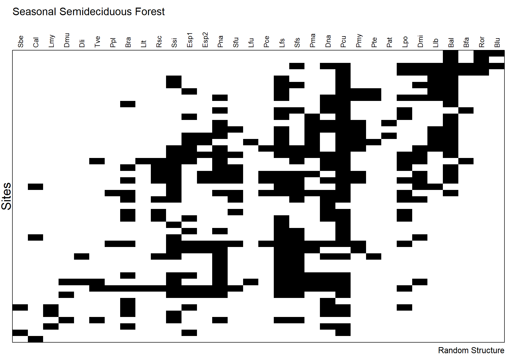
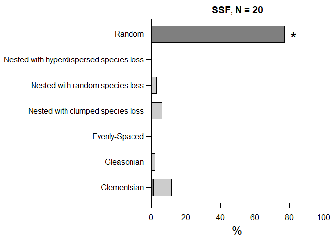
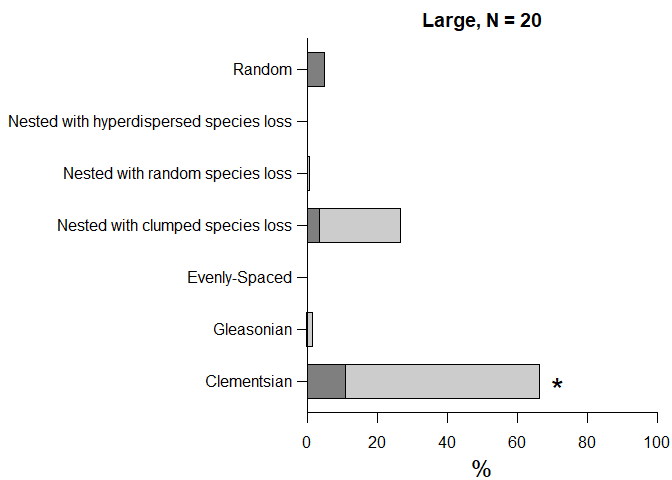
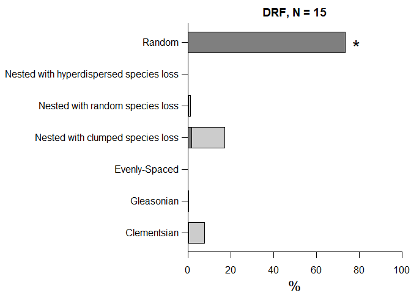

Elements of Metacommunity Structure
================
Rodolfo Pelinson
12/04/2021

First we need preparare all data matrices from the main dataset. These
are prepared sourcing the “Loading_data.R” file in the Auxiliary Scripts
folder.

``` r
library(AtlanticForestMetacommunity)
source("Loading_data.R")
```

The packages used to run this analyses are:

`vegan` version 2.5-6  
`metacom` version 1.5.3

       

Running the EMS analysis. The `IdentifyStructure` function is a function
created to run the same analyses for multiple datasets and automatically
identify the idealized metacommunity structure.

``` r
Metacommunities <- IdentifyStructure(list(Broad_pa,
                                          DRF_pa,#(Dense Rain Forest)
                                          UBA_pa,#(Ubatuba)
                                          BER_pa,#(Bertioga)
                                          ITA_pa,#(Itanhaém)
                                          SSF_pa,#(Seasonal Semideciduous Forest)
                                          ST_pa,#(Santa Fé do Sul)
                                          IC_pa,#(Icém)
                                          NI_pa,#(Nova Itapirema)
                                          MD_pa,#(Morro do Diabo)
                                          JA_pa),#(Estação Ecológica do Jataí)
                                     names = c("Broad",
                                               "DRF",
                                               "Ubatuba",
                                               "Bertioga",
                                               "Itanhaém",
                                               "SSF",
                                               "Santa Fé do Sul",
                                               "Icém",
                                               "Nova Itapirema",
                                               "Morro do Diabo",
                                               "Jataí"),
                                     CoherenceMethod = "curveball",
                                     turnoverMethod = "EMS",
                                     orderNulls = T, seed = 2, sims = 10000, round = 3)
```

    FALSE   |                                                                              |                                                                      |   0%  |                                                                              |======                                                                |   9%  |                                                                              |=============                                                         |  18%  |                                                                              |===================                                                   |  27%  |                                                                              |=========================                                             |  36%  |                                                                              |================================                                      |  45%  |                                                                              |======================================                                |  55%  |                                                                              |=============================================                         |  64%  |                                                                              |===================================================                   |  73%  |                                                                              |=========================================================             |  82%  |                                                                              |================================================================      |  91%  |                                                                              |======================================================================| 100%

``` r
Metacommunities
```

    FALSE                 Embeded_Absences Simulated_Embeded_Absences
    FALSE Broad                       1107                   2808.635
    FALSE DRF                          490                    547.387
    FALSE Ubatuba                      105                    152.446
    FALSE Bertioga                      45                     41.470
    FALSE Itanhaém                      33                     60.155
    FALSE SSF                          596                    675.566
    FALSE Santa Fé do Sul                9                     15.751
    FALSE Icém                          54                     61.013
    FALSE Nova Itapirema                16                     21.450
    FALSE Morro do Diabo                16                     24.564
    FALSE Jataí                         11                     25.636
    FALSE                 percent_difference_EmbAbs z_Coherence p_Coherence Turnover
    FALSE Broad                               0.606     -10.951       0.000   566973
    FALSE DRF                                 0.105      -1.600       0.110    16547
    FALSE Ubatuba                             0.311      -3.043       0.002     2976
    FALSE Bertioga                           -0.085       0.480       0.631      301
    FALSE Itanhaém                            0.451      -2.373       0.018      682
    FALSE SSF                                 0.118      -1.818       0.069    23810
    FALSE Santa Fé do Sul                     0.429      -1.926       0.054      147
    FALSE Icém                                0.115      -1.064       0.287      683
    FALSE Nova Itapirema                      0.254      -1.763       0.078      151
    FALSE Morro do Diabo                      0.349      -2.203       0.028      184
    FALSE Jataí                               0.571      -3.290       0.001      342
    FALSE                 Simulated_Turnover percent_difference_Turn z_Turnover
    FALSE Broad                   463271.838                  -0.224      3.064
    FALSE DRF                      13342.278                  -0.240      1.001
    FALSE Ubatuba                   3479.922                   0.145     -0.835
    FALSE Bertioga                   220.016                  -0.368      1.325
    FALSE Itanhaém                   752.835                   0.094     -0.463
    FALSE SSF                      18926.324                  -0.258      1.293
    FALSE Santa Fé do Sul            171.268                   0.142     -0.537
    FALSE Icém                       590.874                  -0.156      0.603
    FALSE Nova Itapirema              98.680                  -0.530      1.430
    FALSE Morro do Diabo             173.677                  -0.059      0.273
    FALSE Jataí                      280.460                  -0.219      0.815
    FALSE                 p_Turnover I_Index p_I_Index N_sites N_species
    FALSE Broad                0.002   2.505     0.000      96        52
    FALSE DRF                  0.317   3.450     0.000      50        24
    FALSE Ubatuba              0.404   1.467     0.014      23        20
    FALSE Bertioga             0.185   1.795     0.029      12        14
    FALSE Itanhaém             0.643   1.529     0.050      15        15
    FALSE SSF                  0.196   2.038     0.000      46        32
    FALSE Santa Fé do Sul      0.591   1.015     0.388       8        11
    FALSE Icém                 0.546   1.385     0.029      12        18
    FALSE Nova Itapirema       0.153   1.050     0.331       8        18
    FALSE Morro do Diabo       0.785   1.158     0.165       8        14
    FALSE Jataí                0.415   1.516     0.019      10        12
    FALSE                                              Structure
    FALSE Broad                                      Clementsian
    FALSE DRF                                             Random
    FALSE Ubatuba         Quasi-Nested with clumped species loss
    FALSE Bertioga                                        Random
    FALSE Itanhaém         Quasi-Nested with random species loss
    FALSE SSF                                             Random
    FALSE Santa Fé do Sul                                 Random
    FALSE Icém                                            Random
    FALSE Nova Itapirema                                  Random
    FALSE Morro do Diabo                        Quasi-Gleasonian
    FALSE Jataí                                Quasi-Clementsian

   

# Correlation with Environmental Gradients

We only analyzed the correlation between the underlying gradient with
true environmental gradients for the metacommunities that exhibited a
coherent metacommunity structures.    

### Broad Spatial Extent

Spearman rank Correlations or Kruskal-Wallis analysis.

``` r
pca <- rda(Broad_clim_st)
relative_eigenvalues <- pca$CA$eig/sum(pca$CA$eig)
PC1 <- pca$CA$u[,1]
Broad_env$ecoregion <- as.factor(Broad_env$ecoregion)
Broad_spearman <- My_spearman(Broad_pa, data.frame(Broad_env, PC1))

round(Broad_spearman,3)
```

    ##                   rho chi-squared     p adj_p
    ## hydroperiod    -0.053          NA 0.608 0.608
    ## canopy_cover    0.545          NA 0.000 0.000
    ## area           -0.078          NA 0.451 0.516
    ## depth           0.209          NA 0.041 0.055
    ## nvt             0.655          NA 0.000 0.000
    ## dist_to_forest -0.687          NA 0.000 0.000
    ## ecoregion          NA      71.143 0.000 0.000
    ## PC1             0.760          NA 0.000 0.000

   

Plotting it.

``` r
My_Imagine(comm = Broad_pa, col = c("white", "black", "grey50"),
           order = T, scores = 1, fill = T, cex.site = 0.6, cex.species = 0.8, cex.envlab = 0.9,
           top_margin = 5, left_margin = 1.25, sitenames = FALSE, bottom_margin = 1.25, right_margin = 0.25, xline = -0.75,
           ylab = "Sites", ylab_line = 0, cex.ylab = 1.5, xlab = "Clementsian Structure", xlab_line = 0.25, cex.xlab = 1.5,
           Env1 = PC1, Env.col_1 = c("white","red"), Env.label_1 = "Climate",
           Env2 = Broad_env_st$dist_to_forest, Env.col_2 = c("forestgreen","lemonchiffon"), Env.label_2 = "Dist. Forest",
           Env3 = as.numeric(Broad_env$nvt), Env.col_3 = c("lemonchiffon","forestgreen"), Env.label_3 = "Vegetation",
           Env4 = as.numeric(Broad_env$canopy_cover), Env.col_4= c("lemonchiffon","forestgreen"), Env.label_4 = "Canopy Cover",
           Env5 = as.numeric(Broad_env$ecoregion), Env.col_5= c("forestgreen","darkolivegreen2"), Env.label_5 = "Ecoregion")
```


### Intermediate Spatial Extent

#### DRF - Dense Rain Forest

``` r
My_Imagine(comm = DRF_pa, col = c("white", "black"),
           order = T, scores = 1, fill = F, cex.site = 0.6, cex.species = 0.8, cex.envlab = 0.9,
           top_margin = 5, left_margin = 1.25, sitenames = FALSE, bottom_margin = 1.25, right_margin = 0.25, xline = -0.75,
           ylab = "Sites", ylab_line = 0, cex.ylab = 1.5, xlab = "Random Structure", xlab_line = 0.25, cex.xlab = 1,
           main = "Dense Rain Forest", main_line = 3.5, cex.main = 1.25)
```


#### SSF - Seasonal Semideciduous Forest

``` r
My_Imagine(comm = SSF_pa, col = c("white", "black"),
           order = T, scores = 1, fill = F, cex.site = 0.6, cex.species = 0.8,
           top_margin = 5, left_margin = 1.25, sitenames = FALSE, bottom_margin = 1.25, right_margin = 0.25, xline = -0.75,
           ylab = "Sites", ylab_line = 0, cex.ylab = 1.5, xlab = "Random Structure", xlab_line = 0.25, cex.xlab = 1,
           main = "Seasonal Semideciduous Forest", main_line = 3.5, cex.main = 1.25)
```


       

### Intermediate Spatial Extent

#### DRF - Dense Rain Forest

Ubatuba

``` r
UBA_spearman <- My_spearman(UBA_pa, UBA_env)
round(UBA_spearman,3)
```

    ##                   rho chi-squared     p adj_p
    ## hydroperiod    -0.172          NA 0.432 0.721
    ## canopy_cover    0.241          NA 0.269 0.682
    ## area            0.083          NA 0.706 0.772
    ## depth          -0.064          NA 0.772 0.772
    ## dist_to_forest -0.239          NA 0.273 0.682

``` r
My_Imagine(comm = UBA_pa, col = c("white", "black", "grey50"),
           order = T, scores = 1, fill = T, cex.site = 0.6, cex.species = 0.8, cex.envlab = 0.9,
           top_margin = 5, left_margin = 1.25, sitenames = FALSE, bottom_margin = 1.25, right_margin = 0.25, xline = -0.75,
           ylab = "Sites", ylab_line = 0, cex.ylab = 1.5, xlab = "Quasi-Nested Structure: Clumped Species Loss", xlab_line = 0.25, cex.xlab = 1,
           main = "Ubatuba", main_line = 3.5, cex.main = 1.25)
```


   

Bertioga

``` r
My_Imagine(comm = BER_pa, col = c("white", "black"),
           order = T, scores = 1, fill = F, cex.site = 0.6, cex.species = 0.8,
           top_margin = 5, left_margin = 1.25, sitenames = FALSE, bottom_margin = 1.25, right_margin = 0.25, xline = -0.75,
           ylab = "Sites", ylab_line = 0, cex.ylab = 1.5, xlab = "Random Structure", xlab_line = 0.25, cex.xlab = 1,
           main = "Bertioga", main_line = 3.5, cex.main = 1.25)
```


   

Itanhaém

``` r
ITA_spearman <- My_spearman(ITA_pa, ITA_env)
round(ITA_spearman,3)
```

    ##                 rho chi-squared     p adj_p
    ## hydroperiod   0.477          NA 0.072 0.306
    ## canopy_cover -0.009          NA 0.975 0.975
    ## area          0.065          NA 0.819 0.975
    ## depth         0.417          NA 0.122 0.306
    ## nvt          -0.329          NA 0.231 0.384

``` r
My_Imagine(comm = ITA_pa, col = c("white", "black", "grey50"),
           order = T, scores = 1, fill = T, cex.site = 0.6, cex.species = 0.8, cex.envlab = 0.9,
           top_margin = 5, left_margin = 1.25, sitenames = FALSE, bottom_margin = 1.25, right_margin = 0.25, xline = -0.75,
           ylab = "Sites", ylab_line = 0, cex.ylab = 1.5, xlab = "Quasi-Nested Structure: Random Species Loss", xlab_line = 0.25, cex.xlab = 1,
           main = "Itanhaém", main_line = 3.5, cex.main = 1.25)
```


   

#### SSF - Seasonal Semideciduous Forest

Santa Fé do Sul

``` r
ST_spearman <- My_spearman(ST_pa, ST_env)
round(ST_spearman,3)
```

    ##                  rho chi-squared     p adj_p
    ## hydroperiod    0.845          NA 0.008 0.041
    ## area           0.333          NA 0.428 0.428
    ## depth          0.719          NA 0.045 0.112
    ## nvt            0.620          NA 0.101 0.169
    ## dist_to_forest 0.405          NA 0.327 0.409

``` r
My_Imagine(comm = ST_pa, col = c("white", "black"),
           order = T, scores = 1, fill = F, cex.site = 0.6, cex.species = 0.8, cex.envlab = 0.9,
           top_margin = 5, left_margin = 1.25, sitenames = FALSE, bottom_margin = 1.25, right_margin = 0.25, xline = -0.75,
           ylab = "Sites", ylab_line = 0, cex.ylab = 1.5, xlab = "Random Structure", xlab_line = 0.25, cex.xlab = 1,
           main = "Santa Fé do Sul", main_line = 3.5, cex.main = 1.25)
```


   

Icém

``` r
IC_spearman <- My_spearman(IC_pa, IC_env)
round(IC_spearman,3)
```

    ##                   rho chi-squared     p adj_p
    ## hydroperiod    -0.809          NA 0.001 0.007
    ## area           -0.695          NA 0.012 0.028
    ## depth           0.060          NA 0.854 0.854
    ## nvt            -0.519          NA 0.084 0.105
    ## dist_to_forest  0.673          NA 0.017 0.028

``` r
My_Imagine(comm = IC_pa, col = c("white", "black"),
           order = T, scores = 1, fill = F, cex.site = 0.6, cex.species = 0.8,
           top_margin = 5, left_margin = 1.25, sitenames = FALSE, bottom_margin = 1.25, right_margin = 0.25, xline = -0.75,
           ylab = "Sites", ylab_line = 0, cex.ylab = 1.5, xlab = "Random Structure", xlab_line = 0.25, cex.xlab = 1,
           main = "Icém", main_line = 3.5, cex.main = 1.25)
```


   

Nova Itapirema

``` r
NI_spearman <- My_spearman(NI_pa, NI_env)
round(NI_spearman,3)
```

    ##                   rho chi-squared     p adj_p
    ## hydroperiod     0.282          NA 0.499 0.774
    ## area           -0.214          NA 0.619 0.774
    ## depth          -0.331          NA 0.423 0.774
    ## nvt             0.082          NA 0.846 0.846
    ## dist_to_forest -0.762          NA 0.037 0.184

``` r
My_Imagine(comm = NI_pa, col = c("white", "black"),
           order = T, scores = 1, fill = F, cex.site = 0.6, cex.species = 0.8, cex.envlab = 0.9,
           top_margin = 5, left_margin = 1.25, sitenames = FALSE, bottom_margin = 1.25, right_margin = 0.25, xline = -0.75,
           ylab = "Sites", ylab_line = 0, cex.ylab = 1.5, xlab = "Random Structure", xlab_line = 0.25, cex.xlab = 1,
           main = "Nova Itapirema", main_line = 3.5, cex.main = 1.25)
```


   

Morro do Diabo

``` r
MD_spearman <- My_spearman(MD_pa, MD_env)
round(MD_spearman,3)
```

    ##                   rho chi-squared     p adj_p
    ## hydroperiod    -0.620          NA 0.101 0.304
    ## canopy_cover    0.756          NA 0.030 0.180
    ## area           -0.371          NA 0.365 0.498
    ## depth          -0.361          NA 0.379 0.498
    ## nvt             0.326          NA 0.431 0.498
    ## dist_to_forest -0.282          NA 0.498 0.498

``` r
My_Imagine(comm = MD_pa, col = c("white", "black", "grey50"),
           order = T, scores = 1, fill = T, cex.site = 0.6, cex.species = 0.8, cex.envlab = 0.9,
           top_margin = 5, left_margin = 1.25, sitenames = FALSE, bottom_margin = 1.25, right_margin = 0.25, xline = -0.75,
           ylab = "Sites", ylab_line = 0, cex.ylab = 1.5, xlab = "Quasi-Gleasonian Structure", xlab_line = 0.25, cex.xlab = 1,
           main = "Morro do Diabo", main_line = 3.5, cex.main = 1.25,
           Env1 = as.numeric(MD_env$canopy_cover), Env.col_1= c("lemonchiffon","forestgreen"), Env.label_1 = "Canopy Cover")
```


   

Jataí

``` r
JA_spearman <- My_spearman(JA_pa, JA_env)
round(JA_spearman,3)
```

    ##                   rho chi-squared     p adj_p
    ## hydroperiod    -0.853          NA 0.002 0.010
    ## canopy_cover   -0.700          NA 0.024 0.048
    ## area           -0.322          NA 0.364 0.364
    ## depth          -0.448          NA 0.194 0.233
    ## nvt            -0.803          NA 0.005 0.016
    ## dist_to_forest  0.546          NA 0.102 0.154

``` r
My_Imagine(comm = JA_pa, col = c("white", "black", "grey50"),
           order = T, scores = 1, fill = T, cex.site = 0.6, cex.species = 0.8, cex.envlab = 0.9,
           top_margin = 5, left_margin = 1.25, sitenames = FALSE, bottom_margin = 1.25, right_margin = 0.25, xline = -0.75,
           ylab = "Sites", ylab_line = 0, cex.ylab = 1.5, xlab = "Quasi-Clementsian Structure", xlab_line = 0.25, cex.xlab = 1,
           main = "Jataí", main_line = 3.5, cex.main = 1.25,
           Env1 = as.numeric(JA_env$hydroperiod), Env.col_1 = c("lightskyblue", "royalblue"), Env.label_1 = "Hydroperiod",
           Env2 = as.numeric(JA_env$nvt), Env.col_2 = c("lemonchiffon","forestgreen"), Env.label_2 = "Vegetation",
           Env3 = as.numeric(JA_env$canopy_cover), Env.col_3 = c("lemonchiffon","forestgreen"), Env.label_3 = "Canopy Cover")
```


       

# Exploring multiple sample sizes

We clearly have very different sample sizes among scales. 96 on the
Broad scale, 46 and 50 on the intermediate one, and from 8 to 23 on the
smallest ones. The number of communities in each scale clearly affects
our ability to detect true co-occurrence patterns. Therefore, we
repeated our analysis for the intermediate and large scale varying the
number of observed communities to have a better idea of the validity of
our results for the intermediate and small scales.    

## Large scale with N = 50

We got Random structures at the intermediate scales with an N \~ 50, and
a Clementsian structure at the large scale with an N \~ 100. Lets see if
we would get a similar result at large scale with an N = 50.

To do so we sampled 50 communities from a total of 96 for 1000 times and
calculated the metacommunity structure. To keep the a good
representation of spatial scale we restricted our sampling procedure
following:

-   5 communities from each of the 5 areas of the SSF for a total of 25
    communities from the SSF ecoregion.
-   8 communities from each of the 3 areas of the DRF plus 1 community
    from any of those areas for a total of 25 communities from the DRF
    ecoregion.

``` r
set.seed(3)
Broad_matrices_pa_50 <- list()
SSF_locality_levels <-levels(as.factor(SSF_locality))
DRF_locality_levels <-levels(as.factor(DRF_locality))
id_SSF <- list()
id_DRF <- list()

for(j in 1:1000){
  for(i in 1:length(SSF_locality_levels)){
    id_SSF[[i]] <- c(sample(rownames(Broad_pa[Broad_locality == SSF_locality_levels[i],]),5))
  }
  ids_SSF <- unlist(id_SSF)

  for(i in 1:length(DRF_locality_levels)){
    id_DRF[[i]] <- c(sample(rownames(Broad_pa[Broad_locality == DRF_locality_levels[i],]),8))
  }
  ids_DRF <- unlist(id_DRF)
  ids_DRF <- c(ids_DRF, sample(rownames(DRF_pa)[rownames(DRF_pa) %in% id_DRF == FALSE],1))
  ids <- c(ids_SSF,ids_DRF)
  oc_matrix <- Broad_pa[match(ids, rownames(Broad_pa)),]
  oc_matrix <- oc_matrix[,colSums(oc_matrix) > 0]
  Broad_matrices_pa_50[[j]] <- oc_matrix
}


Metacommunities_Broad_50 <- IdentifyStructure2(Broad_matrices_pa_50,
                                              CoherenceMethod = "curveball",
                                              turnoverMethod = "EMS",
                                              orderNulls = T, seed = 3, sims = 1000, round = 3, multicore = TRUE, n_cores = 10)
```

 

This is the percentage of coherent metacommunities found in our
subsamples:

``` r
length(Metacommunities_Broad_50$p_Coherence[Metacommunities_Broad_50$p_Coherence < 0.05]) / length(Metacommunities_Broad_50$p_Coherence)
```

    ## [1] 0.959

 

These are the percentages of different structures identified. The
asterisk indicate the Structure identified using all of the 96
communities.

``` r
names_structures <- c("Clementsian",
  "Quasi-Clementsian",
  "Gleasonian",
  "Quasi-Gleasonian",
  "Evenly-Spaced",
  "Quasi-Evenly-Spaced",
  "Nested with clumped species loss",
  "Quasi-Nested with clumped species loss",
  "Nested with random species loss",
  "Quasi-Nested with random species loss",
  "Nested with hyperdispersed species loss",
  "Quasi-Nested with hyperdispersed species loss",
  "Random")

Structures_50 <- c(rep(NA, 13))
names(Structures_50) <- names_structures

prop_Structures <- table(Metacommunities_Broad_50$Structure) / sum(table(Metacommunities_Broad_50$Structure)) 
Structures_50[match(names(prop_Structures), names_structures)] <- prop_Structures
Structures_50[is.na(Structures_50)] <- 0
Structures_50 <- Structures_50*100


Structures_50 <- as.matrix(t(data.frame(Structures = Structures_50[c(1,3,5,7,9,11,13)], Quasi = c(Structures_50[c(2,4,5,8,10,12)],0))))

par(mar = c(3.5,16,2,0.75), bty = "l")
barplot(Structures_50,
        axes = F, col = c("grey50", "grey80"), space = c(0, 0.5, 0.5, 0.5, 0.5, 0.5, 0.5),
        border = "black", xlim = c(0,100), axisnames= F, xlab = "", cex.lab = 1.25, main = "N = 50", horiz = TRUE, ylim = c(0,10))
title(xlab = "%", line = 2.5, cex.lab = 1.5)
axis(1)
axis(2,at = c(0.5, 2, 3.5, 5, 6.5, 8, 9.5),line = -0.25, labels =names_structures[c(1,3,5,7,9,11,13)], tick = F,las = 1, hadj = 1, cex.axis = 1, gap.axis = -1, padj = 0.4)
axis(2,at = c(0.5, 2, 3.5, 5, 6.5, 8, 9.5),line = 0, labels =FALSE, tick = T,las = 1, hadj = 1, cex.axis = 0.75, gap.axis = -1, padj = 0.4)
text(x = sum(Structures_50[,1],5), y = 0.5,labels = "*", cex = 2)
box()
```

<!-- -->

Light grey bars are Quasi structures.  

It seems that a sample size of 50 would be more than enough to identify
the true co-occurrence pattern.    

## Large and intermediate scales with N = 20

Now lets see if we would get a similar results for the large and
intermediate scales with an N = 20.

### Intermediate Scale

#### SSF

We sampled 20 communities from a total of 46 for 1000 times and
calculated the Metacommunity Structure (i.e. co-occurrence pattern). To
keep a good representation of spatial scale we restricted our sampling
procedure following:

-   4 communities from each of the 5 areas of the SSF for a total of 20
    communities.

``` r
SSF_matrices_pa_20 <- list()
SSF_locality_levels <-levels(as.factor(SSF_locality))
id <- list()

for(j in 1:1000){
  for(i in 1:length(SSF_locality_levels)){
    id[[i]] <- c(sample(rownames(SSF_pa[SSF_locality == SSF_locality_levels[i],]),4))
  }
  ids <- unlist(id)
  oc_matrix <- SSF_pa[match(ids, rownames(SSF_pa)),]
  oc_matrix <- oc_matrix[,colSums(oc_matrix) > 0]
  SSF_matrices_pa_20[[j]] <- oc_matrix
}

Metacommunities_SSF_20 <- IdentifyStructure2(SSF_matrices_pa_20,
                                            CoherenceMethod = "curveball",
                                            turnoverMethod = "EMS",
                                            orderNulls = T, seed = 3, sims = 1000, round = 3, multicore = TRUE, n_cores = 10)
```

This is the percentage of coherent metacommunities found in our
subsamples:

``` r
length(Metacommunities_SSF_20$p_Coherence[Metacommunities_SSF_20$p_Coherence < 0.05]) / length(Metacommunities_SSF_20$p_Coherence)
```

    ## [1] 0.232

 

These are the percentages of different structures identified. The
asterisk indicate the Structure identified using all of the 46
communities.

``` r
Structures_SSF_20 <- c(rep(NA, 13))
names(Structures_SSF_20) <- names_structures

prop_Structures <- table(Metacommunities_SSF_20$Structure) / sum(table(Metacommunities_SSF_20$Structure)) 
Structures_SSF_20[match(names(prop_Structures), names_structures)] <- prop_Structures
Structures_SSF_20[is.na(Structures_SSF_20)] <- 0
Structures_SSF_20 <- Structures_SSF_20*100


Structures_SSF_20 <- as.matrix(t(data.frame(Structures = Structures_SSF_20[c(1,3,5,7,9,11,13)], Quasi = c(Structures_SSF_20[c(2,4,5,8,10,12)],0))))

par(mar = c(3.5,16,2,0.75), bty = "l")
barplot(Structures_SSF_20,
        axes = F, col = c("grey50", "grey80"), space = c(0, 0.5, 0.5, 0.5, 0.5, 0.5, 0.5),
        border = "black", xlim = c(0,100), axisnames= F, xlab = "", cex.lab = 1.25, main = "SSF, N = 20", horiz = TRUE, ylim = c(0,10))
title(xlab = "%", line = 2.5, cex.lab = 1.5)
axis(1)
axis(2,at = c(0.5, 2, 3.5, 5, 6.5, 8, 9.5),line = -0.25, labels =names_structures[c(1,3,5,7,9,11,13)], tick = F,las = 1, hadj = 1, cex.axis = 1, gap.axis = -1, padj = 0.4)
axis(2,at = c(0.5, 2, 3.5, 5, 6.5, 8, 9.5),line = 0, labels =FALSE, tick = T,las = 1, hadj = 1, cex.axis = 0.75, gap.axis = -1, padj = 0.4)
text(x = sum(Structures_SSF_20[,7],5), y = 9.5,labels = "*", cex = 2)
box()
```

<!-- -->

Light grey bars are Quasi structures.

 

#### DRF

We sampled 20 communities from a total of 50 for 1000 times and
calculated the Metacommunity Structure (i.e. co-occurrence pattern). To
keep a good representation of spatial scale we restricted our sampling
procedure following:

-   7 communities from each of the 3 areas of the DRF, minus one of any
    of the selected communities for a total of 20 communities.

``` r
DRF_matrices_pa_20 <- list()
DRF_locality_levels <-levels(as.factor(DRF_locality))
id <- list()

for(j in 1:1000){
  for(i in 1:length(DRF_locality_levels)){
    id[[i]] <- c(sample(rownames(DRF_pa[DRF_locality == DRF_locality_levels[i],]),7))
  }
  ids <- unlist(id)
  ids <- ids[-sample(ids,1)]
  oc_matrix <- DRF_pa[match(ids, rownames(DRF_pa)),]
  oc_matrix <- oc_matrix[,colSums(oc_matrix) > 0]
  DRF_matrices_pa_20[[j]] <- oc_matrix
}

Metacommunities_DRF_20 <- IdentifyStructure2(DRF_matrices_pa_20,
                                            CoherenceMethod = "curveball",
                                            turnoverMethod = "EMS",
                                            orderNulls = T, seed = 3, sims = 1000, round = 3, multicore = TRUE, n_cores = 10)
```

This is the percentage of coherent metacommunities found in our
subsamples:

``` r
length(Metacommunities_DRF_20$p_Coherence[Metacommunities_DRF_20$p_Coherence < 0.05]) / length(Metacommunities_DRF_20$p_Coherence)
```

    ## [1] 0.446

 

These are the percentages of different structures identified. The
asterisk indicate the Structure identified using all of the 46
communities.

``` r
Structures_DRF_20 <- c(rep(NA, 13))
names(Structures_DRF_20) <- names_structures

prop_Structures <- table(Metacommunities_DRF_20$Structure) / sum(table(Metacommunities_DRF_20$Structure)) 
Structures_DRF_20[match(names(prop_Structures), names_structures)] <- prop_Structures
Structures_DRF_20[is.na(Structures_DRF_20)] <- 0
Structures_DRF_20 <- Structures_DRF_20*100


Structures_DRF_20 <- as.matrix(t(data.frame(Structures = Structures_DRF_20[c(1,3,5,7,9,11,13)], Quasi = c(Structures_DRF_20[c(2,4,5,8,10,12)],0))))

par(mar = c(3.5,16,2,0.75), bty = "l")
barplot(Structures_DRF_20,
        axes = F, col = c("grey50", "grey80"), space = c(0, 0.5, 0.5, 0.5, 0.5, 0.5, 0.5),
        border = "black", xlim = c(0,100), axisnames= F, xlab = "", cex.lab = 1.25, main = "DRF, N = 20", horiz = TRUE, ylim = c(0,10))
title(xlab = "%", line = 2.5, cex.lab = 1.5)
axis(1)
axis(2,at = c(0.5, 2, 3.5, 5, 6.5, 8, 9.5),line = -0.25, labels =names_structures[c(1,3,5,7,9,11,13)], tick = F,las = 1, hadj = 1, cex.axis = 1, gap.axis = -1, padj = 0.4)
axis(2,at = c(0.5, 2, 3.5, 5, 6.5, 8, 9.5),line = 0, labels =FALSE, tick = T,las = 1, hadj = 1, cex.axis = 0.75, gap.axis = -1, padj = 0.4)
text(x = sum(Structures_DRF_20[,7],5), y = 9.5,labels = "*", cex = 2)

box()
```

<!-- -->

Light grey bars are Quasi structures.

 

### Large scale with N = 20

We sampled 20 communities from a total of 96 for 1000 times and
calculated the Metacommunity Structure (i.e. co-occurrence pattern). To
keep a good representation of spatial scale we restricted our sampling
procedure following:

-   2 communities from each of the 5 areas of the SSF for a total of 10
    communities from the SSF ecoregion.
-   3 communities from each of the 3 areas of the DRF plus 1 community
    from any of those areas for a total of 10 communities from the DRF
    ecoregion.

``` r
set.seed(3)
Broad_matrices_pa_20 <- list()
SSF_locality_levels <-levels(as.factor(SSF_locality))
DRF_locality_levels <-levels(as.factor(DRF_locality))
id_SSF <- list()
id_DRF <- list()

for(j in 1:1000){
  for(i in 1:length(SSF_locality_levels)){
    id_SSF[[i]] <- c(sample(rownames(Broad_pa[Broad_locality == SSF_locality_levels[i],]),2))
  }
  ids_SSF <- unlist(id_SSF)

  for(i in 1:length(DRF_locality_levels)){
    id_DRF[[i]] <- c(sample(rownames(Broad_pa[Broad_locality == DRF_locality_levels[i],]),3))
  }
  ids_DRF <- unlist(id_DRF)
  ids_DRF <- c(ids_DRF, sample(rownames(DRF_pa)[rownames(DRF_pa) %in% id_DRF == FALSE],1))
  ids <- c(ids_SSF,ids_DRF)
  oc_matrix <- Broad_pa[match(ids, rownames(Broad_pa)),]
  oc_matrix <- oc_matrix[,colSums(oc_matrix) > 0]
  Broad_matrices_pa_20[[j]] <- oc_matrix
}


Metacommunities_Broad_20 <- IdentifyStructure2(Broad_matrices_pa_20,
                                              CoherenceMethod = "curveball",
                                              turnoverMethod = "EMS",
                                              orderNulls = T, seed = 3, sims = 1000, round = 3, multicore = TRUE, n_cores = 10)
```

This is the percentage of coherent metacommunities found in our
subsamples:

``` r
length(Metacommunities_Broad_20$p_Coherence[Metacommunities_Broad_20$p_Coherence < 0.05]) / length(Metacommunities_Broad_20$p_Coherence)
```

    ## [1] 0.951

 

These are the percentages of different structures identified. The
asterisk indicate the Structure identified using all of the 96
communities.

``` r
Structures_Broad_20 <- c(rep(NA, 13))
names(Structures_Broad_20) <- names_structures

prop_Structures <- table(Metacommunities_Broad_20$Structure) / sum(table(Metacommunities_Broad_20$Structure)) 
Structures_Broad_20[match(names(prop_Structures), names_structures)] <- prop_Structures
Structures_Broad_20[is.na(Structures_Broad_20)] <- 0
Structures_Broad_20 <- Structures_Broad_20*100


Structures_Broad_20 <- as.matrix(t(data.frame(Structures = Structures_Broad_20[c(1,3,5,7,9,11,13)], Quasi = c(Structures_Broad_20[c(2,4,5,8,10,12)],0))))

par(mar = c(3.5,16,2,0.75), bty = "l")
barplot(Structures_Broad_20,
        axes = F, col = c("grey50", "grey80"), space = c(0, 0.5, 0.5, 0.5, 0.5, 0.5, 0.5),
        border = "black", xlim = c(0,100), axisnames= F, xlab = "", cex.lab = 1.25, main = "Large, N = 20", horiz = TRUE, ylim = c(0,10))
title(xlab = "%", line = 2.5, cex.lab = 1.5)
axis(1)
axis(2,at = c(0.5, 2, 3.5, 5, 6.5, 8, 9.5),line = -0.25, labels =names_structures[c(1,3,5,7,9,11,13)], tick = F,las = 1, hadj = 1, cex.axis = 1, gap.axis = -1, padj = 0.4)
axis(2,at = c(0.5, 2, 3.5, 5, 6.5, 8, 9.5),line = 0, labels =FALSE, tick = T,las = 1, hadj = 1, cex.axis = 0.75, gap.axis = -1, padj = 0.4)
text(x = sum(Structures_Broad_20[,1],5), y = 0.5,labels = "*", cex = 2)

box()
```

<!-- -->

Light grey bars are Quasi structures.

 

It seems that a sample size of 20 gives a good idea of the true
co-occurrence pattern.    

## Large and intermediate scales with N = 15

Now lets see if we would get a similar results for the large and
intermediate scales with an N = 20.

### Intermediate Scale

#### SSF

We sampled 15 communities from a total of 46 for 1000 times and
calculated the Metacommunity Structure (i.e. co-occurrence pattern). To
keep a good representation of spatial scale we restricted our sampling
procedure following:

-   3 communities from each of the 5 areas of the SSF for a total of 15
    communities.

``` r
set.seed(3)
SSF_matrices_pa_15 <- list()
SSF_locality_levels <-levels(as.factor(SSF_locality))
id <- list()

for(j in 1:1000){
  for(i in 1:length(SSF_locality_levels)){
    id[[i]] <- c(sample(rownames(SSF_pa[SSF_locality == SSF_locality_levels[i],]),3))
  }
  ids <- unlist(id)
  oc_matrix <- SSF_pa[match(ids, rownames(SSF_pa)),]
  oc_matrix <- oc_matrix[,colSums(oc_matrix) > 0]
  SSF_matrices_pa_15[[j]] <- oc_matrix
}

Metacommunities_SSF_15 <- IdentifyStructure2(SSF_matrices_pa_15,
                                         CoherenceMethod = "curveball",
                                         turnoverMethod = "EMS",
                                         orderNulls = T, seed = 3, sims = 1000, round = 3, multicore = TRUE, n_cores = 10)
```

This is the percentage of coherent metacommunities found in our
subsamples:

``` r
length(Metacommunities_SSF_15$p_Coherence[Metacommunities_SSF_15$p_Coherence < 0.05 & Metacommunities_SSF_15$z_Coherence < 0]) / length(Metacommunities_SSF_15$p_Coherence)
```

    ## [1] 0.203

 

These are the percentages of different structures identified. The
asterisk indicate the Structure identified using all of the 46
communities.

``` r
Structures_SSF_15 <- c(rep(NA, 13))
names(Structures_SSF_15) <- names_structures

prop_Structures <- table(Metacommunities_SSF_15$Structure) / sum(table(Metacommunities_SSF_15$Structure)) 
Structures_SSF_15[match(names(prop_Structures), names_structures)] <- prop_Structures
Structures_SSF_15[is.na(Structures_SSF_15)] <- 0
Structures_SSF_15 <- Structures_SSF_15*100


Structures_SSF_15 <- as.matrix(t(data.frame(Structures = Structures_SSF_15[c(1,3,5,7,9,11,13)], Quasi = c(Structures_SSF_15[c(2,4,5,8,10,12)],0))))

par(mar = c(3.5,16,2,0.75), bty = "l")
barplot(Structures_SSF_15,
        axes = F, col = c("grey50", "grey80"), space = c(0, 0.5, 0.5, 0.5, 0.5, 0.5, 0.5),
        border = "black", xlim = c(0,100), axisnames= F, xlab = "", cex.lab = 1.25, main = "SSF, N = 15", horiz = TRUE, ylim = c(0,10))
title(xlab = "%", line = 2.5, cex.lab = 1.5)
axis(1)
axis(2,at = c(0.5, 2, 3.5, 5, 6.5, 8, 9.5),line = -0.25, labels =names_structures[c(1,3,5,7,9,11,13)], tick = F,las = 1, hadj = 1, cex.axis = 1, gap.axis = -1, padj = 0.4)
axis(2,at = c(0.5, 2, 3.5, 5, 6.5, 8, 9.5),line = 0, labels =FALSE, tick = T,las = 1, hadj = 1, cex.axis = 0.75, gap.axis = -1, padj = 0.4)
text(x = sum(Structures_SSF_15[,7],5), y = 9.5,labels = "*", cex = 2)

box()
```

<!-- -->

Light grey bars are Quasi structures.

 

#### DRF

We sampled 15 communities from a total of 50 for 1500 times and
calculated the Metacommunity Structure (i.e. co-occurrence pattern). To
keep a good representation of spatial scale we restricted our sampling
procedure following:

-   5 communities from each of the 3 areas of the DRF for a total of 15
    communities.

``` r
set.seed(3)
DRF_matrices_pa_15 <- list()
DRF_locality_levels <-levels(as.factor(DRF_locality))
id <- list()

for(j in 1:1000){
  for(i in 1:length(DRF_locality_levels)){
    id[[i]] <- c(sample(rownames(DRF_pa[DRF_locality == DRF_locality_levels[i],]),5))
  }
  ids <- unlist(id)
  oc_matrix <- DRF_pa[match(ids, rownames(DRF_pa)),]
  oc_matrix <- oc_matrix[,colSums(oc_matrix) > 0]
  DRF_matrices_pa_15[[j]] <- oc_matrix
}
nrow(DRF_matrices_pa_15[[10]])

Metacommunities_DRF_15 <- IdentifyStructure2(DRF_matrices_pa_15,
                                         CoherenceMethod = "curveball",
                                         turnoverMethod = "EMS",
                                         orderNulls = T, seed = 3, sims = 1000, round = 3, multicore = TRUE, n_cores = 10)
```

This is the percentage of coherent metacommunities found in our
subsamples:

``` r
length(Metacommunities_DRF_15$p_Coherence[Metacommunities_DRF_15$p_Coherence < 0.05 & Metacommunities_DRF_15$z_Coherence < 0]) / length(Metacommunities_DRF_15$p_Coherence)
```

    ## [1] 0.269

 

These are the percentages of different structures identified. The
asterisk indicate the Structure identified using all of the 46
communities.

``` r
Structures_DRF_15 <- c(rep(NA, 13))
names(Structures_DRF_15) <- names_structures

prop_Structures <- table(Metacommunities_DRF_15$Structure) / sum(table(Metacommunities_DRF_15$Structure)) 
Structures_DRF_15[match(names(prop_Structures), names_structures)] <- prop_Structures
Structures_DRF_15[is.na(Structures_DRF_15)] <- 0
Structures_DRF_15 <- Structures_DRF_15*100


Structures_DRF_15 <- as.matrix(t(data.frame(Structures = Structures_DRF_15[c(1,3,5,7,9,11,13)], Quasi = c(Structures_DRF_15[c(2,4,5,8,10,12)],0))))

par(mar = c(3.5,16,2,0.75), bty = "l")
barplot(Structures_DRF_15,
        axes = F, col = c("grey50", "grey80"), space = c(0, 0.5, 0.5, 0.5, 0.5, 0.5, 0.5),
        border = "black", xlim = c(0,100), axisnames= F, xlab = "", cex.lab = 1.25, main = "DRF, N = 15", horiz = TRUE, ylim = c(0,10))
title(xlab = "%", line = 2.5, cex.lab = 1.5)
axis(1)
axis(2,at = c(0.5, 2, 3.5, 5, 6.5, 8, 9.5),line = -0.25, labels =names_structures[c(1,3,5,7,9,11,13)], tick = F,las = 1, hadj = 1, cex.axis = 1, gap.axis = -1, padj = 0.4)
axis(2,at = c(0.5, 2, 3.5, 5, 6.5, 8, 9.5),line = 0, labels =FALSE, tick = T,las = 1, hadj = 1, cex.axis = 0.75, gap.axis = -1, padj = 0.4)
text(x = sum(Structures_DRF_15[,7],5), y = 9.5,labels = "*", cex = 2)

box()
```

<!-- -->

Light grey bars are Quasi structures.

 

### Large scale with N = 15

We sampled 15 communities from a total of 96 for 1000 times and
calculated the Metacommunity Structure (i.e. co-occurrence pattern). To
keep a good representation of spatial scale we restricted our sampling
procedure following:

-   2 community from each of the 5 areas of the SSF minus 2 or 3 of
    those communities for a total of 7 or 8 communities from the SSF
    ecoregion.
-   2 communities from each of the 3 areas of the DRF, plus 1 or 2
    communities from any of those areas for a total of 7 or 8
    communities from the DRF ecoregion.

``` r
set.seed(3)
Broad_matrices_pa_15 <- list()
SSF_locality_levels <-levels(as.factor(SSF_locality))
DRF_locality_levels <-levels(as.factor(DRF_locality))
id_SSF <- list()
id_DRF <- list()

for(j in 1:1000){
  for(i in 1:length(SSF_locality_levels)){
    id_SSF[[i]] <- c(sample(rownames(Broad_pa[Broad_locality == SSF_locality_levels[i],]),2))
  }
  ids_SSF <- unlist(id_SSF)
  minus <- sample(c(2,3),1)
  ids_SSF<- ids_SSF[-sample(1:length(ids_SSF),minus)]


  for(i in 1:length(DRF_locality_levels)){
    id_DRF[[i]] <- c(sample(rownames(Broad_pa[Broad_locality == DRF_locality_levels[i],]),2))
  }
  ids_DRF <- unlist(id_DRF)
  ids_DRF <- c(ids_DRF, sample(rownames(DRF_pa)[rownames(DRF_pa) %in% id_DRF == FALSE],(minus-1) ) )
  ids <- c(ids_SSF,ids_DRF)
  oc_matrix <- Broad_pa[match(ids, rownames(Broad_pa)),]
  oc_matrix <- oc_matrix[,colSums(oc_matrix) > 0]
  Broad_matrices_pa_15[[j]] <- oc_matrix
}


Metacommunities_Broad_15 <- IdentifyStructure2(Broad_matrices_pa_15,
                                           CoherenceMethod = "curveball",
                                           turnoverMethod = "EMS",
                                           orderNulls = T, seed = 3, sims = 1000, round = 3, multicore = TRUE, n_cores = 10)
```

This is the percentage of coherent metacommunities found in our
subsamples:

``` r
length(Metacommunities_Broad_15$p_Coherence[Metacommunities_Broad_15$p_Coherence < 0.05 & Metacommunities_Broad_15$z_Coherence < 0]) / length(Metacommunities_Broad_15$p_Coherence)
```

    ## [1] 0.948

 

These are the percentages of different structures identified. The
asterisk indicate the Structure identified using all of the 96
communities.

``` r
Structures_Broad_15 <- c(rep(NA, 13))
names(Structures_Broad_15) <- names_structures

prop_Structures <- table(Metacommunities_Broad_15$Structure) / sum(table(Metacommunities_Broad_15$Structure)) 
Structures_Broad_15[match(names(prop_Structures), names_structures)] <- prop_Structures
Structures_Broad_15[is.na(Structures_Broad_15)] <- 0
Structures_Broad_15 <- Structures_Broad_15*100


Structures_Broad_15 <- as.matrix(t(data.frame(Structures = Structures_Broad_15[c(1,3,5,7,9,11,13)], Quasi = c(Structures_Broad_15[c(2,4,5,8,10,12)],0))))

par(mar = c(3.5,16,2,0.75), bty = "l")
barplot(Structures_Broad_15,
        axes = F, col = c("grey50", "grey80"), space = c(0, 0.5, 0.5, 0.5, 0.5, 0.5, 0.5),
        border = "black", xlim = c(0,100), axisnames= F, xlab = "", cex.lab = 1.25, main = "Large, N = 15", horiz = TRUE, ylim = c(0,10))
title(xlab = "%", line = 2.5, cex.lab = 1.5)
axis(1)
axis(2,at = c(0.5, 2, 3.5, 5, 6.5, 8, 9.5),line = -0.25, labels =names_structures[c(1,3,5,7,9,11,13)], tick = F,las = 1, hadj = 1, cex.axis = 1, gap.axis = -1, padj = 0.4)
axis(2,at = c(0.5, 2, 3.5, 5, 6.5, 8, 9.5),line = 0, labels =FALSE, tick = T,las = 1, hadj = 1, cex.axis = 0.75, gap.axis = -1, padj = 0.4)
text(x = sum(Structures_Broad_15[,1],5), y = 0.5,labels = "*", cex = 2)

box()
```

<!-- -->

Light grey bars are Quasi structures.

 

It seems that a sample size of 15 would only capture co-occurrence
patterns that are too strong.    

## Large and intermediate scales with N = 10

Now lets see if we would get a similar results for the large and
intermediate scales with an N = 20.

### Intermediate Scale

#### SSF

We sampled 10 communities from a total of 46 for 1000 times and
calculated the Metacommunity Structure (i.e. co-occurrence pattern). To
keep a good representation of spatial scale we restricted our sampling
procedure following:

-   2 communities from each of the 5 areas of the SSF for a total of 10
    communities.

``` r
SSF_matrices_pa <- list()
SSF_locality_levels <-levels(as.factor(SSF_locality))
id <- list()

set.seed(3)
for(j in 1:1000){
  for(i in 1:length(SSF_locality_levels)){
    id[[i]] <- c(sample(rownames(SSF_pa[SSF_locality == SSF_locality_levels[i],]),2))
  }
  ids <- unlist(id)
  oc_matrix <- SSF_pa[match(ids, rownames(SSF_pa)),]
  oc_matrix <- oc_matrix[,colSums(oc_matrix) > 0]
  SSF_matrices_pa[[j]] <- oc_matrix
}

Metacommunities_SSF <- IdentifyStructure2(SSF_matrices_pa,
                                     CoherenceMethod = "curveball",
                                     turnoverMethod = "EMS",
                                     orderNulls = T, seed = 3, sims = 1000, round = 3, multicore = TRUE, n_cores = 10)
```

This is the percentage of coherent metacommunities found in our
subsamples:

``` r
length(Metacommunities_SSF$p_Coherence[Metacommunities_SSF$p_Coherence < 0.05 & Metacommunities_SSF$z_Coherence < 0]) / length(Metacommunities_SSF$p_Coherence)
```

    ## [1] 0.129

 

These are the percentages of different structures identified. The
asterisk indicate the Structure identified using all of the 46
communities.

``` r
Structures_SSF <- c(rep(NA, 13))
names(Structures_SSF) <- names_structures

prop_Structures <- table(Metacommunities_SSF$Structure) / sum(table(Metacommunities_SSF$Structure)) 
Structures_SSF[match(names(prop_Structures), names_structures)] <- prop_Structures
Structures_SSF[is.na(Structures_SSF)] <- 0
Structures_SSF <- Structures_SSF*100


Structures_SSF <- as.matrix(t(data.frame(Structures = Structures_SSF[c(1,3,5,7,9,11,13)], Quasi = c(Structures_SSF[c(2,4,5,8,10,12)],0))))

par(mar = c(3.5,16,2,0.75), bty = "l")
barplot(Structures_SSF,
        axes = F, col = c("grey50", "grey80"), space = c(0, 0.5, 0.5, 0.5, 0.5, 0.5, 0.5),
        border = "black", xlim = c(0,100), axisnames= F, xlab = "", cex.lab = 1.25, main = "SSF, N = 10", horiz = TRUE, ylim = c(0,10))
title(xlab = "%", line = 2.5, cex.lab = 1.5)
axis(1)
axis(2,at = c(0.5, 2, 3.5, 5, 6.5, 8, 9.5),line = -0.25, labels =names_structures[c(1,3,5,7,9,11,13)], tick = F,las = 1, hadj = 1, cex.axis = 1, gap.axis = -1, padj = 0.4)
axis(2,at = c(0.5, 2, 3.5, 5, 6.5, 8, 9.5),line = 0, labels =FALSE, tick = T,las = 1, hadj = 1, cex.axis = 0.75, gap.axis = -1, padj = 0.4)
text(x = sum(Structures_SSF[,7],5), y = 9.5,labels = "*", cex = 2)
box()
```

<!-- -->

Light grey bars are Quasi structures.

 

#### DRF

We sampled 10 communities from a total of 50 for 1000 times and
calculated the Metacommunity Structure (i.e. co-occurrence pattern). To
keep a good representation of spatial scale we restricted our sampling
procedure following:

-   3 communities from each of the 3 areas of the DRF, plus one from any
    of those areas for a total of 10 communities.

``` r
DRF_matrices_pa <- list()
DRF_locality_levels <-levels(as.factor(DRF_locality))
id <- list()

set.seed(3)
for(j in 1:1000){
  for(i in 1:length(DRF_locality_levels)){
    id[[i]] <- c(sample(rownames(DRF_pa[DRF_locality == DRF_locality_levels[i],]),3))
  }
  ids <- unlist(id)
  ids <- c(ids, sample(rownames(DRF_pa)[rownames(DRF_pa) %in% ids == FALSE],1))
  oc_matrix <- DRF_pa[match(ids, rownames(DRF_pa)),]
  oc_matrix <- oc_matrix[,colSums(oc_matrix) > 0]
  DRF_matrices_pa[[j]] <- oc_matrix
}

Metacommunities_DRF <- IdentifyStructure2(DRF_matrices_pa,
                                         CoherenceMethod = "curveball",
                                         turnoverMethod = "EMS",
                                         orderNulls = T, seed = 3, sims = 1000, round = 3, multicore = TRUE, n_cores = 10)
```

This is the percentage of coherent metacommunities found in our
subsamples:

``` r
length(Metacommunities_DRF$p_Coherence[Metacommunities_DRF$p_Coherence < 0.05 & Metacommunities_DRF$z_Coherence < 0]) / length(Metacommunities_DRF$p_Coherence)
```

    ## [1] 0.154

 

These are the percentages of different structures identified. The
asterisk indicate the Structure identified using all of the 46
communities.

``` r
Structures_DRF <- c(rep(NA, 13))
names(Structures_DRF) <- names_structures

prop_Structures <- table(Metacommunities_DRF$Structure) / sum(table(Metacommunities_DRF$Structure)) 
Structures_DRF[match(names(prop_Structures), names_structures)] <- prop_Structures
Structures_DRF[is.na(Structures_DRF)] <- 0
Structures_DRF <- Structures_DRF*100


Structures_DRF <- as.matrix(t(data.frame(Structures = Structures_DRF[c(1,3,5,7,9,11,13)], Quasi = c(Structures_DRF[c(2,4,5,8,10,12)],0))))

par(mar = c(3.5,16,2,0.75), bty = "l")
barplot(Structures_DRF,
        axes = F, col = c("grey50", "grey80"), space = c(0, 0.5, 0.5, 0.5, 0.5, 0.5, 0.5),
        border = "black", xlim = c(0,100), axisnames= F, xlab = "", cex.lab = 1.25, main = "DRF, N = 10", horiz = TRUE, ylim = c(0,10))
title(xlab = "%", line = 2.5, cex.lab = 1.5)
axis(1)
axis(2,at = c(0.5, 2, 3.5, 5, 6.5, 8, 9.5),line = -0.25, labels =names_structures[c(1,3,5,7,9,11,13)], tick = F,las = 1, hadj = 1, cex.axis = 1, gap.axis = -1, padj = 0.4)
axis(2,at = c(0.5, 2, 3.5, 5, 6.5, 8, 9.5),line = 0, labels =FALSE, tick = T,las = 1, hadj = 1, cex.axis = 0.75, gap.axis = -1, padj = 0.4)
text(x = sum(Structures_DRF[,7],5), y = 9.5,labels = "*", cex = 2)
box()
```

<!-- -->

Light grey bars are Quasi structures.

 

### Large scale with N = 10

We sampled 10 communities from a total of 96 for 1000 times and
calculated the Metacommunity Structure (i.e. co-occurrence pattern). To
keep a good representation of spatial scale we restricted our sampling
procedure following:

-   1 community from each of the 5 areas of the SSF for a total of 5
    communities from the SSF ecoregion.
-   2 communities from each of the 3 areas of the DRF, minus 1 community
    from any of those areas for a total of 5 communities from the DRF
    ecoregion.

``` r
set.seed(3)
Broad_matrices_pa <- list()
SSF_locality_levels <-levels(as.factor(SSF_locality))
DRF_locality_levels <-levels(as.factor(DRF_locality))
id_SSF <- list()
id_DRF <- list()

for(j in 1:1000){
  for(i in 1:length(SSF_locality_levels)){
    id_SSF[[i]] <- c(sample(rownames(Broad_pa[Broad_locality == SSF_locality_levels[i],]),1))
  }
  ids_SSF <- unlist(id_SSF)

  for(i in 1:length(DRF_locality_levels)){
    id_DRF[[i]] <- c(sample(rownames(Broad_pa[Broad_locality == DRF_locality_levels[i],]),2))
  }
  ids_DRF <- unlist(id_DRF)
  ids_DRF <- ids_DRF[-sample(1:length(ids_DRF),1)]
  ids <- c(ids_SSF,ids_DRF)
  oc_matrix <- Broad_pa[match(ids, rownames(Broad_pa)),]
  oc_matrix <- oc_matrix[,colSums(oc_matrix) > 0]
  Broad_matrices_pa[[j]] <- oc_matrix
}


Metacommunities_Broad <- IdentifyStructure2(Broad_matrices_pa,
                                         CoherenceMethod = "curveball",
                                         turnoverMethod = "EMS",
                                         orderNulls = T, seed = 3, sims = 1000, round = 3, multicore = TRUE, n_cores = 10)
```

This is the percentage of coherent metacommunities found in our
subsamples:

``` r
length(Metacommunities_Broad$p_Coherence[Metacommunities_Broad$p_Coherence < 0.05]) / length(Metacommunities_Broad$p_Coherence)
```

    ## [1] 0.756

 

These are the percentages of different structures identified. The
asterisk indicate the Structure identified using all of the 96
communities.

``` r
Structures_Broad <- c(rep(NA, 13))
names(Structures_Broad) <- names_structures

prop_Structures <- table(Metacommunities_Broad$Structure) / sum(table(Metacommunities_Broad$Structure)) 
Structures_Broad[match(names(prop_Structures), names_structures)] <- prop_Structures
Structures_Broad[is.na(Structures_Broad)] <- 0
Structures_Broad <- Structures_Broad*100


Structures_Broad <- as.matrix(t(data.frame(Structures = Structures_Broad[c(1,3,5,7,9,11,13)], Quasi = c(Structures_Broad[c(2,4,5,8,10,12)],0))))

par(mar = c(3.5,16,2,0.75), bty = "l")
barplot(Structures_Broad,
        axes = F, col = c("grey50", "grey80"), space = c(0, 0.5, 0.5, 0.5, 0.5, 0.5, 0.5),
        border = "black", xlim = c(0,100), axisnames= F, xlab = "", cex.lab = 1.25, main = "Large, N = 10", horiz = TRUE, ylim = c(0,10))
title(xlab = "%", line = 2.5, cex.lab = 1.5)
axis(1)
axis(2,at = c(0.5, 2, 3.5, 5, 6.5, 8, 9.5),line = -0.25, labels =names_structures[c(1,3,5,7,9,11,13)], tick = F,las = 1, hadj = 1, cex.axis = 1, gap.axis = -1, padj = 0.4)
axis(2,at = c(0.5, 2, 3.5, 5, 6.5, 8, 9.5),line = 0, labels =FALSE, tick = T,las = 1, hadj = 1, cex.axis = 0.75, gap.axis = -1, padj = 0.4)
text(x = sum(Structures_Broad[,1],5), y = 0.5,labels = "*", cex = 2)
box()
```

<!-- -->

Light grey bars are Quasi structures.

 

It seems that a sample size of 10 is not enough to capture the true
structure. It seems to be able to capture coherence when it exists
though.    
