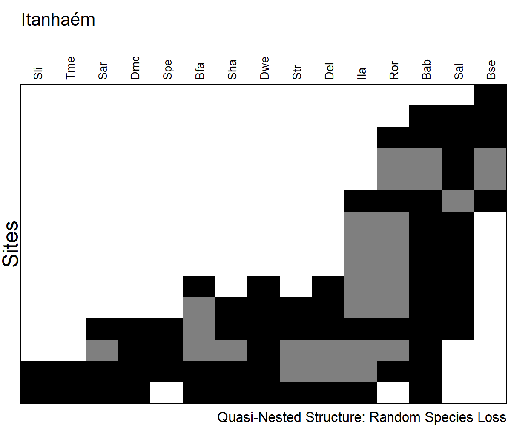

Elements of Metacommunity Structure
================
Rodolfo Pelinson
12/04/2021

First we need preparare all data matrices from the main dataset. These
are prepared sourcing the “Loading\_data.R” file in the Auxiliary
Scripts folder.

``` r
library(AtlanticForestMetacommunity)
source("Loading_data.R")
```

    ## Error in get(genname, envir = envir) : 
    ##   objeto 'testthat_print' não encontrado

The packages used to run this analyses are:

`vegan` version 2.5-6  
`metacom` version 1.5.3

       

Running the EMS analysis. The `IdentifyStructure` function is a function
created to run the same analyses for multiple datasets and automatically
identify the idealized metacommunity structure.

``` r
Metacommunities <- IdentifyStructure(list(Broad_pa,
                                          DRF_pa,#(Dense Rain Forest)
                                          UBA_pa,#(Ubatuba)
                                          BER_pa,#(Bertioga)
                                          ITA_pa,#(Itanhaém)
                                          SSF_pa,#(Seasonal Semideciduous Forest)
                                          ST_pa,#(Santa Fé do Sul)
                                          IC_pa,#(Icém)
                                          NI_pa,#(Nova Itapirema)
                                          MD_pa,#(Morro do Diabo)
                                          JA_pa),#(Estação Ecológica do Jataí)
                                     names = c("Broad",
                                               "DRF",
                                               "Ubatuba",
                                               "Bertioga",
                                               "Itanhaém",
                                               "SSF",
                                               "Santa Fé do Sul",
                                               "Icém",
                                               "Nova Itapirema",
                                               "Morro do Diabo",
                                               "Jataí"),
                                     CoherenceMethod = "curveball",
                                     turnoverMethod = "EMS",
                                     orderNulls = T, seed = 2, sims = 10000, round = 3)
```

    FALSE   |                                                                              |                                                                      |   0%  |                                                                              |======                                                                |   9%  |                                                                              |=============                                                         |  18%  |                                                                              |===================                                                   |  27%  |                                                                              |=========================                                             |  36%  |                                                                              |================================                                      |  45%  |                                                                              |======================================                                |  55%  |                                                                              |=============================================                         |  64%  |                                                                              |===================================================                   |  73%  |                                                                              |=========================================================             |  82%  |                                                                              |================================================================      |  91%  |                                                                              |======================================================================| 100%

``` r
Metacommunities
```

    FALSE                 Embeded_Absences Simulated_Embeded_Absences
    FALSE Broad                       1107                   2808.635
    FALSE DRF                          490                    547.387
    FALSE Ubatuba                      105                    152.446
    FALSE Bertioga                      45                     41.470
    FALSE Itanhaém                      33                     60.155
    FALSE SSF                          596                    675.566
    FALSE Santa Fé do Sul                9                     15.751
    FALSE Icém                          54                     61.013
    FALSE Nova Itapirema                16                     21.450
    FALSE Morro do Diabo                16                     24.564
    FALSE Jataí                         11                     25.636
    FALSE                 percent_difference_EmbAbs z_Coherence p_Coherence Turnover
    FALSE Broad                               0.606     -10.951       0.000   566973
    FALSE DRF                                 0.105      -1.600       0.110    16547
    FALSE Ubatuba                             0.311      -3.043       0.002     2976
    FALSE Bertioga                           -0.085       0.480       0.631      301
    FALSE Itanhaém                            0.451      -2.373       0.018      682
    FALSE SSF                                 0.118      -1.818       0.069    23810
    FALSE Santa Fé do Sul                     0.429      -1.926       0.054      147
    FALSE Icém                                0.115      -1.064       0.287      683
    FALSE Nova Itapirema                      0.254      -1.763       0.078      151
    FALSE Morro do Diabo                      0.349      -2.203       0.028      184
    FALSE Jataí                               0.571      -3.290       0.001      342
    FALSE                 Simulated_Turnover percent_difference_Turn z_Turnover
    FALSE Broad                   462880.436                  -0.225      3.058
    FALSE DRF                      13332.898                  -0.241      0.993
    FALSE Ubatuba                   3475.796                   0.144     -0.834
    FALSE Bertioga                   219.755                  -0.370      1.312
    FALSE Itanhaém                   751.828                   0.093     -0.457
    FALSE SSF                      18951.726                  -0.256      1.308
    FALSE Santa Fé do Sul            171.332                   0.142     -0.527
    FALSE Icém                       592.498                  -0.153      0.594
    FALSE Nova Itapirema              98.568                  -0.532      1.432
    FALSE Morro do Diabo             173.214                  -0.062      0.283
    FALSE Jataí                      282.259                  -0.212      0.786
    FALSE                 p_Turnover I_Index p_I_Index N_sites N_species
    FALSE Broad                0.002   2.505     0.000      96        52
    FALSE DRF                  0.321   3.450     0.000      50        24
    FALSE Ubatuba              0.404   1.467     0.014      23        20
    FALSE Bertioga             0.190   1.795     0.029      12        14
    FALSE Itanhaém             0.648   1.529     0.050      15        15
    FALSE SSF                  0.191   2.038     0.000      46        32
    FALSE Santa Fé do Sul      0.598   1.015     0.388       8        11
    FALSE Icém                 0.552   1.385     0.029      12        18
    FALSE Nova Itapirema       0.152   1.050     0.331       8        18
    FALSE Morro do Diabo       0.777   1.158     0.165       8        14
    FALSE Jataí                0.432   1.516     0.019      10        12
    FALSE                                              Structure
    FALSE Broad                                      Clementsian
    FALSE DRF                                             Random
    FALSE Ubatuba         Quasi-Nested with clumped species loss
    FALSE Bertioga                                        Random
    FALSE Itanhaém         Quasi-Nested with random species loss
    FALSE SSF                                             Random
    FALSE Santa Fé do Sul                                 Random
    FALSE Icém                                            Random
    FALSE Nova Itapirema                                  Random
    FALSE Morro do Diabo                        Quasi-Gleasonian
    FALSE Jataí                                Quasi-Clementsian

   

# Correlation with Environmental Gradients

We only analyzed the correlation between the underlying gradient with
true environmental gradients for the metacommunities that exhibited a
coherent metacommunity structures.    

### Broad Spatial Extent

Spearman rank Correlations or Kruskal-Wallis analysis.

``` r
pca <- rda(Broad_clim_st)
relative_eigenvalues <- pca$CA$eig/sum(pca$CA$eig)
PC1 <- pca$CA$u[,1]
Broad_env$ecoregion <- as.factor(Broad_env$ecoregion)
Broad_spearman <- My_spearman(Broad_pa, data.frame(Broad_env, PC1))

round(Broad_spearman,3)
```

    ##                 rho chi-squared     p adj_p
    ## hydroperiod  -0.053          NA 0.608 0.608
    ## canopy_cover  0.461          NA 0.000 0.000
    ## area         -0.078          NA 0.451 0.526
    ## depth         0.209          NA 0.041 0.058
    ## nvt           0.655          NA 0.000 0.000
    ## ecoregion        NA      71.143 0.000 0.000
    ## PC1           0.760          NA 0.000 0.000

   

Plotting it.

``` r
My_Imagine(comm = Broad_pa, col = c("white", "black", "grey50"),
           order = T, scores = 1, fill = T, cex.site = 0.6, cex.species = 0.8,
           top_margin = 7, left_margin = 4,
           Env1 = PC1, Env.col_1 = c("white","red"), Env.label_1 = "Climate",
           Env2 = Broad_env_st$dist_to_forest, Env.col_2 = c("forestgreen","lemonchiffon"), Env.label_2 = "Dist. Forest",
           Env3 = as.numeric(Broad_env$nvt), Env.col_3 = c("lemonchiffon","forestgreen"), Env.label_3 = "Vegetation",
           Env4 = as.numeric(Broad_env$canopy_cover), Env.col_4= c("lemonchiffon","forestgreen"), Env.label_4 = "Canopy Cover",
           Env5 = as.numeric(Broad_env$ecoregion), Env.col_5= c("forestgreen","darkolivegreen2"), Env.label_5 = "Ecoregion")
```


### Intermediate Spatial Extent

#### DRF - Dense Rain Forest

``` r
My_Imagine(comm = DRF_pa, col = c("white", "black"),
           order = T, scores = 1, fill = F, cex.site = 0.6, top_margin = 4, left_margin = 4)
```


#### SSF - Seasonal Semideciduous Forest

``` r
My_Imagine(comm = SSF_pa, col = c("white", "black"),
           order = T, scores = 1, fill = F, cex.site = 0.6, top_margin = 4, left_margin = 4)
```


       

### Intermediate Spatial Extent

#### DRF - Dense Rain Forest

Ubatuba

``` r
UBA_spearman <- My_spearman(UBA_pa, UBA_env)
round(UBA_spearman,3)
```

    ##                 rho chi-squared     p adj_p
    ## hydroperiod  -0.172          NA 0.432 0.772
    ## canopy_cover  0.271          NA 0.211 0.772
    ## area          0.083          NA 0.706 0.772
    ## depth        -0.064          NA 0.772 0.772
    ## nvt              NA          NA    NA    NA

``` r
My_Imagine(comm = UBA_pa, col = c("white", "black","grey50"),
           order = T, scores = 1, fill = T, cex.site = 0.6,
           top_margin = 4, left_margin = 4)
```


   

Bertioga

``` r
My_Imagine(comm = BER_pa, col = c("white", "black"),
           order = T, scores = 1, fill = F, cex.site = 0.6,
           top_margin = 4, left_margin = 4)
```


   

Itanhaém

``` r
ITA_spearman <- My_spearman(ITA_pa, ITA_env)
round(ITA_spearman,3)
```

    ##                 rho chi-squared     p adj_p
    ## hydroperiod   0.477          NA 0.072 0.306
    ## canopy_cover  0.213          NA 0.446 0.557
    ## area          0.065          NA 0.819 0.819
    ## depth         0.417          NA 0.122 0.306
    ## nvt          -0.329          NA 0.231 0.384

``` r
My_Imagine(comm = ITA_pa, col = c("white", "black","gray50"),
           order = T, scores = 1, fill = T, cex.site = 0.6, top_margin = 7, left_margin = 4)
```



   

#### SSF - Seasonal Semideciduous Forest

Santa Fé do Sul

``` r
ST_spearman <- My_spearman(ST_pa, ST_env)
round(ST_spearman,3)
```

    ##                rho chi-squared     p adj_p
    ## hydroperiod  0.845          NA 0.008 0.033
    ## canopy_cover    NA          NA    NA    NA
    ## area         0.333          NA 0.428 0.428
    ## depth        0.719          NA 0.045 0.089
    ## nvt          0.620          NA 0.101 0.135

``` r
My_Imagine(comm = ST_pa, col = c("white", "black"),
           order = T, scores = 1, fill = F, cex.site = 0.6,
           top_margin = 4, left_margin = 4)
```


   

Icém

``` r
IC_spearman <- My_spearman(IC_pa, IC_env)
round(IC_spearman,3)
```

    ##                 rho chi-squared     p adj_p
    ## hydroperiod  -0.809          NA 0.001 0.006
    ## canopy_cover     NA          NA    NA    NA
    ## area         -0.695          NA 0.012 0.024
    ## depth         0.060          NA 0.854 0.854
    ## nvt          -0.519          NA 0.084 0.112

``` r
My_Imagine(comm = IC_pa, col = c("white", "black"),
           order = T, scores = 1, fill = F, cex.site = 0.6,
           top_margin = 4, left_margin = 4)
```


   

Nova Itapirema

``` r
NI_spearman <- My_spearman(NI_pa, NI_env)
round(NI_spearman,3)
```

    ##                 rho chi-squared     p adj_p
    ## hydroperiod   0.282          NA 0.499 0.825
    ## canopy_cover     NA          NA    NA    NA
    ## area         -0.214          NA 0.619 0.825
    ## depth        -0.331          NA 0.423 0.825
    ## nvt           0.082          NA 0.846 0.846

``` r
My_Imagine(comm = NI_pa, col = c("white", "black"),
           order = T, scores = 1, fill = F, cex.site = 0.6,
           top_margin = 4, left_margin = 4)
```


   

Morro do Diabo

``` r
MD_spearman <- My_spearman(MD_pa, MD_env)
round(MD_spearman,3)
```

    ##                 rho chi-squared     p adj_p
    ## hydroperiod  -0.620          NA 0.101 0.253
    ## canopy_cover  0.756          NA 0.030 0.150
    ## area         -0.371          NA 0.365 0.431
    ## depth        -0.361          NA 0.379 0.431
    ## nvt           0.326          NA 0.431 0.431

``` r
My_Imagine(comm = MD_pa, col = c("white", "black","gray50"),
           order = T, scores = 1, fill = T, cex.site = 0.6, top_margin = 7, left_margin = 4,
           Env1 = as.numeric(MD_env$canopy_cover), Env.col_1 = c("lemonchiffon","forestgreen"), Env.label_1 = "Canopy Cover")
```


   

Jataí

``` r
JA_spearman <- My_spearman(JA_pa, JA_env)
round(JA_spearman,3)
```

    ##                 rho chi-squared     p adj_p
    ## hydroperiod  -0.853          NA 0.002 0.009
    ## canopy_cover -0.722          NA 0.018 0.031
    ## area         -0.322          NA 0.364 0.364
    ## depth        -0.448          NA 0.194 0.243
    ## nvt          -0.803          NA 0.005 0.013

``` r
My_Imagine(comm = JA_pa, col = c("white", "black","gray50"),
           order = T, scores = 1, fill = T, cex.site = 0.6, top_margin = 7, left_margin = 4,
           Env1 = as.numeric(JA_env$hydroperiod), Env.col_1 = c("lightskyblue", "royalblue"), Env.label_1 = "Hydroperiod",
           Env2 = as.numeric(JA_env$nvt), Env.col_2 = c("lemonchiffon","forestgreen"), Env.label_2 = "Vegetation",
           Env3 = as.numeric(JA_env$canopy_cover), Env.col_3 = c("lemonchiffon","forestgreen"), Env.label_3 = "Canopy Cover")
```


