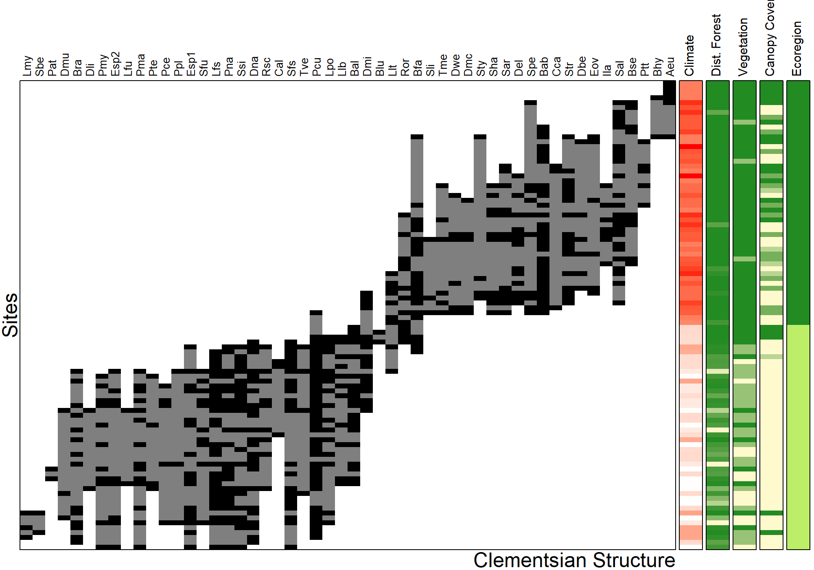
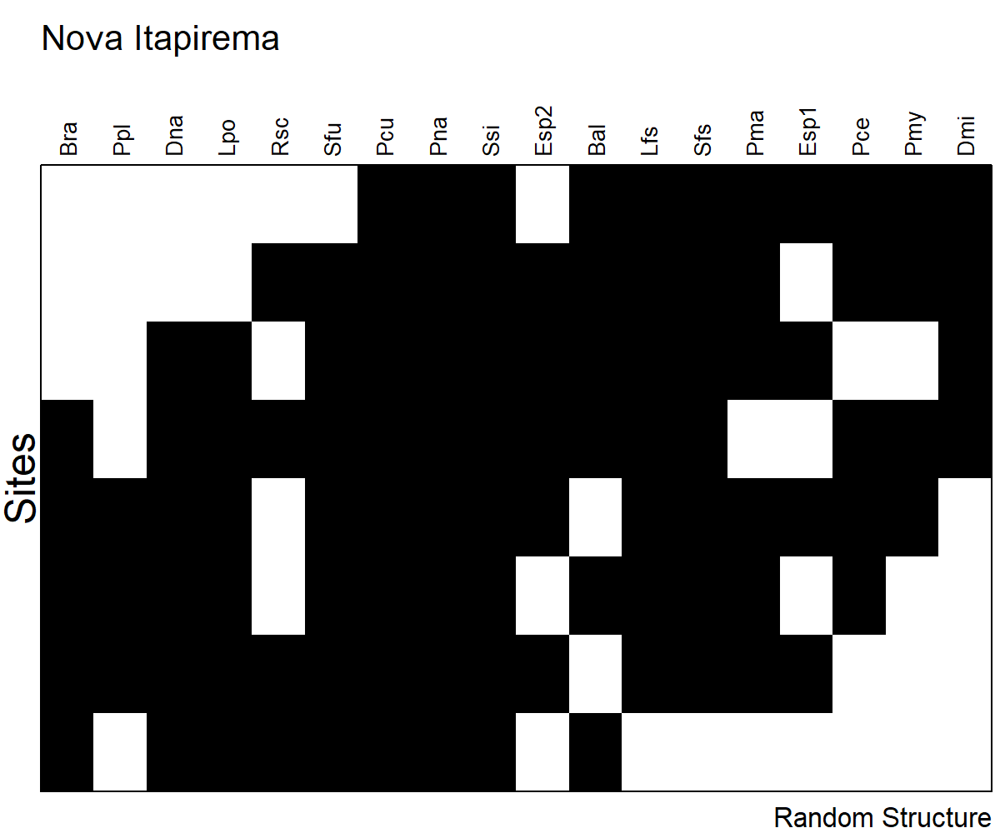
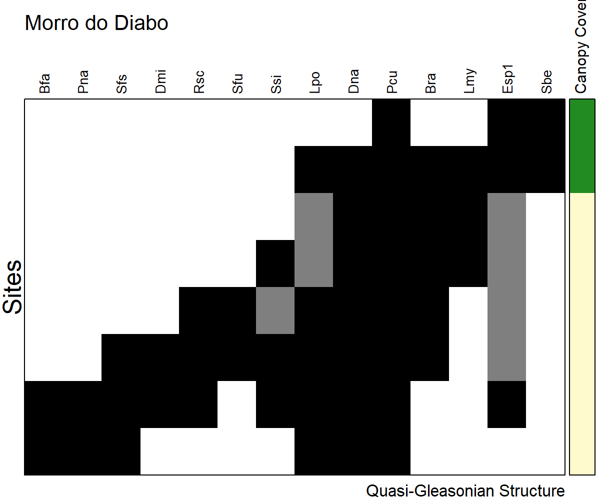
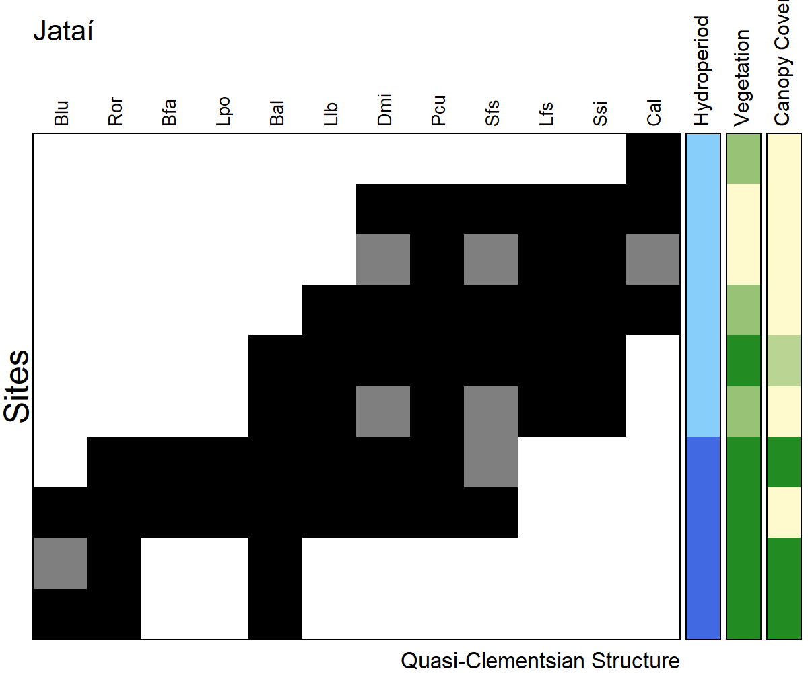

Elements of Metacommunity Structure
================
Rodolfo Pelinson
12/04/2021

First we have to load the separated data matrices we need. It all comes
from the Data.csv file in the Data folder. The data matrices are
prepared sourcing the “Loading\_data.R” file in the Auxiliary Scripts
folder.

``` r
source("Loading_data.R")
library(AtlanticForestMetacommunity)
```

The used packages to run this analysis are:

`vegan` version 2.5-6  
`metacom` version 1.5.3

       

Running the EMS analysis

``` r
Metacommunities <- IdentifyStructure(list(Broad_pa,
                                          DRF_pa,#(Dense Rain Forest)
                                          UBA_pa,#(Ubatuba)
                                          BER_pa,#(Bertioga)
                                          ITA_pa,#(Itanhaém)
                                          SSF_pa,#(Seasonal Semideciduous Forest)
                                          ST_pa,#(Santa Fé do Sul)
                                          IC_pa,#(Icém)
                                          NI_pa,#(Nova Itapirema)
                                          MD_pa,#(Morro do Diabo)
                                          JA_pa),#(Estação Ecológica do Jataí)
                                     names = c("Broad",
                                               "DRF",
                                               "Ubatuba",
                                               "Bertioga",
                                               "Itanhaém",
                                               "SSF",
                                               "Santa Fé do Sul",
                                               "Icém",
                                               "Nova Itapirema",
                                               "Morro do Diabo",
                                               "Jataí"),
                                     CoherenceMethod = "curveball",
                                     turnoverMethod = "EMS",
                                     orderNulls = T, seed = 3, sims = 10000)
```

    ##   |                                                                              |                                                                      |   0%  |                                                                              |======                                                                |   9%  |                                                                              |=============                                                         |  18%  |                                                                              |===================                                                   |  27%  |                                                                              |=========================                                             |  36%  |                                                                              |================================                                      |  45%  |                                                                              |======================================                                |  55%  |                                                                              |=============================================                         |  64%  |                                                                              |===================================================                   |  73%  |                                                                              |=========================================================             |  82%  |                                                                              |================================================================      |  91%  |                                                                              |======================================================================| 100%

``` r
Metacommunities
```

    ##                 Embeded_Absences Simulated_Embeded_Absences
    ## Broad                       1107                  2809.3941
    ## DRF                          490                   546.3680
    ## Ubatuba                      105                   152.2589
    ## Bertioga                      45                    40.6333
    ## Itanhaém                      33                    60.0516
    ## SSF                          596                   677.7384
    ## Santa Fé do Sul                9                    15.8651
    ## Icém                          54                    61.0686
    ## Nova Itapirema                16                    21.6285
    ## Morro do Diabo                16                    24.5500
    ## Jataí                         11                    25.8129
    ##                 percent_difference_EmbAbs z_Coherence  p_Coherence Turnover
    ## Broad                           0.6059649 -11.5483503 7.525099e-31   566973
    ## DRF                             0.1031686  -1.4655372 1.427744e-01    16547
    ## Ubatuba                         0.3103851  -2.9761589 2.918836e-03     2976
    ## Bertioga                       -0.1074660   0.5780797 5.632103e-01      301
    ## Itanhaém                        0.4504726  -2.3147403 2.062715e-02      682
    ## SSF                             0.1206046  -1.9277666 5.388416e-02    23810
    ## Santa Fé do Sul                 0.4327171  -1.9610308 4.987543e-02      147
    ## Icém                            0.1157485  -1.0743742 2.826550e-01      683
    ## Nova Itapirema                  0.2602353  -1.8497584 6.434838e-02      151
    ## Morro do Diabo                  0.3482688  -2.2248147 2.609368e-02      184
    ## Jataí                           0.5738565  -3.2866369 1.013915e-03      342
    ##                 Simulated_Turnover percent_difference_Turn z_Turnover
    ## Broad                  462666.8782             -0.22544541  3.0163399
    ## DRF                     13330.5955             -0.24127988  1.0065306
    ## Ubatuba                  3475.5572              0.14373442 -0.8286954
    ## Bertioga                  220.3879             -0.36577371  1.3121629
    ## Itanhaém                  747.8519              0.08805473 -0.4315736
    ## SSF                     18925.4417             -0.25809481  1.2984426
    ## Santa Fé do Sul           170.6858              0.13876843 -0.5213197
    ## Icém                      590.7692             -0.15611985  0.6120645
    ## Nova Itapirema             98.6941             -0.52998001  1.4288721
    ## Morro do Diabo            173.2692             -0.06193138  0.2799493
    ## Jataí                     281.8202             -0.21353970  0.7948606
    ##                  p_Turnover  I_Index    p_I_Index N_sites N_species
    ## Broad           0.002558463 2.505263 3.352874e-14      96        52
    ## DRF             0.314160416 3.450317 4.740652e-13      50        24
    ## Ubatuba         0.407276813 1.466667 1.404999e-02      23        20
    ## Bertioga        0.189465166 1.794872 2.941613e-02      12        14
    ## Itanhaém        0.666051331 1.529412 5.038045e-02      15        15
    ## SSF             0.194135279 2.038418 5.295788e-07      46        32
    ## Santa Fé do Sul 0.602144091 1.014706 3.878447e-01       8        11
    ## Icém            0.540495103 1.384615 2.866922e-02      12        18
    ## Nova Itapirema  0.153040989 1.050000 3.313100e-01       8        18
    ## Morro do Diabo  0.779516413 1.157895 1.651549e-01       8        14
    ## Jataí           0.426694603 1.515789 1.873235e-02      10        12
    ##                                              Structure
    ## Broad                                      Clementsian
    ## DRF                                             Random
    ## Ubatuba         Quasi-Nested with clumped species loss
    ## Bertioga                                        Random
    ## Itanhaém         Quasi-Nested with random species loss
    ## SSF                                             Random
    ## Santa Fé do Sul  Quasi-Nested with random species loss
    ## Icém                                            Random
    ## Nova Itapirema                                  Random
    ## Morro do Diabo                        Quasi-Gleasonian
    ## Jataí                                Quasi-Clementsian

# Correlation with Environmental Gradients

We only analysed those gradients for metacommunities that exhibited a
coherent metacommunity structure.    

### Broad Spatial Extent

Spearman rank Correlations or Kruskal-Wallis analysis.

``` r
pca <- rda(Broad_clim_st)
relative_eigenvalues <- pca$CA$eig/sum(pca$CA$eig)
PC1 <- pca$CA$u[,1]
Broad_env$ecoregion <- as.factor(Broad_env$ecoregion)
Broad_spearman <- My_spearman(Broad_pa, data.frame(Broad_env, PC1))

round(Broad_spearman,3)
```

    ##                 rho chi-squared     p adj_p
    ## hydroperiod  -0.053          NA 0.608 0.608
    ## canopy_cover  0.461          NA 0.000 0.000
    ## area         -0.078          NA 0.451 0.526
    ## depth         0.209          NA 0.041 0.058
    ## nvt           0.655          NA 0.000 0.000
    ## ecoregion        NA      71.143 0.000 0.000
    ## PC1           0.760          NA 0.000 0.000

   

Plotting it.

``` r
My_Imagine(comm = Broad_pa, col = c("white", "black", "grey50"),
           order = T, scores = 1, fill = T, cex.site = 0.6, cex.species = 0.8,
           top_margin = 7, left_margin = 4,
           Env1 = PC1, Env.col_1 = c("white","red"), Env.label_1 = "Climate",
           Env2 = as.factor(Broad_env$nvt), Env.col_2 = c("chartreuse1", "chartreuse3","chartreuse4"), Env.label_2 = "Vegetation",
           Env3 = as.factor(Broad_env$canopy_cover), Env.col_3= c("gold","forestgreen"), Env.label_3 = "Canopy Cover",
           Env4 = as.factor(Broad_env$ecoregion), Env.col_4= c("darkgreen","darkolivegreen1"), Env.label_4 = "Ecoregion")
```



### Intermediate Spatial Extent

#### DRF - Dense Rain Forest

``` r
My_Imagine(comm = DRF_pa, col = c("white", "black"),
           order = T, scores = 1, fill = F, cex.site = 0.6, top_margin = 4, left_margin = 4)
```


#### SSF - Seasonal Semideciduous Forest

``` r
My_Imagine(comm = SSF_pa, col = c("white", "black"),
           order = T, scores = 1, fill = F, cex.site = 0.6, top_margin = 4, left_margin = 4)
```


       

### Intermediate Spatial Extent

#### DRF - Dense Rain Forest

Ubatuba

``` r
UBA_spearman <- My_spearman(UBA_pa, UBA_env)
round(UBA_spearman,3)
```

    ##                 rho chi-squared     p adj_p
    ## hydroperiod  -0.172          NA 0.432 0.772
    ## canopy_cover  0.271          NA 0.211 0.772
    ## area          0.083          NA 0.706 0.772
    ## depth        -0.064          NA 0.772 0.772
    ## nvt              NA          NA    NA    NA

``` r
My_Imagine(comm = UBA_pa, col = c("white", "black","grey50"),
           order = T, scores = 1, fill = T, cex.site = 0.6,
           top_margin = 4, left_margin = 4)
```


   

Bertioga

``` r
My_Imagine(comm = BER_pa, col = c("white", "black"),
           order = T, scores = 1, fill = F, cex.site = 0.6,
           top_margin = 4, left_margin = 4)
```


   

Itanhaém

``` r
ITA_spearman <- My_spearman(ITA_pa, ITA_env)
round(ITA_spearman,3)
```

    ##                 rho chi-squared     p adj_p
    ## hydroperiod   0.477          NA 0.072 0.306
    ## canopy_cover  0.213          NA 0.446 0.557
    ## area          0.065          NA 0.819 0.819
    ## depth         0.417          NA 0.122 0.306
    ## nvt          -0.329          NA 0.231 0.384

``` r
My_Imagine(comm = ITA_pa, col = c("white", "black","gray50"),
           order = T, scores = 1, fill = T, cex.site = 0.6, top_margin = 7, left_margin = 4,
           Env1 = as.factor(ITA_env$hydroperiod), Env.col_1 = c("lightskyblue", "royalblue"), Env.label_1 = "Hydroperiod")
```


   

#### SSF - Seasonal Semideciduous Forest

Santa Fé do Sul

``` r
ST_spearman <- My_spearman(ST_pa, ST_env)
round(ST_spearman,3)
```

    ##                rho chi-squared     p adj_p
    ## hydroperiod  0.845          NA 0.008 0.033
    ## canopy_cover    NA          NA    NA    NA
    ## area         0.333          NA 0.428 0.428
    ## depth        0.719          NA 0.045 0.089
    ## nvt          0.620          NA 0.101 0.135

``` r
My_Imagine(comm = ST_pa, col = c("white", "black"),
           order = T, scores = 1, fill = F, cex.site = 0.6,
           top_margin = 4, left_margin = 4)
```


   

Icém

``` r
IC_spearman <- My_spearman(IC_pa, IC_env)
round(IC_spearman,3)
```

    ##                 rho chi-squared     p adj_p
    ## hydroperiod  -0.809          NA 0.001 0.006
    ## canopy_cover     NA          NA    NA    NA
    ## area         -0.695          NA 0.012 0.024
    ## depth         0.060          NA 0.854 0.854
    ## nvt          -0.519          NA 0.084 0.112

``` r
My_Imagine(comm = IC_pa, col = c("white", "black"),
           order = T, scores = 1, fill = F, cex.site = 0.6,
           top_margin = 4, left_margin = 4)
```


   

Nova Itapirema

``` r
NI_spearman <- My_spearman(NI_pa, NI_env)
round(NI_spearman,3)
```

    ##                 rho chi-squared     p adj_p
    ## hydroperiod   0.282          NA 0.499 0.825
    ## canopy_cover     NA          NA    NA    NA
    ## area         -0.214          NA 0.619 0.825
    ## depth        -0.331          NA 0.423 0.825
    ## nvt           0.082          NA 0.846 0.846

``` r
My_Imagine(comm = NI_pa, col = c("white", "black"),
           order = T, scores = 1, fill = F, cex.site = 0.6,
           top_margin = 4, left_margin = 4)
```


   

Morro do Diabo

``` r
MD_spearman <- My_spearman(MD_pa, MD_env)
round(MD_spearman,3)
```

    ##                 rho chi-squared     p adj_p
    ## hydroperiod  -0.620          NA 0.101 0.253
    ## canopy_cover  0.756          NA 0.030 0.150
    ## area         -0.371          NA 0.365 0.431
    ## depth        -0.361          NA 0.379 0.431
    ## nvt           0.326          NA 0.431 0.431

``` r
My_Imagine(comm = MD_pa, col = c("white", "black","gray50"),
           order = T, scores = 1, fill = T, cex.site = 0.6, top_margin = 7, left_margin = 4,
           Env1 = as.factor(MD_env$canopy_cover), Env.col_1 = c("gold","forestgreen"), Env.label_1 = "Canopy Cover")
```


   

Jataí

``` r
JA_spearman <- My_spearman(JA_pa, JA_env)
round(JA_spearman,3)
```

    ##                 rho chi-squared     p adj_p
    ## hydroperiod  -0.853          NA 0.002 0.009
    ## canopy_cover -0.722          NA 0.018 0.031
    ## area         -0.322          NA 0.364 0.364
    ## depth        -0.448          NA 0.194 0.243
    ## nvt          -0.803          NA 0.005 0.013

``` r
My_Imagine(comm = JA_pa, col = c("white", "black","gray50"),
           order = T, scores = 1, fill = T, cex.site = 0.6, top_margin = 7, left_margin = 4,
           Env1 = as.factor(JA_env$hydroperiod), Env.col_1 = c("cyan2","blue3"), Env.label_1 = "Hydroperiod",
           Env2 = as.factor(JA_env$nvt), Env.col_2 = c("chartreuse1", "chartreuse3","chartreuse4"), Env.label_2 = "Vegetation",
           Env3 = as.factor(JA_env$canopy_cover), Env.col_3 = c("gold","forestgreen"), Env.label_3 = "Canopy Cover")
```


   
