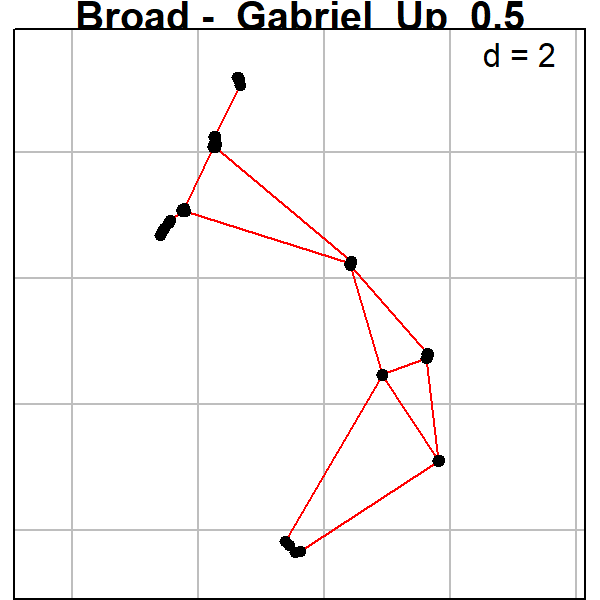
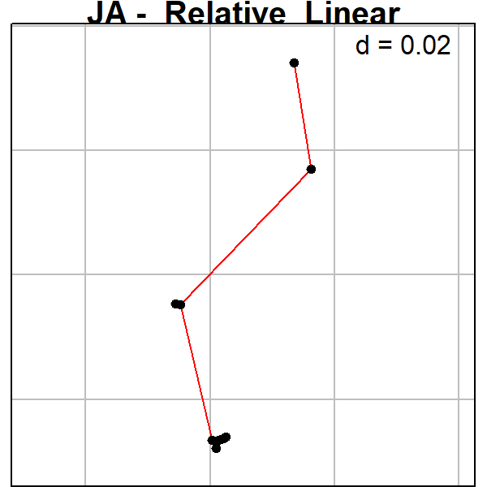
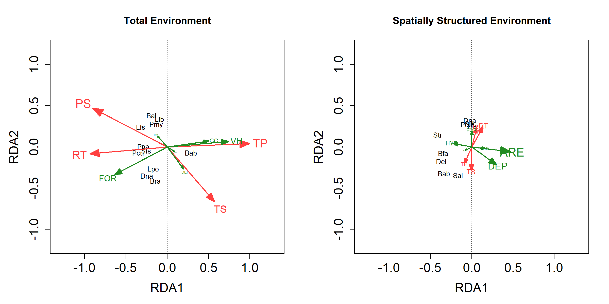
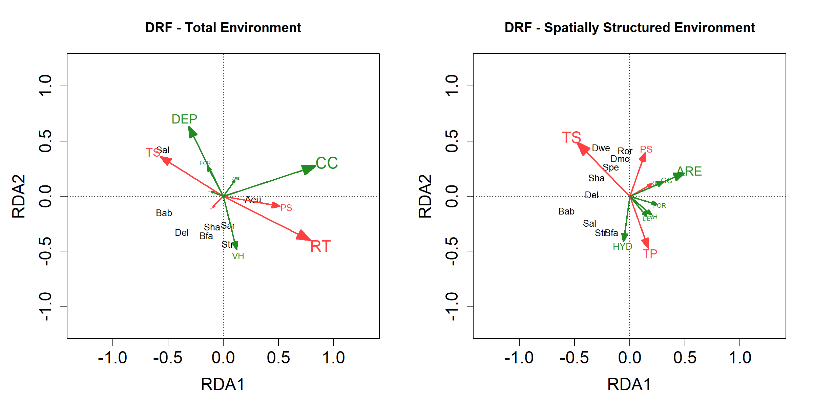
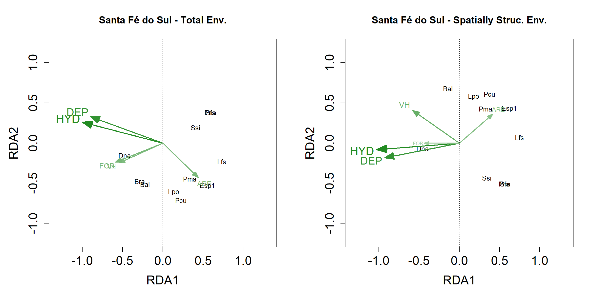
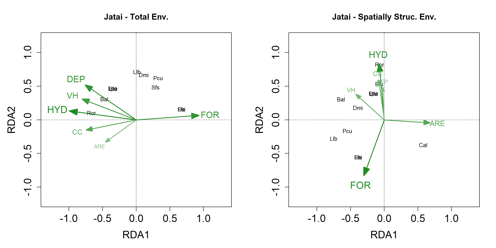

RDAs
================
Rodolfo Pelinson
12/06/2021

First we have to load the separated data matrices we need. The data
matrices are prepared sourcing the “Loading\_data.R” file in the
Auxiliary Scripts folder.

``` r
library(AtlanticForestMetacommunity)
source("Loading_data.R")
```

    ## Error in get(genname, envir = envir) : 
    ##   objeto 'testthat_print' não encontrado

The used packages to run this analysis are:

`vegan` version 2.5-6  
`ade4` version 1.7-15  
`adespatial` version 0.3-8

        Constructing Spatial matrix (same as in the varpart file)

``` r
set.seed(3, sample.kind = "default")

candidates_Broad <- listw.candidates(Broad_coord, style = "B", nb = c("del", "gab", "rel", "pcnm"),
                                   weights = c("flin", "fup"), y_fdown = 5, y_fup = 0.5)
```

    ## 
    ##      PLEASE NOTE:  The components "delsgs" and "summary" of the
    ##  object returned by deldir() are now DATA FRAMES rather than
    ##  matrices (as they were prior to release 0.0-18).
    ##  See help("deldir").
    ##  
    ##      PLEASE NOTE: The process that deldir() uses for determining
    ##  duplicated points has changed from that used in version
    ##  0.0-9 of this package (and previously). See help("deldir").

``` r
Broad_MEM <- listw.select(Broad_pa, candidates = candidates_Broad, MEM.autocor = c("positive"), method = c("FWD"),
             MEM.all = FALSE, nperm = 10000, nperm.global = 10000, alpha = 0.05, p.adjust = TRUE, verbose = FALSE)
```

    ## Procedure stopped (alpha criteria): pvalue for variable 5 is 0.286871 (> 0.050000)
    ## Procedure stopped (alpha criteria): pvalue for variable 12 is 0.066193 (> 0.050000)
    ## Procedure stopped (adjR2thresh criteria) adjR2cum = 0.395438 with 22 variables (> 0.393805)
    ## Procedure stopped (alpha criteria): pvalue for variable 16 is 0.072993 (> 0.050000)
    ## Procedure stopped (adjR2thresh criteria) adjR2cum = 0.399941 with 31 variables (> 0.398728)
    ## Procedure stopped (alpha criteria): pvalue for variable 18 is 0.051195 (> 0.050000)
    ## Procedure stopped (adjR2thresh criteria) adjR2cum = 0.371382 with 23 variables (> 0.369036)

``` r
Broad_MEM_FS <- Broad_MEM$best$MEM.select

adegraphics::s.label(Broad_coord, nb = candidates_Broad[[Broad_MEM$best.id]],
                     pnb.edge.col = "red", main = paste("Broad - ",names(Broad_MEM$best.id)), plot = TRUE, labels = NULL)
```



``` r
################################################################################


candidates_DRF <- listw.candidates(DRF_coord, style = "B", nb = c("del", "gab", "rel", "pcnm"),
                                   weights = c("flin", "fup"), y_fdown = 5, y_fup = 0.25)

DRF_MEM <- listw.select(DRF_pa, candidates = candidates_DRF, MEM.autocor = c("positive"), method = c("FWD"),
             MEM.all = FALSE, nperm = 10000, nperm.global = 10000, alpha = 0.05, p.adjust = TRUE, verbose = FALSE)
```

    ## Procedure stopped (alpha criteria): pvalue for variable 8 is 0.083192 (> 0.050000)
    ## Procedure stopped (alpha criteria): pvalue for variable 8 is 0.108089 (> 0.050000)

``` r
DRF_MEM_FS <- DRF_MEM$best$MEM.select


adegraphics::s.label(DRF_coord, nb = candidates_DRF[[DRF_MEM$best.id]],
                     pnb.edge.col = "red", main = paste("DRF - ",names(DRF_MEM$best.id)), plot = TRUE, labels = NULL)
```


``` r
################################################################################


candidates_SSF <- listw.candidates(SSF_coord, style = "B", nb = c("del", "gab", "rel", "pcnm"),
                                   weights = c("flin", "fup"), y_fdown = 5, y_fup = 0.25)

SSF_MEM <- listw.select(SSF_pa, candidates = candidates_SSF, MEM.autocor = c("positive"), method = c("FWD"),
             MEM.all = FALSE, nperm = 10000, nperm.global = 10000, alpha = 0.05, p.adjust = TRUE, verbose = FALSE)
```

    ## Procedure stopped (adjR2thresh criteria) adjR2cum = 0.079183 with 2 variables (> 0.079183)
    ## Procedure stopped (alpha criteria): pvalue for variable 7 is 0.082992 (> 0.050000)
    ## Procedure stopped (adjR2thresh criteria) adjR2cum = 0.304147 with 9 variables (> 0.302779)
    ## Procedure stopped (alpha criteria): pvalue for variable 7 is 0.071493 (> 0.050000)
    ## Procedure stopped (alpha criteria): pvalue for variable 8 is 0.068893 (> 0.050000)
    ## Procedure stopped (alpha criteria): pvalue for variable 9 is 0.071693 (> 0.050000)
    ## Procedure stopped (alpha criteria): pvalue for variable 10 is 0.056094 (> 0.050000)

``` r
SSF_MEM_FS <- SSF_MEM$best$MEM.select


adegraphics::s.label(SSF_coord, nb = candidates_SSF[[SSF_MEM$best.id]],
                     pnb.edge.col = "red", main = paste("SSF - ",names(SSF_MEM$best.id)), plot = TRUE, labels = NULL)
```


``` r
################################################################################


#We restricted our options for optimization because of the low statistical power (low replication) that we had at our small spatial scale. We only used linear weights as we do not believe that a exponential decay would make sense at this scale (even relative large distances between sites are actually small). Also We restricted our graph conectivity matrix to only three that yields relatively different scenarios of conectance. Those are the Delauney triangulation, the Relative neighbour and the PCNM

################################################################################


candidates_ITA <- listw.candidates(ITA_coord, style = "B", nb = c("del", "rel", "pcnm"),
                                   weights = c("flin"))

ITA_MEM <- listw.select(ITA_pa, candidates = candidates_ITA, MEM.autocor = c("positive"), method = c("FWD"),
             MEM.all = FALSE, nperm = 10000, nperm.global = 10000, alpha = 0.05, p.adjust = TRUE, verbose = FALSE)


ITA_MEM_FS <- dbmem(ITA_coord, MEM.autocor = c("positive"), silent = TRUE)
################################################################################


candidates_BER <- listw.candidates(BER_coord, style = "B", nb = c("del", "rel", "pcnm"),
                                   weights = c("flin"))

BER_MEM <- listw.select(BER_pa, candidates = candidates_BER, MEM.autocor = c("positive"), method = c("FWD"),
             MEM.all = FALSE, nperm = 10000, nperm.global = 10000, alpha = 0.05, p.adjust = TRUE, verbose = FALSE)

BER_MEM_FS <- dbmem(BER_coord, MEM.autocor = c("positive"), silent = TRUE)
################################################################################

candidates_UBA <- listw.candidates(UBA_coord, style = "B", nb = c("del", "rel", "pcnm"),
                                   weights = c("flin"))
```

    ## Warning in nb2listw(nb.object, style = style, glist = lapply(nb.dist, f1, : zero
    ## sum general weights

``` r
UBA_MEM <- listw.select(UBA_pa, candidates = candidates_UBA, MEM.autocor = c("positive"), method = c("FWD"),
             MEM.all = FALSE, nperm = 10000, nperm.global = 10000, alpha = 0.05, p.adjust = TRUE, verbose = FALSE)
```

    ## Procedure stopped (alpha criteria): pvalue for variable 3 is 0.082792 (> 0.050000)

``` r
UBA_MEM_FS <- UBA_MEM$best$MEM.select

adegraphics::s.label(UBA_coord, nb = candidates_UBA[[UBA_MEM$best.id]],
                     pnb.edge.col = "red", main = paste("UBA - ",names(UBA_MEM$best.id)), plot = TRUE, labels = NULL)
```


``` r
################################################################################


candidates_ST <- listw.candidates(ST_coord, style = "B", nb = c("del", "rel", "pcnm"),
                                   weights = c("flin"))
```

    ## Warning in nb2listw(nb.object, style = style, glist = lapply(nb.dist, f1, : zero
    ## sum general weights

``` r
ST_MEM <- listw.select(ST_pa, candidates = candidates_ST, MEM.autocor = c("positive"), method = c("FWD"),
             MEM.all = FALSE, nperm = 10000, nperm.global = 10000, alpha = 0.05, p.adjust = TRUE, verbose = FALSE)

ST_MEM_FS <- dbmem(ST_coord, MEM.autocor = c("positive"), silent = TRUE)

################################################################################


candidates_IC <- listw.candidates(IC_coord, style = "B", nb = c("del", "rel", "pcnm"),
                                   weights = c("flin"))

IC_MEM <- listw.select(IC_pa, candidates = candidates_IC, MEM.autocor = c("positive"), method = c("FWD"),
             MEM.all = FALSE, nperm = 10000, nperm.global = 10000, alpha = 0.05, p.adjust = TRUE, verbose = FALSE)

IC_MEM_FS <- dbmem(IC_coord, MEM.autocor = c("positive"), silent = TRUE)

################################################################################

candidates_NI <- listw.candidates(NI_coord, style = "B", nb = c("del", "rel", "pcnm"),
                                   weights = c("flin"))

NI_MEM <- listw.select(NI_pa, candidates = candidates_NI, MEM.autocor = c("positive"), method = c("FWD"),
             MEM.all = FALSE, nperm = 10000, nperm.global = 10000, alpha = 0.05, p.adjust = TRUE, verbose = FALSE)


adegraphics::s.label(NI_coord, nb = candidates_NI[[NI_MEM$best.id]],
                     pnb.edge.col = "red", main = paste("NI - ",names(NI_MEM$best.id)), plot = TRUE, labels = NULL)
```


``` r
NI_MEM_FS <- dbmem(NI_coord, MEM.autocor = c("positive"), silent = TRUE)


################################################################################

candidates_MD <- listw.candidates(MD_coord, style = "B", nb = c("del", "rel", "pcnm"),
                                   weights = c("flin"))

MD_MEM <- listw.select(MD_pa, candidates = candidates_MD, MEM.autocor = c("positive"), method = c("FWD"),
             MEM.all = FALSE, nperm = 10000, nperm.global = 10000, alpha = 0.05, p.adjust = TRUE, verbose = FALSE)

MD_MEM_FS <- dbmem(MD_coord, MEM.autocor = c("positive"), silent = TRUE)

################################################################################


candidates_JA <- listw.candidates(JA_coord, style = "B", nb = c("del", "rel", "pcnm"),
                                   weights = c("flin"))

JA_MEM <- listw.select(JA_pa, candidates = candidates_JA, MEM.autocor = c("positive"), method = c("FWD"),
             MEM.all = FALSE, nperm = 10000, nperm.global = 10000, alpha = 0.05, p.adjust = TRUE, verbose = FALSE)
```

    ## Procedure stopped (alpha criteria): pvalue for variable 2 is 0.083692 (> 0.050000)
    ## Procedure stopped (alpha criteria): pvalue for variable 3 is 0.103690 (> 0.050000)

``` r
JA_MEM_FS <- JA_MEM$best$MEM.select


adegraphics::s.label(JA_coord, nb = candidates_JA[[JA_MEM$best.id]],
                     pnb.edge.col = "red", main = paste("JA - ",names(JA_MEM$best.id)), plot = TRUE, labels = NULL)
```



``` r
################################################################################
```

To better understand what are the environmental variables that are
important in each fraction, we looked at the RDA plots of environmental
variables (local Environment and Climate) both unconstrained alone and
constrained by spatial variables, that is, with and without the
importance spatially structured variables.

Because here we are not looking at p or R2 values, we are not woried
about multicolinearity or overfitting, so we are using all climate and
environmental variables.

### Large Extent

``` r
RDA_env_Broad <- rda(Broad_pa, data.frame(Broad_clim_st, Broad_env_st[,-7]))

species_scores_Broad <- scores(RDA_env_Broad, display = c( "species"), scaling = 0, hill = T)
loadings_Broad <- scores(RDA_env_Broad, display = c( "bp"), scaling = 0, hill = T)

species_scores_Broad <- species_scores_Broad[(species_scores_Broad[,1] > 0.25 | species_scores_Broad[,1] < -0.25) | 
                                         (species_scores_Broad[,2] > 0.25 | species_scores_Broad[,2] < -0.25) ,]

#species_scores_Broad <- species_scores_Broad*1.5

xmin <- -1.2
xmax <-  1.2
ymin <- -1.2
ymax <-  1.2

rownames(loadings_Broad) <- c("TS","RT","TP","PS","HYD","CC","ARE","DEP","VH","FOR")
col_Broad <- c("brown1","brown1","brown1","brown1","forestgreen","forestgreen","forestgreen","forestgreen","forestgreen","forestgreen")


dists_Broad <- as.matrix(dist(rbind(loadings_Broad,c(0,0))))[11,-11]
dists_Broad_prop <- dists_Broad/max(dists_Broad)

#for(i in 1:length(col_Broad)){
#  col_Broad[i] <- lighten_color((1-dists_Broad_prop[i]),col_Broad[i])
#}

par(mfrow = c(1,2),mar = c(5, 5, 4, 2))
plot(RDA_env_Broad, type="n", scaling = 2, xlim = c(xmin,xmax), ylim = c(ymin,ymax), cex.lab = 1.5, cex.axis = 1.5, main = "Total Environment")
for(i in 1:length(species_scores_Broad[,1])){
  #points(species_scores_Broad[i,1], species_scores_Broad[i,2], col = "white", pch = 21, cex = 5, bg = "grey80", lwd = 1)
  text(species_scores_Broad[i,1], species_scores_Broad[i,2], labels = rownames(species_scores_Broad)[i],col = "black", cex = 0.8)
}

shape::Arrows(x0 = rep(0, length(loadings_Broad[,1])),
              y0 = rep(0, length(loadings_Broad[,1])),
              x1 = loadings_Broad[,1],
              y1 = loadings_Broad[,2], col = col_Broad, lwd = 2, arr.type="triangle", arr.length = 0.4*(dists_Broad_prop), arr.width = 0.3*(dists_Broad_prop))

for(i in 1:length(loadings_Broad[,1])){
  #points(loadings_Broad[i,1], loadings_Broad[i,2], col = col_Broad[i], pch = 21, cex = ((7*dists_Broad_prop[i])+1), bg = "white", lwd = 3)
  text(loadings_Broad[i,1]*1.2, loadings_Broad[i,2]*1.2, labels = rownames(loadings_Broad)[i],col = col_Broad[i], cex = (1.4*dists_Broad_prop[i]))
}

##################################################################################################################################
##################################################################################################################################
##################################################################################################################################


RDA_env_constrained_Broad <- rda(Broad_pa, data.frame(Broad_clim_st, Broad_env_st[,-7]), Broad_MEM_FS)

species_scores_Broad <- scores(RDA_env_constrained_Broad, display = c( "species"), scaling = 0, hill = T)
loadings_Broad <- scores(RDA_env_constrained_Broad, display = c( "bp"), scaling = 0, hill = T)

species_scores_Broad <- species_scores_Broad[(species_scores_Broad[,1] > 0.25 | species_scores_Broad[,1] < -0.25) | 
                                         (species_scores_Broad[,2] > 0.25 | species_scores_Broad[,2] < -0.25) ,]

#species_scores_Broad <- species_scores_Broad*1.5

xmin <- -1.2
xmax <-  1.2
ymin <- -1.2
ymax <-  1.2

rownames(loadings_Broad) <- c("TS","RT","TP","PS","HYD","CC","ARE","DEP","VH","FOR")
col_Broad <- c("brown1","brown1","brown1","brown1","forestgreen","forestgreen","forestgreen","forestgreen","forestgreen","forestgreen")


dists_Broad <- as.matrix(dist(rbind(loadings_Broad,c(0,0))))[11,-11]
dists_Broad_prop <- dists_Broad/max(dists_Broad)

#for(i in 1:length(col_Broad)){
#  col_Broad[i] <- lighten_color((1-dists_Broad_prop[i]),col_Broad[i])
#}

#par(mfrow = c(2,2),mar = c(5, 5, 4, 2))
plot(RDA_env_constrained_Broad, type="n", scaling = 2, xlim = c(xmin,xmax), ylim = c(ymin,ymax), cex.lab = 1.5, cex.axis = 1.5, main = "Spatially Structured Environment")
for(i in 1:length(species_scores_Broad[,1])){
  #points(species_scores_Broad[i,1], species_scores_Broad[i,2], col = "white", pch = 21, cex = 5, bg = "grey80", lwd = 1)
  text(species_scores_Broad[i,1], species_scores_Broad[i,2], labels = rownames(species_scores_Broad)[i],col = "black", cex = 0.8)
}

shape::Arrows(x0 = rep(0, length(loadings_Broad[,1])),
              y0 = rep(0, length(loadings_Broad[,1])),
              x1 = loadings_Broad[,1],
              y1 = loadings_Broad[,2], col = col_Broad, lwd = 2, arr.type="triangle", arr.length = 0.4*(dists_Broad_prop), arr.width = 0.3*(dists_Broad_prop))

for(i in 1:length(loadings_Broad[,1])){
  #points(loadings_Broad[i,1], loadings_Broad[i,2], col = col_Broad[i], pch = 21, cex = ((7*dists_Broad_prop[i])+1), bg = "white", lwd = 3)
  text(loadings_Broad[i,1]*1.2, loadings_Broad[i,2]*1.2, labels = rownames(loadings_Broad)[i],col = col_Broad[i], cex = (1.4*dists_Broad_prop[i]))
}
```



### Intermediate Extent

``` r
RDA_env_SSF <- rda(SSF_pa, data.frame(SSF_clim_st, SSF_env_st))

species_scores_SSF <- scores(RDA_env_SSF, display = c( "species"), scaling = 0, hill = T)
loadings_SSF <- scores(RDA_env_SSF, display = c( "bp"), scaling = 0, hill = T)

species_scores_SSF <- species_scores_SSF[(species_scores_SSF[,1] > 0.25 | species_scores_SSF[,1] < -0.25) | 
                                         (species_scores_SSF[,2] > 0.25 | species_scores_SSF[,2] < -0.25) ,]

#species_scores_SSF <- species_scores_SSF*1.5

xmin <- -1.2
xmax <-  1.2
ymin <- -1.2
ymax <-  1.2

rownames(loadings_SSF) <- c("TS","RT","TP","PS","HYD","CC","ARE","DEP","VH","FOR")
col_SSF <- c("brown1","brown1","brown1","brown1","forestgreen","forestgreen","forestgreen","forestgreen","forestgreen","forestgreen")


dists_SSF <- as.matrix(dist(rbind(loadings_SSF,c(0,0))))[11,-11]
dists_SSF_prop <- dists_SSF/max(dists_SSF)

#for(i in 1:length(col_SSF)){
#  col_SSF[i] <- lighten_color((1-dists_SSF_prop[i]),col_SSF[i])
#}

par(mfrow = c(1,2),mar = c(5, 5, 4, 2))
plot(RDA_env_SSF, type="n", scaling = 2, xlim = c(xmin,xmax), ylim = c(ymin,ymax), cex.lab = 1.5, cex.axis = 1.5, main = "SSF - Total Environment")
for(i in 1:length(species_scores_SSF[,1])){
  #points(species_scores_SSF[i,1], species_scores_SSF[i,2], col = "white", pch = 21, cex = 5, bg = "grey80", lwd = 1)
  text(species_scores_SSF[i,1], species_scores_SSF[i,2], labels = rownames(species_scores_SSF)[i],col = "black", cex = 0.8)
}

shape::Arrows(x0 = rep(0, length(loadings_SSF[,1])),
              y0 = rep(0, length(loadings_SSF[,1])),
              x1 = loadings_SSF[,1],
              y1 = loadings_SSF[,2], col = col_SSF, lwd = 2, arr.type="triangle", arr.length = 0.4*(dists_SSF_prop), arr.width = 0.3*(dists_SSF_prop))

for(i in 1:length(loadings_SSF[,1])){
  #points(loadings_SSF[i,1], loadings_SSF[i,2], col = col_SSF[i], pch = 21, cex = ((7*dists_SSF_prop[i])+1), bg = "white", lwd = 3)
  text(loadings_SSF[i,1]*1.2, loadings_SSF[i,2]*1.2, labels = rownames(loadings_SSF)[i],col = col_SSF[i], cex = (1.4*dists_SSF_prop[i]))
}

##################################################################################################################################
##################################################################################################################################
##################################################################################################################################


RDA_env_constrained_SSF <- rda(SSF_pa, data.frame(SSF_clim_st, SSF_env_st), SSF_MEM_FS)

species_scores_SSF <- scores(RDA_env_constrained_SSF, display = c( "species"), scaling = 0, hill = T)
loadings_SSF <- scores(RDA_env_constrained_SSF, display = c( "bp"), scaling = 0, hill = T)

species_scores_SSF <- species_scores_SSF[(species_scores_SSF[,1] > 0.25 | species_scores_SSF[,1] < -0.25) | 
                                         (species_scores_SSF[,2] > 0.25 | species_scores_SSF[,2] < -0.25) ,]

#species_scores_SSF <- species_scores_SSF*1.5

xmin <- -1.2
xmax <-  1.2
ymin <- -1.2
ymax <-  1.2

rownames(loadings_SSF) <- c("TS","RT","TP","PS","HYD","CC","ARE","DEP","VH","FOR")
col_SSF <- c("brown1","brown1","brown1","brown1","forestgreen","forestgreen","forestgreen","forestgreen","forestgreen","forestgreen")


dists_SSF <- as.matrix(dist(rbind(loadings_SSF,c(0,0))))[11,-11]
dists_SSF_prop <- dists_SSF/max(dists_SSF)

#for(i in 1:length(col_SSF)){
#  col_SSF[i] <- lighten_color((1-dists_SSF_prop[i]),col_SSF[i])
#}

#par(mfrow = c(2,2),mar = c(5, 5, 4, 2))
plot(RDA_env_constrained_SSF, type="n", scaling = 2, xlim = c(xmin,xmax), ylim = c(ymin,ymax), cex.lab = 1.5, cex.axis = 1.5, main = "SSF - Spatially Structured Environment")
for(i in 1:length(species_scores_SSF[,1])){
  #points(species_scores_SSF[i,1], species_scores_SSF[i,2], col = "white", pch = 21, cex = 5, bg = "grey80", lwd = 1)
  text(species_scores_SSF[i,1], species_scores_SSF[i,2], labels = rownames(species_scores_SSF)[i],col = "black", cex = 0.8)
}

shape::Arrows(x0 = rep(0, length(loadings_SSF[,1])),
              y0 = rep(0, length(loadings_SSF[,1])),
              x1 = loadings_SSF[,1],
              y1 = loadings_SSF[,2], col = col_SSF, lwd = 2, arr.type="triangle", arr.length = 0.4*(dists_SSF_prop), arr.width = 0.3*(dists_SSF_prop))

for(i in 1:length(loadings_SSF[,1])){
  #points(loadings_SSF[i,1], loadings_SSF[i,2], col = col_SSF[i], pch = 21, cex = ((7*dists_SSF_prop[i])+1), bg = "white", lwd = 3)
  text(loadings_SSF[i,1]*1.2, loadings_SSF[i,2]*1.2, labels = rownames(loadings_SSF)[i],col = col_SSF[i], cex = (1.4*dists_SSF_prop[i]))
}
```


``` r
RDA_env_DRF <- rda(DRF_pa, data.frame(DRF_clim_st, DRF_env_st))

species_scores_DRF <- scores(RDA_env_DRF, display = c( "species"), scaling = 0, hill = T)
loadings_DRF <- scores(RDA_env_DRF, display = c( "bp"), scaling = 0, hill = T)

species_scores_DRF <- species_scores_DRF[(species_scores_DRF[,1] > 0.25 | species_scores_DRF[,1] < -0.25) | 
                                         (species_scores_DRF[,2] > 0.25 | species_scores_DRF[,2] < -0.25) ,]

#species_scores_DRF <- species_scores_DRF*1.5

xmin <- -1.2
xmax <-  1.2
ymin <- -1.2
ymax <-  1.2

rownames(loadings_DRF) <- c("TS","RT","TP","PS","HYD","CC","ARE","DEP","VH","FOR")
col_DRF <- c("brown1","brown1","brown1","brown1","forestgreen","forestgreen","forestgreen","forestgreen","forestgreen","forestgreen")


dists_DRF <- as.matrix(dist(rbind(loadings_DRF,c(0,0))))[11,-11]
dists_DRF_prop <- dists_DRF/max(dists_DRF)

#for(i in 1:length(col_DRF)){
#  col_DRF[i] <- lighten_color((1-dists_DRF_prop[i]),col_DRF[i])
#}

par(mfrow = c(1,2),mar = c(5, 5, 4, 2))
plot(RDA_env_DRF, type="n", scaling = 2, xlim = c(xmin,xmax), ylim = c(ymin,ymax), cex.lab = 1.5, cex.axis = 1.5, main = "DRF - Total Environment")
for(i in 1:length(species_scores_DRF[,1])){
  #points(species_scores_DRF[i,1], species_scores_DRF[i,2], col = "white", pch = 21, cex = 5, bg = "grey80", lwd = 1)
  text(species_scores_DRF[i,1], species_scores_DRF[i,2], labels = rownames(species_scores_DRF)[i],col = "black", cex = 0.8)
}

shape::Arrows(x0 = rep(0, length(loadings_DRF[,1])),
              y0 = rep(0, length(loadings_DRF[,1])),
              x1 = loadings_DRF[,1],
              y1 = loadings_DRF[,2], col = col_DRF, lwd = 2, arr.type="triangle", arr.length = 0.4*(dists_DRF_prop), arr.width = 0.3*(dists_DRF_prop))

for(i in 1:length(loadings_DRF[,1])){
  #points(loadings_DRF[i,1], loadings_DRF[i,2], col = col_DRF[i], pch = 21, cex = ((7*dists_DRF_prop[i])+1), bg = "white", lwd = 3)
  text(loadings_DRF[i,1]*1.2, loadings_DRF[i,2]*1.2, labels = rownames(loadings_DRF)[i],col = col_DRF[i], cex = (1.4*dists_DRF_prop[i]))
}

##################################################################################################################################
##################################################################################################################################
##################################################################################################################################


RDA_env_constrained_DRF <- rda(DRF_pa, data.frame(DRF_clim_st, DRF_env_st), DRF_MEM_FS)

species_scores_DRF <- scores(RDA_env_constrained_DRF, display = c( "species"), scaling = 0, hill = T)
loadings_DRF <- scores(RDA_env_constrained_DRF, display = c( "bp"), scaling = 0, hill = T)

species_scores_DRF <- species_scores_DRF[(species_scores_DRF[,1] > 0.25 | species_scores_DRF[,1] < -0.25) | 
                                         (species_scores_DRF[,2] > 0.25 | species_scores_DRF[,2] < -0.25) ,]

#species_scores_DRF <- species_scores_DRF*1.5

xmin <- -1.2
xmax <-  1.2
ymin <- -1.2
ymax <-  1.2

rownames(loadings_DRF) <- c("TS","RT","TP","PS","HYD","CC","ARE","DEP","VH","FOR")
col_DRF <- c("brown1","brown1","brown1","brown1","forestgreen","forestgreen","forestgreen","forestgreen","forestgreen","forestgreen")


dists_DRF <- as.matrix(dist(rbind(loadings_DRF,c(0,0))))[11,-11]
dists_DRF_prop <- dists_DRF/max(dists_DRF)

#for(i in 1:length(col_DRF)){
#  col_DRF[i] <- lighten_color((1-dists_DRF_prop[i]),col_DRF[i])
#}

#par(mfrow = c(2,2),mar = c(5, 5, 4, 2))
plot(RDA_env_constrained_DRF, type="n", scaling = 2, xlim = c(xmin,xmax), ylim = c(ymin,ymax), cex.lab = 1.5, cex.axis = 1.5, main = "DRF - Spatially Structured Environment")
for(i in 1:length(species_scores_DRF[,1])){
  #points(species_scores_DRF[i,1], species_scores_DRF[i,2], col = "white", pch = 21, cex = 5, bg = "grey80", lwd = 1)
  text(species_scores_DRF[i,1], species_scores_DRF[i,2], labels = rownames(species_scores_DRF)[i],col = "black", cex = 0.8)
}

shape::Arrows(x0 = rep(0, length(loadings_DRF[,1])),
              y0 = rep(0, length(loadings_DRF[,1])),
              x1 = loadings_DRF[,1],
              y1 = loadings_DRF[,2], col = col_DRF, lwd = 2, arr.type="triangle", arr.length = 0.4*(dists_DRF_prop), arr.width = 0.3*(dists_DRF_prop))

for(i in 1:length(loadings_DRF[,1])){
  #points(loadings_DRF[i,1], loadings_DRF[i,2], col = col_DRF[i], pch = 21, cex = ((7*dists_DRF_prop[i])+1), bg = "white", lwd = 3)
  text(loadings_DRF[i,1]*1.2, loadings_DRF[i,2]*1.2, labels = rownames(loadings_DRF)[i],col = col_DRF[i], cex = (1.4*dists_DRF_prop[i]))
}
```



### Small Extent

#### SSF

##### Santa Fé do Sul

``` r
#SANTA FÈ DO SUL

RDA_clim_ST <- rda(ST_pa, data.frame(ST_env_st))


species_scores_ST <- scores(RDA_clim_ST, display = c( "species"), scaling = 0, hill = T)
loadings_ST <- scores(RDA_clim_ST, display = c( "bp"), scaling = 0, hill = T)

species_scores_ST <- species_scores_ST[(species_scores_ST[,1] > 0.25 | species_scores_ST[,1] < -0.25) | 
                                         (species_scores_ST[,2] > 0.25 | species_scores_ST[,2] < -0.25) ,]

species_scores_ST <- species_scores_ST*1.5

xmin <- -1.2
xmax <-  1.2
ymin <- -1.2
ymax <-  1.2

rownames(loadings_ST) <- c("HYD","ARE","DEP","VH","FOR")
col_ST <- c("forestgreen","forestgreen","forestgreen","forestgreen","forestgreen")

dists_ST <- as.matrix(dist(rbind(loadings_ST,c(0,0))))[6,-6]
dists_ST_prop <- dists_ST/max(dists_ST)

for(i in 1:length(col_ST)){
  col_ST[i] <- lighten_color((1-dists_ST_prop[i]),col_ST[i])
}

par(mfrow = c(1,2),mar = c(5, 5, 4, 2))
plot(RDA_clim_ST, type="n", scaling = 2, xlim = c(xmin,xmax), ylim = c(ymin,ymax), cex.lab = 1.5, cex.axis = 1.5, main = "Santa Fé do Sul - Total Env.")
for(i in 1:length(species_scores_ST[,1])){
  #points(species_scores_ST[i,1], species_scores_ST[i,2], col = "white", pch = 21, cex = 5, bg = "grey80", lwd = 1)
  text(species_scores_ST[i,1], species_scores_ST[i,2], labels = rownames(species_scores_ST)[i],col = "black", cex = 0.8)
}

shape::Arrows(x0 = rep(0, length(loadings_ST[,1])),
              y0 = rep(0, length(loadings_ST[,1])),
              x1 = loadings_ST[,1],
              y1 = loadings_ST[,2], col = col_ST, lwd = 2, arr.type="triangle", arr.length = 0.4*(dists_ST_prop), arr.width = 0.3*(dists_ST_prop))

for(i in 1:length(loadings_ST[,1])){
  #points(loadings_ST[i,1], loadings_ST[i,2], col = col_ST[i], pch = 21, cex = ((7*dists_ST_prop[i])+1), bg = "white", lwd = 3)
  text(loadings_ST[i,1]*1.25, loadings_ST[i,2]*1.25, labels = rownames(loadings_ST)[i],col = col_ST[i], cex = (1.4*dists_ST_prop[i]))
}

##################################################################################################################################


RDA_clim_ST <- rda(ST_pa, data.frame(ST_env_st), data.frame(ST_MEM_FS))


species_scores_ST <- scores(RDA_clim_ST, display = c( "species"), scaling = 0, hill = T)
loadings_ST <- scores(RDA_clim_ST, display = c( "bp"), scaling = 0, hill = T)

species_scores_ST <- species_scores_ST[(species_scores_ST[,1] > 0.25 | species_scores_ST[,1] < -0.25) | 
                                         (species_scores_ST[,2] > 0.25 | species_scores_ST[,2] < -0.25) ,]

species_scores_ST <- species_scores_ST*1.5

xmin <- -1.2
xmax <-  1.2
ymin <- -1.2
ymax <-  1.2

rownames(loadings_ST) <- c("HYD","ARE","DEP","VH","FOR")
col_ST <- c("forestgreen","forestgreen","forestgreen","forestgreen","forestgreen")

dists_ST <- as.matrix(dist(rbind(loadings_ST,c(0,0))))[6,-6]
dists_ST_prop <- dists_ST/max(dists_ST)

for(i in 1:length(col_ST)){
  col_ST[i] <- lighten_color((1-dists_ST_prop[i]),col_ST[i])
}

#par(mfrow = c(1,2),mar = c(5, 5, 4, 2))
plot(RDA_clim_ST, type="n", scaling = 2, xlim = c(xmin,xmax), ylim = c(ymin,ymax), cex.lab = 1.5, cex.axis = 1.5, main = "Santa Fé do Sul - Spatially Struc. Env.")
for(i in 1:length(species_scores_ST[,1])){
  #points(species_scores_ST[i,1], species_scores_ST[i,2], col = "white", pch = 21, cex = 5, bg = "grey80", lwd = 1)
  text(species_scores_ST[i,1], species_scores_ST[i,2], labels = rownames(species_scores_ST)[i],col = "black", cex = 0.8)
}

shape::Arrows(x0 = rep(0, length(loadings_ST[,1])),
              y0 = rep(0, length(loadings_ST[,1])),
              x1 = loadings_ST[,1],
              y1 = loadings_ST[,2], col = col_ST, lwd = 2, arr.type="triangle", arr.length = 0.4*(dists_ST_prop), arr.width = 0.3*(dists_ST_prop))

for(i in 1:length(loadings_ST[,1])){
  #points(loadings_ST[i,1], loadings_ST[i,2], col = col_ST[i], pch = 21, cex = ((7*dists_ST_prop[i])+1), bg = "white", lwd = 3)
  text(loadings_ST[i,1]*1.25, loadings_ST[i,2]*1.25, labels = rownames(loadings_ST)[i],col = col_ST[i], cex = (1.4*dists_ST_prop[i]))
}
```



##### Icém

``` r
#ICÉM
RDA_clim_IC <- rda(IC_pa, data.frame(IC_env_st))


species_scores_IC <- scores(RDA_clim_IC, display = c( "species"), scaling = 0, hill = T)
loadings_IC <- scores(RDA_clim_IC, display = c( "bp"), scaling = 0, hill = T)

species_scores_IC <- species_scores_IC[(species_scores_IC[,1] > 0.25 | species_scores_IC[,1] < -0.25) | 
                                         (species_scores_IC[,2] > 0.25 | species_scores_IC[,2] < -0.25) ,]

species_scores_IC <- species_scores_IC*1.5

xmin <- -1.2
xmax <-  1.2
ymin <- -1.2
ymax <-  1.2

rownames(loadings_IC) <- c("HYD","ARE","DEP","VH","FOR")
col_IC <- c("forestgreen","forestgreen","forestgreen","forestgreen","forestgreen")

dists_IC <- as.matrix(dist(rbind(loadings_IC,c(0,0))))[6,-6]
dists_IC_prop <- dists_IC/max(dists_IC)

for(i in 1:length(col_IC)){
  col_IC[i] <- lighten_color((1-dists_IC_prop[i]),col_IC[i])
}

par(mfrow = c(1,2),mar = c(5, 5, 4, 2))
plot(RDA_clim_IC, type="n", scaling = 2, xlim = c(xmin,xmax), ylim = c(ymin,ymax), cex.lab = 1.5, cex.axis = 1.5, main = "Icém - Total Env.")
for(i in 1:length(species_scores_IC[,1])){
  #points(species_scores_IC[i,1], species_scores_IC[i,2], col = "white", pch = 21, cex = 5, bg = "grey80", lwd = 1)
  text(species_scores_IC[i,1], species_scores_IC[i,2], labels = rownames(species_scores_IC)[i],col = "black", cex = 0.8)
}

shape::Arrows(x0 = rep(0, length(loadings_IC[,1])),
              y0 = rep(0, length(loadings_IC[,1])),
              x1 = loadings_IC[,1],
              y1 = loadings_IC[,2], col = col_IC, lwd = 2, arr.type="triangle", arr.length = 0.4*(dists_IC_prop), arr.width = 0.3*(dists_IC_prop))

for(i in 1:length(loadings_IC[,1])){
  #points(loadings_IC[i,1], loadings_IC[i,2], col = col_IC[i], pch = 21, cex = ((7*diICs_IC_prop[i])+1), bg = "white", lwd = 3)
  text(loadings_IC[i,1]*1.25, loadings_IC[i,2]*1.25, labels = rownames(loadings_IC)[i],col = col_IC[i], cex = (1.4*dists_IC_prop[i]))
}


##################################################################################################################################


RDA_clim_IC <- rda(IC_pa, data.frame(IC_env_st), data.frame(IC_MEM_FS))


species_scores_IC <- scores(RDA_clim_IC, display = c( "species"), scaling = 0, hill = T)
loadings_IC <- scores(RDA_clim_IC, display = c( "bp"), scaling = 0, hill = T)

species_scores_IC <- species_scores_IC[(species_scores_IC[,1] > 0.25 | species_scores_IC[,1] < -0.25) | 
                                         (species_scores_IC[,2] > 0.25 | species_scores_IC[,2] < -0.25) ,]

species_scores_IC <- species_scores_IC*1.5

xmin <- -1.2
xmax <-  1.2
ymin <- -1.2
ymax <-  1.2

rownames(loadings_IC) <- c("HYD","ARE","DEP","VH","FOR")
col_IC <- c("forestgreen","forestgreen","forestgreen","forestgreen","forestgreen")

dists_IC <- as.matrix(dist(rbind(loadings_IC,c(0,0))))[6,-6]
dists_IC_prop <- dists_IC/max(dists_IC)

for(i in 1:length(col_IC)){
  col_IC[i] <- lighten_color((1-dists_IC_prop[i]),col_IC[i])
}

plot(RDA_clim_IC, type="n", scaling = 2, xlim = c(xmin,xmax), ylim = c(ymin,ymax), cex.lab = 1.5, cex.axis = 1.5, main = "Icém - Spatially Struc. Env.")
for(i in 1:length(species_scores_IC[,1])){
  #points(species_scores_IC[i,1], species_scores_IC[i,2], col = "white", pch = 21, cex = 5, bg = "grey80", lwd = 1)
  text(species_scores_IC[i,1], species_scores_IC[i,2], labels = rownames(species_scores_IC)[i],col = "black", cex = 0.8)
}

shape::Arrows(x0 = rep(0, length(loadings_IC[,1])),
              y0 = rep(0, length(loadings_IC[,1])),
              x1 = loadings_IC[,1],
              y1 = loadings_IC[,2], col = col_IC, lwd = 2, arr.type="triangle", arr.length = 0.4*(dists_IC_prop), arr.width = 0.3*(dists_IC_prop))

for(i in 1:length(loadings_IC[,1])){
  #points(loadings_IC[i,1], loadings_IC[i,2], col = col_IC[i], pch = 21, cex = ((7*diICs_IC_prop[i])+1), bg = "white", lwd = 3)
  text(loadings_IC[i,1]*1.25, loadings_IC[i,2]*1.25, labels = rownames(loadings_IC)[i],col = col_IC[i], cex = (1.4*dists_IC_prop[i]))
}
```


##### Nova Itapirema

``` r
#NOVA ITAPIREMA
RDA_clim_NI <- rda(NI_pa, data.frame(NI_env_st))


species_scores_NI <- scores(RDA_clim_NI, display = c( "species"), scaling = 0, hill = T)
loadings_NI <- scores(RDA_clim_NI, display = c( "bp"), scaling = 0, hill = T)

species_scores_NI <- species_scores_NI[(species_scores_NI[,1] > 0.25 | species_scores_NI[,1] < -0.25) | 
                                         (species_scores_NI[,2] > 0.25 | species_scores_NI[,2] < -0.25) ,]

species_scores_NI <- species_scores_NI*1.5

xmin <- -1.2
xmax <-  1.2
ymin <- -1.2
ymax <-  1.2

rownames(loadings_NI) <- c("HYD","ARE","DEP","VH","FOR")
col_NI <- c("forestgreen","forestgreen","forestgreen","forestgreen","forestgreen")

dists_NI <- as.matrix(dist(rbind(loadings_NI,c(0,0))))[6,-6]
dists_NI_prop <- dists_NI/max(dists_NI)

for(i in 1:length(col_NI)){
  col_NI[i] <- lighten_color((1-dists_NI_prop[i]),col_NI[i])
}

par(mfrow = c(1,2),mar = c(5, 5, 4, 2))
plot(RDA_clim_NI, type="n", scaling = 2, xlim = c(xmin,xmax), ylim = c(ymin,ymax), cex.lab = 1.5, cex.axis = 1.5, main = "Nova Itapirema - Total Env.")
for(i in 1:length(species_scores_NI[,1])){
  #points(species_scores_NI[i,1], species_scores_NI[i,2], col = "white", pch = 21, cex = 5, bg = "grey80", lwd = 1)
  text(species_scores_NI[i,1], species_scores_NI[i,2], labels = rownames(species_scores_NI)[i],col = "black", cex = 0.8)
}

shape::Arrows(x0 = rep(0, length(loadings_NI[,1])),
              y0 = rep(0, length(loadings_NI[,1])),
              x1 = loadings_NI[,1],
              y1 = loadings_NI[,2], col = col_NI, lwd = 2, arr.type="triangle", arr.length = 0.4*(dists_NI_prop), arr.width = 0.3*(dists_NI_prop))

for(i in 1:length(loadings_NI[,1])){
  #points(loadings_NI[i,1], loadings_NI[i,2], col = col_NI[i], pch = 21, cex = ((7*diNIs_NI_prop[i])+1), bg = "white", lwd = 3)
  text(loadings_NI[i,1]*1.25, loadings_NI[i,2]*1.25, labels = rownames(loadings_NI)[i],col = col_NI[i], cex = (1.4*dists_NI_prop[i]))
}

##################################################################################################################################


RDA_clim_NI <- rda(NI_pa, data.frame(NI_env_st), data.frame(NI_MEM_FS))


species_scores_NI <- scores(RDA_clim_NI, display = c( "species"), scaling = 0, hill = T)
loadings_NI <- scores(RDA_clim_NI, display = c( "bp"), scaling = 0, hill = T)

species_scores_NI <- species_scores_NI[(species_scores_NI[,1] > 0.25 | species_scores_NI[,1] < -0.25) | 
                                         (species_scores_NI[,2] > 0.25 | species_scores_NI[,2] < -0.25) ,]

species_scores_NI <- species_scores_NI*1.5

xmin <- -1.2
xmax <-  1.2
ymin <- -1.2
ymax <-  1.2

rownames(loadings_NI) <- c("HYD","ARE","DEP","VH","FOR")
col_NI <- c("forestgreen","forestgreen","forestgreen","forestgreen","forestgreen")

dists_NI <- as.matrix(dist(rbind(loadings_NI,c(0,0))))[6,-6]
dists_NI_prop <- dists_NI/max(dists_NI)

for(i in 1:length(col_NI)){
  col_NI[i] <- lighten_color((1-dists_NI_prop[i]),col_NI[i])
}

plot(RDA_clim_NI, type="n", scaling = 2, xlim = c(xmin,xmax), ylim = c(ymin,ymax), cex.lab = 1.5, cex.axis = 1.5, main = "Nova Itapirema - Spatially Struc. Env.")
for(i in 1:length(species_scores_NI[,1])){
  #points(species_scores_NI[i,1], species_scores_NI[i,2], col = "white", pch = 21, cex = 5, bg = "grey80", lwd = 1)
  text(species_scores_NI[i,1], species_scores_NI[i,2], labels = rownames(species_scores_NI)[i],col = "black", cex = 0.8)
}

shape::Arrows(x0 = rep(0, length(loadings_NI[,1])),
              y0 = rep(0, length(loadings_NI[,1])),
              x1 = loadings_NI[,1],
              y1 = loadings_NI[,2], col = col_NI, lwd = 2, arr.type="triangle", arr.length = 0.4*(dists_NI_prop), arr.width = 0.3*(dists_NI_prop))

for(i in 1:length(loadings_NI[,1])){
  #points(loadings_NI[i,1], loadings_NI[i,2], col = col_NI[i], pch = 21, cex = ((7*diNIs_NI_prop[i])+1), bg = "white", lwd = 3)
  text(loadings_NI[i,1]*1.25, loadings_NI[i,2]*1.25, labels = rownames(loadings_NI)[i],col = col_NI[i], cex = (1.4*dists_NI_prop[i]))
}
```


##### Morro do Diabo

``` r
#MORRO DO DIABO
RDA_clim_MD <- rda(MD_pa, data.frame(MD_env_st))


species_scores_MD <- scores(RDA_clim_MD, display = c( "species"), scaling = 0, hill = T)
loadings_MD <- scores(RDA_clim_MD, display = c( "bp"), scaling = 0, hill = T)

species_scores_MD <- species_scores_MD[(species_scores_MD[,1] > 0.25 | species_scores_MD[,1] < -0.25) | 
                                         (species_scores_MD[,2] > 0.25 | species_scores_MD[,2] < -0.25) ,]

species_scores_MD <- species_scores_MD*1.5

xmin <- -1.2
xmax <-  1.2
ymin <- -1.2
ymax <-  1.2

rownames(loadings_MD) <- c("HYD","CC","ARE","DEP","VH","FOR")
col_MD <- c("forestgreen","forestgreen","forestgreen","forestgreen","forestgreen","forestgreen")

dists_MD <- as.matrix(dist(rbind(loadings_MD,c(0,0))))[7,-7]
dists_MD_prop <- dists_MD/max(dists_MD)

for(i in 1:length(col_MD)){
  col_MD[i] <- lighten_color((1-dists_MD_prop[i]),col_MD[i])
}

par(mfrow = c(1,2),mar = c(5, 5, 4, 2))
plot(RDA_clim_MD, type="n", scaling = 2, xlim = c(xmin,xmax), ylim = c(ymin,ymax), cex.lab = 1.5, cex.axis = 1.5, main = "Morro do Diabo - Total Env.")
for(i in 1:length(species_scores_MD[,1])){
  #points(species_scores_MD[i,1], species_scores_MD[i,2], col = "white", pch = 21, cex = 5, bg = "grey80", lwd = 1)
  text(species_scores_MD[i,1], species_scores_MD[i,2], labels = rownames(species_scores_MD)[i],col = "black", cex = 0.8)
}

shape::Arrows(x0 = rep(0, length(loadings_MD[,1])),
              y0 = rep(0, length(loadings_MD[,1])),
              x1 = loadings_MD[,1],
              y1 = loadings_MD[,2], col = col_MD, lwd = 2, arr.type="triangle", arr.length = 0.4*(dists_MD_prop), arr.width = 0.3*(dists_MD_prop))

for(i in 1:length(loadings_MD[,1])){
  #points(loadings_MD[i,1], loadings_MD[i,2], col = col_MD[i], pch = 21, cex = ((7*diNIs_MD_prop[i])+1), bg = "white", lwd = 3)
  text(loadings_MD[i,1]*1.25, loadings_MD[i,2]*1.25, labels = rownames(loadings_MD)[i],col = col_MD[i], cex = (1.4*dists_MD_prop[i]))
}


##################################################################################################################################


RDA_clim_MD <- rda(MD_pa, data.frame(MD_env_st), data.frame(MD_MEM_FS))


species_scores_MD <- scores(RDA_clim_MD, display = c( "species"), scaling = 0, hill = T)
loadings_MD <- scores(RDA_clim_MD, display = c( "bp"), scaling = 0, hill = T)

species_scores_MD <- species_scores_MD[(species_scores_MD[,1] > 0.25 | species_scores_MD[,1] < -0.25) | 
                                         (species_scores_MD[,2] > 0.25 | species_scores_MD[,2] < -0.25) ,]

species_scores_MD <- species_scores_MD*1.5

xmin <- -1.2
xmax <-  1.2
ymin <- -1.2
ymax <-  1.2

rownames(loadings_MD) <- c("HYD","CC","ARE","DEP","VH","FOR")
col_MD <- c("forestgreen","forestgreen","forestgreen","forestgreen","forestgreen","forestgreen")

dists_MD <- as.matrix(dist(rbind(loadings_MD,c(0,0))))[7,-7]
dists_MD_prop <- dists_MD/max(dists_MD)

for(i in 1:length(col_MD)){
  col_MD[i] <- lighten_color((1-dists_MD_prop[i]),col_MD[i])
}

plot(RDA_clim_MD, type="n", scaling = 2, xlim = c(xmin,xmax), ylim = c(ymin,ymax), cex.lab = 1.5, cex.axis = 1.5, main = "Morro do Diabo - Spatially Struc. Env.")
for(i in 1:length(species_scores_MD[,1])){
  #points(species_scores_MD[i,1], species_scores_MD[i,2], col = "white", pch = 21, cex = 5, bg = "grey80", lwd = 1)
  text(species_scores_MD[i,1], species_scores_MD[i,2], labels = rownames(species_scores_MD)[i],col = "black", cex = 0.8)
}

shape::Arrows(x0 = rep(0, length(loadings_MD[,1])),
              y0 = rep(0, length(loadings_MD[,1])),
              x1 = loadings_MD[,1],
              y1 = loadings_MD[,2], col = col_MD, lwd = 2, arr.type="triangle", arr.length = 0.4*(dists_MD_prop), arr.width = 0.3*(dists_MD_prop))

for(i in 1:length(loadings_MD[,1])){
  #points(loadings_MD[i,1], loadings_MD[i,2], col = col_MD[i], pch = 21, cex = ((7*diNIs_MD_prop[i])+1), bg = "white", lwd = 3)
  text(loadings_MD[i,1]*1.25, loadings_MD[i,2]*1.25, labels = rownames(loadings_MD)[i],col = col_MD[i], cex = (1.4*dists_MD_prop[i]))
}
```


##### Jataí

``` r
#JATAÍ
RDA_clim_JA <- rda(JA_pa, data.frame(JA_env_st))


species_scores_JA <- scores(RDA_clim_JA, display = c( "species"), scaling = 0, hill = T)
loadings_JA <- scores(RDA_clim_JA, display = c( "bp"), scaling = 0, hill = T)

species_scores_JA <- species_scores_JA[(species_scores_JA[,1] > 0.25 | species_scores_JA[,1] < -0.25) | 
                                         (species_scores_JA[,2] > 0.25 | species_scores_JA[,2] < -0.25) ,]

species_scores_JA <- species_scores_JA*1.5

xmin <- -1.2
xmax <-  1.2
ymin <- -1.2
ymax <-  1.2

rownames(loadings_JA) <- c("HYD","CC","ARE","DEP","VH","FOR")
col_JA <- c("forestgreen","forestgreen","forestgreen","forestgreen","forestgreen","forestgreen")

dists_JA <- as.matrix(dist(rbind(loadings_JA,c(0,0))))[7,-7]
dists_JA_prop <- dists_JA/max(dists_JA)

for(i in 1:length(col_JA)){
  col_JA[i] <- lighten_color((1-dists_JA_prop[i]),col_JA[i])
}


par(mfrow = c(1,2),mar = c(5, 5, 4, 2))
plot(RDA_clim_JA, type="n", scaling = 2, xlim = c(xmin,xmax), ylim = c(ymin,ymax), cex.lab = 1.5, cex.axis = 1.5, main = "Jataí - Total Env.")
for(i in 1:length(species_scores_JA[,1])){
  #points(species_scores_JA[i,1], species_scores_JA[i,2], col = "white", pch = 21, cex = 5, bg = "grey80", lwd = 1)
  text(species_scores_JA[i,1], species_scores_JA[i,2], labels = rownames(species_scores_JA)[i],col = "black", cex = 0.8)
}

shape::Arrows(x0 = rep(0, length(loadings_JA[,1])),
              y0 = rep(0, length(loadings_JA[,1])),
              x1 = loadings_JA[,1],
              y1 = loadings_JA[,2], col = col_JA, lwd = 2, arr.type="triangle", arr.length = 0.4*(dists_JA_prop), arr.width = 0.3*(dists_JA_prop))

for(i in 1:length(loadings_JA[,1])){
  #points(loadings_JA[i,1], loadings_JA[i,2], col = col_JA[i], pch = 21, cex = ((7*diNIs_JA_prop[i])+1), bg = "white", lwd = 3)
  text(loadings_JA[i,1]*1.25, loadings_JA[i,2]*1.25, labels = rownames(loadings_JA)[i],col = col_JA[i], cex = (1.4*dists_JA_prop[i]))
}

##################################################################################################################################


RDA_clim_JA <- rda(JA_pa, data.frame(JA_env_st), data.frame(JA_MEM_FS))


species_scores_JA <- scores(RDA_clim_JA, display = c( "species"), scaling = 0, hill = T)
loadings_JA <- scores(RDA_clim_JA, display = c( "bp"), scaling = 0, hill = T)

species_scores_JA <- species_scores_JA[(species_scores_JA[,1] > 0.25 | species_scores_JA[,1] < -0.25) | 
                                         (species_scores_JA[,2] > 0.25 | species_scores_JA[,2] < -0.25) ,]

species_scores_JA <- species_scores_JA*1.5

xmin <- -1.2
xmax <-  1.2
ymin <- -1.2
ymax <-  1.2

rownames(loadings_JA) <- c("HYD","CC","ARE","DEP","VH","FOR")
col_JA <- c("forestgreen","forestgreen","forestgreen","forestgreen","forestgreen","forestgreen")

dists_JA <- as.matrix(dist(rbind(loadings_JA,c(0,0))))[7,-7]
dists_JA_prop <- dists_JA/max(dists_JA)

for(i in 1:length(col_JA)){
  col_JA[i] <- lighten_color((1-dists_JA_prop[i]),col_JA[i])
}

plot(RDA_clim_JA, type="n", scaling = 2, xlim = c(xmin,xmax), ylim = c(ymin,ymax), cex.lab = 1.5, cex.axis = 1.5, main = "Jataí - Spatially Struc. Env.")
for(i in 1:length(species_scores_JA[,1])){
  #points(species_scores_JA[i,1], species_scores_JA[i,2], col = "white", pch = 21, cex = 5, bg = "grey80", lwd = 1)
  text(species_scores_JA[i,1], species_scores_JA[i,2], labels = rownames(species_scores_JA)[i],col = "black", cex = 0.8)
}

shape::Arrows(x0 = rep(0, length(loadings_JA[,1])),
              y0 = rep(0, length(loadings_JA[,1])),
              x1 = loadings_JA[,1],
              y1 = loadings_JA[,2], col = col_JA, lwd = 2, arr.type="triangle", arr.length = 0.4*(dists_JA_prop), arr.width = 0.3*(dists_JA_prop))

for(i in 1:length(loadings_JA[,1])){
  #points(loadings_JA[i,1], loadings_JA[i,2], col = col_JA[i], pch = 21, cex = ((7*diNIs_JA_prop[i])+1), bg = "white", lwd = 3)
  text(loadings_JA[i,1]*1.25, loadings_JA[i,2]*1.25, labels = rownames(loadings_JA)[i],col = col_JA[i], cex = (1.4*dists_JA_prop[i]))
}
```



#### DRF

##### Ubatuba

``` r
#UBATUBA
RDA_clim_UBA <- rda(UBA_pa, data.frame(UBA_env_st))


species_scores_UBA <- scores(RDA_clim_UBA, display = c( "species"), scaling = 0, hill = T)
loadings_UBA <- scores(RDA_clim_UBA, display = c( "bp"), scaling = 0, hill = T)

species_scores_UBA <- species_scores_UBA[(species_scores_UBA[,1] > 0.25 | species_scores_UBA[,1] < -0.25) | 
                                         (species_scores_UBA[,2] > 0.25 | species_scores_UBA[,2] < -0.25) ,]

species_scores_UBA <- species_scores_UBA*1.5

xmin <- -1.2
xmax <-  1.2
ymin <- -1.2
ymax <-  1.2

rownames(loadings_UBA) <- c("HYD","CC","ARE","DEP","FOR")
col_UBA <- c("forestgreen","forestgreen","forestgreen","forestgreen","forestgreen")

dists_UBA <- as.matrix(dist(rbind(loadings_UBA,c(0,0))))[6,-6]
dists_UBA_prop <- dists_UBA/max(dists_UBA)

for(i in 1:length(col_UBA)){
  col_UBA[i] <- lighten_color((1-dists_UBA_prop[i]),col_UBA[i])
}


par(mfrow = c(1,2),mar = c(5, 5, 4, 2))
plot(RDA_clim_UBA, type="n", scaling = 2, xlim = c(xmin,xmax), ylim = c(ymin,ymax), cex.lab = 1.5, cex.axis = 1.5, main = "Ubatuba - Total Env.")
for(i in 1:length(species_scores_UBA[,1])){
  #points(species_scores_UBA[i,1], species_scores_UBA[i,2], col = "white", pch = 21, cex = 5, bg = "grey80", lwd = 1)
  text(species_scores_UBA[i,1], species_scores_UBA[i,2], labels = rownames(species_scores_UBA)[i],col = "black", cex = 0.8)
}

shape::Arrows(x0 = rep(0, length(loadings_UBA[,1])),
              y0 = rep(0, length(loadings_UBA[,1])),
              x1 = loadings_UBA[,1],
              y1 = loadings_UBA[,2], col = col_UBA, lwd = 2, arr.type="triangle", arr.length = 0.4*(dists_UBA_prop), arr.width = 0.3*(dists_UBA_prop))

for(i in 1:length(loadings_UBA[,1])){
  #points(loadings_UBA[i,1], loadings_UBA[i,2], col = col_UBA[i], pch = 21, cex = ((7*diNIs_UBA_prop[i])+1), bg = "white", lwd = 3)
  text(loadings_UBA[i,1]*1.25, loadings_UBA[i,2]*1.25, labels = rownames(loadings_UBA)[i],col = col_UBA[i], cex = (1.4*dists_UBA_prop[i]))
}

##################################################################################################################################


RDA_clim_UBA <- rda(UBA_pa, data.frame(UBA_env_st), data.frame(UBA_MEM_FS))


species_scores_UBA <- scores(RDA_clim_UBA, display = c( "species"), scaling = 0, hill = T)
loadings_UBA <- scores(RDA_clim_UBA, display = c( "bp"), scaling = 0, hill = T)

species_scores_UBA <- species_scores_UBA[(species_scores_UBA[,1] > 0.25 | species_scores_UBA[,1] < -0.25) | 
                                         (species_scores_UBA[,2] > 0.25 | species_scores_UBA[,2] < -0.25) ,]

species_scores_UBA <- species_scores_UBA*1.5

xmin <- -1.2
xmax <-  1.2
ymin <- -1.2
ymax <-  1.2

rownames(loadings_UBA) <- c("HYD","CC","ARE","DEP","FOR")
col_UBA <- c("forestgreen","forestgreen","forestgreen","forestgreen","forestgreen")

dists_UBA <- as.matrix(dist(rbind(loadings_UBA,c(0,0))))[6,-6]
dists_UBA_prop <- dists_UBA/max(dists_UBA)

for(i in 1:length(col_UBA)){
  col_UBA[i] <- lighten_color((1-dists_UBA_prop[i]),col_UBA[i])
}

plot(RDA_clim_UBA, type="n", scaling = 2, xlim = c(xmin,xmax), ylim = c(ymin,ymax), cex.lab = 1.5, cex.axis = 1.5, main = "Ubatuba - Spatially Struc. Env.")
for(i in 1:length(species_scores_UBA[,1])){
  #points(species_scores_UBA[i,1], species_scores_UBA[i,2], col = "white", pch = 21, cex = 5, bg = "grey80", lwd = 1)
  text(species_scores_UBA[i,1], species_scores_UBA[i,2], labels = rownames(species_scores_UBA)[i],col = "black", cex = 0.8)
}

shape::Arrows(x0 = rep(0, length(loadings_UBA[,1])),
              y0 = rep(0, length(loadings_UBA[,1])),
              x1 = loadings_UBA[,1],
              y1 = loadings_UBA[,2], col = col_UBA, lwd = 2, arr.type="triangle", arr.length = 0.4*(dists_UBA_prop), arr.width = 0.3*(dists_UBA_prop))

for(i in 1:length(loadings_UBA[,1])){
  #points(loadings_UBA[i,1], loadings_UBA[i,2], col = col_UBA[i], pch = 21, cex = ((7*diNIs_UBA_prop[i])+1), bg = "white", lwd = 3)
  text(loadings_UBA[i,1]*1.25, loadings_UBA[i,2]*1.25, labels = rownames(loadings_UBA)[i],col = col_UBA[i], cex = (1.4*dists_UBA_prop[i]))
}
```


##### Bertioga

``` r
#BERTIOGA
RDA_clim_BER <- rda(BER_pa, data.frame(BER_env_st))


species_scores_BER <- scores(RDA_clim_BER, display = c( "species"), scaling = 0, hill = T)
loadings_BER <- scores(RDA_clim_BER, display = c( "bp"), scaling = 0, hill = T)

species_scores_BER <- species_scores_BER[(species_scores_BER[,1] > 0.25 | species_scores_BER[,1] < -0.25) | 
                                         (species_scores_BER[,2] > 0.25 | species_scores_BER[,2] < -0.25) ,]

species_scores_BER <- species_scores_BER*1.5

xmin <- -1.2
xmax <-  1.2
ymin <- -1.2
ymax <-  1.2

rownames(loadings_BER) <- c("HYD","CC","ARE","DEP","FOR")
col_BER <- c("forestgreen","forestgreen","forestgreen","forestgreen","forestgreen")

dists_BER <- as.matrix(dist(rbind(loadings_BER,c(0,0))))[6,-6]
dists_BER_prop <- dists_BER/max(dists_BER)

for(i in 1:length(col_BER)){
  col_BER[i] <- lighten_color((1-dists_BER_prop[i]),col_BER[i])
}

par(mfrow = c(1,2),mar = c(5, 5, 4, 2))
plot(RDA_clim_BER, type="n", scaling = 2, xlim = c(xmin,xmax), ylim = c(ymin,ymax), cex.lab = 1.5, cex.axis = 1.5, main = "Bertioga - Total Env.")
for(i in 1:length(species_scores_BER[,1])){
  #points(species_scores_BER[i,1], species_scores_BER[i,2], col = "white", pch = 21, cex = 5, bg = "grey80", lwd = 1)
  text(species_scores_BER[i,1], species_scores_BER[i,2], labels = rownames(species_scores_BER)[i],col = "black", cex = 0.8)
}

shape::Arrows(x0 = rep(0, length(loadings_BER[,1])),
              y0 = rep(0, length(loadings_BER[,1])),
              x1 = loadings_BER[,1],
              y1 = loadings_BER[,2], col = col_BER, lwd = 2, arr.type="triangle", arr.length = 0.4*(dists_BER_prop), arr.width = 0.3*(dists_BER_prop))

for(i in 1:length(loadings_BER[,1])){
  #points(loadings_BER[i,1], loadings_BER[i,2], col = col_BER[i], pch = 21, cex = ((7*diNIs_BER_prop[i])+1), bg = "white", lwd = 3)
  text(loadings_BER[i,1]*1.25, loadings_BER[i,2]*1.25, labels = rownames(loadings_BER)[i],col = col_BER[i], cex = (1.4*dists_BER_prop[i]))
}


##################################################################################################################################


RDA_clim_BER <- rda(BER_pa, data.frame(BER_env_st), data.frame(BER_MEM_FS))


species_scores_BER <- scores(RDA_clim_BER, display = c( "species"), scaling = 0, hill = T)
loadings_BER <- scores(RDA_clim_BER, display = c( "bp"), scaling = 0, hill = T)

species_scores_BER <- species_scores_BER[(species_scores_BER[,1] > 0.25 | species_scores_BER[,1] < -0.25) | 
                                         (species_scores_BER[,2] > 0.25 | species_scores_BER[,2] < -0.25) ,]

species_scores_BER <- species_scores_BER*1.5

xmin <- -1.2
xmax <-  1.2
ymin <- -1.2
ymax <-  1.2

rownames(loadings_BER) <- c("HYD","CC","ARE","DEP","FOR")
col_BER <- c("forestgreen","forestgreen","forestgreen","forestgreen","forestgreen")

dists_BER <- as.matrix(dist(rbind(loadings_BER,c(0,0))))[6,-6]
dists_BER_prop <- dists_BER/max(dists_BER)

for(i in 1:length(col_BER)){
  col_BER[i] <- lighten_color((1-dists_BER_prop[i]),col_BER[i])
}

plot(RDA_clim_BER, type="n", scaling = 2, xlim = c(xmin,xmax), ylim = c(ymin,ymax), cex.lab = 1.5, cex.axis = 1.5, main = "Bertioga - Spatially Struc. Env.")
for(i in 1:length(species_scores_BER[,1])){
  #points(species_scores_BER[i,1], species_scores_BER[i,2], col = "white", pch = 21, cex = 5, bg = "grey80", lwd = 1)
  text(species_scores_BER[i,1], species_scores_BER[i,2], labels = rownames(species_scores_BER)[i],col = "black", cex = 0.8)
}

shape::Arrows(x0 = rep(0, length(loadings_BER[,1])),
              y0 = rep(0, length(loadings_BER[,1])),
              x1 = loadings_BER[,1],
              y1 = loadings_BER[,2], col = col_BER, lwd = 2, arr.type="triangle", arr.length = 0.4*(dists_BER_prop), arr.width = 0.3*(dists_BER_prop))

for(i in 1:length(loadings_BER[,1])){
  #points(loadings_BER[i,1], loadings_BER[i,2], col = col_BER[i], pch = 21, cex = ((7*diNIs_BER_prop[i])+1), bg = "white", lwd = 3)
  text(loadings_BER[i,1]*1.25, loadings_BER[i,2]*1.25, labels = rownames(loadings_BER)[i],col = col_BER[i], cex = (1.4*dists_BER_prop[i]))
}
```


##### Itanhaém

``` r
#ITANHAÉM
RDA_clim_ITA <- rda(ITA_pa, data.frame(ITA_env_st))


species_scores_ITA <- scores(RDA_clim_ITA, display = c( "species"), scaling = 0, hill = T)
loadings_ITA <- scores(RDA_clim_ITA, display = c( "bp"), scaling = 0, hill = T)

species_scores_ITA <- species_scores_ITA[(species_scores_ITA[,1] > 0.25 | species_scores_ITA[,1] < -0.25) | 
                                         (species_scores_ITA[,2] > 0.25 | species_scores_ITA[,2] < -0.25) ,]

species_scores_ITA <- species_scores_ITA*1.5

xmin <- -1.2
xmax <-  1.2
ymin <- -1.2
ymax <-  1.2

rownames(loadings_ITA) <- c("HYD","CC","ARE","DEP","VH")
col_ITA <- c("forestgreen","forestgreen","forestgreen","forestgreen","forestgreen")

dists_ITA <- as.matrix(dist(rbind(loadings_ITA,c(0,0))))[6,-6]
dists_ITA_prop <- dists_ITA/max(dists_ITA)

for(i in 1:length(col_ITA)){
  col_ITA[i] <- lighten_color((1-dists_ITA_prop[i]),col_ITA[i])
}

par(mfrow = c(1,2),mar = c(5, 5, 4, 2))
plot(RDA_clim_ITA, type="n", scaling = 2, xlim = c(xmin,xmax), ylim = c(ymin,ymax), cex.lab = 1.5, cex.axis = 1.5, main = "Itanhaém - Total Env.")
for(i in 1:length(species_scores_ITA[,1])){
  #points(species_scores_ITA[i,1], species_scores_ITA[i,2], col = "white", pch = 21, cex = 5, bg = "grey80", lwd = 1)
  text(species_scores_ITA[i,1], species_scores_ITA[i,2], labels = rownames(species_scores_ITA)[i],col = "black", cex = 0.8)
}

shape::Arrows(x0 = rep(0, length(loadings_ITA[,1])),
              y0 = rep(0, length(loadings_ITA[,1])),
              x1 = loadings_ITA[,1],
              y1 = loadings_ITA[,2], col = col_ITA, lwd = 2, arr.type="triangle", arr.length = 0.4*(dists_ITA_prop), arr.width = 0.3*(dists_ITA_prop))

for(i in 1:length(loadings_ITA[,1])){
  #points(loadings_ITA[i,1], loadings_ITA[i,2], col = col_ITA[i], pch = 21, cex = ((7*diNIs_ITA_prop[i])+1), bg = "white", lwd = 3)
  text(loadings_ITA[i,1]*1.25, loadings_ITA[i,2]*1.25, labels = rownames(loadings_ITA)[i],col = col_ITA[i], cex = (1.4*dists_ITA_prop[i]))
}

##################################################################################################################################


RDA_clim_ITA <- rda(ITA_pa, data.frame(ITA_env_st), data.frame(ITA_MEM_FS))


species_scores_ITA <- scores(RDA_clim_ITA, display = c( "species"), scaling = 0, hill = T)
loadings_ITA <- scores(RDA_clim_ITA, display = c( "bp"), scaling = 0, hill = T)

species_scores_ITA <- species_scores_ITA[(species_scores_ITA[,1] > 0.25 | species_scores_ITA[,1] < -0.25) | 
                                         (species_scores_ITA[,2] > 0.25 | species_scores_ITA[,2] < -0.25) ,]

species_scores_ITA <- species_scores_ITA*1.5

xmin <- -1.2
xmax <-  1.2
ymin <- -1.2
ymax <-  1.2

rownames(loadings_ITA) <- c("HYD","CC","ARE","DEP","VH")
col_ITA <- c("forestgreen","forestgreen","forestgreen","forestgreen","forestgreen")

dists_ITA <- as.matrix(dist(rbind(loadings_ITA,c(0,0))))[6,-6]
dists_ITA_prop <- dists_ITA/max(dists_ITA)

for(i in 1:length(col_ITA)){
  col_ITA[i] <- lighten_color((1-dists_ITA_prop[i]),col_ITA[i])
}

plot(RDA_clim_ITA, type="n", scaling = 2, xlim = c(xmin,xmax), ylim = c(ymin,ymax), cex.lab = 1.5, cex.axis = 1.5, main = "Itanhaém - Spatially Struc. Env.")
for(i in 1:length(species_scores_ITA[,1])){
  #points(species_scores_ITA[i,1], species_scores_ITA[i,2], col = "white", pch = 21, cex = 5, bg = "grey80", lwd = 1)
  text(species_scores_ITA[i,1], species_scores_ITA[i,2], labels = rownames(species_scores_ITA)[i],col = "black", cex = 0.8)
}

shape::Arrows(x0 = rep(0, length(loadings_ITA[,1])),
              y0 = rep(0, length(loadings_ITA[,1])),
              x1 = loadings_ITA[,1],
              y1 = loadings_ITA[,2], col = col_ITA, lwd = 2, arr.type="triangle", arr.length = 0.4*(dists_ITA_prop), arr.width = 0.3*(dists_ITA_prop))

for(i in 1:length(loadings_ITA[,1])){
  #points(loadings_ITA[i,1], loadings_ITA[i,2], col = col_ITA[i], pch = 21, cex = ((7*diNIs_ITA_prop[i])+1), bg = "white", lwd = 3)
  text(loadings_ITA[i,1]*1.25, loadings_ITA[i,2]*1.25, labels = rownames(loadings_ITA)[i],col = col_ITA[i], cex = (1.4*dists_ITA_prop[i]))
}
```


