Variation Partitioning
================
Rodolfo Pelinson
07/04/2021

First we have to load the separated data matrices we need. The data
matrices are prepared sourcing the “Loading\_data.R” file in the
Auxiliary Scripts folder.

``` r
library(AtlanticForestMetacommunity)
source("Loading_data.R")
```

The used packages to run this analysis are:

`vegan` version 2.5-6  
`ade4` version 1.7-15  
`adespatial` version 0.3-8

Some packages used to generate plots and tables

`dplyr` version 0.8.5  
`plotrix` version 3.7-8

       

## Reducing Multicolinearity

To remove multicolinear variables from our Environmental Matrix I built
a function that removes variables with the variance inflation factor
(VIF) higher than 3. The function `VIF_selection()` simply uses the
`vif.cca()` from the `vegan` package.

``` r
Broad_env_VIF <- VIF_selection(Broad_pa,  Broad_env_st[,-6])

SSF_env_VIF <- VIF_selection(SSF_pa,  SSF_env_st)
ST_env_VIF <- VIF_selection(ST_pa,  ST_env_st)
IC_env_VIF <- VIF_selection(IC_pa,  IC_env_st)
NI_env_VIF <- VIF_selection(NI_pa,  NI_env_st)
MD_env_VIF <- VIF_selection(MD_pa,  MD_env_st)
JA_env_VIF <- VIF_selection(JA_pa,  JA_env_st)

DRF_env_VIF <- VIF_selection(DRF_pa,  DRF_env_st)
UBA_env_VIF <- VIF_selection(UBA_pa,  UBA_env_st)
BER_env_VIF <- VIF_selection(BER_pa,  BER_env_st)
ITA_env_VIF <- VIF_selection(ITA_pa,  ITA_env_st)
```

   

Same thing for climate variables

``` r
Broad_clim_VIF <- VIF_selection(Broad_pa,  Broad_clim_st[,-6])
SSF_clim_VIF <- VIF_selection(SSF_pa,  SSF_clim_st)
DRF_clim_VIF <- VIF_selection(DRF_pa,  DRF_clim_st)
```

   

## Spatial Variables

Constructing matrices of spatial filters

``` r
Broad_dbMEM <- dbmem(dist(Broad_coord), silent = F, thresh = NULL)
```

    ## Truncation level = 2.740265 
    ## Time to compute dbMEMs = 0.040000  sec

``` r
SSF_dbMEM <- dbmem(dist(SSF_coord), silent = F, thresh = NULL)
```

    ## Truncation level = 2.608894 
    ## Time to compute dbMEMs = 0.020000  sec

``` r
ST_dbMEM <- dbmem(dist(ST_coord), silent = F, thresh = NULL)
```

    ## Truncation level = 0.006243823 
    ## Time to compute dbMEMs = 0.020000  sec

``` r
IC_dbMEM <- dbmem(dist(IC_coord), silent = F, thresh = NULL)
```

    ## Truncation level = 0.03260922 
    ## Time to compute dbMEMs = 0.010000  sec

``` r
NI_dbMEM <- dbmem(dist(NI_coord), silent = F, thresh = NULL)
```

    ## Truncation level = 0.01866376 
    ## Time to compute dbMEMs = 0.000000  sec

``` r
MD_dbMEM <- dbmem(dist(MD_coord), silent = F, thresh = NULL)
```

    ## Truncation level = 0.1459119 
    ## Time to compute dbMEMs = 0.000000  sec

``` r
JA_dbMEM <- dbmem(dist(JA_coord), silent = F, thresh = NULL)
```

    ## Truncation level = 0.03033848 
    ## Time to compute dbMEMs = 0.000000  sec

``` r
DRF_dbMEM <- dbmem(dist(DRF_coord), silent = F, thresh = NULL)
```

    ## Truncation level = 1.072626 
    ## Time to compute dbMEMs = 0.000000  sec

``` r
UBA_dbMEM <- dbmem(dist(UBA_coord), silent = F, thresh = NULL)
```

    ## Truncation level = 0.08923115 
    ## Time to compute dbMEMs = 0.000000  sec

``` r
BER_dbMEM <- dbmem(dist(BER_coord), silent = F, thresh = NULL)
```

    ## Truncation level = 0.09885289 
    ## Time to compute dbMEMs = 0.000000  sec

``` r
ITA_dbMEM <- dbmem(dist(ITA_coord), silent = F, thresh = NULL)
```

    ## Truncation level = 0.254218 
    ## Time to compute dbMEMs = 0.000000  sec

       

## Forward Selection

Similarly to removing variables with VIF higher than 3, I built a
function to select the most important variables, when they could
significantly explain species occurrences. This function mostly rely on
the function `fs()` from package `adespatial`. Forward selection is only
performed when the whole predictor matrix can significantly explain (p
&lt; 0.05) the variation in species occurrences.

### Broad Spatial Extent

``` r
Broad_env_FS <- forward_selection(Broad_pa, Broad_env_VIF)
```

    ## Testing variable 1
    ## Testing variable 2
    ## Testing variable 3
    ## Testing variable 4
    ## Procedure stopped (adjR2thresh criteria) adjR2cum = 0.156246 with 4 variables (> 0.153482)

``` r
Broad_clim_FS <- forward_selection(Broad_pa, Broad_clim_VIF)
```

    ## Testing variable 1
    ## Testing variable 2

``` r
Broad_dbMEM_FS <- forward_selection(Broad_pa, Broad_dbMEM)
```

    ## Testing variable 1
    ## Testing variable 2
    ## Testing variable 3
    ## Testing variable 4

<span style="color: #D4AC0D;">Retained Environmental Variables</span>

``` r
colnames(Broad_env_FS)
```

    ## [1] "hydroperiod"  "canopy_cover" "area"

<span style="color: #CB4335;">Retained Climate Variables</span>

``` r
colnames(Broad_clim_FS)
```

    ## [1] "temp_Season" "range_temp"

<span style="color: #3498DB;">Retained Spatial Variables</span>

``` r
colnames(Broad_dbMEM_FS)
```

    ## [1] "MEM1" "MEM2" "MEM3" "MEM4"

   

### Intermediate Spatial Extent

#### DRF

``` r
DRF_env_FS <- forward_selection(DRF_pa, DRF_env_VIF)
```

    ## Testing variable 1
    ## Testing variable 2
    ## Testing variable 3
    ## Procedure stopped (alpha criteria): pvalue for variable 3 is 0.055200 (> 0.050000)

``` r
DRF_clim_FS <- forward_selection(DRF_pa, DRF_clim_VIF)
```

    ## Testing variable 1
    ## Testing variable 2
    ## Procedure stopped (adjR2thresh criteria) adjR2cum = 0.059316 with 2 variables (> 0.055078)

``` r
DRF_dbMEM_FS <- forward_selection(DRF_pa, DRF_dbMEM)
```

    ## Testing variable 1
    ## Testing variable 2
    ## Procedure stopped (adjR2thresh criteria) adjR2cum = 0.057465 with 2 variables (> 0.050471)

<span style="color: #D4AC0D;">Retained Environmental Variables</span>

``` r
colnames(DRF_env_FS)
```

    ## [1] "hydroperiod"  "canopy_cover"

<span style="color: #CB4335;">Retained Climate Variables</span>

``` r
colnames(DRF_clim_FS)
```

    ## [1] "temp_Season"

<span style="color: #3498DB;">Retained Spatial Variables</span>

``` r
colnames(DRF_dbMEM_FS)
```

    ## [1] "MEM1"

   

#### SSF

``` r
SSF_env_FS <- forward_selection(SSF_pa, SSF_env_VIF)
```

    ## Testing variable 1
    ## Testing variable 2
    ## Testing variable 3
    ## Testing variable 4
    ## Procedure stopped (alpha criteria): pvalue for variable 4 is 0.097100 (> 0.050000)

``` r
SSF_clim_FS <- forward_selection(SSF_pa, SSF_clim_VIF)
```

    ## Testing variable 1
    ## Testing variable 2

``` r
SSF_dbMEM_FS <- forward_selection(SSF_pa, SSF_dbMEM)
```

    ## Testing variable 1
    ## Testing variable 2
    ## Procedure stopped (adjR2thresh criteria) adjR2cum = 0.079183 with 2 variables (> 0.079183)

<span style="color: #D4AC0D;">Retained Environmental Variables</span>

``` r
colnames(SSF_env_FS)
```

    ## [1] "hydroperiod"  "canopy_cover" "area"

<span style="color: #CB4335;">Retained Climate Variables</span>

``` r
colnames(SSF_clim_FS)
```

    ## [1] "temp_Season" "total_prec"

<span style="color: #3498DB;">Retained Spatial Variables</span>

``` r
colnames(SSF_dbMEM_FS)
```

    ## [1] "MEM1"

   

### Small Spatial Extent

#### DRF

Ubatuba

``` r
UBA_env_FS <- forward_selection(UBA_pa, UBA_env_VIF)
```

    ## Testing variable 1
    ## Testing variable 2
    ## Procedure stopped (alpha criteria): pvalue for variable 2 is 0.218500 (> 0.050000)

``` r
UBA_dbMEM_FS <- forward_selection(UBA_pa, UBA_dbMEM)
```

    ## Forward selection NOT performed. p > 0.05

<span style="color: #D4AC0D;">Retained Environmental Variables</span>

``` r
colnames(UBA_env_FS)
```

    ## [1] "hydroperiod"

<span style="color: #3498DB;">Retained Spatial Variables</span>

``` r
colnames(UBA_dbMEM_FS)
```

    ## [1] "MEM1"

   

Bertioga

``` r
BER_env_FS <- forward_selection(BER_pa, BER_env_VIF)
```

    ## Forward selection NOT performed. p > 0.05

``` r
BER_dbMEM_FS <- forward_selection(BER_pa, BER_dbMEM)
```

    ## Forward selection NOT performed. p > 0.05

<span style="color: #D4AC0D;">Retained Environmental Variables</span>

``` r
colnames(BER_env_FS)
```

    ## [1] "hydroperiod"  "canopy_cover" "depth"

<span style="color: #3498DB;">Retained Spatial Variables</span>

``` r
colnames(BER_dbMEM_FS)
```

    ## [1] "MEM1"

   

Itanhaém

``` r
ITA_env_FS <- forward_selection(ITA_pa, ITA_env_VIF)
```

    ## Forward selection NOT performed. p > 0.05

``` r
ITA_dbMEM_FS <- forward_selection(ITA_pa, ITA_dbMEM)
```

    ## Forward selection NOT performed. p > 0.05

<span style="color: #D4AC0D;">Retained Environmental Variables</span>

``` r
colnames(ITA_env_FS)
```

    ## [1] "hydroperiod"  "canopy_cover" "area"         "depth"        "nvt"

<span style="color: #3498DB;">Retained Spatial Variables</span>

``` r
colnames(ITA_dbMEM_FS)
```

    ## [1] "MEM1" "MEM2"

   

#### SSF

Santa Fé do Sul

``` r
ST_env_FS <- forward_selection(ST_pa, ST_env_VIF)
```

    ## Forward selection NOT performed. p > 0.05

``` r
ST_dbMEM_FS <- forward_selection(ST_pa, ST_dbMEM)
```

    ## Forward selection NOT performed. p > 0.05

<span style="color: #D4AC0D;">Retained Environmental Variables</span>

``` r
colnames(ST_env_FS)
```

    ## [1] "area"  "depth" "nvt"

<span style="color: #3498DB;">Retained Spatial Variables</span>

``` r
colnames(ST_dbMEM_FS)
```

    ## [1] "MEM1" "MEM2"

   

Icém

``` r
IC_env_FS <- forward_selection(IC_pa, IC_env_VIF)
```

    ## Testing variable 1
    ## Testing variable 2
    ## Procedure stopped (adjR2thresh criteria) adjR2cum = 0.285112 with 2 variables (> 0.282066)

``` r
IC_dbMEM_FS <- forward_selection(IC_pa, IC_dbMEM)
```

    ## Forward selection NOT performed. p > 0.05

<span style="color: #D4AC0D;">Retained Environmental Variables</span>

``` r
colnames(IC_env_FS)
```

    ## [1] "hydroperiod"

<span style="color: #3498DB;">Retained Spatial Variables</span>

``` r
colnames(IC_dbMEM_FS)
```

    ## [1] "MEM1" "MEM2"

   

Nova Itapirema

``` r
NI_env_FS <- forward_selection(NI_pa, NI_env_VIF)
```

    ## Forward selection NOT performed. p > 0.05

``` r
NI_dbMEM_FS <- forward_selection(NI_pa, NI_dbMEM)
```

    ## Testing variable 1

<span style="color: #D4AC0D;">Retained Environmental Variables</span>

``` r
colnames(NI_env_FS)
```

    ## [1] "hydroperiod" "area"        "nvt"

<span style="color: #3498DB;">Retained Spatial Variables</span>

``` r
colnames(NI_dbMEM_FS)
```

    ## [1] "MEM1"

   

Morro do Diabo

``` r
MD_env_FS <- forward_selection(MD_pa, MD_env_VIF)
```

    ## Forward selection NOT performed. p > 0.05

``` r
MD_dbMEM_FS <- forward_selection(MD_pa, MD_dbMEM)
```

    ## Forward selection NOT performed. p > 0.05

<span style="color: #D4AC0D;">Retained Environmental Variables</span>

``` r
colnames(MD_env_FS)
```

    ## [1] "hydroperiod"  "canopy_cover" "depth"        "nvt"

<span style="color: #3498DB;">Retained Spatial Variables</span>

``` r
colnames(MD_dbMEM_FS)
```

    ## [1] "MEM1"

   

Jataí

``` r
JA_env_FS <- forward_selection(JA_pa, JA_env_VIF)
```

    ## Testing variable 1
    ## Testing variable 2
    ## Testing variable 3
    ## Testing variable 4
    ## Procedure stopped (adjR2thresh criteria) adjR2cum = 0.544662 with 4 variables (> 0.544662)

``` r
JA_dbMEM_FS <- forward_selection(JA_pa, JA_dbMEM)
```

    ## Testing variable 1
    ## Procedure stopped (adjR2thresh criteria) adjR2cum = 0.220516 with 1 variables (> 0.220516)
    ## Error in forward.sel(Y, as.matrix(X), adjR2thresh = X.R2, nperm = 9999) : 
    ##   No variables selected. Please change your parameters.

    ## No variables selected

<span style="color: #D4AC0D;">Retained Environmental Variables</span>

``` r
colnames(JA_env_FS)
```

    ## [1] "canopy_cover" "area"         "depth"

<span style="color: #3498DB;">Retained Spatial Variables</span>

``` r
colnames(JA_dbMEM_FS)
```

    ## [1] "MEM1"

       

We can plot the important spatial variables to better understand what
spatial patterns they describe.

Large Scale MEM 1, 2, 3 and 4.

``` r
par(mfrow = c(2,2))
sr_value(Broad_coord, Broad_dbMEM_FS[,1], ylim = c(-24.49270,-20.17833), xlim = c(-52.64536, -44.51492), grid=F, csize = 0.8, clegend = 1, xax = 2, yax = 1, method = "bubble")
title(main = "LARGE SCALE MEM 1", line = 3, outer = F, adj = 1)

sr_value(Broad_coord, Broad_dbMEM_FS[,2], ylim = c(-24.49270,-20.17833), xlim = c(-52.64536, -44.51492), grid=F, csize = 0.8, clegend = 1, xax = 2, yax = 1, method = "bubble")
title(main = "LARGE SCALE MEM 2", line = 3, outer = F, adj = 1)

sr_value(Broad_coord, Broad_dbMEM_FS[,3], ylim = c(-24.49270,-20.17833), xlim = c(-52.64536, -44.51492), grid=F, csize = 0.8, clegend = 1, xax = 2, yax = 1, method = "bubble")
title(main = "LARGE SCALE MEM 3", line = 3, outer = F, adj = 1)

sr_value(Broad_coord, Broad_dbMEM_FS[,4], ylim = c(-24.49270,-20.17833), xlim = c(-52.64536, -44.51492), grid=F, csize = 0.8, clegend = 1, xax = 2, yax = 1, method = "bubble")
title(main = "LARGE SCALE MEM 4", line = 3, outer = F, adj = 1)
```

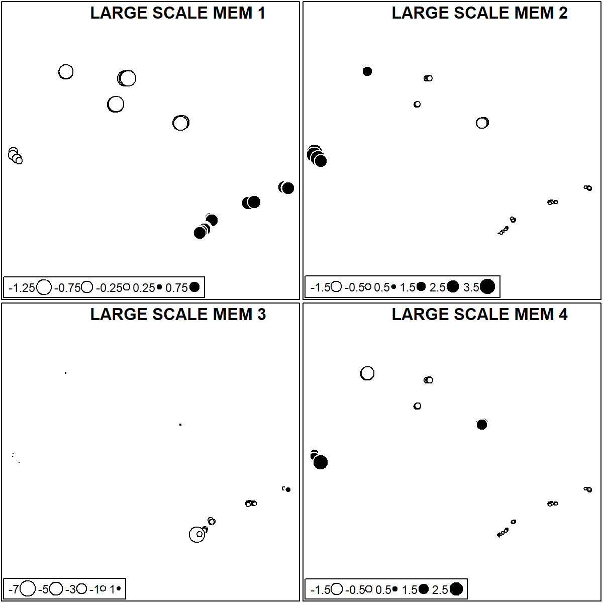

       

Intermediate Scale DRF MEM 1.

``` r
par(mfrow = c(1,1))
sr_value(DRF_coord, DRF_dbMEM_FS[,1], ylim = c(-24.59270,-23.33123), xlim = c(-47.61181, -44.61492), grid=F, csize = 0.8, clegend = 0.8, xax = 2, yax = 1, method = "bubble")
title(main = "DRF MEM 1", line = 3, outer = F, adj = 1)
```

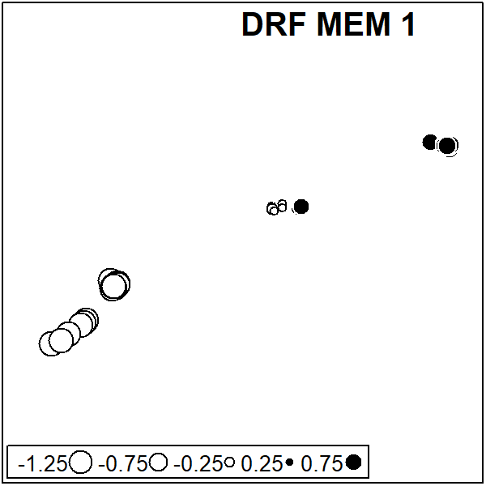

       

Intermediate Scale SSF MEM 1.

``` r
sr_value(SSF_coord, SSF_dbMEM_FS[,1], ylim = c(-22.61958,-20.17833), xlim = c(-52.54536, -47.52589), grid=F, csize = 0.8, clegend = 0.8, xax = 2, yax = 1, method = "bubble")
title(main = "SSF MEM 1", line = 3, outer = F, adj = 1)
```

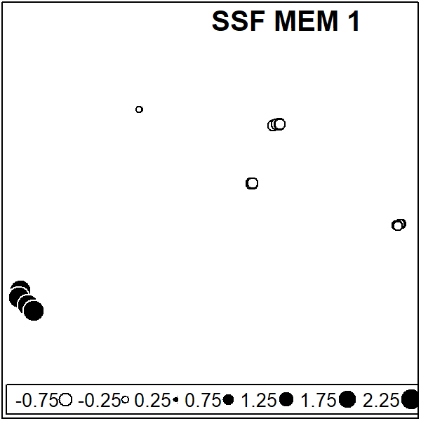

       

Small Extent DRF - Ubatuba MEM 1

``` r
sr_value(UBA_coord, UBA_dbMEM_FS[,1], ylim = c(-23.37694,-23.33123), xlim = c(-44.95004, -44.80492), grid=F, csize = 0.8, clegend = 0.8, xax = 2, yax = 1, method = "bubble")
title(main = "Ubatuba MEM 1", line = 3, outer = F, adj = 1)
```

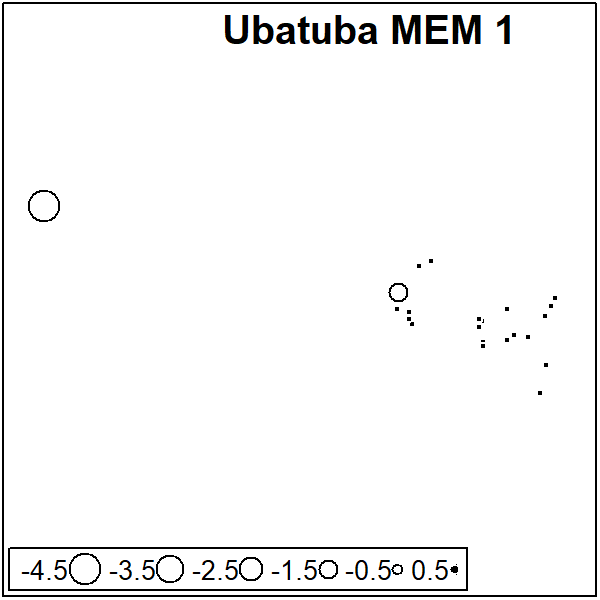

   

Small Extent DRF - Bertioga MEM 1

``` r
sr_value(BER_coord, BER_dbMEM_FS[,1], ylim = c(-23.76198,-23.71684), xlim = c(-45.94223, -45.73709), grid=F, csize = 0.8, clegend = 0.8, xax = 2, yax = 1, method = "bubble")
title(main = "Bertioga MEM 1", line = 3, outer = F, adj = 1)
```

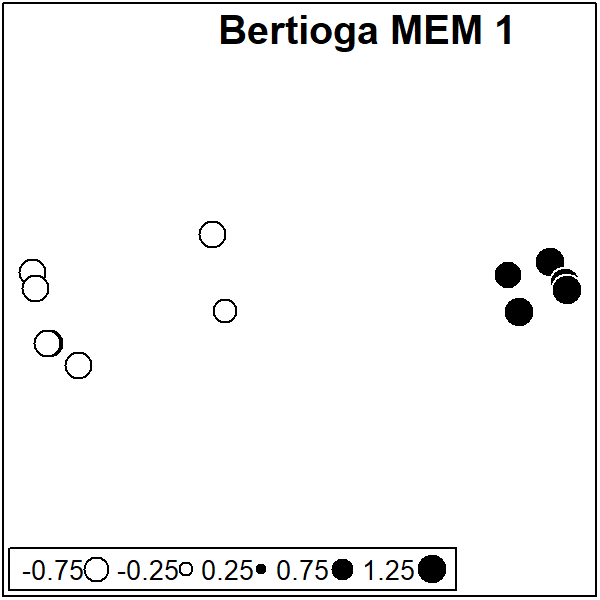

       

Small Extent DRF - Itanhaém MEM 1 and 2.

``` r
par(mfrow = c(1,2))

sr_value(ITA_coord, ITA_dbMEM_FS[,1], ylim = c(-24.6527,-24.1786), xlim = c(-47.31181, -46.89443), grid=F, csize = 0.8, clegend = 0.8, xax = 2, yax = 1, method = "bubble")
title(main = "Itanhaém MEM 1", line = 3, outer = F, adj = 1)


sr_value(ITA_coord, ITA_dbMEM_FS[,2], ylim = c(-24.6527,-24.1786), xlim = c(-47.31181, -46.89443), grid=F, csize = 0.8, clegend = 0.8, xax = 2, yax = 1, method = "bubble")
title(main = "Itanhaém MEM 2", line = 3, outer = F, adj = 1)
```

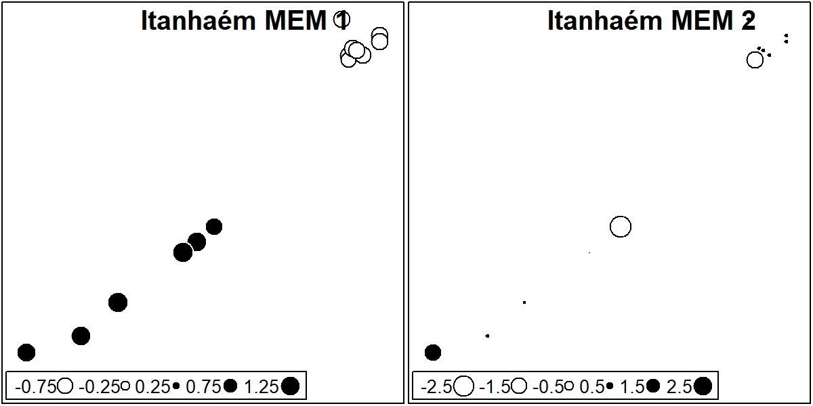

       

Small Extent DRF - Santa Fé do Sul MEM 1 and 2.

``` r
par(mfrow = c(1,2))

sr_value(ST_coord, ST_dbMEM_FS[,1], ylim = c(-20.18789,-20.17733), xlim = c(-50.89639, -50.89056), grid=F, csize = 0.8, clegend = 0.8, xax = 2, yax = 1, method = "bubble")
title(main = "Santa Fé do Sul MEM 1", line = 3, outer = F, adj = 1)


sr_value(ST_coord, ST_dbMEM_FS[,2], ylim = c(-20.18789,-20.17733), xlim = c(-50.89639, -50.89056), grid=F, csize = 0.8, clegend = 0.8, xax = 2, yax = 1, method = "bubble")
title(main = "Santa Fé do Sul MEM 2", line = 3, outer = F, adj = 1)
```

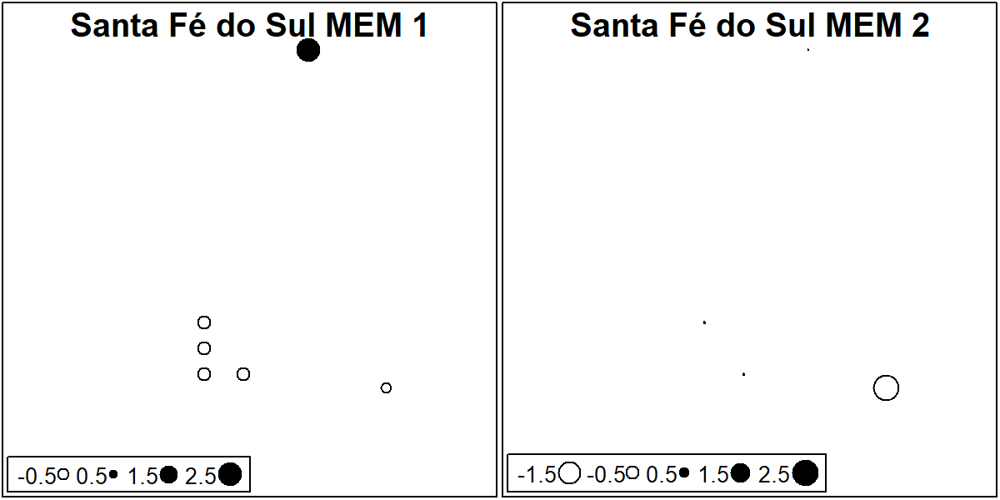

       

Small Extent DRF - Icém MEM 1 and 2.

``` r
par(mfrow = c(1,2))

sr_value(IC_coord, IC_dbMEM_FS[,1], ylim = c(-20.375,-20.355), xlim = c(-49.28556, -49.18333), grid=F, csize = 0.8, clegend = 0.8, xax = 2, yax = 1, method = "bubble")
title(main = "Icém MEM 1", line = 3, outer = F, adj = 1)


sr_value(IC_coord, IC_dbMEM_FS[,2], ylim = c(-20.375,-20.355), xlim = c(-49.28556, -49.18333), grid=F, csize = 0.8, clegend = 0.8, xax = 2, yax = 1, method = "bubble")
title(main = "Icém MEM 2", line = 3, outer = F, adj = 1)
```

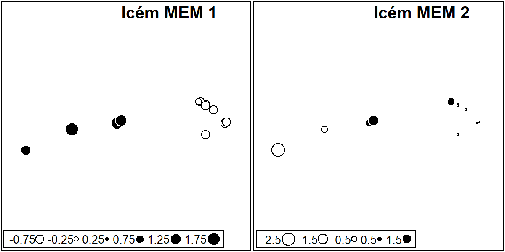

       

Small Extent DRF - Nova Itapirema MEM 1.

``` r
sr_value(NI_coord, NI_dbMEM_FS[,1], ylim = c(-21.08111,-21.07333), xlim = c(-49.54072, -49.51689), grid=F, csize = 0.8, clegend = 0.8, xax = 2, yax = 1, method = "bubble")
title(main = "Nova Itapirema MEM 1", line = 3, outer = F, adj = 1)
```

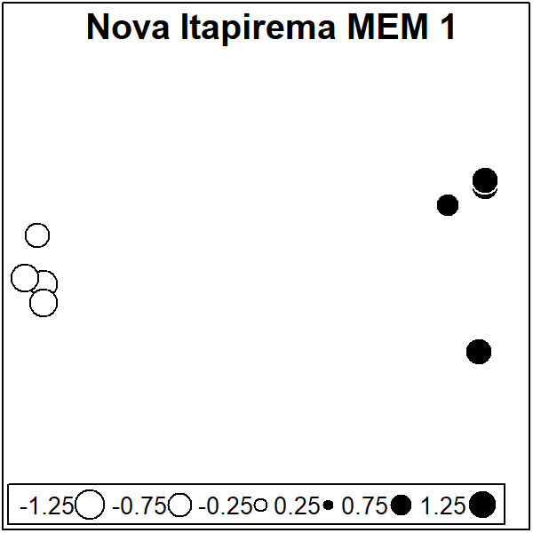

       

Small Extent DRF - Morro do Diabo MEM 1.

``` r
sr_value(MD_coord, MD_dbMEM_FS[,1], ylim = c(-22.65958, -22.34950), xlim = c(-52.34536, -52.16550), grid=F, csize = 0.8, clegend = 0.8, xax = 2, yax = 1, method = "bubble")
title(main = "Morro do Diabo MEM 1", line = 3, outer = F, adj = 1)
```

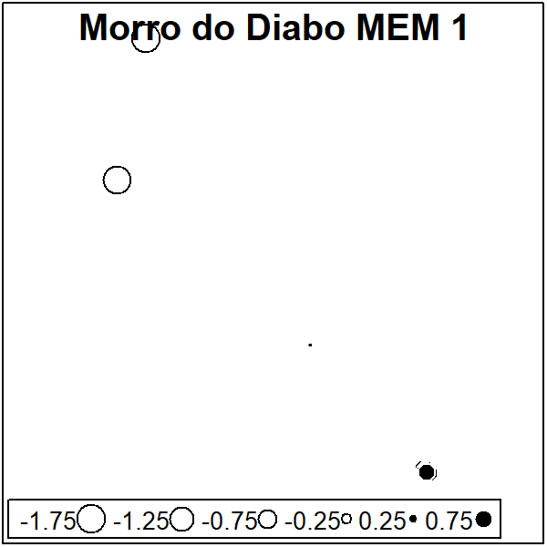

       

Small Extent DRF - Jataí MEM 1.

``` r
sr_value(JA_coord, JA_dbMEM_FS[,1], ylim = c(-21.58556, -21.56376), xlim = c(-47.79086, -47.72289), grid=F, csize = 0.8, clegend = 0.8, xax = 2, yax = 1, method = "bubble")
title(main = "Jataí MEM 1", line = 3, outer = F, adj = 1)
```

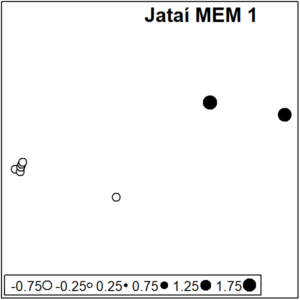

       

## Variation Partitioning

#### Large Extent

``` r
#Variation partitioning Broad
Broad_varpart <- var_partitioning_1(Y = Broad_pa, 
                                       env = Broad_env_FS,
                                       clim = Broad_clim_FS,
                                       spa = Broad_dbMEM_FS, percent_r2 = F)
Broad_varpart
```

    ##              Adj_R2 Df         F      p
    ## All           0.300  9  5.527369 0.0001
    ## Env           0.145  3  6.375104 0.0001
    ## Clim          0.212  2 13.748385 0.0001
    ## Spa           0.260  4  9.328382 0.0001
    ## Pure_Env      0.033  3  2.404244 0.0001
    ## Pure_Clim     0.006  2  1.401882 0.0426
    ## Pure_Spa      0.038  4  2.229201 0.0001
    ## Env_Spa       0.017 NA        NA     NA
    ## Env_Clim      0.001 NA        NA     NA
    ## Spa_Clim      0.110 NA        NA     NA
    ## Spa_Clim_Env  0.094 NA        NA     NA
    ## Resid         0.700 NA        NA     NA

   

#### Intermediate Extent

``` r
DRF_varpart <- var_partitioning_1(Y = DRF_pa, 
                                      env = DRF_env_FS,
                                      clim = DRF_clim_FS,
                                      spa = DRF_dbMEM_FS, percent_r2 = F)

SSF_varpart <- var_partitioning_1(Y = SSF_pa, 
                                      env = SSF_env_FS,
                                      clim = SSF_clim_FS,
                                      spa = SSF_dbMEM_FS, percent_r2 = F)

SSF_varpart
```

    ##              Adj_R2 Df        F      p
    ## All           0.244  6 3.418204 0.0001
    ## Env           0.107  3 2.806389 0.0001
    ## Clim          0.171  2 5.648020 0.0001
    ## Spa           0.053  1 3.496976 0.0005
    ## Pure_Env      0.071  3 2.307075 0.0001
    ## Pure_Clim     0.103  2 3.805509 0.0001
    ## Pure_Spa      0.004  1 1.191561 0.2460
    ## Env_Spa      -0.002 NA       NA     NA
    ## Env_Clim      0.017 NA       NA     NA
    ## Spa_Clim      0.029 NA       NA     NA
    ## Spa_Clim_Env  0.021 NA       NA     NA
    ## Resid         0.756 NA       NA     NA

``` r
DRF_varpart
```

    ##              Adj_R2 Df        F      p
    ## All           0.125  4 2.756106 0.0001
    ## Env           0.091  2 3.449479 0.0001
    ## Clim          0.049  1 3.515187 0.0003
    ## Spa           0.037  1 2.875084 0.0031
    ## Pure_Env      0.068  2 2.822793 0.0005
    ## Pure_Clim     0.012  1 1.636371 0.0613
    ## Pure_Spa      0.011  1 1.585382 0.0695
    ## Env_Spa      -0.002 NA       NA     NA
    ## Env_Clim      0.009 NA       NA     NA
    ## Spa_Clim      0.011 NA       NA     NA
    ## Spa_Clim_Env  0.017 NA       NA     NA
    ## Resid         0.875 NA       NA     NA

   

#### Small Extent

Small Extent allowing negative fractions

``` r
ST_varpart <- var_partitioning_2(ST_pa, ST_env_FS, ST_dbMEM_FS, allow_negative_r2 = T, percent_r2 = F)
IC_varpart <- var_partitioning_2(IC_pa, IC_env_FS, IC_dbMEM_FS, allow_negative_r2 = T, percent_r2 = F)
NI_varpart <- var_partitioning_2(NI_pa, NI_env_FS, NI_dbMEM_FS, allow_negative_r2 = T, percent_r2 = F)
MD_varpart <- var_partitioning_2(MD_pa, MD_env_FS, MD_dbMEM_FS, allow_negative_r2 = T, percent_r2 = F)
JA_varpart <- var_partitioning_2(JA_pa, JA_env_FS, JA_dbMEM_FS, allow_negative_r2 = T, percent_r2 = F)

UBA_varpart <- var_partitioning_2(UBA_pa, UBA_env_FS, UBA_dbMEM_FS, allow_negative_r2 = T, percent_r2 = F)
BER_varpart <- var_partitioning_2(BER_pa, BER_env_FS, BER_dbMEM_FS, allow_negative_r2 = T, percent_r2 = F)
ITA_varpart <- var_partitioning_2(ITA_pa, ITA_env_FS, ITA_dbMEM_FS, allow_negative_r2 = T, percent_r2 = F)

ST_varpart
```

    ##          Adj_R2 Df         F      p
    ## All       0.146  5 1.2397061 0.3187
    ## Env       0.087  3 1.2221392 0.2929
    ## Spa      -0.085  2 0.7256147 0.8180
    ## Pure_Env  0.231  3 1.4514129 0.2814
    ## Pure_Spa  0.059  2 1.1388165 0.4284
    ## Env_Spa  -0.144 NA        NA     NA
    ## Resid     0.854 NA        NA     NA

``` r
IC_varpart
```

    ##          Adj_R2 Df         F      p
    ## All       0.165  3 1.7235286 0.0372
    ## Env       0.195  1 3.6582711 0.0049
    ## Spa      -0.041  2 0.7833254 0.7254
    ## Pure_Env  0.206  1 3.2178660 0.0164
    ## Pure_Spa -0.030  2 0.8214688 0.6686
    ## Env_Spa  -0.011 NA        NA     NA
    ## Resid     0.835 NA        NA     NA

``` r
NI_varpart
```

    ##          Adj_R2 Df         F      p
    ## All       0.154  4 1.3174254 0.1860
    ## Env      -0.010  3 0.9774548 0.5216
    ## Spa       0.159  1 2.3197422 0.0153
    ## Pure_Env -0.005  3 0.9879706 0.5102
    ## Pure_Spa  0.163  1 1.7716486 0.1800
    ## Env_Spa  -0.005 NA        NA     NA
    ## Resid     0.846 NA        NA     NA

``` r
MD_varpart
```

    ##          Adj_R2 Df         F      p
    ## All       0.282  5 1.5500378 0.1656
    ## Env       0.139  4 1.2819349 0.2672
    ## Spa      -0.005  1 0.9665789 0.3659
    ## Pure_Env  0.287  4 1.5993494 0.1670
    ## Pure_Spa  0.143  1 1.5988564 0.2674
    ## Env_Spa  -0.148 NA        NA     NA
    ## Resid     0.718 NA        NA     NA

``` r
JA_varpart
```

    ##          Adj_R2 Df        F      p
    ## All       0.555  4 3.803902 0.0002
    ## Env       0.524  3 4.306537 0.0001
    ## Spa       0.221  1 3.546104 0.0030
    ## Pure_Env  0.334  3 3.002293 0.0081
    ## Pure_Spa  0.030  1 1.411002 0.2512
    ## Env_Spa   0.190 NA       NA     NA
    ## Resid     0.445 NA       NA     NA

``` r
UBA_varpart
```

    ##          Adj_R2 Df         F      p
    ## All       0.068  2 1.7967175 0.0339
    ## Env       0.064  1 2.4974703 0.0119
    ## Spa      -0.011  1 0.7677334 0.6122
    ## Pure_Env  0.078  1 2.7613103 0.0059
    ## Pure_Spa  0.004  1 1.0857650 0.3633
    ## Env_Spa  -0.014 NA        NA     NA
    ## Resid     0.932 NA        NA     NA

``` r
BER_varpart
```

    ##          Adj_R2 Df         F      p
    ## All       0.023  4 1.0633197 0.4060
    ## Env       0.021  3 1.0779635 0.3682
    ## Spa      -0.012  1 0.8660103 0.5779
    ## Pure_Env  0.035  3 1.1188012 0.3442
    ## Pure_Spa  0.002  1 1.0138071 0.4348
    ## Env_Spa  -0.014 NA        NA     NA
    ## Resid     0.977 NA        NA     NA

``` r
ITA_varpart
```

    ##          Adj_R2 Df         F      p
    ## All       0.090  7 1.1970607 0.2869
    ## Env       0.097  5 1.2995211 0.2048
    ## Spa      -0.008  2 0.9443449 0.4800
    ## Pure_Env  0.098  5 1.2576028 0.2566
    ## Pure_Spa -0.007  2 0.9656843 0.5247
    ## Env_Spa  -0.001 NA        NA     NA
    ## Resid     0.910 NA        NA     NA

   

Small Extent not allowing negative fractions

``` r
ST_varpart2 <- var_partitioning_2(ST_pa, ST_env_FS, ST_dbMEM_FS, allow_negative_r2 = F, percent_r2 = F)
IC_varpart2 <- var_partitioning_2(IC_pa, IC_env_FS, IC_dbMEM_FS, allow_negative_r2 = F, percent_r2 = F)
NI_varpart2 <- var_partitioning_2(NI_pa, NI_env_FS, NI_dbMEM_FS, allow_negative_r2 = F, percent_r2 = F)
MD_varpart2 <- var_partitioning_2(MD_pa, MD_env_FS, MD_dbMEM_FS, allow_negative_r2 = F, percent_r2 = F)
JA_varpart2 <- var_partitioning_2(JA_pa, JA_env_FS, JA_dbMEM_FS, allow_negative_r2 = F, percent_r2 = F)

UBA_varpart2 <- var_partitioning_2(UBA_pa, UBA_env_FS, UBA_dbMEM_FS, allow_negative_r2 = F, percent_r2 = F)
BER_varpart2 <- var_partitioning_2(BER_pa, BER_env_FS, BER_dbMEM_FS, allow_negative_r2 = F, percent_r2 = F)
ITA_varpart2 <- var_partitioning_2(ITA_pa, ITA_env_FS, ITA_dbMEM_FS, allow_negative_r2 = F, percent_r2 = F)

ST_varpart2
```

    ##          Adj_R2 Df        F      p
    ## Pure_Env  0.087  3 1.222139 0.2982
    ## Resid     0.913 NA       NA     NA

``` r
IC_varpart2
```

    ##          Adj_R2 Df        F     p
    ## Pure_Env  0.195  1 3.658271 0.005
    ## Resid     0.805 NA       NA    NA

``` r
NI_varpart2
```

    ##          Adj_R2 Df        F      p
    ## Pure_Spa  0.159  1 2.319742 0.0126
    ## Resid     0.841 NA       NA     NA

``` r
MD_varpart2
```

    ##          Adj_R2 Df        F      p
    ## Pure_Env  0.139  4 1.281935 0.2617
    ## Resid     0.861 NA       NA     NA

``` r
JA_varpart2
```

    ##          Adj_R2 Df        F      p
    ## All       0.555  4 3.803902 0.0001
    ## Env       0.524  3 4.306537 0.0002
    ## Spa       0.221  1 3.546104 0.0031
    ## Pure_Env  0.334  3 3.002293 0.0079
    ## Pure_Spa  0.030  1 1.411002 0.2459
    ## Env_Spa   0.190 NA       NA     NA
    ## Resid     0.445 NA       NA     NA

``` r
UBA_varpart2
```

    ##          Adj_R2 Df       F      p
    ## Pure_Env  0.064  1 2.49747 0.0105
    ## Resid     0.936 NA      NA     NA

``` r
BER_varpart2
```

    ##          Adj_R2 Df        F      p
    ## Pure_Env  0.021  3 1.077964 0.3726
    ## Resid     0.979 NA       NA     NA

``` r
ITA_varpart2
```

    ##          Adj_R2 Df        F      p
    ## Pure_Env  0.097  5 1.299521 0.2084
    ## Resid     0.903 NA       NA     NA

   

Constructing a matrix with all R2 values

``` r
Varpart_plot <- full_join(data.frame(rbind(Broad_varpart[,1])),
                          data.frame(rbind(SSF_varpart[,1])),)

Varpart_plot <- full_join(Varpart_plot,
                          data.frame(rbind(DRF_varpart[,1])))

Varpart_plot <- full_join(Varpart_plot,
                          data.frame(rbind(ST_varpart2[,1])))

Varpart_plot <- full_join(Varpart_plot,
                          data.frame(rbind(IC_varpart2[,1])))

Varpart_plot <- full_join(Varpart_plot,
                          data.frame(rbind(NI_varpart2[,1])))

Varpart_plot <- full_join(Varpart_plot,
                          data.frame(rbind(MD_varpart2[,1])))

Varpart_plot <- full_join(Varpart_plot,
                          data.frame(rbind(JA_varpart2[,1])))
                          
Varpart_plot <- full_join(Varpart_plot,
                          data.frame(rbind(UBA_varpart2[,1])))

Varpart_plot <- full_join(Varpart_plot,
                          data.frame(rbind(BER_varpart2[,1])))

Varpart_plot <- full_join(Varpart_plot,
                          data.frame(rbind(ITA_varpart2[,1])))

rownames(Varpart_plot) <- c("Broad", "SSF", "DRF", "Santa Fé do Sul", "Icém", "Nova Itapirema", "Morro do Diabo", "Jataí", "Ubatuba", "Bertioga", "Itanhaém")

Varpart_barplot <- t(Varpart_plot)
Varpart_barplot
```

    ##              Broad    SSF    DRF Santa Fé do Sul  Icém Nova Itapirema
    ## All          0.300  0.244  0.125              NA    NA             NA
    ## Env          0.145  0.107  0.091              NA    NA             NA
    ## Clim         0.212  0.171  0.049              NA    NA             NA
    ## Spa          0.260  0.053  0.037              NA    NA             NA
    ## Pure_Env     0.033  0.071  0.068           0.087 0.195             NA
    ## Pure_Clim    0.006  0.103  0.012              NA    NA             NA
    ## Pure_Spa     0.038  0.004  0.011              NA    NA          0.159
    ## Env_Spa      0.017 -0.002 -0.002              NA    NA             NA
    ## Env_Clim     0.001  0.017  0.009              NA    NA             NA
    ## Spa_Clim     0.110  0.029  0.011              NA    NA             NA
    ## Spa_Clim_Env 0.094  0.021  0.017              NA    NA             NA
    ## Resid        0.700  0.756  0.875           0.913 0.805          0.841
    ##              Morro do Diabo Jataí Ubatuba Bertioga Itanhaém
    ## All                      NA 0.555      NA       NA       NA
    ## Env                      NA 0.524      NA       NA       NA
    ## Clim                     NA    NA      NA       NA       NA
    ## Spa                      NA 0.221      NA       NA       NA
    ## Pure_Env              0.139 0.334   0.064    0.021    0.097
    ## Pure_Clim                NA    NA      NA       NA       NA
    ## Pure_Spa                 NA 0.030      NA       NA       NA
    ## Env_Spa                  NA 0.190      NA       NA       NA
    ## Env_Clim                 NA    NA      NA       NA       NA
    ## Spa_Clim                 NA    NA      NA       NA       NA
    ## Spa_Clim_Env             NA    NA      NA       NA       NA
    ## Resid                 0.861 0.445   0.936    0.979    0.903

     
   

Plotting the Variation Partioning as barplots.

``` r
Varpart_barplot <- Varpart_barplot[-c(1:4),]


for(i in 1:dim(Varpart_barplot)[1]){
  for(j in 1:dim(Varpart_barplot)[2]){
    if(is.na(Varpart_barplot[i,j])){Varpart_barplot[i,j] <- 0}
  }
}


Varpart_barplot_break <- Varpart_barplot; Varpart_barplot_break[8,] <- Varpart_barplot_break[8,]-0.3

Varpart_barplot_break <- Varpart_barplot_break[c(1,4,3,6,2,5,7,8),]

barplot(as.matrix(Varpart_barplot_break), axes = F, col = c(Pure_Env = "gold",
                                                            Env_Spa = mix_color(alpha = 0.4,"gold","cornflowerblue"),
                                                            Pure_Spa = "cornflowerblue",
                                                            Spa_Clim  = mix_color(alpha = 0.4,"brown1","cornflowerblue"),
                                                            Pure_Clim = "brown1",
                                                            Env_Clim  = mix_color(alpha = 0.4,"brown1","gold"),
                                                            Spa_Clim_Env = mix_color(alpha = 0.7,"brown1","grey"),
                                                            Resid = "grey80"), space = c(0,2,1,2,1,1,1,1,2,1,1), border = "white",
        legend.text = c("Environment","Environment-Space","Space","Climate-Space","Climate","Climate-Environment","All three","Residual"), ylim = c(0,0.8),
        args.legend = list(x = -0.5,y = 0.85, yjust = 1,xjust = 0, horiz = F, ncol = 4, box.col = "transparent",text.width = 5, border = "white"), axisnames= F, ylab = "Adjusted R²", cex.lab = 1.25)
axis(2, at = c(0,0.1,0.2,0.3,0.4,0.5,0.6, 0.7), labels = c("0 %","10 %","20 %","30 %","40 %","50 %","60 %","100 %"))
axis.break(2, 0.65, style = "slash") 
axis(1,at = c(0.5,4.5,16),line = 2, labels =c("Broad","Intermediate","Fine"), tick = F,las = 1, hadj = 0.5, cex.axis = 1.3)
axis(1,at = c(12.5,21.5),line = 0.5, labels =c("SSF","DRF"), tick = F,las = 1, hadj = 0.5, cex.axis = 1.1)
text(c(0.5,   3.5,5.5   ,8.5,10.5,12.5,14.5,16.5,    19.5,21.5,23.5),rep(0.69,11), labels =c("All","SSF","DRF","Santa Fé do Sul","Icém","Nova Itapirema","Morro do Diabo","Jataí","Ubatuba","Bertioga","Itanhaém"), srt = 90, adj = 1, col = "grey45")
text(c(8.5,14.5,16.5,21.5,23.5),c(0.045,0.07,0.54,0.01,0.05), labels =c("*","*","*","*","*"), adj = 0.5, col = "white", cex = 2)
text(c(0.5,0.5,0.5),c(0.02,0.07,0.205), labels =c("*","*","*"), adj = 0.5, col = "white", cex = 2)
text(c(3.5,3.5,5.5),c(0.04,0.155,0.035), labels =c("*","*","*"), adj = 0.5, col = "white", cex = 2)
```

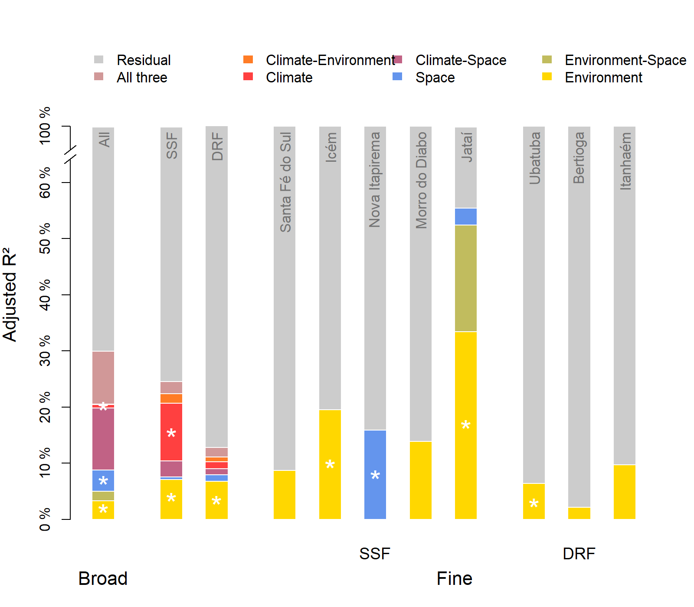
The asterisks represent significant fractions.

     
   

To better understand what are the environmental variables that are
important in each fraction, we looked at the RDA plots of environmental
variables (local Environment and Climate) both unconstrained alone and
constrained by spatial variables, that is, with and without the
importance spatially structured variables.

Because here we are not looking at p or R2 values, we are not woried
about multicolinearity or overfitting, so we are using all climate and
environmental variables.

### Intermediate Extent

``` r
RDA_clim_SSF <- rda(SSF_pa, data.frame(SSF_clim_st,SSF_env_st))

species_scores_SSF <- scores(RDA_clim_SSF, display = c( "species"), scaling = 0, hill = T)
loadings_SSF <- scores(RDA_clim_SSF, display = c( "bp"), scaling = 0, hill = T)

species_scores_SSF <- species_scores_SSF[(species_scores_SSF[,1] > 0.3 | species_scores_SSF[,1] < -0.3) | 
                                         (species_scores_SSF[,2] > 0.3 | species_scores_SSF[,2] < -0.3) ,]

species_scores_SSF <- species_scores_SSF*1.5

xmin <- min(c(species_scores_SSF[,1], loadings_SSF[,1])) -0.2
xmax <- max(c(species_scores_SSF[,1], loadings_SSF[,1])) +0.2

ymin <- min(c(species_scores_SSF[,2], loadings_SSF[,2])) -0.2
ymax <- max(c(species_scores_SSF[,2], loadings_SSF[,2])) +0.2

rownames(loadings_SSF) <- c("TS","RT","TP","PS","HYD","CC","ARE","DEP","VH")
col_SSF <- c("brown1","brown1","brown1","brown1","darkgoldenrod","darkgoldenrod","darkgoldenrod","darkgoldenrod","darkgoldenrod")


dists_SSF <- as.matrix(dist(rbind(loadings_SSF,c(0,0))))[10,-10]
dists_SSF_prop <- dists_SSF/max(dists_SSF)

for(i in 1:length(col_SSF)){
  col_SSF[i] <- lighten_color((1-dists_SSF_prop[i]),col_SSF[i])
}

par(mfrow = c(1,2),mar = c(5, 5, 4, 2))
plot(RDA_clim_SSF, type="n", scaling = 2, xlim = c(xmin,xmax), ylim = c(ymin,ymax), cex.lab = 1.5, cex.axis = 1.5, main = "SSF - Unconstrained")
for(i in 1:length(species_scores_SSF[,1])){
  #points(species_scores_SSF[i,1], species_scores_SSF[i,2], col = "white", pch = 21, cex = 5, bg = "grey80", lwd = 1)
  text(species_scores_SSF[i,1], species_scores_SSF[i,2], labels = rownames(species_scores_SSF)[i],col = "black", cex = 0.8)
}

shape::Arrows(x0 = rep(0, length(loadings_SSF[,1])),
              y0 = rep(0, length(loadings_SSF[,1])),
              x1 = loadings_SSF[,1],
              y1 = loadings_SSF[,2], col = col_SSF, lwd = 2, arr.type="triangle", arr.length = 0.4*(dists_SSF_prop), arr.width = 0.3*(dists_SSF_prop))

for(i in 1:length(loadings_SSF[,1])){
  #points(loadings_SSF[i,1], loadings_SSF[i,2], col = col_SSF[i], pch = 21, cex = ((7*dists_SSF_prop[i])+1), bg = "white", lwd = 3)
  text(loadings_SSF[i,1]*1.25, loadings_SSF[i,2]*1.25, labels = rownames(loadings_SSF)[i],col = col_SSF[i], cex = (1.4*dists_SSF_prop[i]))
}


#########################RDA SSF Constrained
RDA_clim_SSF <- rda(SSF_pa, data.frame(SSF_clim_st,SSF_env_st), data.frame(SSF_dbMEM_FS))


species_scores_SSF <- scores(RDA_clim_SSF, display = c( "species"), scaling = 0, hill = T)
loadings_SSF <- scores(RDA_clim_SSF, display = c( "bp"), scaling = 0, hill = T)

species_scores_SSF <- species_scores_SSF[(species_scores_SSF[,1] > 0.25 | species_scores_SSF[,1] < -0.25) | 
                                         (species_scores_SSF[,2] > 0.25 | species_scores_SSF[,2] < -0.25) ,]

species_scores_SSF <- species_scores_SSF*1.5

xmin <- min(c(species_scores_SSF[,1], loadings_SSF[,1])) -0.2
xmax <- max(c(species_scores_SSF[,1], loadings_SSF[,1])) +0.2

ymin <- min(c(species_scores_SSF[,2], loadings_SSF[,2])) -0.2
ymax <- max(c(species_scores_SSF[,2], loadings_SSF[,2])) +0.2

rownames(loadings_SSF) <- c("TS","RT","TP","PS","HYD","CC","ARE","DEP","VH")
col_SSF <- c("brown1","brown1","brown1","brown1","darkgoldenrod","darkgoldenrod","darkgoldenrod","darkgoldenrod","darkgoldenrod")

dists_SSF <- as.matrix(dist(rbind(loadings_SSF,c(0,0))))[10,-10]
dists_SSF_prop <- dists_SSF/max(dists_SSF)

for(i in 1:length(col_SSF)){
  col_SSF[i] <- lighten_color((1-dists_SSF_prop[i]),col_SSF[i])
}


plot(RDA_clim_SSF, type="n", scaling = 2, xlim = c(xmin,xmax), ylim = c(ymin,ymax), cex.lab = 1.5, cex.axis = 1.5, main = "SSF - Constrained")
for(i in 1:length(species_scores_SSF[,1])){
  #points(species_scores_SSF[i,1], species_scores_SSF[i,2], col = "white", pch = 21, cex = 5, bg = "grey80", lwd = 1)
  text(species_scores_SSF[i,1], species_scores_SSF[i,2], labels = rownames(species_scores_SSF)[i],col = "black", cex = 0.8)
}

shape::Arrows(x0 = rep(0, length(loadings_SSF[,1])),
              y0 = rep(0, length(loadings_SSF[,1])),
              x1 = loadings_SSF[,1],
              y1 = loadings_SSF[,2], col = col_SSF, lwd = 2, arr.type="triangle", arr.length = 0.4*(dists_SSF_prop), arr.width = 0.3*(dists_SSF_prop))

for(i in 1:length(loadings_SSF[,1])){
  #points(loadings_SSF[i,1], loadings_SSF[i,2], col = col_SSF[i], pch = 21, cex = ((7*dists_SSF_prop[i])+1), bg = "white", lwd = 3)
  text(loadings_SSF[i,1]*1.25, loadings_SSF[i,2]*1.25, labels = rownames(loadings_SSF)[i],col = col_SSF[i], cex = (1.4*dists_SSF_prop[i]))
}
```

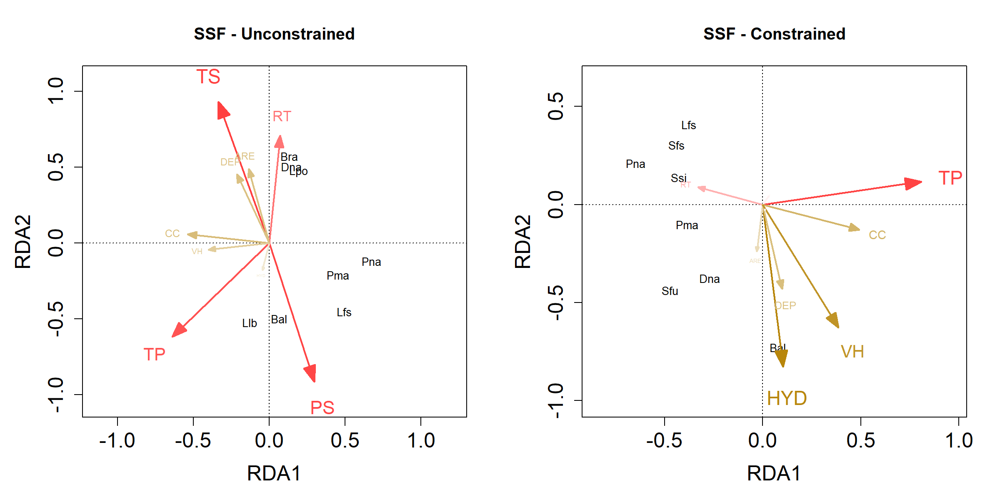

``` r
RDA_clim_DRF <- rda(DRF_pa, data.frame(DRF_clim_st,DRF_env_st))

species_scores_DRF <- scores(RDA_clim_DRF, display = c( "species"), scaling = 0, hill = T)
loadings_DRF <- scores(RDA_clim_DRF, display = c( "bp"), scaling = 0, hill = T)

species_scores_DRF <- species_scores_DRF[(species_scores_DRF[,1] > 0.25 | species_scores_DRF[,1] < -0.25) | 
                                         (species_scores_DRF[,2] > 0.25 | species_scores_DRF[,2] < -0.25) ,]

species_scores_DRF <- species_scores_DRF*1.5

xmin <- min(c(species_scores_DRF[,1], loadings_DRF[,1])) -0.2
xmax <- max(c(species_scores_DRF[,1], loadings_DRF[,1])) +0.2

ymin <- min(c(species_scores_DRF[,2], loadings_DRF[,2])) -0.2
ymax <- max(c(species_scores_DRF[,2], loadings_DRF[,2])) +0.2

rownames(loadings_DRF) <- c("TS","RT","TP","PS","HYD","CC","ARE","DEP","VH")
col_DRF <- c("brown1","brown1","brown1","brown1","darkgoldenrod","darkgoldenrod","darkgoldenrod","darkgoldenrod","darkgoldenrod")


dists_DRF <- as.matrix(dist(rbind(loadings_DRF,c(0,0))))[10,-10]
dists_DRF_prop <- dists_DRF/max(dists_DRF)

for(i in 1:length(col_DRF)){
  col_DRF[i] <- lighten_color((1-dists_DRF_prop[i]),col_DRF[i])
}

par(mfrow = c(1,2),mar = c(5, 5, 4, 2))
plot(RDA_clim_DRF, type="n", scaling = 2, xlim = c(xmin,xmax), ylim = c(ymin,ymax), cex.lab = 1.5, cex.axis = 1.5, main = "DRF - Unconstrained")
for(i in 1:length(species_scores_DRF[,1])){
  #points(species_scores_DRF[i,1], species_scores_DRF[i,2], col = "white", pch = 21, cex = 5, bg = "grey80", lwd = 1)
  text(species_scores_DRF[i,1], species_scores_DRF[i,2], labels = rownames(species_scores_DRF)[i],col = "black", cex = 0.8)
}

shape::Arrows(x0 = rep(0, length(loadings_DRF[,1])),
              y0 = rep(0, length(loadings_DRF[,1])),
              x1 = loadings_DRF[,1],
              y1 = loadings_DRF[,2], col = col_DRF, lwd = 2, arr.type="triangle", arr.length = 0.4*(dists_DRF_prop), arr.width = 0.3*(dists_DRF_prop))

for(i in 1:length(loadings_DRF[,1])){
  #points(loadings_DRF[i,1], loadings_DRF[i,2], col = col_DRF[i], pch = 21, cex = ((7*dists_DRF_prop[i])+1), bg = "white", lwd = 3)
  text(loadings_DRF[i,1]*1.25, loadings_DRF[i,2]*1.25, labels = rownames(loadings_DRF)[i],col = col_DRF[i], cex = (1.4*dists_DRF_prop[i]))
}


#########################RDA DRF Constrained
RDA_clim_DRF <- rda(DRF_pa, data.frame(DRF_clim_st,DRF_env_st), data.frame(DRF_dbMEM_FS))


species_scores_DRF <- scores(RDA_clim_DRF, display = c( "species"), scaling = 0, hill = T)
loadings_DRF <- scores(RDA_clim_DRF, display = c( "bp"), scaling = 0, hill = T)

species_scores_DRF <- species_scores_DRF[(species_scores_DRF[,1] > 0.25 | species_scores_DRF[,1] < -0.25) | 
                                         (species_scores_DRF[,2] > 0.25 | species_scores_DRF[,2] < -0.25) ,]

species_scores_DRF <- species_scores_DRF*1.5

xmin <- min(c(species_scores_DRF[,1], loadings_DRF[,1])) -0.2
xmax <- max(c(species_scores_DRF[,1], loadings_DRF[,1])) +0.2

ymin <- min(c(species_scores_DRF[,2], loadings_DRF[,2])) -0.2
ymax <- max(c(species_scores_DRF[,2], loadings_DRF[,2])) +0.2

rownames(loadings_DRF) <- c("TS","RT","TP","PS","HYD","CC","ARE","DEP","VH")
col_DRF <- c("brown1","brown1","brown1","brown1","darkgoldenrod","darkgoldenrod","darkgoldenrod","darkgoldenrod","darkgoldenrod")

dists_DRF <- as.matrix(dist(rbind(loadings_DRF,c(0,0))))[10,-10]
dists_DRF_prop <- dists_DRF/max(dists_DRF)

for(i in 1:length(col_DRF)){
  col_DRF[i] <- lighten_color((1-dists_DRF_prop[i]),col_DRF[i])
}


plot(RDA_clim_DRF, type="n", scaling = 2, xlim = c(xmin,xmax), ylim = c(ymin,ymax), cex.lab = 1.5, cex.axis = 1.5, main = "DRF - Constrained")
for(i in 1:length(species_scores_DRF[,1])){
  #points(species_scores_DRF[i,1], species_scores_DRF[i,2], col = "white", pch = 21, cex = 5, bg = "grey80", lwd = 1)
  text(species_scores_DRF[i,1], species_scores_DRF[i,2], labels = rownames(species_scores_DRF)[i],col = "black", cex = 0.8)
}

shape::Arrows(x0 = rep(0, length(loadings_DRF[,1])),
              y0 = rep(0, length(loadings_DRF[,1])),
              x1 = loadings_DRF[,1],
              y1 = loadings_DRF[,2], col = col_DRF, lwd = 2, arr.type="triangle", arr.length = 0.4*(dists_DRF_prop), arr.width = 0.3*(dists_DRF_prop))

for(i in 1:length(loadings_DRF[,1])){
  #points(loadings_DRF[i,1], loadings_DRF[i,2], col = col_DRF[i], pch = 21, cex = ((7*dists_DRF_prop[i])+1), bg = "white", lwd = 3)
  text(loadings_DRF[i,1]*1.25, loadings_DRF[i,2]*1.25, labels = rownames(loadings_DRF)[i],col = col_DRF[i], cex = (1.4*dists_DRF_prop[i]))
}
```

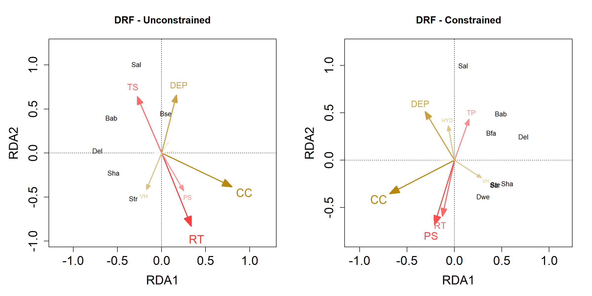

     
   

### Small Extent

Because there were no shared fractions between spatial and environmental
variables at small spatial extent, we only plotted constrained
ordinations.

#### SSF

``` r
#SANTA FÈ DO SUL
RDA_clim_ST <- rda(ST_pa, data.frame(ST_env_st), data.frame(ST_dbMEM_FS))


species_scores_ST <- scores(RDA_clim_ST, display = c( "species"), scaling = 0, hill = T)
loadings_ST <- scores(RDA_clim_ST, display = c( "bp"), scaling = 0, hill = T)

species_scores_ST <- species_scores_ST[(species_scores_ST[,1] > 0.25 | species_scores_ST[,1] < -0.25) | 
                                         (species_scores_ST[,2] > 0.25 | species_scores_ST[,2] < -0.25) ,]

species_scores_ST <- species_scores_ST*1.5

xmin <- min(c(species_scores_ST[,1], loadings_ST[,1])) -0.2
xmax <- max(c(species_scores_ST[,1], loadings_ST[,1])) +0.2

ymin <- min(c(species_scores_ST[,2], loadings_ST[,2])) -0.2
ymax <- max(c(species_scores_ST[,2], loadings_ST[,2])) +0.2

rownames(loadings_ST) <- c("HYD","ARE","DEP","VH")
col_ST <- c("darkgoldenrod","darkgoldenrod","darkgoldenrod","darkgoldenrod")

dists_ST <- as.matrix(dist(rbind(loadings_ST,c(0,0))))[5,-5]
dists_ST_prop <- dists_ST/max(dists_ST)

for(i in 1:length(col_ST)){
  col_ST[i] <- lighten_color((1-dists_ST_prop[i]),col_ST[i])
}

par(mfrow = c(1,2),mar = c(5, 5, 4, 2))
plot(RDA_clim_ST, type="n", scaling = 2, xlim = c(xmin,xmax), ylim = c(ymin,ymax), cex.lab = 1.5, cex.axis = 1.5, main = "ST - Constrained")
for(i in 1:length(species_scores_ST[,1])){
  #points(species_scores_ST[i,1], species_scores_ST[i,2], col = "white", pch = 21, cex = 5, bg = "grey80", lwd = 1)
  text(species_scores_ST[i,1], species_scores_ST[i,2], labels = rownames(species_scores_ST)[i],col = "black", cex = 0.8)
}

shape::Arrows(x0 = rep(0, length(loadings_ST[,1])),
              y0 = rep(0, length(loadings_ST[,1])),
              x1 = loadings_ST[,1],
              y1 = loadings_ST[,2], col = col_ST, lwd = 2, arr.type="triangle", arr.length = 0.4*(dists_ST_prop), arr.width = 0.3*(dists_ST_prop))

for(i in 1:length(loadings_ST[,1])){
  #points(loadings_ST[i,1], loadings_ST[i,2], col = col_ST[i], pch = 21, cex = ((7*dists_ST_prop[i])+1), bg = "white", lwd = 3)
  text(loadings_ST[i,1]*1.25, loadings_ST[i,2]*1.25, labels = rownames(loadings_ST)[i],col = col_ST[i], cex = (1.4*dists_ST_prop[i]))
}

#ICÉM
RDA_clim_IC <- rda(IC_pa, data.frame(IC_env_st), data.frame(IC_dbMEM_FS))


species_scores_IC <- scores(RDA_clim_IC, display = c( "species"), scaling = 0, hill = T)
loadings_IC <- scores(RDA_clim_IC, display = c( "bp"), scaling = 0, hill = T)

species_scores_IC <- species_scores_IC[(species_scores_IC[,1] > 0.25 | species_scores_IC[,1] < -0.25) | 
                                         (species_scores_IC[,2] > 0.25 | species_scores_IC[,2] < -0.25) ,]

species_scores_IC <- species_scores_IC*1.5

xmin <- min(c(species_scores_IC[,1], loadings_IC[,1])) -0.2
xmax <- max(c(species_scores_IC[,1], loadings_IC[,1])) +0.2

ymin <- min(c(species_scores_IC[,2], loadings_IC[,2])) -0.2
ymax <- max(c(species_scores_IC[,2], loadings_IC[,2])) +0.2

rownames(loadings_IC) <- c("HYD","ARE","DEP","VH")
col_IC <- c("darkgoldenrod","darkgoldenrod","darkgoldenrod","darkgoldenrod")

dists_IC <- as.matrix(dist(rbind(loadings_IC,c(0,0))))[5,-5]
dists_IC_prop <- dists_IC/max(dists_IC)

for(i in 1:length(col_IC)){
  col_IC[i] <- lighten_color((1-dists_IC_prop[i]),col_IC[i])
}

plot(RDA_clim_IC, type="n", scaling = 2, xlim = c(xmin,xmax), ylim = c(ymin,ymax), cex.lab = 1.5, cex.axis = 1.5, main = "IC - Constrained")
for(i in 1:length(species_scores_IC[,1])){
  #points(species_scores_IC[i,1], species_scores_IC[i,2], col = "white", pch = 21, cex = 5, bg = "grey80", lwd = 1)
  text(species_scores_IC[i,1], species_scores_IC[i,2], labels = rownames(species_scores_IC)[i],col = "black", cex = 0.8)
}

shape::Arrows(x0 = rep(0, length(loadings_IC[,1])),
              y0 = rep(0, length(loadings_IC[,1])),
              x1 = loadings_IC[,1],
              y1 = loadings_IC[,2], col = col_IC, lwd = 2, arr.type="triangle", arr.length = 0.4*(dists_IC_prop), arr.width = 0.3*(dists_IC_prop))

for(i in 1:length(loadings_IC[,1])){
  #points(loadings_IC[i,1], loadings_IC[i,2], col = col_IC[i], pch = 21, cex = ((7*diICs_IC_prop[i])+1), bg = "white", lwd = 3)
  text(loadings_IC[i,1]*1.25, loadings_IC[i,2]*1.25, labels = rownames(loadings_IC)[i],col = col_IC[i], cex = (1.4*dists_IC_prop[i]))
}

#NOVA ITAPIREMA
RDA_clim_NI <- rda(NI_pa, data.frame(NI_env_st), data.frame(NI_dbMEM_FS))


species_scores_NI <- scores(RDA_clim_NI, display = c( "species"), scaling = 0, hill = T)
loadings_NI <- scores(RDA_clim_NI, display = c( "bp"), scaling = 0, hill = T)

species_scores_NI <- species_scores_NI[(species_scores_NI[,1] > 0.25 | species_scores_NI[,1] < -0.25) | 
                                         (species_scores_NI[,2] > 0.25 | species_scores_NI[,2] < -0.25) ,]

species_scores_NI <- species_scores_NI*1.5

xmin <- min(c(species_scores_NI[,1], loadings_NI[,1])) -0.2
xmax <- max(c(species_scores_NI[,1], loadings_NI[,1])) +0.2

ymin <- min(c(species_scores_NI[,2], loadings_NI[,2])) -0.2
ymax <- max(c(species_scores_NI[,2], loadings_NI[,2])) +0.2

rownames(loadings_NI) <- c("HYD","ARE","DEP","VH")
col_NI <- c("darkgoldenrod","darkgoldenrod","darkgoldenrod","darkgoldenrod")

dists_NI <- as.matrix(dist(rbind(loadings_NI,c(0,0))))[5,-5]
dists_NI_prop <- dists_NI/max(dists_NI)

for(i in 1:length(col_NI)){
  col_NI[i] <- lighten_color((1-dists_NI_prop[i]),col_NI[i])
}

plot(RDA_clim_NI, type="n", scaling = 2, xlim = c(xmin,xmax), ylim = c(ymin,ymax), cex.lab = 1.5, cex.axis = 1.5, main = "NI - Constrained")
for(i in 1:length(species_scores_NI[,1])){
  #points(species_scores_NI[i,1], species_scores_NI[i,2], col = "white", pch = 21, cex = 5, bg = "grey80", lwd = 1)
  text(species_scores_NI[i,1], species_scores_NI[i,2], labels = rownames(species_scores_NI)[i],col = "black", cex = 0.8)
}

shape::Arrows(x0 = rep(0, length(loadings_NI[,1])),
              y0 = rep(0, length(loadings_NI[,1])),
              x1 = loadings_NI[,1],
              y1 = loadings_NI[,2], col = col_NI, lwd = 2, arr.type="triangle", arr.length = 0.4*(dists_NI_prop), arr.width = 0.3*(dists_NI_prop))

for(i in 1:length(loadings_NI[,1])){
  #points(loadings_NI[i,1], loadings_NI[i,2], col = col_NI[i], pch = 21, cex = ((7*diNIs_NI_prop[i])+1), bg = "white", lwd = 3)
  text(loadings_NI[i,1]*1.25, loadings_NI[i,2]*1.25, labels = rownames(loadings_NI)[i],col = col_NI[i], cex = (1.4*dists_NI_prop[i]))
}


#MORRO DO DIABO
RDA_clim_MD <- rda(MD_pa, data.frame(MD_env_st), data.frame(MD_dbMEM_FS))


species_scores_MD <- scores(RDA_clim_MD, display = c( "species"), scaling = 0, hill = T)
loadings_MD <- scores(RDA_clim_MD, display = c( "bp"), scaling = 0, hill = T)

species_scores_MD <- species_scores_MD[(species_scores_MD[,1] > 0.25 | species_scores_MD[,1] < -0.25) | 
                                         (species_scores_MD[,2] > 0.25 | species_scores_MD[,2] < -0.25) ,]

species_scores_MD <- species_scores_MD*1.5

xmin <- min(c(species_scores_MD[,1], loadings_MD[,1])) -0.2
xmax <- max(c(species_scores_MD[,1], loadings_MD[,1])) +0.2

ymin <- min(c(species_scores_MD[,2], loadings_MD[,2])) -0.2
ymax <- max(c(species_scores_MD[,2], loadings_MD[,2])) +0.2

rownames(loadings_MD) <- c("HYD","CC","ARE","DEP","VH")
col_MD <- c("darkgoldenrod","darkgoldenrod","darkgoldenrod","darkgoldenrod","darkgoldenrod")

dists_MD <- as.matrix(dist(rbind(loadings_MD,c(0,0))))[6,-6]
dists_MD_prop <- dists_MD/max(dists_MD)

for(i in 1:length(col_MD)){
  col_MD[i] <- lighten_color((1-dists_MD_prop[i]),col_MD[i])
}

plot(RDA_clim_MD, type="n", scaling = 2, xlim = c(xmin,xmax), ylim = c(ymin,ymax), cex.lab = 1.5, cex.axis = 1.5, main = "MD - Constrained")
for(i in 1:length(species_scores_MD[,1])){
  #points(species_scores_MD[i,1], species_scores_MD[i,2], col = "white", pch = 21, cex = 5, bg = "grey80", lwd = 1)
  text(species_scores_MD[i,1], species_scores_MD[i,2], labels = rownames(species_scores_MD)[i],col = "black", cex = 0.8)
}

shape::Arrows(x0 = rep(0, length(loadings_MD[,1])),
              y0 = rep(0, length(loadings_MD[,1])),
              x1 = loadings_MD[,1],
              y1 = loadings_MD[,2], col = col_MD, lwd = 2, arr.type="triangle", arr.length = 0.4*(dists_MD_prop), arr.width = 0.3*(dists_MD_prop))

for(i in 1:length(loadings_MD[,1])){
  #points(loadings_MD[i,1], loadings_MD[i,2], col = col_MD[i], pch = 21, cex = ((7*diNIs_MD_prop[i])+1), bg = "white", lwd = 3)
  text(loadings_MD[i,1]*1.25, loadings_MD[i,2]*1.25, labels = rownames(loadings_MD)[i],col = col_MD[i], cex = (1.4*dists_MD_prop[i]))
}


#JATAÍ
RDA_clim_JA <- rda(JA_pa, data.frame(JA_env_st), data.frame(JA_dbMEM_FS))


species_scores_JA <- scores(RDA_clim_JA, display = c( "species"), scaling = 0, hill = T)
loadings_JA <- scores(RDA_clim_JA, display = c( "bp"), scaling = 0, hill = T)

species_scores_JA <- species_scores_JA[(species_scores_JA[,1] > 0.25 | species_scores_JA[,1] < -0.25) | 
                                         (species_scores_JA[,2] > 0.25 | species_scores_JA[,2] < -0.25) ,]

species_scores_JA <- species_scores_JA*1.5

xmin <- min(c(species_scores_JA[,1], loadings_JA[,1])) -0.2
xmax <- max(c(species_scores_JA[,1], loadings_JA[,1])) +0.2

ymin <- min(c(species_scores_JA[,2], loadings_JA[,2])) -0.2
ymax <- max(c(species_scores_JA[,2], loadings_JA[,2])) +0.2

rownames(loadings_JA) <- c("HYD","CC","ARE","DEP","VH")
col_JA <- c("darkgoldenrod","darkgoldenrod","darkgoldenrod","darkgoldenrod","darkgoldenrod")

dists_JA <- as.matrix(dist(rbind(loadings_JA,c(0,0))))[6,-6]
dists_JA_prop <- dists_JA/max(dists_JA)

for(i in 1:length(col_JA)){
  col_JA[i] <- lighten_color((1-dists_JA_prop[i]),col_JA[i])
}

plot(RDA_clim_JA, type="n", scaling = 2, xlim = c(xmin,xmax), ylim = c(ymin,ymax), cex.lab = 1.5, cex.axis = 1.5, main = "JA - Constrained")
for(i in 1:length(species_scores_JA[,1])){
  #points(species_scores_JA[i,1], species_scores_JA[i,2], col = "white", pch = 21, cex = 5, bg = "grey80", lwd = 1)
  text(species_scores_JA[i,1], species_scores_JA[i,2], labels = rownames(species_scores_JA)[i],col = "black", cex = 0.8)
}

shape::Arrows(x0 = rep(0, length(loadings_JA[,1])),
              y0 = rep(0, length(loadings_JA[,1])),
              x1 = loadings_JA[,1],
              y1 = loadings_JA[,2], col = col_JA, lwd = 2, arr.type="triangle", arr.length = 0.4*(dists_JA_prop), arr.width = 0.3*(dists_JA_prop))

for(i in 1:length(loadings_JA[,1])){
  #points(loadings_JA[i,1], loadings_JA[i,2], col = col_JA[i], pch = 21, cex = ((7*diNIs_JA_prop[i])+1), bg = "white", lwd = 3)
  text(loadings_JA[i,1]*1.25, loadings_JA[i,2]*1.25, labels = rownames(loadings_JA)[i],col = col_JA[i], cex = (1.4*dists_JA_prop[i]))
}
```

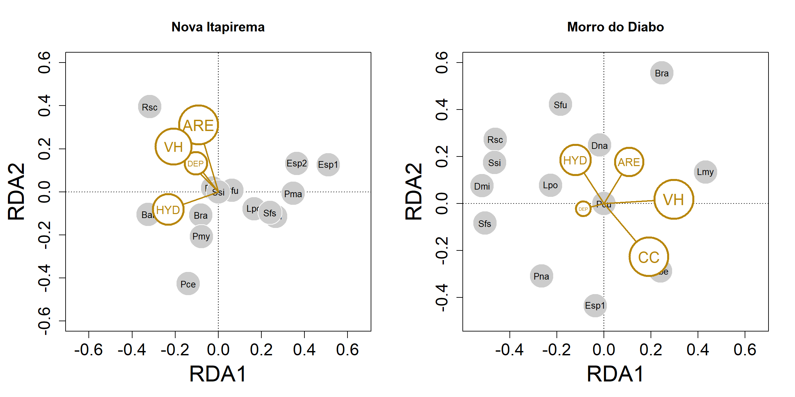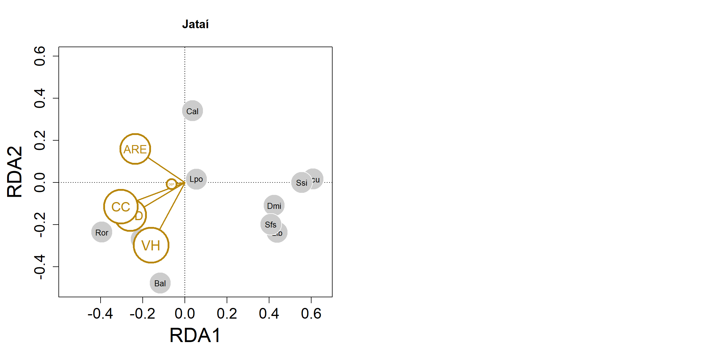

     
   

#### DRF

``` r
#UBATUBA
RDA_clim_UBA <- rda(UBA_pa, data.frame(UBA_env_st), data.frame(UBA_dbMEM_FS))


species_scores_UBA <- scores(RDA_clim_UBA, display = c( "species"), scaling = 0, hill = T)
loadings_UBA <- scores(RDA_clim_UBA, display = c( "bp"), scaling = 0, hill = T)

species_scores_UBA <- species_scores_UBA[(species_scores_UBA[,1] > 0.25 | species_scores_UBA[,1] < -0.25) | 
                                         (species_scores_UBA[,2] > 0.25 | species_scores_UBA[,2] < -0.25) ,]

species_scores_UBA <- species_scores_UBA*1.5

xmin <- min(c(species_scores_UBA[,1], loadings_UBA[,1])) -0.2
xmax <- max(c(species_scores_UBA[,1], loadings_UBA[,1])) +0.2

ymin <- min(c(species_scores_UBA[,2], loadings_UBA[,2])) -0.2
ymax <- max(c(species_scores_UBA[,2], loadings_UBA[,2])) +0.2

rownames(loadings_UBA) <- c("HYD","CC","ARE","DEP")
col_UBA <- c("darkgoldenrod","darkgoldenrod","darkgoldenrod","darkgoldenrod")

dists_UBA <- as.matrix(dist(rbind(loadings_UBA,c(0,0))))[5,-5]
dists_UBA_prop <- dists_UBA/max(dists_UBA)

for(i in 1:length(col_UBA)){
  col_UBA[i] <- lighten_color((1-dists_UBA_prop[i]),col_UBA[i])
}

par(mfrow = c(1,2),mar = c(5, 5, 4, 2))
plot(RDA_clim_UBA, type="n", scaling = 2, xlim = c(xmin,xmax), ylim = c(ymin,ymax), cex.lab = 1.5, cex.axis = 1.5, main = "UBA - Constrained")
for(i in 1:length(species_scores_UBA[,1])){
  #points(species_scores_UBA[i,1], species_scores_UBA[i,2], col = "white", pch = 21, cex = 5, bg = "grey80", lwd = 1)
  text(species_scores_UBA[i,1], species_scores_UBA[i,2], labels = rownames(species_scores_UBA)[i],col = "black", cex = 0.8)
}

shape::Arrows(x0 = rep(0, length(loadings_UBA[,1])),
              y0 = rep(0, length(loadings_UBA[,1])),
              x1 = loadings_UBA[,1],
              y1 = loadings_UBA[,2], col = col_UBA, lwd = 2, arr.type="triangle", arr.length = 0.4*(dists_UBA_prop), arr.width = 0.3*(dists_UBA_prop))

for(i in 1:length(loadings_UBA[,1])){
  #points(loadings_UBA[i,1], loadings_UBA[i,2], col = col_UBA[i], pch = 21, cex = ((7*diNIs_UBA_prop[i])+1), bg = "white", lwd = 3)
  text(loadings_UBA[i,1]*1.25, loadings_UBA[i,2]*1.25, labels = rownames(loadings_UBA)[i],col = col_UBA[i], cex = (1.4*dists_UBA_prop[i]))
}

#BERTIOGA
RDA_clim_BER <- rda(BER_pa, data.frame(BER_env_st), data.frame(BER_dbMEM_FS))


species_scores_BER <- scores(RDA_clim_BER, display = c( "species"), scaling = 0, hill = T)
loadings_BER <- scores(RDA_clim_BER, display = c( "bp"), scaling = 0, hill = T)

species_scores_BER <- species_scores_BER[(species_scores_BER[,1] > 0.25 | species_scores_BER[,1] < -0.25) | 
                                         (species_scores_BER[,2] > 0.25 | species_scores_BER[,2] < -0.25) ,]

species_scores_BER <- species_scores_BER*1.5

xmin <- min(c(species_scores_BER[,1], loadings_BER[,1])) -0.2
xmax <- max(c(species_scores_BER[,1], loadings_BER[,1])) +0.2

ymin <- min(c(species_scores_BER[,2], loadings_BER[,2])) -0.2
ymax <- max(c(species_scores_BER[,2], loadings_BER[,2])) +0.2

rownames(loadings_BER) <- c("HYD","CC","ARE","DEP")
col_BER <- c("darkgoldenrod","darkgoldenrod","darkgoldenrod","darkgoldenrod")

dists_BER <- as.matrix(dist(rbind(loadings_BER,c(0,0))))[5,-5]
dists_BER_prop <- dists_BER/max(dists_BER)

for(i in 1:length(col_BER)){
  col_BER[i] <- lighten_color((1-dists_BER_prop[i]),col_BER[i])
}

plot(RDA_clim_BER, type="n", scaling = 2, xlim = c(xmin,xmax), ylim = c(ymin,ymax), cex.lab = 1.5, cex.axis = 1.5, main = "BER - Constrained")
for(i in 1:length(species_scores_BER[,1])){
  #points(species_scores_BER[i,1], species_scores_BER[i,2], col = "white", pch = 21, cex = 5, bg = "grey80", lwd = 1)
  text(species_scores_BER[i,1], species_scores_BER[i,2], labels = rownames(species_scores_BER)[i],col = "black", cex = 0.8)
}

shape::Arrows(x0 = rep(0, length(loadings_BER[,1])),
              y0 = rep(0, length(loadings_BER[,1])),
              x1 = loadings_BER[,1],
              y1 = loadings_BER[,2], col = col_BER, lwd = 2, arr.type="triangle", arr.length = 0.4*(dists_BER_prop), arr.width = 0.3*(dists_BER_prop))

for(i in 1:length(loadings_BER[,1])){
  #points(loadings_BER[i,1], loadings_BER[i,2], col = col_BER[i], pch = 21, cex = ((7*diNIs_BER_prop[i])+1), bg = "white", lwd = 3)
  text(loadings_BER[i,1]*1.25, loadings_BER[i,2]*1.25, labels = rownames(loadings_BER)[i],col = col_BER[i], cex = (1.4*dists_BER_prop[i]))
}

#ITANHAÉM
RDA_clim_ITA <- rda(ITA_pa, data.frame(ITA_env_st), data.frame(ITA_dbMEM_FS))


species_scores_ITA <- scores(RDA_clim_ITA, display = c( "species"), scaling = 0, hill = T)
loadings_ITA <- scores(RDA_clim_ITA, display = c( "bp"), scaling = 0, hill = T)

species_scores_ITA <- species_scores_ITA[(species_scores_ITA[,1] > 0.25 | species_scores_ITA[,1] < -0.25) | 
                                         (species_scores_ITA[,2] > 0.25 | species_scores_ITA[,2] < -0.25) ,]

species_scores_ITA <- species_scores_ITA*1.5

xmin <- min(c(species_scores_ITA[,1], loadings_ITA[,1])) -0.2
xmax <- max(c(species_scores_ITA[,1], loadings_ITA[,1])) +0.2

ymin <- min(c(species_scores_ITA[,2], loadings_ITA[,2])) -0.2
ymax <- max(c(species_scores_ITA[,2], loadings_ITA[,2])) +0.2

rownames(loadings_ITA) <- c("HYD","CC","ARE","DEP","VH")
col_ITA <- c("darkgoldenrod","darkgoldenrod","darkgoldenrod","darkgoldenrod","darkgoldenrod")

dists_ITA <- as.matrix(dist(rbind(loadings_ITA,c(0,0))))[6,-6]
dists_ITA_prop <- dists_ITA/max(dists_ITA)

for(i in 1:length(col_ITA)){
  col_ITA[i] <- lighten_color((1-dists_ITA_prop[i]),col_ITA[i])
}

plot(RDA_clim_ITA, type="n", scaling = 2, xlim = c(xmin,xmax), ylim = c(ymin,ymax), cex.lab = 1.5, cex.axis = 1.5, main = "ITA - Constrained")
for(i in 1:length(species_scores_ITA[,1])){
  #points(species_scores_ITA[i,1], species_scores_ITA[i,2], col = "white", pch = 21, cex = 5, bg = "grey80", lwd = 1)
  text(species_scores_ITA[i,1], species_scores_ITA[i,2], labels = rownames(species_scores_ITA)[i],col = "black", cex = 0.8)
}

shape::Arrows(x0 = rep(0, length(loadings_ITA[,1])),
              y0 = rep(0, length(loadings_ITA[,1])),
              x1 = loadings_ITA[,1],
              y1 = loadings_ITA[,2], col = col_ITA, lwd = 2, arr.type="triangle", arr.length = 0.4*(dists_ITA_prop), arr.width = 0.3*(dists_ITA_prop))

for(i in 1:length(loadings_ITA[,1])){
  #points(loadings_ITA[i,1], loadings_ITA[i,2], col = col_ITA[i], pch = 21, cex = ((7*diNIs_ITA_prop[i])+1), bg = "white", lwd = 3)
  text(loadings_ITA[i,1]*1.25, loadings_ITA[i,2]*1.25, labels = rownames(loadings_ITA)[i],col = col_ITA[i], cex = (1.4*dists_ITA_prop[i]))
}
```

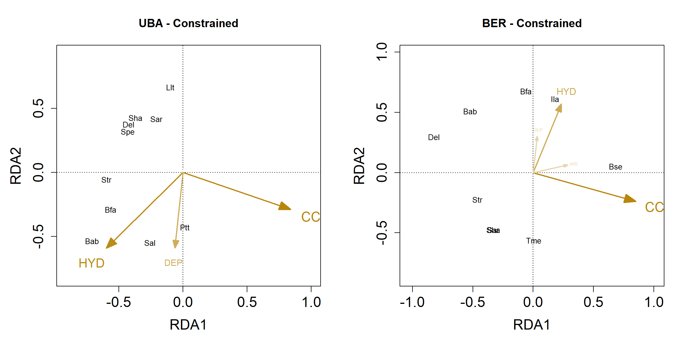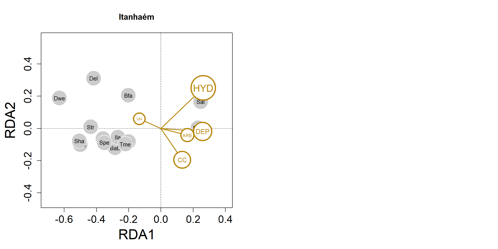
