Variation Partitioning
================
Rodolfo Pelinson
07/04/2021

First we have to load the separated data matrices we need. It all comes
from the Data.csv file in the Data folder. The data matrices are
prepared sourcing the “Loading\_data.R” file in the Auxiliary Scripts
folder.

``` r
source("Loading_data.R")
```

The used packages to run this analysis are:

`vegan` version 2.5-6  
`ade4` version 1.7-15  
`adespatial` version 0.3-8

## Reducing Multicolinearity

To remove multicolinear variables from our Environmental Matrix I built
a function that removes variables with the variance inflation factor
(VIF) higher than 3. The function `VIF_selection()` simply uses the
`vif.cca()` from the `vegan` package.

``` r
Broad_env_VIF <- VIF_selection(Broad_pa,  Broad_env_st[,-6])

SSF_env_VIF <- VIF_selection(SSF_pa,  SSF_env_st)
ST_env_VIF <- VIF_selection(ST_pa,  ST_env_st)
IC_env_VIF <- VIF_selection(IC_pa,  IC_env_st)
NI_env_VIF <- VIF_selection(NI_pa,  NI_env_st)
MD_env_VIF <- VIF_selection(MD_pa,  MD_env_st)
JA_env_VIF <- VIF_selection(JA_pa,  JA_env_st)

DRF_env_VIF <- VIF_selection(DRF_pa,  DRF_env_st)
UBA_env_VIF <- VIF_selection(UBA_pa,  UBA_env_st)
BER_env_VIF <- VIF_selection(BER_pa,  BER_env_st)
ITA_env_VIF <- VIF_selection(ITA_pa,  ITA_env_st)
```

Same thing for climate variables

``` r
Broad_clim_VIF <- VIF_selection(Broad_pa,  Broad_clim_st[,-6])
SSF_clim_VIF <- VIF_selection(SSF_pa,  SSF_clim_st)
DRF_clim_VIF <- VIF_selection(DRF_pa,  DRF_clim_st)
```

## Spatial Variables

Constructing matrices of spatial filters

``` r
Broad_dbMEM <- dbmem(dist(Broad_coord), silent = F, thresh = NULL)
```

    ## Truncation level = 2.740265 
    ## Time to compute dbMEMs = 0.020000  sec

``` r
SSF_dbMEM <- dbmem(dist(SSF_coord), silent = F, thresh = NULL)
```

    ## Truncation level = 2.608894 
    ## Time to compute dbMEMs = 0.020000  sec

``` r
ST_dbMEM <- dbmem(dist(ST_coord), silent = F, thresh = NULL)
```

    ## Truncation level = 0.006243823 
    ## Time to compute dbMEMs = 0.010000  sec

``` r
IC_dbMEM <- dbmem(dist(IC_coord), silent = F, thresh = NULL)
```

    ## Truncation level = 0.03260922 
    ## Time to compute dbMEMs = 0.000000  sec

``` r
NI_dbMEM <- dbmem(dist(NI_coord), silent = F, thresh = NULL)
```

    ## Truncation level = 0.01866376 
    ## Time to compute dbMEMs = 0.000000  sec

``` r
MD_dbMEM <- dbmem(dist(MD_coord), silent = F, thresh = NULL)
```

    ## Truncation level = 0.1459119 
    ## Time to compute dbMEMs = 0.000000  sec

``` r
JA_dbMEM <- dbmem(dist(JA_coord), silent = F, thresh = NULL)
```

    ## Truncation level = 0.03033848 
    ## Time to compute dbMEMs = 0.000000  sec

``` r
DRF_dbMEM <- dbmem(dist(DRF_coord), silent = F, thresh = NULL)
```

    ## Truncation level = 1.072626 
    ## Time to compute dbMEMs = 0.020000  sec

``` r
UBA_dbMEM <- dbmem(dist(UBA_coord), silent = F, thresh = NULL)
```

    ## Truncation level = 0.08923115 
    ## Time to compute dbMEMs = 0.000000  sec

``` r
BER_dbMEM <- dbmem(dist(BER_coord), silent = F, thresh = NULL)
```

    ## Truncation level = 0.09885289 
    ## Time to compute dbMEMs = 0.020000  sec

``` r
ITA_dbMEM <- dbmem(dist(ITA_coord), silent = F, thresh = NULL)
```

    ## Truncation level = 0.254218 
    ## Time to compute dbMEMs = 0.000000  sec

## Forward Selection

Similarly to removing variables with VIF higher than 3, I built a
function to select the most important variables, when they could
significantly explain speices occurrences. Here we use the function
`fs()` from package `adespatial`.

``` r
Broad_env_FS <- forward_selection(Broad_pa, Broad_env_VIF)

SSF_env_FS <- forward_selection(SSF_pa, SSF_env_VIF)
ST_env_FS <- forward_selection(ST_pa, ST_env_VIF)
IC_env_FS <- forward_selection(IC_pa, IC_env_VIF)
NI_env_FS <- forward_selection(NI_pa, NI_env_VIF)
MD_env_FS <- forward_selection(MD_pa, MD_env_VIF)
JA_env_FS <- forward_selection(JA_pa, JA_env_VIF)

DRF_env_FS <- forward_selection(DRF_pa, DRF_env_VIF)
UBA_env_FS <- forward_selection(UBA_pa, UBA_env_VIF)
BER_env_FS <- forward_selection(BER_pa, BER_env_VIF)
ITA_env_FS <- forward_selection(ITA_pa, ITA_env_VIF)
```

Forward Selection of climate variables.

``` r
Broad_clim_FS <- forward_selection(Broad_pa, Broad_clim_VIF)

SSF_clim_FS <- forward_selection(SSF_pa, SSF_clim_VIF)
DRF_clim_FS <- forward_selection(DRF_pa, DRF_clim_VIF)
```

Forward Selection of Spatial variables (dbMEMs).

``` r
Broad_dbMEM_FS <- forward_selection(Broad_pa, Broad_dbMEM)

SSF_dbMEM_FS <- forward_selection(SSF_pa, SSF_dbMEM)
ST_dbMEM_FS <- forward_selection(ST_pa, ST_dbMEM)
IC_dbMEM_FS <- forward_selection(IC_pa, IC_dbMEM)
NI_dbMEM_FS <- forward_selection(NI_pa, NI_dbMEM)
MD_dbMEM_FS <- forward_selection(MD_pa, MD_dbMEM)
JA_dbMEM_FS <- forward_selection(JA_pa, JA_dbMEM)

DRF_dbMEM_FS <- forward_selection(DRF_pa, DRF_dbMEM)
UBA_dbMEM_FS <- forward_selection(UBA_pa, UBA_dbMEM)
BER_dbMEM_FS <- forward_selection(BER_pa, BER_dbMEM)
ITA_dbMEM_FS <- forward_selection(ITA_pa, ITA_dbMEM)
```

We can plot these important spatial variables to better understand what
spatial patterns they describe.

Large Scale MEM 1, 2, 3 and 4.

``` r
par(mfrow = c(2,2))
sr_value(Broad_coord, Broad_dbMEM_FS[,1], ylim = c(-24.49270,-20.17833), xlim = c(-52.64536, -44.51492), grid=F, csize = 0.8, clegend = 1.5, xax = 2, yax = 1, method = "bubble")
title(main = "LARGE SCALE MEM 1", line = 3, outer = F, adj = 1)

sr_value(Broad_coord, Broad_dbMEM_FS[,2], ylim = c(-24.49270,-20.17833), xlim = c(-52.64536, -44.51492), grid=F, csize = 0.8, clegend = 1.5, xax = 2, yax = 1, method = "bubble")
title(main = "LARGE SCALE MEM 2", line = 3, outer = F, adj = 1)

sr_value(Broad_coord, Broad_dbMEM_FS[,3], ylim = c(-24.49270,-20.17833), xlim = c(-52.64536, -44.51492), grid=F, csize = 0.8, clegend = 1.5, xax = 2, yax = 1, method = "bubble")
title(main = "LARGE SCALE MEM 3", line = 3, outer = F, adj = 1)

sr_value(Broad_coord, Broad_dbMEM_FS[,4], ylim = c(-24.49270,-20.17833), xlim = c(-52.64536, -44.51492), grid=F, csize = 0.8, clegend = 1.5, xax = 2, yax = 1, method = "bubble")
title(main = "LARGE SCALE MEM 4", line = 3, outer = F, adj = 1)
```

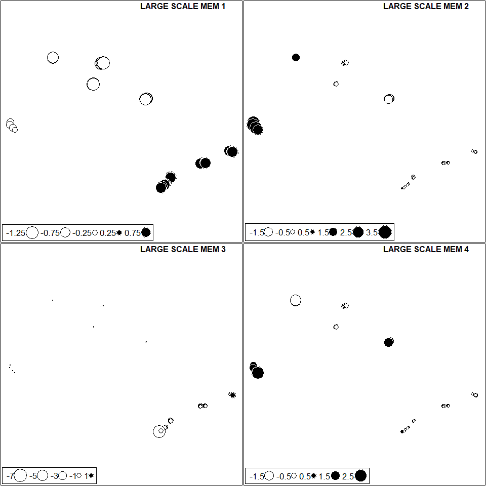

Intermediate Scale DRF MEM 1.

``` r
par(mfrow = c(1,1))
sr_value(DRF_coord, DRF_dbMEM_FS, ylim = c(-24.59270,-23.33123), xlim = c(-47.61181, -44.61492), grid=F, csize = 0.8, clegend = 1.5, xax = 2, yax = 1, method = "bubble")
title(main = "DRF MEM 1", line = 3, outer = F, adj = 1)
```

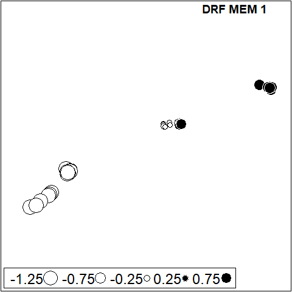

Intermediate Scale SSF MEM 1.

``` r
sr_value(SSF_coord, SSF_dbMEM_FS, ylim = c(-22.61958,-20.17833), xlim = c(-52.54536, -47.52589), grid=F, csize = 0.8, clegend = 1.5, xax = 2, yax = 1, method = "bubble")
title(main = "SSF MEM 1", line = 3, outer = F, adj = 1)
```

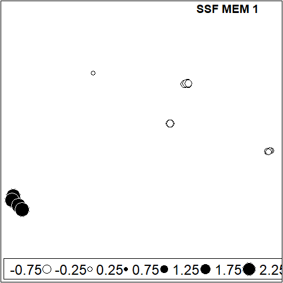

Small Extent DRF - Ubatuba MEM 1

``` r
sr_value(UBA_coord, UBA_dbMEM_FS[,1], ylim = c(-23.37694,-23.33123), xlim = c(-44.95004, -44.80492), grid=F, csize = 0.8, clegend = 1.5, xax = 2, yax = 1, method = "bubble")
title(main = "Ubatuba MEM 1", line = 3, outer = F, adj = 1)
```

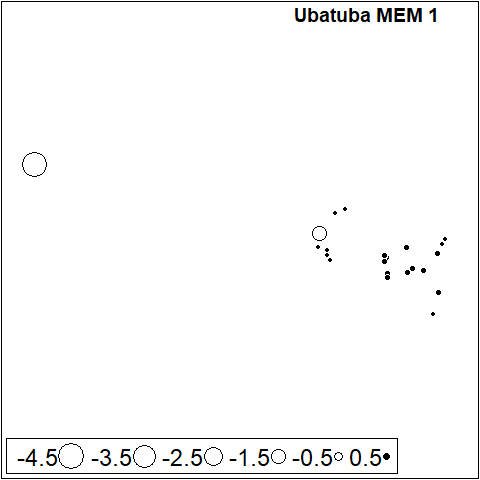

Small Extent DRF - Bertioga MEM 1

``` r
sr_value(BER_coord, BER_dbMEM_FS[,1], ylim = c(-23.76198,-23.71684), xlim = c(-45.94223, -45.73709), grid=F, csize = 0.8, clegend = 1.5, xax = 2, yax = 1, method = "bubble")
title(main = "Bertioga MEM 1", line = 3, outer = F, adj = 1)
```

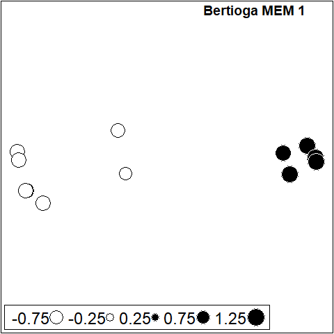

Small Extent DRF - Itanhaém MEM 1 and 2.

``` r
par(mfrow = c(1,2))

sr_value(ITA_coord, ITA_dbMEM_FS[,1], ylim = c(-24.6527,-24.1786), xlim = c(-47.31181, -46.89443), grid=F, csize = 0.8, clegend = 1.5, xax = 2, yax = 1, method = "bubble")
title(main = "Itanhaém MEM 1", line = 3, outer = F, adj = 1)


sr_value(ITA_coord, ITA_dbMEM_FS[,2], ylim = c(-24.6527,-24.1786), xlim = c(-47.31181, -46.89443), grid=F, csize = 0.8, clegend = 1.5, xax = 2, yax = 1, method = "bubble")
title(main = "Itanhaém MEM 2", line = 3, outer = F, adj = 1)
```

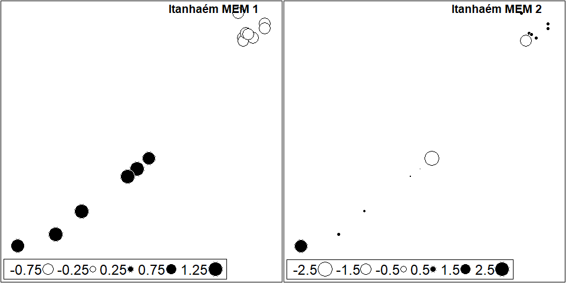

Small Extent DRF - Santa Fé do Sul MEM 1 and 2.

``` r
par(mfrow = c(1,2))

sr_value(ST_coord, ST_dbMEM_FS[,1], ylim = c(-20.18789,-20.17733), xlim = c(-50.89639, -50.89056), grid=F, csize = 0.8, clegend = 1.5, xax = 2, yax = 1, method = "bubble")
title(main = "Santa Fé do Sul MEM 1", line = 3, outer = F, adj = 1)


sr_value(ST_coord, ST_dbMEM_FS[,2], ylim = c(-20.18789,-20.17733), xlim = c(-50.89639, -50.89056), grid=F, csize = 0.8, clegend = 1.5, xax = 2, yax = 1, method = "bubble")
title(main = "Santa Fé do Sul MEM 2", line = 3, outer = F, adj = 1)
```

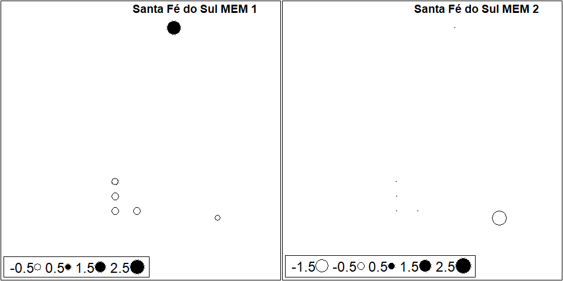

Small Extent DRF - Icém MEM 1 and 2.

``` r
par(mfrow = c(1,2))

sr_value(IC_coord, IC_dbMEM_FS[,1], ylim = c(-20.375,-20.355), xlim = c(-49.28556, -49.18333), grid=F, csize = 0.8, clegend = 1.5, xax = 2, yax = 1, method = "bubble")
title(main = "Icém MEM 1", line = 3, outer = F, adj = 1)


sr_value(IC_coord, IC_dbMEM_FS[,2], ylim = c(-20.375,-20.355), xlim = c(-49.28556, -49.18333), grid=F, csize = 0.8, clegend = 1.5, xax = 2, yax = 1, method = "bubble")
title(main = "Icém MEM 2", line = 3, outer = F, adj = 1)
```

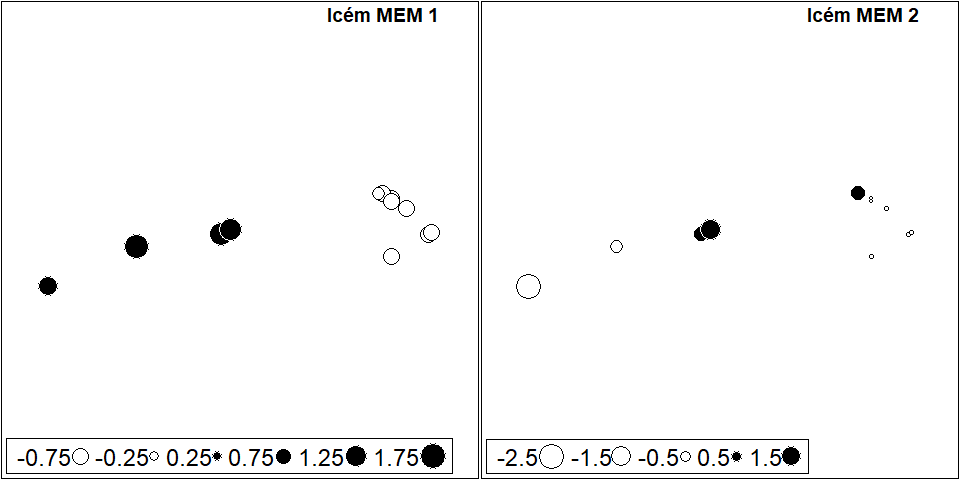

Small Extent DRF - Nova Itapirema MEM 1.

``` r
sr_value(NI_coord, NI_dbMEM_FS, ylim = c(-21.08111,-21.07333), xlim = c(-49.54072, -49.51689), grid=F, csize = 0.8, clegend = 1.5, xax = 2, yax = 1, method = "bubble")
title(main = "Nova Itapirema MEM 1", line = 3, outer = F, adj = 1)
```


Small Extent DRF - Morro do Diabo MEM 1.

``` r
sr_value(MD_coord, MD_dbMEM_FS[,1], ylim = c(-22.65958, -22.34950), xlim = c(-52.34536, -52.16550), grid=F, csize = 0.8, clegend = 1.5, xax = 2, yax = 1, method = "bubble")
title(main = "Morro do Diabo MEM 1", line = 3, outer = F, adj = 1)
```

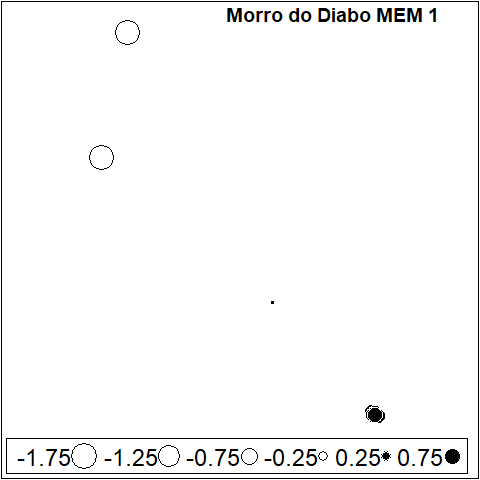

Small Extent DRF - Jataí MEM 1.

``` r
sr_value(JA_coord, JA_dbMEM_FS[,1], ylim = c(-21.58556, -21.56376), xlim = c(-47.79086, -47.72289), grid=F, csize = 0.8, clegend = 1.5, xax = 2, yax = 1, method = "bubble")
title(main = "Jataí MEM 1", line = 3, outer = F, adj = 1)
```

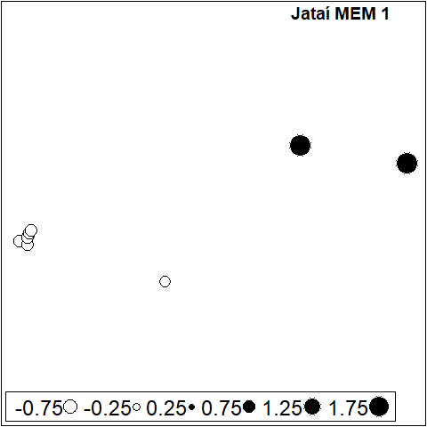

\#\#Variation Partitioning

Large Extent

``` r
#Variation partitioning Broad
Broad_varpart <- var_partitioning_1(Y = Broad_pa, 
                                       env = Broad_env_FS,
                                       clim = Broad_clim_FS,
                                       spa = Broad_dbMEM_FS, percent_r2 = F)
Broad_varpart
```

    ##              Adj_R2 Df         F      p
    ## All           0.300  9  5.527369 0.0001
    ## Env           0.145  3  6.375104 0.0001
    ## Clim          0.212  2 13.748385 0.0001
    ## Spa           0.260  4  9.328382 0.0001
    ## Pure_Env      0.033  3  2.404244 0.0001
    ## Pure_Clim     0.006  2  1.401882 0.0444
    ## Pure_Spa      0.038  4  2.229201 0.0001
    ## Env_Spa       0.017 NA        NA     NA
    ## Env_Clim      0.001 NA        NA     NA
    ## Spa_Clim      0.110 NA        NA     NA
    ## Spa_Clim_Env  0.094 NA        NA     NA
    ## Resid         0.700 NA        NA     NA

``` r
DRF_varpart <- var_partitioning_1(Y = DRF_pa, 
                                      env = DRF_env_FS,
                                      clim = DRF_clim_FS,
                                      spa = DRF_dbMEM_FS, percent_r2 = F)

SSF_varpart <- var_partitioning_1(Y = SSF_pa, 
                                      env = SSF_env_FS,
                                      clim = SSF_clim_FS,
                                      spa = SSF_dbMEM_FS, percent_r2 = F)

SSF_varpart
```

    ##              Adj_R2 Df        F      p
    ## All           0.244  6 3.418204 0.0001
    ## Env           0.107  3 2.806389 0.0001
    ## Clim          0.171  2 5.648020 0.0001
    ## Spa           0.053  1 3.496976 0.0007
    ## Pure_Env      0.071  3 2.307075 0.0001
    ## Pure_Clim     0.103  2 3.805509 0.0001
    ## Pure_Spa      0.004  1 1.191561 0.2509
    ## Env_Spa      -0.002 NA       NA     NA
    ## Env_Clim      0.017 NA       NA     NA
    ## Spa_Clim      0.029 NA       NA     NA
    ## Spa_Clim_Env  0.021 NA       NA     NA
    ## Resid         0.756 NA       NA     NA

``` r
DRF_varpart
```

    ##              Adj_R2 Df        F      p
    ## All           0.125  4 2.756106 0.0001
    ## Env           0.091  2 3.449479 0.0001
    ## Clim          0.049  1 3.515187 0.0006
    ## Spa           0.037  1 2.875084 0.0031
    ## Pure_Env      0.068  2 2.822793 0.0003
    ## Pure_Clim     0.012  1 1.636371 0.0616
    ## Pure_Spa      0.011  1 1.585382 0.0720
    ## Env_Spa      -0.002 NA       NA     NA
    ## Env_Clim      0.009 NA       NA     NA
    ## Spa_Clim      0.011 NA       NA     NA
    ## Spa_Clim_Env  0.017 NA       NA     NA
    ## Resid         0.875 NA       NA     NA

Small Extent allowing negative fractions

``` r
ST_varpart <- var_partitioning_2(ST_pa, ST_env_FS, ST_dbMEM_FS, allow_negative_r2 = T, percent_r2 = F)
IC_varpart <- var_partitioning_2(IC_pa, IC_env_FS, IC_dbMEM_FS, allow_negative_r2 = T, percent_r2 = F)
NI_varpart <- var_partitioning_2(NI_pa, NI_env_FS, NI_dbMEM_FS, allow_negative_r2 = T, percent_r2 = F)
MD_varpart <- var_partitioning_2(MD_pa, MD_env_FS, MD_dbMEM_FS, allow_negative_r2 = T, percent_r2 = F)
JA_varpart <- var_partitioning_2(JA_pa, JA_env_FS, JA_dbMEM_FS, allow_negative_r2 = T, percent_r2 = F)

UBA_varpart <- var_partitioning_2(UBA_pa, UBA_env_FS, UBA_dbMEM_FS, allow_negative_r2 = T, percent_r2 = F)
BER_varpart <- var_partitioning_2(BER_pa, BER_env_FS, BER_dbMEM_FS, allow_negative_r2 = T, percent_r2 = F)
ITA_varpart <- var_partitioning_2(ITA_pa, ITA_env_FS, ITA_dbMEM_FS, allow_negative_r2 = T, percent_r2 = F)

ST_varpart
```

    ##          Adj_R2 Df         F      p
    ## All       0.146  5 1.2397061 0.3278
    ## Env       0.087  3 1.2221392 0.2957
    ## Spa      -0.085  2 0.7256147 0.8142
    ## Pure_Env  0.231  3 1.4514129 0.2807
    ## Pure_Spa  0.059  2 1.1388165 0.4277
    ## Env_Spa  -0.144 NA        NA     NA
    ## Resid     0.854 NA        NA     NA

``` r
IC_varpart
```

    ##          Adj_R2 Df         F      p
    ## All       0.165  3 1.7235286 0.0365
    ## Env       0.195  1 3.6582711 0.0066
    ## Spa      -0.041  2 0.7833254 0.7295
    ## Pure_Env  0.206  1 3.2178660 0.0151
    ## Pure_Spa -0.030  2 0.8214688 0.6742
    ## Env_Spa  -0.011 NA        NA     NA
    ## Resid     0.835 NA        NA     NA

``` r
NI_varpart
```

    ##          Adj_R2 Df         F      p
    ## All       0.154  4 1.3174254 0.1885
    ## Env      -0.010  3 0.9774548 0.5255
    ## Spa       0.159  1 2.3197422 0.0148
    ## Pure_Env -0.005  3 0.9879706 0.5018
    ## Pure_Spa  0.163  1 1.7716486 0.1760
    ## Env_Spa  -0.005 NA        NA     NA
    ## Resid     0.846 NA        NA     NA

``` r
MD_varpart
```

    ##          Adj_R2 Df         F      p
    ## All       0.282  5 1.5500378 0.1671
    ## Env       0.139  4 1.2819349 0.2548
    ## Spa      -0.005  1 0.9665789 0.3738
    ## Pure_Env  0.287  4 1.5993494 0.1687
    ## Pure_Spa  0.143  1 1.5988564 0.2763
    ## Env_Spa  -0.148 NA        NA     NA
    ## Resid     0.718 NA        NA     NA

``` r
JA_varpart
```

    ##          Adj_R2 Df        F      p
    ## All       0.555  4 3.803902 0.0001
    ## Env       0.524  3 4.306537 0.0001
    ## Spa       0.221  1 3.546104 0.0031
    ## Pure_Env  0.334  3 3.002293 0.0083
    ## Pure_Spa  0.030  1 1.411002 0.2415
    ## Env_Spa   0.190 NA       NA     NA
    ## Resid     0.445 NA       NA     NA

``` r
UBA_varpart
```

    ##          Adj_R2 Df         F      p
    ## All       0.068  2 1.7967175 0.0293
    ## Env       0.064  1 2.4974703 0.0094
    ## Spa      -0.011  1 0.7677334 0.6149
    ## Pure_Env  0.078  1 2.7613103 0.0071
    ## Pure_Spa  0.004  1 1.0857650 0.3696
    ## Env_Spa  -0.014 NA        NA     NA
    ## Resid     0.932 NA        NA     NA

``` r
BER_varpart
```

    ##          Adj_R2 Df         F      p
    ## All       0.023  4 1.0633197 0.4002
    ## Env       0.021  3 1.0779635 0.3645
    ## Spa      -0.012  1 0.8660103 0.5679
    ## Pure_Env  0.035  3 1.1188012 0.3385
    ## Pure_Spa  0.002  1 1.0138071 0.4237
    ## Env_Spa  -0.014 NA        NA     NA
    ## Resid     0.977 NA        NA     NA

``` r
ITA_varpart
```

    ##          Adj_R2 Df         F      p
    ## All       0.090  7 1.1970607 0.2861
    ## Env       0.097  5 1.2995211 0.2161
    ## Spa      -0.008  2 0.9443449 0.4830
    ## Pure_Env  0.098  5 1.2576028 0.2644
    ## Pure_Spa -0.007  2 0.9656843 0.5194
    ## Env_Spa  -0.001 NA        NA     NA
    ## Resid     0.910 NA        NA     NA

Small Extent not allowing negative fractions

``` r
ST_varpart2 <- var_partitioning_2(ST_pa, ST_env_FS, ST_dbMEM_FS, allow_negative_r2 = F, percent_r2 = F)
IC_varpart2 <- var_partitioning_2(IC_pa, IC_env_FS, IC_dbMEM_FS, allow_negative_r2 = F, percent_r2 = F)
NI_varpart2 <- var_partitioning_2(NI_pa, NI_env_FS, NI_dbMEM_FS, allow_negative_r2 = F, percent_r2 = F)
MD_varpart2 <- var_partitioning_2(MD_pa, MD_env_FS, MD_dbMEM_FS, allow_negative_r2 = F, percent_r2 = F)
JA_varpart2 <- var_partitioning_2(JA_pa, JA_env_FS, JA_dbMEM_FS, allow_negative_r2 = F, percent_r2 = F)

UBA_varpart2 <- var_partitioning_2(UBA_pa, UBA_env_FS, UBA_dbMEM_FS, allow_negative_r2 = F, percent_r2 = F)
BER_varpart2 <- var_partitioning_2(BER_pa, BER_env_FS, BER_dbMEM_FS, allow_negative_r2 = F, percent_r2 = F)
ITA_varpart2 <- var_partitioning_2(ITA_pa, ITA_env_FS, ITA_dbMEM_FS, allow_negative_r2 = F, percent_r2 = F)

ST_varpart2
```

    ##          Adj_R2 Df        F      p
    ## Pure_Env  0.087  3 1.222139 0.2958
    ## Resid     0.913 NA       NA     NA

``` r
IC_varpart2
```

    ##          Adj_R2 Df        F      p
    ## Pure_Env  0.195  1 3.658271 0.0052
    ## Resid     0.805 NA       NA     NA

``` r
NI_varpart2
```

    ##          Adj_R2 Df        F      p
    ## Pure_Spa  0.159  1 2.319742 0.0149
    ## Resid     0.841 NA       NA     NA

``` r
MD_varpart2
```

    ##          Adj_R2 Df        F      p
    ## Pure_Env  0.139  4 1.281935 0.2564
    ## Resid     0.861 NA       NA     NA

``` r
JA_varpart2
```

    ##          Adj_R2 Df        F      p
    ## All       0.555  4 3.803902 0.0002
    ## Env       0.524  3 4.306537 0.0001
    ## Spa       0.221  1 3.546104 0.0037
    ## Pure_Env  0.334  3 3.002293 0.0078
    ## Pure_Spa  0.030  1 1.411002 0.2495
    ## Env_Spa   0.190 NA       NA     NA
    ## Resid     0.445 NA       NA     NA

``` r
UBA_varpart2
```

    ##          Adj_R2 Df       F     p
    ## Pure_Env  0.064  1 2.49747 0.012
    ## Resid     0.936 NA      NA    NA

``` r
BER_varpart2
```

    ##          Adj_R2 Df        F      p
    ## Pure_Env  0.021  3 1.077964 0.3706
    ## Resid     0.979 NA       NA     NA

``` r
ITA_varpart2
```

    ##          Adj_R2 Df        F      p
    ## Pure_Env  0.097  5 1.299521 0.2027
    ## Resid     0.903 NA       NA     NA

Constructing a matrix with all R2 values

``` r
library(dplyr)

Varpart_plot <- full_join(data.frame(rbind(Broad_varpart[,1])),
                          data.frame(rbind(SSF_varpart[,1])),)

Varpart_plot <- full_join(Varpart_plot,
                          data.frame(rbind(DRF_varpart[,1])))

Varpart_plot <- full_join(Varpart_plot,
                          data.frame(rbind(ST_varpart2[,1])))

Varpart_plot <- full_join(Varpart_plot,
                          data.frame(rbind(IC_varpart2[,1])))

Varpart_plot <- full_join(Varpart_plot,
                          data.frame(rbind(NI_varpart2[,1])))

Varpart_plot <- full_join(Varpart_plot,
                          data.frame(rbind(MD_varpart2[,1])))

Varpart_plot <- full_join(Varpart_plot,
                          data.frame(rbind(JA_varpart2[,1])))
                          
Varpart_plot <- full_join(Varpart_plot,
                          data.frame(rbind(UBA_varpart2[,1])))

Varpart_plot <- full_join(Varpart_plot,
                          data.frame(rbind(BER_varpart2[,1])))

Varpart_plot <- full_join(Varpart_plot,
                          data.frame(rbind(ITA_varpart2[,1])))

rownames(Varpart_plot) <- c("Broad", "SSF", "DRF", "Santa Fé do Sul", "Icém", "Nova Itapirema", "Morro do Diabo", "Jataí", "Ubatuba", "Bertioga", "Itanhaém")

Varpart_barplot <- t(Varpart_plot)
Varpart_barplot
```

    ##              Broad    SSF    DRF Santa Fé do Sul  Icém Nova Itapirema
    ## All          0.300  0.244  0.125              NA    NA             NA
    ## Env          0.145  0.107  0.091              NA    NA             NA
    ## Clim         0.212  0.171  0.049              NA    NA             NA
    ## Spa          0.260  0.053  0.037              NA    NA             NA
    ## Pure_Env     0.033  0.071  0.068           0.087 0.195             NA
    ## Pure_Clim    0.006  0.103  0.012              NA    NA             NA
    ## Pure_Spa     0.038  0.004  0.011              NA    NA          0.159
    ## Env_Spa      0.017 -0.002 -0.002              NA    NA             NA
    ## Env_Clim     0.001  0.017  0.009              NA    NA             NA
    ## Spa_Clim     0.110  0.029  0.011              NA    NA             NA
    ## Spa_Clim_Env 0.094  0.021  0.017              NA    NA             NA
    ## Resid        0.700  0.756  0.875           0.913 0.805          0.841
    ##              Morro do Diabo Jataí Ubatuba Bertioga Itanhaém
    ## All                      NA 0.555      NA       NA       NA
    ## Env                      NA 0.524      NA       NA       NA
    ## Clim                     NA    NA      NA       NA       NA
    ## Spa                      NA 0.221      NA       NA       NA
    ## Pure_Env              0.139 0.334   0.064    0.021    0.097
    ## Pure_Clim                NA    NA      NA       NA       NA
    ## Pure_Spa                 NA 0.030      NA       NA       NA
    ## Env_Spa                  NA 0.190      NA       NA       NA
    ## Env_Clim                 NA    NA      NA       NA       NA
    ## Spa_Clim                 NA    NA      NA       NA       NA
    ## Spa_Clim_Env             NA    NA      NA       NA       NA
    ## Resid                 0.861 0.445   0.936    0.979    0.903

Plotting the Variation Partioning as barplots.

``` r
library(plotrix)

Varpart_barplot <- Varpart_barplot[-c(1:4),]


for(i in 1:dim(Varpart_barplot)[1]){
  for(j in 1:dim(Varpart_barplot)[2]){
    if(is.na(Varpart_barplot[i,j])){Varpart_barplot[i,j] <- 0}
  }
}

round(colSums(Varpart_barplot),2)
```

    ##           Broad             SSF             DRF Santa Fé do Sul            Icém 
    ##               1               1               1               1               1 
    ##  Nova Itapirema  Morro do Diabo           Jataí         Ubatuba        Bertioga 
    ##               1               1               1               1               1 
    ##        Itanhaém 
    ##               1

``` r
Varpart_barplot_break <- Varpart_barplot; Varpart_barplot_break[8,] <- Varpart_barplot_break[8,]-0.3

colSums(Varpart_barplot_break)
```

    ##           Broad             SSF             DRF Santa Fé do Sul            Icém 
    ##           0.699           0.699           0.701           0.700           0.700 
    ##  Nova Itapirema  Morro do Diabo           Jataí         Ubatuba        Bertioga 
    ##           0.700           0.700           0.699           0.700           0.700 
    ##        Itanhaém 
    ##           0.700

``` r
Varpart_barplot_break <- Varpart_barplot_break[c(1,4,3,6,2,5,7,8),]

barplot(as.matrix(Varpart_barplot_break), axes = F, col = c(Pure_Env = "gold",
                                                            Env_Spa = mix_color(alpha = 0.4,"gold","cornflowerblue"),
                                                            Pure_Spa = "cornflowerblue",
                                                            Spa_Clim  = mix_color(alpha = 0.4,"brown1","cornflowerblue"),
                                                            Pure_Clim = "brown1",
                                                            Env_Clim  = mix_color(alpha = 0.4,"brown1","gold"),
                                                            Spa_Clim_Env = mix_color(alpha = 0.7,"brown1","grey"),
                                                            Resid = "grey80"), space = c(0,2,1,2,1,1,1,1,2,1,1), border = "white",
        legend.text = c("Environment","Environment-Space","Space","Climate-Space","Climate","Climate-Environment","All three","Residual"), ylim = c(0,0.8),
        args.legend = list(x = -0.5,y = 0.85, yjust = 1,xjust = 0, horiz = F, ncol = 4, box.col = "transparent",text.width = 5, border = "white"), axisnames= F, ylab = "Adjusted R²", cex.lab = 1.25)
axis(2, at = c(0,0.1,0.2,0.3,0.4,0.5,0.6, 0.7), labels = c("0 %","10 %","20 %","30 %","40 %","50 %","60 %","100 %"))
axis.break(2, 0.65, style = "slash") 
axis(1,at = c(0.5,4.5,16),line = 2, labels =c("Broad","Intermediate","Fine"), tick = F,las = 1, hadj = 0.5, cex.axis = 1.3)
axis(1,at = c(12.5,21.5),line = 0.5, labels =c("SSF","DRF"), tick = F,las = 1, hadj = 0.5, cex.axis = 1.1)
text(c(0.5,   3.5,5.5   ,8.5,10.5,12.5,14.5,16.5,    19.5,21.5,23.5),rep(0.69,11), labels =c("All","SSF","DRF","Santa Fé do Sul","Icém","Nova Itapirema","Morro do Diabo","Jataí","Ubatuba","Bertioga","Itanhaém"), srt = 90, adj = 1, col = "grey45")
text(c(8.5,14.5,16.5,21.5,23.5),c(0.045,0.07,0.54,0.01,0.05), labels =c("*","*","*","*","*"), adj = 0.5, col = "white", cex = 2)
text(c(0.5,0.5,0.5),c(0.02,0.07,0.205), labels =c("*","*","*"), adj = 0.5, col = "white", cex = 2)
text(c(3.5,3.5,5.5),c(0.04,0.155,0.035), labels =c("*","*","*"), adj = 0.5, col = "white", cex = 2)
```

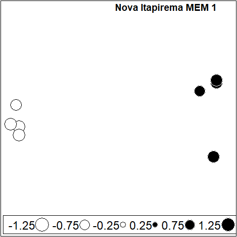
The asterisks represent significant fractions.
