Variation Partitioning
================
Rodolfo Pelinson
07/04/2021

First we need preparare all data matrices from the main dataset. These
are prepared sourcing the “Loading\_data.R” file in the Auxiliary
Scripts folder.

``` r
library(AtlanticForestMetacommunity)
source("Loading_data.R")
```

    ## Error in get(genname, envir = envir) : 
    ##   objeto 'testthat_print' não encontrado

The used packages to run this analysis are:

`vegan` version 2.5-6  
`ade4` version 1.7-15  
`adespatial` version 0.3-8

Some packages used to generate plots and tables

`dplyr` version 0.8.5  
`plotrix` version 3.7-8

       

## Reducing Multicolinearity

To remove multicolinear variables from our Environmental Matrix I built
a function that removes variables with the variance inflation factor
(VIF) higher than 3. The function `VIF_selection()` simply uses the
`vif.cca()` from the `vegan` package.

``` r
Broad_env_VIF <- VIF_selection(Broad_pa,  Broad_env_st[,-6])
Broad_env_VIF$VIFs
```

    ## [[1]]
    ##    hydroperiod   canopy_cover           area          depth     arbust_veg 
    ##       1.286536       1.451979       1.139009       1.341646       1.319669 
    ## dist_to_forest      ecoregion 
    ##       1.357872       1.629874

``` r
SSF_env_VIF <- VIF_selection(SSF_pa,  SSF_env_st)
SSF_env_VIF$VIFs
```

    ## [[1]]
    ##    hydroperiod   canopy_cover           area          depth     arbust_veg 
    ##       1.290581       1.421941       1.370161       1.480381       1.266830 
    ##      arbor_veg dist_to_forest 
    ##       1.640280       1.143554

``` r
ST_env_VIF <- VIF_selection(ST_pa,  ST_env_st)
ST_env_VIF$VIFs
```

    ## [[1]]
    ##    hydroperiod           area          depth     arbust_veg dist_to_forest 
    ##      27.479904      11.917983       5.386203      20.148713       1.807948 
    ## 
    ## [[2]]
    ##           area          depth     arbust_veg dist_to_forest 
    ##       3.533032       2.360081       2.639484       1.668725 
    ## 
    ## [[3]]
    ##          depth     arbust_veg dist_to_forest 
    ##       1.444899       1.301229       1.367747

``` r
IC_env_VIF <- VIF_selection(IC_pa,  IC_env_st)
IC_env_VIF$VIFs
```

    ## [[1]]
    ##    hydroperiod           area          depth     arbust_veg      arbor_veg 
    ##      13.994042       8.475701       3.746172       8.829321       6.070905 
    ## dist_to_forest 
    ##       3.751443 
    ## 
    ## [[2]]
    ##           area          depth     arbust_veg      arbor_veg dist_to_forest 
    ##       3.025874       3.662616       4.677666       2.363837       1.857459 
    ## 
    ## [[3]]
    ##           area          depth      arbor_veg dist_to_forest 
    ##       2.431287       1.283145       1.961016       1.419327

``` r
NI_env_VIF <- VIF_selection(NI_pa,  NI_env_st)
NI_env_VIF$VIFs
```

    ## [[1]]
    ##    hydroperiod           area          depth     arbust_veg dist_to_forest 
    ##       1.502173       4.868245       4.697667       1.834039       2.256836 
    ## 
    ## [[2]]
    ##    hydroperiod          depth     arbust_veg dist_to_forest 
    ##       1.487856       1.157613       1.493676       1.441587

``` r
MD_env_VIF <- VIF_selection(MD_pa,  MD_env_st)
MD_env_VIF$VIFs
```

    ## [[1]]
    ##    hydroperiod   canopy_cover           area          depth     arbust_veg 
    ##       8.498641      88.204089      23.930816      11.021950       4.384440 
    ##      arbor_veg dist_to_forest 
    ##       4.538795      99.155716 
    ## 
    ## [[2]]
    ##  hydroperiod canopy_cover         area        depth   arbust_veg    arbor_veg 
    ##     4.305173     1.952042     8.327303     6.938457     3.759482     3.795006 
    ## 
    ## [[3]]
    ##  hydroperiod canopy_cover        depth   arbust_veg    arbor_veg 
    ##     3.651985     1.438614     3.580236     3.611676     1.119540 
    ## 
    ## [[4]]
    ## canopy_cover        depth   arbust_veg    arbor_veg 
    ##     1.438399     1.554905     1.443346     1.100250

``` r
JA_env_VIF <- VIF_selection(JA_pa,  JA_env_st)
JA_env_VIF$VIFs
```

    ## [[1]]
    ##    hydroperiod   canopy_cover           area          depth     arbust_veg 
    ##      21.043712      11.498156       4.974863       7.169020       2.337838 
    ##      arbor_veg dist_to_forest 
    ##       6.306300      14.270869 
    ## 
    ## [[2]]
    ##   canopy_cover           area          depth     arbust_veg      arbor_veg 
    ##       7.704533       3.143530       3.717337       2.237136       5.688753 
    ## dist_to_forest 
    ##       7.837156 
    ## 
    ## [[3]]
    ## canopy_cover         area        depth   arbust_veg    arbor_veg 
    ##     3.666590     1.907343     2.799926     1.590391     5.648083 
    ## 
    ## [[4]]
    ## canopy_cover         area        depth   arbust_veg 
    ##     1.403846     1.622256     1.596348     1.507106

``` r
DRF_env_VIF <- VIF_selection(DRF_pa,  DRF_env_st)
DRF_env_VIF$VIFs
```

    ## [[1]]
    ##    hydroperiod   canopy_cover           area          depth      arbor_veg 
    ##       1.335097       1.284025       1.296877       1.355938       1.057982 
    ## dist_to_forest 
    ##       1.380390

``` r
UBA_env_VIF <- VIF_selection(UBA_pa,  UBA_env_st)
UBA_env_VIF$VIFs
```

    ## [[1]]
    ##    hydroperiod   canopy_cover           area          depth dist_to_forest 
    ##       1.444507       1.517073       7.027610       1.752700       6.859993 
    ## 
    ## [[2]]
    ##    hydroperiod   canopy_cover          depth dist_to_forest 
    ##       1.345960       1.466037       1.606077       1.710966

``` r
BER_env_VIF <- VIF_selection(BER_pa,  BER_env_st)
BER_env_VIF$VIFs
```

    ## [[1]]
    ##    hydroperiod   canopy_cover           area          depth dist_to_forest 
    ##       3.107574       1.792601       8.375663       2.415887       8.261786 
    ## 
    ## [[2]]
    ##    hydroperiod   canopy_cover          depth dist_to_forest 
    ##       2.194544       1.694149       2.377779       4.283174 
    ## 
    ## [[3]]
    ##  hydroperiod canopy_cover        depth 
    ##     1.611632     1.426723     1.159804

``` r
ITA_env_VIF <- VIF_selection(ITA_pa,  ITA_env_st)
ITA_env_VIF$VIFs
```

    ## [[1]]
    ##  hydroperiod canopy_cover         area        depth    arbor_veg 
    ##     2.400799     1.625552     1.532619     1.999819     1.311338

   

Same thing for climate variables

``` r
Broad_clim_VIF <- VIF_selection(Broad_pa,  Broad_clim_st[,-6])
Broad_clim_VIF$VIFs
```

    ## [[1]]
    ## temp_Season  range_temp  total_prec prec_season 
    ##    16.70154    11.09451    37.77466    37.44331 
    ## 
    ## [[2]]
    ## temp_Season  range_temp prec_season 
    ##    3.034782    2.140178    4.860439 
    ## 
    ## [[3]]
    ## temp_Season  range_temp 
    ##    1.169728    1.169728

``` r
SSF_clim_VIF <- VIF_selection(SSF_pa,  SSF_clim_st)
SSF_clim_VIF$VIFs
```

    ## [[1]]
    ## temp_Season  range_temp  total_prec prec_season 
    ##   44.759191    5.971934    3.197284   52.382832 
    ## 
    ## [[2]]
    ## temp_Season  range_temp  total_prec 
    ##    2.026442    4.722364    3.061846 
    ## 
    ## [[3]]
    ## temp_Season  total_prec 
    ##    1.157234    1.157234

``` r
DRF_clim_VIF <- VIF_selection(DRF_pa,  DRF_clim_st)
DRF_clim_VIF$VIFs
```

    ## [[1]]
    ## temp_Season  range_temp  total_prec prec_season 
    ##    6.512557    3.413672   11.946292    6.515921 
    ## 
    ## [[2]]
    ## temp_Season  range_temp prec_season 
    ##    1.881731    2.874642    2.327331

   

## Spatial Variables

Constructing matrices of spatial filters

``` r
set.seed(5)

candidates_Broad <- listw.candidates(Broad_coord, style = "B", nb = c("del", "gab", "rel", "pcnm"),
                                   weights = c("flin", "fup"), y_fdown = 5, y_fup = 0.5)
```

    ## 
    ##      PLEASE NOTE:  The components "delsgs" and "summary" of the
    ##  object returned by deldir() are now DATA FRAMES rather than
    ##  matrices (as they were prior to release 0.0-18).
    ##  See help("deldir").
    ##  
    ##      PLEASE NOTE: The process that deldir() uses for determining
    ##  duplicated points has changed from that used in version
    ##  0.0-9 of this package (and previously). See help("deldir").

``` r
Broad_MEM <- listw.select(Broad_pa, candidates = candidates_Broad, MEM.autocor = c("positive"), method = c("FWD"),
             MEM.all = FALSE, nperm = 10000, nperm.global = 10000, alpha = 0.05, p.adjust = TRUE, verbose = FALSE)
```

    ## Procedure stopped (adjR2thresh criteria) adjR2cum = 0.259615 with 4 variables (> 0.259615)
    ## Procedure stopped (alpha criteria): pvalue for variable 11 is 0.080592 (> 0.050000)
    ## Procedure stopped (alpha criteria): pvalue for variable 18 is 0.052895 (> 0.050000)
    ## Procedure stopped (alpha criteria): pvalue for variable 18 is 0.065693 (> 0.050000)
    ## Procedure stopped (alpha criteria): pvalue for variable 19 is 0.058094 (> 0.050000)
    ## Procedure stopped (adjR2thresh criteria) adjR2cum = 0.404883 with 25 variables (> 0.404089)
    ## Procedure stopped (alpha criteria): pvalue for variable 23 is 0.059094 (> 0.050000)

``` r
Broad_MEM_FS <- Broad_MEM$best$MEM.select

adegraphics::s.label(Broad_coord, nb = candidates_Broad[[Broad_MEM$best.id]],
                     pnb.edge.col = "red", main = paste("Broad - ",names(Broad_MEM$best.id)), plot = TRUE, labels = NULL)
```

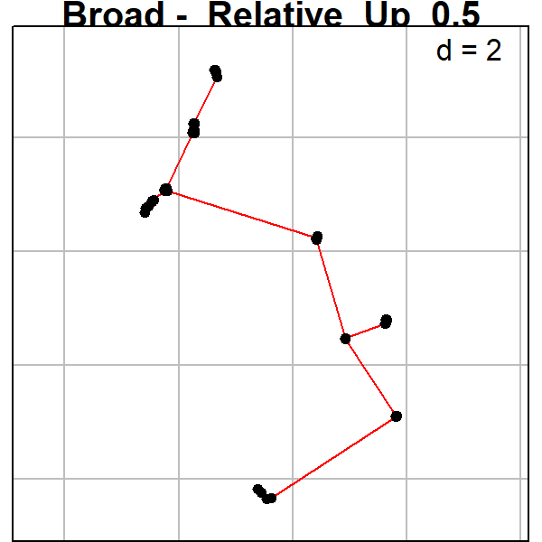

``` r
################################################################################


candidates_DRF <- listw.candidates(DRF_coord, style = "B", nb = c("del", "gab", "rel", "pcnm"),
                                   weights = c("flin", "fup"), y_fdown = 5, y_fup = 0.25)

DRF_MEM <- listw.select(DRF_pa, candidates = candidates_DRF, MEM.autocor = c("positive"), method = c("FWD"),
             MEM.all = FALSE, nperm = 10000, nperm.global = 10000, alpha = 0.05, p.adjust = TRUE, verbose = FALSE)
```

    ## Procedure stopped (adjR2thresh criteria) adjR2cum = 0.057465 with 2 variables (> 0.050471)
    ## Procedure stopped (alpha criteria): pvalue for variable 8 is 0.088891 (> 0.050000)
    ## Procedure stopped (alpha criteria): pvalue for variable 8 is 0.111989 (> 0.050000)

``` r
DRF_MEM_FS <- DRF_MEM$best$MEM.select


adegraphics::s.label(DRF_coord, nb = candidates_DRF[[DRF_MEM$best.id]],
                     pnb.edge.col = "red", main = paste("DRF - ",names(DRF_MEM$best.id)), plot = TRUE, labels = NULL)
```

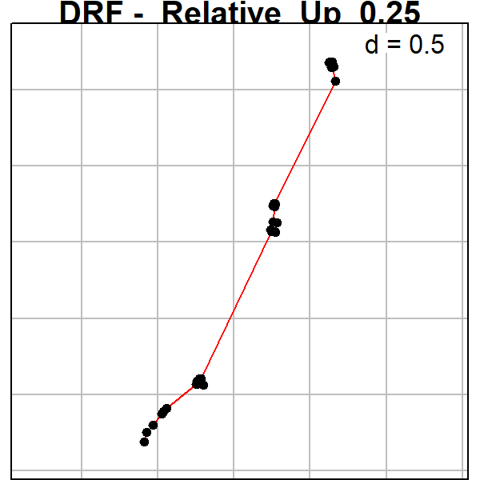

``` r
################################################################################


candidates_SSF <- listw.candidates(SSF_coord, style = "B", nb = c("del", "gab", "rel", "pcnm"),
                                   weights = c("flin", "fup"), y_fdown = 5, y_fup = 0.25)

SSF_MEM <- listw.select(SSF_pa, candidates = candidates_SSF, MEM.autocor = c("positive"), method = c("FWD"),
             MEM.all = FALSE, nperm = 10000, nperm.global = 10000, alpha = 0.05, p.adjust = TRUE, verbose = FALSE)
```

    ## Procedure stopped (adjR2thresh criteria) adjR2cum = 0.079183 with 2 variables (> 0.079183)
    ## Procedure stopped (alpha criteria): pvalue for variable 7 is 0.078592 (> 0.050000)
    ## Procedure stopped (adjR2thresh criteria) adjR2cum = 0.304147 with 9 variables (> 0.302779)
    ## Procedure stopped (alpha criteria): pvalue for variable 7 is 0.076592 (> 0.050000)
    ## Procedure stopped (alpha criteria): pvalue for variable 8 is 0.076192 (> 0.050000)
    ## Procedure stopped (alpha criteria): pvalue for variable 9 is 0.074993 (> 0.050000)
    ## Procedure stopped (alpha criteria): pvalue for variable 10 is 0.057894 (> 0.050000)

``` r
SSF_MEM_FS <- SSF_MEM$best$MEM.select


adegraphics::s.label(SSF_coord, nb = candidates_SSF[[SSF_MEM$best.id]],
                     pnb.edge.col = "red", main = paste("SSF - ",names(SSF_MEM$best.id)), plot = TRUE, labels = NULL)
```

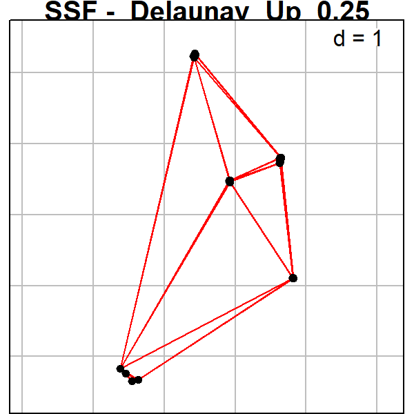

``` r
################################################################################


#We restricted our options for optimization because of the low statistical power (low replication) that we had at our small spatial scale. We only used linear weights as we do not believe that a exponential decay would make sense at this scale (even relative large distances between sites are actually small). Also We restricted our graph conectivity matrix to only three that yields relatively different scenarios of conectance. Those are the Delauney triangulation, the Relative neighbour and the PCNM

################################################################################


candidates_ITA <- listw.candidates(ITA_coord, style = "B", nb = c("del", "rel", "pcnm"),
                                   weights = c("flin"))

ITA_MEM <- listw.select(ITA_pa, candidates = candidates_ITA, MEM.autocor = c("positive"), method = c("FWD"),
             MEM.all = FALSE, nperm = 10000, nperm.global = 10000, alpha = 0.05, p.adjust = TRUE, verbose = FALSE)


ITA_MEM_FS <- dbmem(ITA_coord, MEM.autocor = c("positive"), silent = TRUE)
################################################################################


candidates_BER <- listw.candidates(BER_coord, style = "B", nb = c("del", "rel", "pcnm"),
                                   weights = c("flin"))

BER_MEM <- listw.select(BER_pa, candidates = candidates_BER, MEM.autocor = c("positive"), method = c("FWD"),
             MEM.all = FALSE, nperm = 10000, nperm.global = 10000, alpha = 0.05, p.adjust = TRUE, verbose = FALSE)

BER_MEM_FS <- dbmem(BER_coord, MEM.autocor = c("positive"), silent = TRUE)
################################################################################

candidates_UBA <- listw.candidates(UBA_coord, style = "B", nb = c("del", "rel", "pcnm"),
                                   weights = c("flin"))
```

    ## Warning in nb2listw(nb.object, style = style, glist = lapply(nb.dist, f1, : zero
    ## sum general weights

``` r
UBA_MEM <- listw.select(UBA_pa, candidates = candidates_UBA, MEM.autocor = c("positive"), method = c("FWD"),
             MEM.all = FALSE, nperm = 10000, nperm.global = 10000, alpha = 0.05, p.adjust = TRUE, verbose = FALSE)
```

    ## Procedure stopped (alpha criteria): pvalue for variable 3 is 0.092191 (> 0.050000)

``` r
UBA_MEM_FS <- UBA_MEM$best$MEM.select

adegraphics::s.label(UBA_coord, nb = candidates_UBA[[UBA_MEM$best.id]],
                     pnb.edge.col = "red", main = paste("UBA - ",names(UBA_MEM$best.id)), plot = TRUE, labels = NULL)
```


``` r
################################################################################


candidates_ST <- listw.candidates(ST_coord, style = "B", nb = c("del", "rel", "pcnm"),
                                   weights = c("flin"))
```

    ## Warning in nb2listw(nb.object, style = style, glist = lapply(nb.dist, f1, : zero
    ## sum general weights

``` r
ST_MEM <- listw.select(ST_pa, candidates = candidates_ST, MEM.autocor = c("positive"), method = c("FWD"),
             MEM.all = FALSE, nperm = 10000, nperm.global = 10000, alpha = 0.05, p.adjust = TRUE, verbose = FALSE)

ST_MEM_FS <- dbmem(ST_coord, MEM.autocor = c("positive"), silent = TRUE)

################################################################################


candidates_IC <- listw.candidates(IC_coord, style = "B", nb = c("del", "rel", "pcnm"),
                                   weights = c("flin"))

IC_MEM <- listw.select(IC_pa, candidates = candidates_IC, MEM.autocor = c("positive"), method = c("FWD"),
             MEM.all = FALSE, nperm = 10000, nperm.global = 10000, alpha = 0.05, p.adjust = TRUE, verbose = FALSE)

IC_MEM_FS <- dbmem(IC_coord, MEM.autocor = c("positive"), silent = TRUE)

################################################################################

candidates_NI <- listw.candidates(NI_coord, style = "B", nb = c("del", "rel", "pcnm"),
                                   weights = c("flin"))

NI_MEM <- listw.select(NI_pa, candidates = candidates_NI, MEM.autocor = c("positive"), method = c("FWD"),
             MEM.all = FALSE, nperm = 10000, nperm.global = 10000, alpha = 0.05, p.adjust = TRUE, verbose = FALSE)


adegraphics::s.label(NI_coord, nb = candidates_NI[[NI_MEM$best.id]],
                     pnb.edge.col = "red", main = paste("NI - ",names(NI_MEM$best.id)), plot = TRUE, labels = NULL)
```


``` r
NI_MEM_FS <- dbmem(NI_coord, MEM.autocor = c("positive"), silent = TRUE)


################################################################################

candidates_MD <- listw.candidates(MD_coord, style = "B", nb = c("del", "rel", "pcnm"),
                                   weights = c("flin"))

MD_MEM <- listw.select(MD_pa, candidates = candidates_MD, MEM.autocor = c("positive"), method = c("FWD"),
             MEM.all = FALSE, nperm = 10000, nperm.global = 10000, alpha = 0.05, p.adjust = TRUE, verbose = FALSE)

MD_MEM_FS <- dbmem(MD_coord, MEM.autocor = c("positive"), silent = TRUE)

################################################################################


candidates_JA <- listw.candidates(JA_coord, style = "B", nb = c("del", "rel", "pcnm"),
                                   weights = c("flin"))

JA_MEM <- listw.select(JA_pa, candidates = candidates_JA, MEM.autocor = c("positive"), method = c("FWD"),
             MEM.all = FALSE, nperm = 10000, nperm.global = 10000, alpha = 0.05, p.adjust = TRUE, verbose = FALSE)
```

    ## Procedure stopped (alpha criteria): pvalue for variable 2 is 0.080092 (> 0.050000)
    ## Procedure stopped (alpha criteria): pvalue for variable 3 is 0.101690 (> 0.050000)

``` r
JA_MEM_FS <- JA_MEM$best$MEM.select


adegraphics::s.label(JA_coord, nb = candidates_JA[[JA_MEM$best.id]],
                     pnb.edge.col = "red", main = paste("JA - ",names(JA_MEM$best.id)), plot = TRUE, labels = NULL)
```

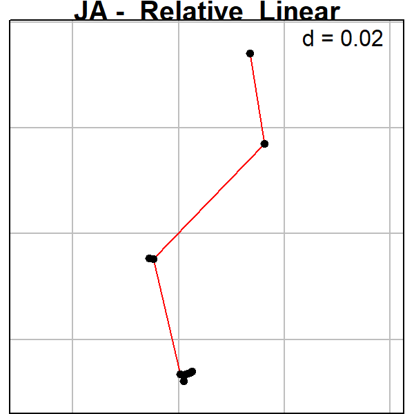

``` r
################################################################################
```

``` r
###PLOTING WEIGHTS ####
nb <- chooseCN(coordinates(UBA_coord), type = 1, plot.nb = FALSE)

#Delaunay triangulation (type 1)
#Gabriel graph (type 2)
#Relative neighbours (type 3)
#Minimum spanning tree (type 4)
#Neighbourhood by distance (type 5)
#K nearests neighbours (type 6)
#Inverse distances (type 7)

dist_UBA <- dist(UBA_coord)

distnb <- spdep::nbdists(nb, as.matrix(UBA_coord))

a_fdown <- 5
a_f_up <- 0.5

fdist <- lapply(distnb, function(x) 1 - x/max(dist_UBA)) #linear
fdist <- lapply(distnb, function(x) 1 - (x/max(dist_UBA))^a_fdown) #fdown
fdist <- lapply(distnb, function(x) 1 / x^a_f_up) #fup
    
lw <- nb2listw(nb, style = 'B', zero.policy = TRUE, glist = fdist) 

m1 <- as.matrix(dist_UBA)
m2 <- spdep::listw2mat(lw)

plot(m1[!diag(ncol(m1))], m2[!diag(ncol(m2))], pch = 20, xlab = "distance", ylab = "spatial weights")
################
```

       

## Forward Selection

Similarly to removing variables with VIF higher than 3, I built a
function to select the most important variables, when they could
significantly explain species occurrences. This function mostly rely on
the function `fs()` from package `adespatial`. Forward selection is only
performed when the whole predictor matrix can significantly explain (p
\< 0.05) the variation in species occurrences.

### Broad Spatial Extent

``` r
Broad_env_Forward <- forward_selection(Broad_pa, Broad_env_VIF$variables)
```

    ## Testing variable 1
    ## Testing variable 2
    ## Testing variable 3
    ## Testing variable 4
    ## Testing variable 5
    ## Testing variable 6
    ## Testing variable 7
    ## Procedure stopped (alpha criteria): pvalue for variable 7 is 0.422500 (> 0.050000)

``` r
Broad_env_Forward$forward_results
```

    ##        variables order         R2     R2Cum  AdjR2Cum         F pvalue
    ## 1      ecoregion     7 0.21317132 0.2131713 0.2048008 25.466921 0.0001
    ## 2 dist_to_forest     6 0.02689891 0.2400702 0.2237277  3.291881 0.0001
    ## 3   canopy_cover     2 0.02082368 0.2608939 0.2367926  2.592020 0.0002
    ## 4     arbust_veg     5 0.01787554 0.2787694 0.2470670  2.255414 0.0019
    ## 5          depth     4 0.01462478 0.2933942 0.2541383  1.862751 0.0143
    ## 6    hydroperiod     1 0.01463586 0.3080301 0.2613804  1.882439 0.0077

``` r
Broad_env_FS <- Broad_env_Forward$selected_variables

Broad_clim_Forward <- forward_selection(Broad_pa, Broad_clim_VIF$variables)
```

    ## Testing variable 1
    ## Testing variable 2

``` r
Broad_clim_Forward$forward_results
```

    ##     variables order         R2     R2Cum  AdjR2Cum        F pvalue
    ## 1  range_temp     2 0.18564062 0.1856406 0.1769772 21.42815  1e-04
    ## 2 temp_Season     1 0.04173225 0.2273729 0.2107572  5.02325  1e-04

``` r
Broad_clim_FS <- Broad_clim_Forward$selected_variables

#_______________________________________________________________
SSF_env_Forward <- forward_selection(SSF_pa, SSF_env_VIF$variables)
```

    ## Testing variable 1
    ## Testing variable 2
    ## Testing variable 3
    ## Testing variable 4
    ## Testing variable 5
    ## Procedure stopped (alpha criteria): pvalue for variable 5 is 0.156700 (> 0.050000)

``` r
SSF_env_Forward$forward_results
```

    ##        variables order         R2     R2Cum   AdjR2Cum        F pvalue
    ## 1   canopy_cover     2 0.06284440 0.0628444 0.04154541 2.950581 0.0014
    ## 2    hydroperiod     1 0.05808294 0.1209273 0.08004024 2.841138 0.0009
    ## 3          depth     4 0.05066306 0.1715904 0.11241829 2.568595 0.0040
    ## 4 dist_to_forest     7 0.04382034 0.2154107 0.13886545 2.289904 0.0082

``` r
SSF_env_FS <- SSF_env_Forward$selected_variables

SSF_clim_Forward <- forward_selection(SSF_pa, SSF_clim_VIF$variables)
```

    ## Testing variable 1
    ## Testing variable 2
    ## Procedure stopped (adjR2thresh criteria) adjR2cum = 0.171372 with 2 variables (> 0.171372)

``` r
SSF_clim_Forward$forward_results
```

    ##    variables order        R2     R2Cum   AdjR2Cum        F pvalue
    ## 1 total_prec     2 0.1032504 0.1032504 0.08286973 5.066094  1e-04

``` r
SSF_clim_FS <- SSF_clim_Forward$selected_variables

#_______________________________________________________________
ST_env_Forward <- forward_selection(ST_pa, ST_env_VIF$variables)
```

    ## Forward selection NOT performed. p > 0.05

``` r
ST_env_Forward$forward_results
```

    ## Permutation test for rda under reduced model
    ## Permutation: free
    ## Number of permutations: 9999
    ## 
    ## Model: rda(X = New_Y, Y = New_X)
    ##          Df Variance     F Pr(>F)
    ## Model     3   1.5233 1.632 0.1018
    ## Residual  4   1.2446

``` r
ST_env_FS <- ST_env_Forward$selected_variables

IC_env_Forward <- forward_selection(IC_pa, IC_env_VIF$variables)
```

    ## Testing variable 1
    ## Testing variable 2
    ## Procedure stopped (alpha criteria): pvalue for variable 2 is 0.133300 (> 0.050000)

``` r
IC_env_Forward$forward_results
```

    ##        variables order        R2     R2Cum  AdjR2Cum        F pvalue
    ## 1 dist_to_forest     4 0.2762401 0.2762401 0.2038641 3.816737  0.001

``` r
IC_env_FS <- IC_env_Forward$selected_variables

NI_env_Forward <- forward_selection(NI_pa, NI_env_VIF$variables)
```

    ## Forward selection NOT performed. p > 0.05

``` r
NI_env_Forward$forward_results
```

    ## Permutation test for rda under reduced model
    ## Permutation: free
    ## Number of permutations: 9999
    ## 
    ## Model: rda(X = New_Y, Y = New_X)
    ##          Df Variance      F Pr(>F)
    ## Model     4   2.2203 1.3581 0.1463
    ## Residual  3   1.2261

``` r
NI_env_FS <- NI_env_Forward$selected_variables

MD_env_Forward <- forward_selection(MD_pa, MD_env_VIF$variables)
```

    ## Forward selection NOT performed. p > 0.05

``` r
MD_env_Forward$forward_results
```

    ## Permutation test for rda under reduced model
    ## Permutation: free
    ## Number of permutations: 9999
    ## 
    ## Model: rda(X = New_Y, Y = New_X)
    ##          Df Variance      F Pr(>F)  
    ## Model     4  2.12434 1.6823 0.0747 .
    ## Residual  3  0.94709                
    ## ---
    ## Signif. codes:  0 '***' 0.001 '**' 0.01 '*' 0.05 '.' 0.1 ' ' 1

``` r
MD_env_FS <- MD_env_Forward$selected_variables

JA_env_Forward <- forward_selection(JA_pa, JA_env_VIF$variables)
```

    ## Testing variable 1
    ## Testing variable 2
    ## Testing variable 3
    ## Testing variable 4
    ## Procedure stopped (adjR2thresh criteria) adjR2cum = 0.544364 with 4 variables (> 0.544364)

``` r
JA_env_Forward$forward_results
```

    ##      variables order        R2     R2Cum  AdjR2Cum        F pvalue
    ## 1        depth     3 0.2978698 0.2978698 0.2101035 3.393898 0.0023
    ## 2 canopy_cover     1 0.1926780 0.4905478 0.3449900 2.647444 0.0477
    ## 3         area     2 0.1943781 0.6849259 0.5273889 3.701571 0.0185

``` r
JA_env_FS <- JA_env_Forward$selected_variables

#______________________________________________________________
DRF_env_Forward <- forward_selection(DRF_pa, DRF_env_VIF$variables)
```

    ## Testing variable 1
    ## Testing variable 2
    ## Testing variable 3
    ## Procedure stopped (adjR2thresh criteria) adjR2cum = 0.078227 with 3 variables (> 0.076121)

``` r
DRF_env_Forward$forward_results
```

    ##      variables order         R2      R2Cum   AdjR2Cum        F pvalue
    ## 1 canopy_cover     2 0.06790027 0.06790027 0.04848153 3.496636 0.0005
    ## 2        depth     4 0.03835188 0.10625215 0.06822033 2.016831 0.0334

``` r
DRF_env_FS <- DRF_env_Forward$selected_variables

DRF_clim_Forward <- forward_selection(DRF_pa, DRF_clim_VIF$variables)
```

    ## Testing variable 1
    ## Testing variable 2
    ## Procedure stopped (adjR2thresh criteria) adjR2cum = 0.059169 with 2 variables (> 0.051511)

``` r
DRF_clim_Forward$forward_results
```

    ##    variables order         R2      R2Cum   AdjR2Cum       F pvalue
    ## 1 range_temp     2 0.06764289 0.06764289 0.04821878 3.48242  5e-04

``` r
DRF_clim_FS <- DRF_clim_Forward$selected_variables

#______________________________________________________________
UBA_env_Forward <- forward_selection(UBA_pa, UBA_env_VIF$variables)
```

    ## Testing variable 1
    ## Testing variable 2
    ## Procedure stopped (alpha criteria): pvalue for variable 2 is 0.277800 (> 0.050000)

``` r
UBA_env_Forward$forward_results
```

    ##      variables order        R2     R2Cum   AdjR2Cum       F pvalue
    ## 1 canopy_cover     2 0.1314935 0.1314935 0.09013607 3.17944 0.0029

``` r
UBA_env_FS <- UBA_env_Forward$selected_variables

BER_env_Forward <- forward_selection(BER_pa, BER_env_VIF$variables)
```

    ## Forward selection NOT performed. p > 0.05

``` r
BER_env_Forward$forward_results
```

    ## Permutation test for rda under reduced model
    ## Permutation: free
    ## Number of permutations: 9999
    ## 
    ## Model: rda(X = New_Y, Y = New_X)
    ##          Df Variance      F Pr(>F)
    ## Model     3  0.55873 0.7499  0.811
    ## Residual  8  1.98673

``` r
BER_env_FS <- BER_env_Forward$selected_variables

ITA_env_Forward <- forward_selection(ITA_pa, ITA_env_VIF$variables)
```

    ## Forward selection NOT performed. p > 0.05

``` r
ITA_env_Forward$forward_results
```

    ## Permutation test for rda under reduced model
    ## Permutation: free
    ## Number of permutations: 9999
    ## 
    ## Model: rda(X = New_Y, Y = New_X)
    ##          Df Variance     F Pr(>F)
    ## Model     5   1.0843 1.125  0.345
    ## Residual  9   1.7348

``` r
ITA_env_FS <- ITA_env_Forward$selected_variables
```

We can plot the important spatial variables to better understand what
spatial patterns they describe.

We are only going to plot the four most important ones

``` r
par(mfrow = c(2,2))

sr_value(Broad_coord, data.frame(Broad_MEM$best$MEM.select)[,1], ylim = c(-24.49270,-20.17833), xlim = c(-52.64536, -44.51492), grid=F, csize = 0.8, clegend = 1, xax = 2, yax = 1, method = "bubble")
title(main = paste("LARGE SCALE", colnames(data.frame(Broad_MEM$best$MEM.select))[1]), line = 3, outer = F, adj = 1)

sr_value(Broad_coord, data.frame(Broad_MEM$best$MEM.select)[,2], ylim = c(-24.49270,-20.17833), xlim = c(-52.64536, -44.51492), grid=F, csize = 0.8, clegend = 1, xax = 2, yax = 1, method = "bubble")
title(main = paste("LARGE SCALE", colnames(data.frame(Broad_MEM$best$MEM.select))[2]), line = 3, outer = F, adj = 1)

sr_value(Broad_coord, data.frame(Broad_MEM$best$MEM.select)[,3], ylim = c(-24.49270,-20.17833), xlim = c(-52.64536, -44.51492), grid=F, csize = 0.8, clegend = 1, xax = 2, yax = 1, method = "bubble")
title(main = paste("LARGE SCALE", colnames(data.frame(Broad_MEM$best$MEM.select))[3]), line = 3, outer = F, adj = 1)

sr_value(Broad_coord, data.frame(Broad_MEM$best$MEM.select)[,4], ylim = c(-24.49270,-20.17833), xlim = c(-52.64536, -44.51492), grid=F, csize = 0.8, clegend = 1, xax = 2, yax = 1, method = "bubble")
title(main = paste("LARGE SCALE", colnames(data.frame(Broad_MEM$best$MEM.select))[4]), line = 3, outer = F, adj = 1)
```

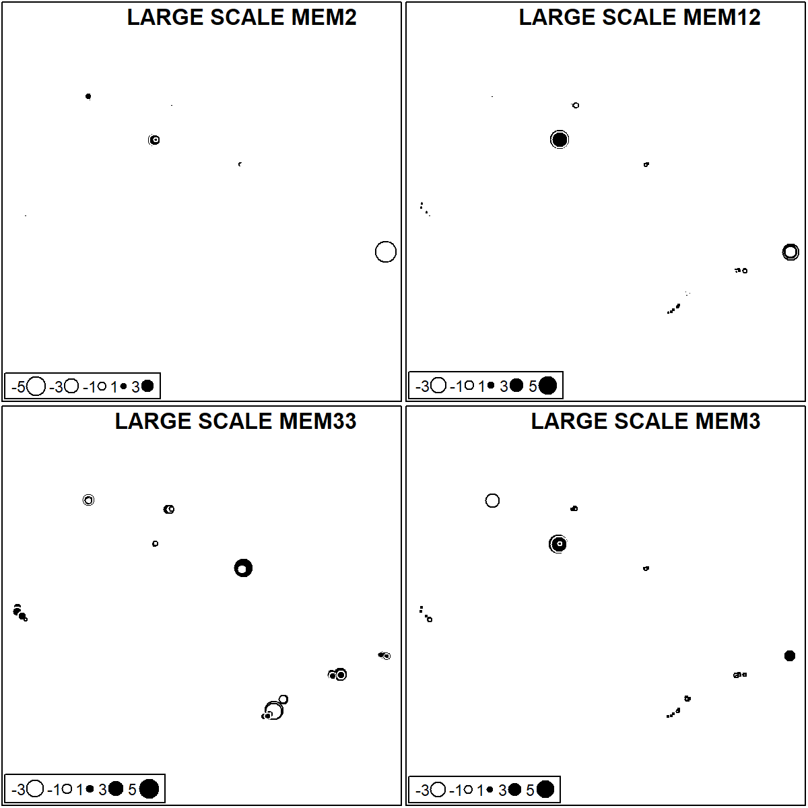

       

Intermediate Scale DRF.

``` r
par(mfrow = c(2,2))

sr_value(DRF_coord, data.frame(DRF_MEM$best$MEM.select)[,1], ylim = c(-24.59270,-23.33123), xlim = c(-47.61181, -44.61492), grid=F, csize = 0.8, clegend = 1, xax = 2, yax = 1, method = "bubble")
title(main = paste("DRF", colnames(data.frame(DRF_MEM$best$MEM.select))[1]), line = 3, outer = F, adj = 1)

sr_value(DRF_coord, data.frame(DRF_MEM$best$MEM.select)[,2], ylim = c(-24.59270,-23.33123), xlim = c(-47.61181, -44.61492), grid=F, csize = 0.8, clegend = 1, xax = 2, yax = 1, method = "bubble")
title(main = paste("DRF", colnames(data.frame(DRF_MEM$best$MEM.select))[2]), line = 3, outer = F, adj = 1)

sr_value(DRF_coord, data.frame(DRF_MEM$best$MEM.select)[,3], ylim = c(-24.59270,-23.33123), xlim = c(-47.61181, -44.61492), grid=F, csize = 0.8, clegend = 1, xax = 2, yax = 1, method = "bubble")
title(main = paste("DRF", colnames(data.frame(DRF_MEM$best$MEM.select))[3]), line = 3, outer = F, adj = 1)

sr_value(DRF_coord, data.frame(DRF_MEM$best$MEM.select)[,4], ylim = c(-24.59270,-23.33123), xlim = c(-47.61181, -44.61492), grid=F, csize = 0.8, clegend = 1, xax = 2, yax = 1, method = "bubble")
title(main = paste("DRF", colnames(data.frame(DRF_MEM$best$MEM.select))[4]), line = 3, outer = F, adj = 1)
```

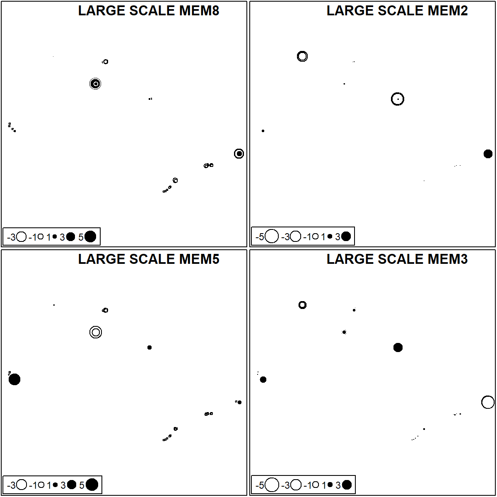
       

Intermediate Scale SSF.

``` r
par(mfrow = c(2,2))

sr_value(SSF_coord, data.frame(SSF_MEM$best$MEM.select)[,1], ylim = c(-22.61958,-20.17833), xlim = c(-52.54536, -47.52589), grid=F, csize = 0.8, clegend = 1, xax = 2, yax = 1, method = "bubble")
title(main = paste("SSF", colnames(data.frame(SSF_MEM$best$MEM.select))[1]), line = 3, outer = F, adj = 1)

sr_value(SSF_coord, data.frame(SSF_MEM$best$MEM.select)[,2], ylim = c(-22.61958,-20.17833), xlim = c(-52.54536, -47.52589), grid=F, csize = 0.8, clegend = 1, xax = 2, yax = 1, method = "bubble")
title(main = paste("SSF", colnames(data.frame(SSF_MEM$best$MEM.select))[2]), line = 3, outer = F, adj = 1)

sr_value(SSF_coord, data.frame(SSF_MEM$best$MEM.select)[,3], ylim = c(-22.61958,-20.17833), xlim = c(-52.54536, -47.52589), grid=F, csize = 0.8, clegend = 1, xax = 2, yax = 1, method = "bubble")
title(main = paste("SSF", colnames(data.frame(SSF_MEM$best$MEM.select))[3]), line = 3, outer = F, adj = 1)

sr_value(SSF_coord, data.frame(SSF_MEM$best$MEM.select)[,4], ylim = c(-22.61958,-20.17833), xlim = c(-52.54536, -47.52589), grid=F, csize = 0.8, clegend = 1, xax = 2, yax = 1, method = "bubble")
title(main = paste("SSF", colnames(data.frame(SSF_MEM$best$MEM.select))[4]), line = 3, outer = F, adj = 1)
```

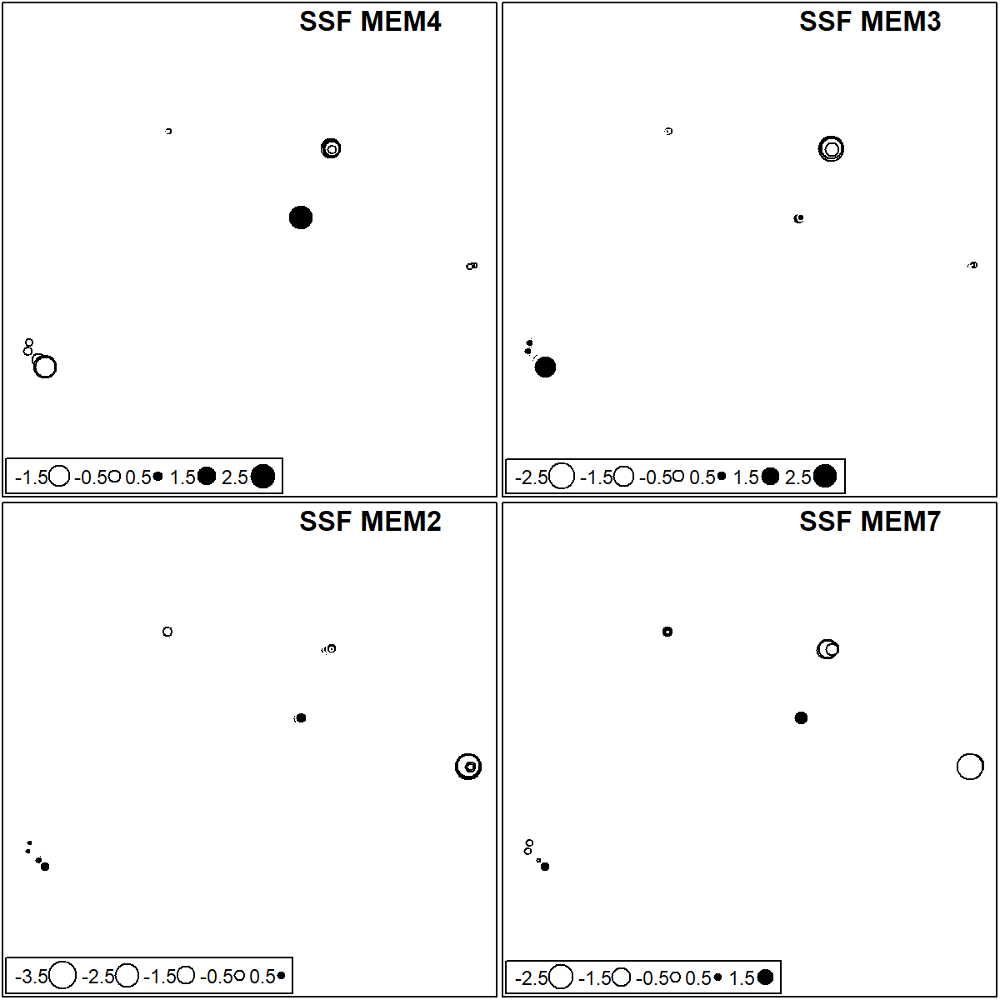

       

Small Extent DRF - Ubatuba

``` r
par(mfrow = c(1,2))

sr_value(UBA_coord, data.frame(UBA_MEM$best$MEM.select)[,1], ylim = c(-23.37694,-23.33123), xlim = c(-44.95004, -44.80492), grid=F, csize = 0.8, clegend = 1, xax = 2, yax = 1, method = "bubble")
title(main = paste("UBA", colnames(data.frame(UBA_MEM$best$MEM.select))[1]), line = 3, outer = F, adj = 1)

sr_value(UBA_coord, data.frame(UBA_MEM$best$MEM.select)[,2], ylim = c(-23.37694,-23.33123), xlim = c(-44.95004, -44.80492), grid=F, csize = 0.8, clegend = 1, xax = 2, yax = 1, method = "bubble")
title(main = paste("UBA", colnames(data.frame(UBA_MEM$best$MEM.select))[2]), line = 3, outer = F, adj = 1)
```

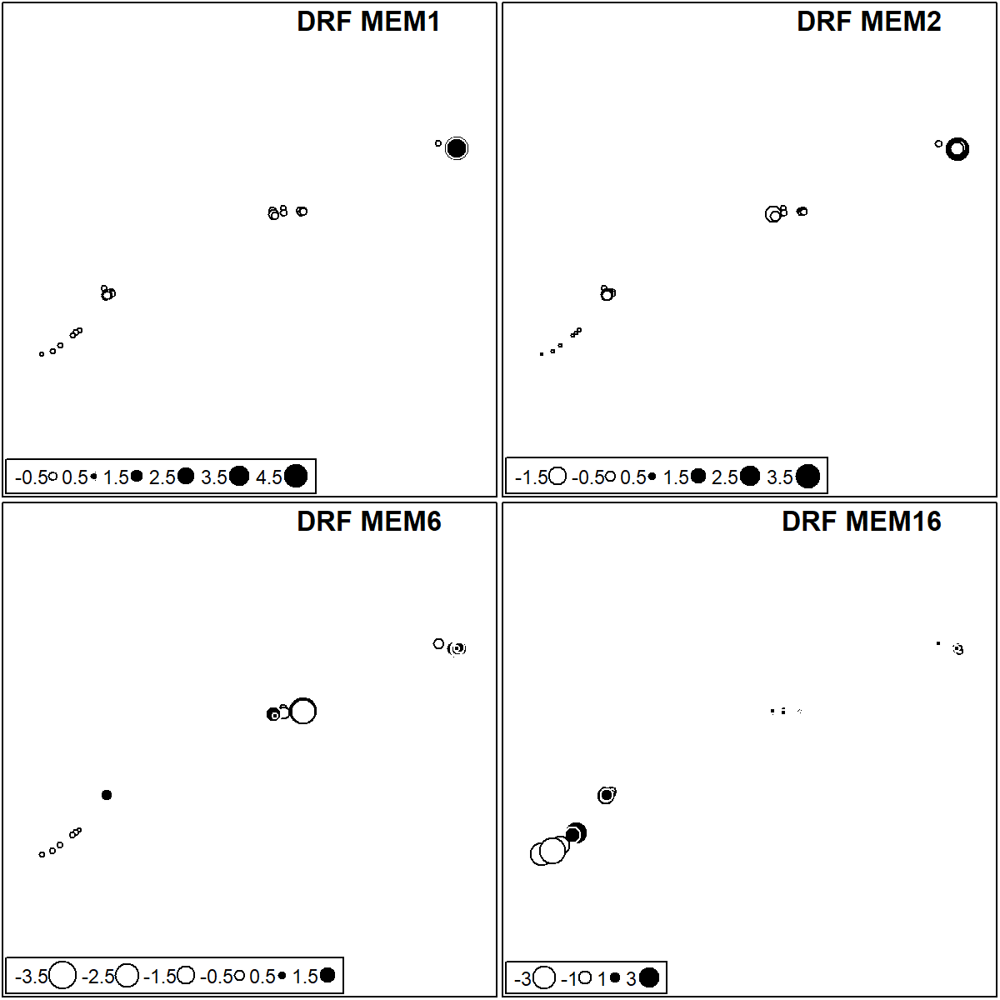

   

Small Extent SSF - Nova Itapirema.

``` r
par(mfrow = c(1,1))

sr_value(NI_coord, data.frame(NI_MEM$best$MEM.select)[,1], ylim = c(-21.08111,-21.07333), xlim = c(-49.54072, -49.51689), grid=F, csize = 0.8, clegend = 1, xax = 2, yax = 1, method = "bubble")
title(main = paste("NI", colnames(data.frame(NI_MEM$best$MEM.select))[1]), line = 3, outer = F, adj = 1)
```

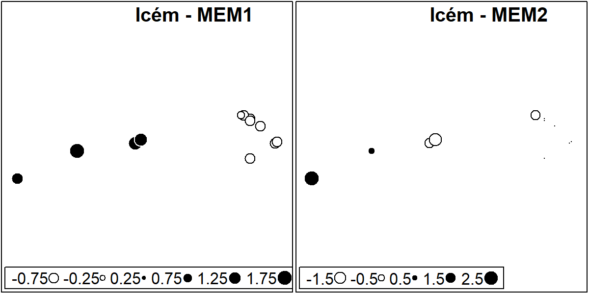

Small Extent SSF - Jataí.

``` r
par(mfrow = c(1,2))

sr_value(JA_coord, data.frame(JA_MEM$best$MEM.select)[,1], ylim = c(-21.58556, -21.56376), xlim = c(-47.79086, -47.72289), grid=F, csize = 0.8, clegend = 1, xax = 2, yax = 1, method = "bubble")
title(main = paste("JA", colnames(data.frame(JA_MEM$best$MEM.select))[1]), line = 3, outer = F, adj = 1)

sr_value(JA_coord, data.frame(JA_MEM$best$MEM.select)[,2], ylim = c(-21.58556, -21.56376), xlim = c(-47.79086, -47.72289), grid=F, csize = 0.8, clegend = 1, xax = 2, yax = 1, method = "bubble")
title(main = paste("JA", colnames(data.frame(JA_MEM$best$MEM.select))[2]), line = 3, outer = F, adj = 1)
```

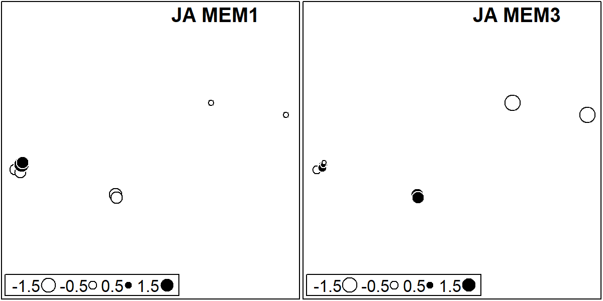

       

## Variation Partitioning

#### Large Extent

``` r
#Variation partitioning Broad

Broad_varpart <- var_partitioning(Y = Broad_pa, 
                                       env = Broad_env_FS,
                                       clim = Broad_clim_FS,
                                       spa = data.frame(Broad_MEM$best$MEM.select), percent_r2 = F)


#Testing significande of spatially structured environment
candidates_Broad_env <- listw.candidates(Broad_coord, style = "B", nb = c("del", "gab", "rel", "pcnm"),
                                   weights = c("flin", "fup","fdown"), y_fdown = 5, y_fup = 0.5)

Broad_MEM_env <- listw.select(Broad_env_FS, candidates = candidates_Broad_env, MEM.autocor = c("positive"), method = c("FWD"),
             MEM.all = FALSE, nperm = 10000, nperm.global = 10000, alpha = 0.05, p.adjust = FALSE, verbose = FALSE)
```

    ## Procedure stopped (alpha criteria): pvalue for variable 4 is 0.086791 (> 0.050000)
    ## Procedure stopped (alpha criteria): pvalue for variable 9 is 0.050195 (> 0.050000)
    ## Procedure stopped (alpha criteria): pvalue for variable 9 is 0.069193 (> 0.050000)
    ## Procedure stopped (alpha criteria): pvalue for variable 13 is 0.066793 (> 0.050000)
    ## Procedure stopped (alpha criteria): pvalue for variable 13 is 0.060494 (> 0.050000)
    ## Procedure stopped (adjR2thresh criteria) adjR2cum = 0.381575 with 15 variables (> 0.374008)
    ## Procedure stopped (adjR2thresh criteria) adjR2cum = 0.400684 with 18 variables (> 0.393873)
    ## Procedure stopped (adjR2thresh criteria) adjR2cum = 0.418525 with 15 variables (> 0.413678)
    ## Procedure stopped (adjR2thresh criteria) adjR2cum = 0.426504 with 19 variables (> 0.425424)
    ## Procedure stopped (alpha criteria): pvalue for variable 14 is 0.050395 (> 0.050000)

``` r
Broad_env_spa_sig <- envspace.test(spe = Broad_pa, env = Broad_env_FS,   coord = Broad_coord,  
              MEM.spe =  data.frame(Broad_MEM$best$MEM.select), 
              listw.env = candidates_Broad_env[[Broad_MEM_env$best.id]], MEM.autocor = c("positive"),
              regular = FALSE, nperm = 10000, MSR.method = "singleton", alpha = 0.05)
Broad_env_spa_sig
```

    ## Monte-Carlo test
    ## Call: as.randtest(sim = E.b, obs = R2.b, alter = alternative)
    ## 
    ## Observation: 0.210177 
    ## 
    ## Based on 10000 replicates
    ## Simulated p-value: 9.999e-05 
    ## Alternative hypothesis: greater 
    ## 
    ##     Std.Obs Expectation    Variance 
    ## 4.362625276 0.062977133 0.001138464

``` r
#Testing significande of spatially structured climate
Broad_MEM_clim <- listw.select(Broad_clim_FS, candidates = candidates_Broad_env, MEM.autocor = c("positive"), method = c("FWD"),
             MEM.all = FALSE, nperm = 10000, nperm.global = 10000, alpha = 0.05, p.adjust = FALSE, verbose = FALSE)
```

    ## Procedure stopped (alpha criteria): pvalue for variable 20 is 0.062894 (> 0.050000)
    ## Procedure stopped (alpha criteria): pvalue for variable 21 is 0.069393 (> 0.050000)
    ## Procedure stopped (R2more criteria): variable 35 explains only 0.000838 of the variance.
    ## Procedure stopped (alpha criteria): pvalue for variable 23 is 0.056294 (> 0.050000)
    ## Procedure stopped (adjR2thresh criteria) adjR2cum = 0.952786 with 28 variables (> 0.952717)
    ## Procedure stopped (adjR2thresh criteria) adjR2cum = 0.926218 with 31 variables (> 0.923705)
    ## Procedure stopped (adjR2thresh criteria) adjR2cum = 0.930318 with 21 variables (> 0.929651)
    ## Procedure stopped (adjR2thresh criteria) adjR2cum = 0.930886 with 24 variables (> 0.929238)
    ## Procedure stopped (adjR2thresh criteria) adjR2cum = 0.906951 with 32 variables (> 0.905302)

``` r
Broad_clim_spa_sig <- envspace.test(spe = Broad_pa, env = Broad_clim_FS,   coord = Broad_coord,  
              MEM.spe =  data.frame(Broad_MEM$best$MEM.select), 
              listw.env = candidates_Broad_env[[Broad_MEM_clim$best.id]], MEM.autocor = c("positive"),
              regular = FALSE, nperm = 10000, MSR.method = "singleton", alpha = 0.05)
Broad_clim_spa_sig
```

    ## Monte-Carlo test
    ## Call: as.randtest(sim = E.b, obs = R2.b, alter = alternative)
    ## 
    ## Observation: 0.1936374 
    ## 
    ## Based on 10000 replicates
    ## Simulated p-value: 9.999e-05 
    ## Alternative hypothesis: greater 
    ## 
    ##      Std.Obs  Expectation     Variance 
    ## 6.3703428416 0.0335624283 0.0006314239

   

#### Intermediate Extent

``` r
DRF_varpart <- var_partitioning(Y = DRF_pa, 
                                      env = DRF_env_FS,
                                      clim = DRF_clim_FS,
                                      spa = DRF_MEM_FS, percent_r2 = F)

#Testing significande of spatially structured environment
candidates_DRF_env <- listw.candidates(DRF_coord, style = "B", nb = c("del", "gab", "rel", "pcnm"),
                                   weights = c("flin", "fup","fdown"), y_fdown = 5, y_fup = 0.5)

DRF_MEM_env <- listw.select(DRF_env_FS, candidates = candidates_DRF_env, MEM.autocor = c("positive"), method = c("FWD"),
             MEM.all = FALSE, nperm = 10000, nperm.global = 10000, alpha = 0.05, p.adjust = FALSE, verbose = FALSE)
```

    ## Procedure stopped (alpha criteria): pvalue for variable 3 is 0.119288 (> 0.050000)
    ## Procedure stopped (alpha criteria): pvalue for variable 3 is 0.064394 (> 0.050000)

``` r
DRF_env_spa_sig <- envspace.test(spe = DRF_pa, env = DRF_env_FS,   coord = DRF_coord,  
              MEM.spe =  data.frame(DRF_MEM$best$MEM.select), 
              listw.env = candidates_DRF_env[[DRF_MEM_env$best.id]], MEM.autocor = c("positive"),
              regular = FALSE, nperm = 10000, MSR.method = "singleton", alpha = 0.05)


#Testing significande of spatially structured climate
DRF_MEM_clim <- listw.select(DRF_clim_FS, candidates = candidates_DRF_env, MEM.autocor = c("positive"), method = c("FWD"),
             MEM.all = FALSE, nperm = 10000, nperm.global = 10000, alpha = 0.05, p.adjust = FALSE, verbose = FALSE)
```

    ## Procedure stopped (adjR2thresh criteria) adjR2cum = 0.844159 with 4 variables (> 0.838710)
    ## Procedure stopped (adjR2thresh criteria) adjR2cum = 0.820676 with 5 variables (> 0.818902)
    ## Procedure stopped (alpha criteria): pvalue for variable 14 is 0.063494 (> 0.050000)
    ## Procedure stopped (adjR2thresh criteria) adjR2cum = 0.932956 with 12 variables (> 0.930517)
    ## Procedure stopped (adjR2thresh criteria) adjR2cum = 0.895779 with 9 variables (> 0.890377)
    ## Procedure stopped (alpha criteria): pvalue for variable 15 is 0.063994 (> 0.050000)
    ## Procedure stopped (alpha criteria): pvalue for variable 10 is 0.055394 (> 0.050000)
    ## Procedure stopped (alpha criteria): pvalue for variable 8 is 0.084192 (> 0.050000)
    ## Procedure stopped (adjR2thresh criteria) adjR2cum = 0.876343 with 14 variables (> 0.873455)

``` r
DRF_clim_spa_sig <- envspace.test(spe = DRF_pa, env = DRF_clim_FS,   coord = DRF_coord,  
              MEM.spe =  data.frame(DRF_MEM$best$MEM.select), 
              listw.env = candidates_DRF_env[[DRF_MEM_clim$best.id]], MEM.autocor = c("positive"),
              regular = FALSE, nperm = 10000, MSR.method = "singleton", alpha = 0.05)


###########################################################################################
SSF_varpart <- var_partitioning(Y = SSF_pa, 
                                      env = SSF_env_FS,
                                      clim = SSF_clim_FS,
                                      spa = SSF_MEM_FS, percent_r2 = F)

#Testing significande of spatially structured environment
candidates_SSF_env <- listw.candidates(SSF_coord, style = "B", nb = c("del", "gab", "rel", "pcnm"),
                                   weights = c("flin", "fup","fdown"), y_fdown = 5, y_fup = 0.5)

SSF_MEM_env <- listw.select(SSF_env_FS, candidates = candidates_SSF_env, MEM.autocor = c("positive"), method = c("FWD"),
             MEM.all = FALSE, nperm = 10000, nperm.global = 10000, alpha = 0.05, p.adjust = FALSE, verbose = FALSE)
```

    ## Procedure stopped (alpha criteria): pvalue for variable 1 is 0.053795 (> 0.050000)
    ## Procedure stopped (alpha criteria): pvalue for variable 6 is 0.074493 (> 0.050000)
    ## Procedure stopped (adjR2thresh criteria) adjR2cum = 0.371274 with 8 variables (> 0.363374)
    ## Procedure stopped (alpha criteria): pvalue for variable 8 is 0.059994 (> 0.050000)
    ## Procedure stopped (alpha criteria): pvalue for variable 10 is 0.073293 (> 0.050000)
    ## Procedure stopped (alpha criteria): pvalue for variable 7 is 0.058494 (> 0.050000)
    ## Procedure stopped (alpha criteria): pvalue for variable 8 is 0.063194 (> 0.050000)
    ## Procedure stopped (alpha criteria): pvalue for variable 10 is 0.050495 (> 0.050000)
    ## Procedure stopped (alpha criteria): pvalue for variable 8 is 0.087591 (> 0.050000)
    ## Procedure stopped (alpha criteria): pvalue for variable 6 is 0.060394 (> 0.050000)

``` r
SSF_env_spa_sig <- envspace.test(spe = SSF_pa, env = SSF_env_FS,   coord = SSF_coord,  
              MEM.spe =  data.frame(SSF_MEM$best$MEM.select), 
              listw.env = candidates_SSF_env[[SSF_MEM_env$best.id]], MEM.autocor = c("positive"),
              regular = FALSE, nperm = 10000, MSR.method = "singleton", alpha = 0.05)


#Testing significande of spatially structured climate
SSF_MEM_clim <- listw.select(SSF_clim_FS, candidates = candidates_SSF_env, MEM.autocor = c("positive"), method = c("FWD"),
             MEM.all = FALSE, nperm = 10000, nperm.global = 10000, alpha = 0.05, p.adjust = FALSE, verbose = FALSE)
```

    ## Procedure stopped (adjR2thresh criteria) adjR2cum = 0.933219 with 7 variables (> 0.929393)
    ## Procedure stopped (adjR2thresh criteria) adjR2cum = 0.900585 with 7 variables (> 0.892680)
    ## Procedure stopped (adjR2thresh criteria) adjR2cum = 0.972352 with 13 variables (> 0.971906)
    ## Procedure stopped (adjR2thresh criteria) adjR2cum = 0.897325 with 6 variables (> 0.887288)
    ## Procedure stopped (adjR2thresh criteria) adjR2cum = 0.886083 with 7 variables (> 0.881915)
    ## Procedure stopped (adjR2thresh criteria) adjR2cum = 0.969459 with 13 variables (> 0.968186)
    ## Procedure stopped (adjR2thresh criteria) adjR2cum = 0.881494 with 10 variables (> 0.881078)
    ## Procedure stopped (alpha criteria): pvalue for variable 8 is 0.060094 (> 0.050000)
    ## Procedure stopped (adjR2thresh criteria) adjR2cum = 0.957627 with 11 variables (> 0.956886)

``` r
SSF_clim_spa_sig <- envspace.test(spe = SSF_pa, env = SSF_clim_FS,   coord = SSF_coord,  
              MEM.spe =  data.frame(SSF_MEM$best$MEM.select), 
              listw.env = candidates_SSF_env[[SSF_MEM_clim$best.id]], MEM.autocor = c("positive"),
              regular = FALSE, nperm = 10000, MSR.method = "singleton", alpha = 0.05)


DRF_varpart
```

    ##              Adj_R2 Df        F      p
    ## All           0.186 10 2.121964 0.0001
    ## Env           0.068  2 2.793770 0.0005
    ## Clim          0.048  1 3.482420 0.0007
    ## Spa           0.165  7 2.378271 0.0001
    ## Pure_Env      0.013  2 1.330891 0.1171
    ## Pure_Clim     0.005  1 1.233515 0.2281
    ## Pure_Spa      0.093  7 1.751330 0.0005
    ## Env_Spa       0.032 NA       NA     NA
    ## Env_Clim      0.004 NA       NA     NA
    ## Spa_Clim      0.020 NA       NA     NA
    ## Spa_Clim_Env  0.019 NA       NA     NA
    ## Resid         0.814 NA       NA     NA

``` r
DRF_env_spa_sig
```

    ## Monte-Carlo test
    ## Call: as.randtest(sim = E.b, obs = R2.b, alter = alternative)
    ## 
    ## Observation: 0.05116403 
    ## 
    ## Based on 10000 replicates
    ## Simulated p-value: 0.01429857 
    ## Alternative hypothesis: greater 
    ## 
    ##      Std.Obs  Expectation     Variance 
    ## 2.3008476871 0.0116996542 0.0002941947

``` r
DRF_clim_spa_sig
```

    ## Monte-Carlo test
    ## Call: as.randtest(sim = E.b, obs = R2.b, alter = alternative)
    ## 
    ## Observation: 0.03954604 
    ## 
    ## Based on 10000 replicates
    ## Simulated p-value: 0.07319268 
    ## Alternative hypothesis: greater 
    ## 
    ##      Std.Obs  Expectation     Variance 
    ## 1.4204062432 0.0228758433 0.0001377387

``` r
SSF_varpart
```

    ##              Adj_R2 Df        F      p
    ## All           0.348 13 2.847250 0.0001
    ## Env           0.139  4 2.814161 0.0001
    ## Clim          0.083  1 5.066094 0.0001
    ## Spa           0.294  8 3.344447 0.0001
    ## Pure_Env      0.042  4 1.572944 0.0065
    ## Pure_Clim     0.008  1 1.428745 0.1224
    ## Pure_Spa      0.150  8 2.147736 0.0001
    ## Env_Spa       0.074 NA       NA     NA
    ## Env_Clim      0.004 NA       NA     NA
    ## Spa_Clim      0.051 NA       NA     NA
    ## Spa_Clim_Env  0.020 NA       NA     NA
    ## Resid         0.652 NA       NA     NA

``` r
SSF_env_spa_sig
```

    ## Monte-Carlo test
    ## Call: as.randtest(sim = E.b, obs = R2.b, alter = alternative)
    ## 
    ## Observation: 0.0935555 
    ## 
    ## Based on 10000 replicates
    ## Simulated p-value: 0.00549945 
    ## Alternative hypothesis: greater 
    ## 
    ##      Std.Obs  Expectation     Variance 
    ## 2.7870020861 0.0312657250 0.0004995269

``` r
SSF_clim_spa_sig
```

    ## Monte-Carlo test
    ## Call: as.randtest(sim = E.b, obs = R2.b, alter = alternative)
    ## 
    ## Observation: 0.07059744 
    ## 
    ## Based on 10000 replicates
    ## Simulated p-value: 0.00329967 
    ## Alternative hypothesis: greater 
    ## 
    ##      Std.Obs  Expectation     Variance 
    ## 3.1266973540 0.0174640140 0.0002887779

   

#### Small Extent

Small Extent allowing negative fractions

``` r
ST_varpart <- var_partitioning(ST_pa, ST_env_FS, spa = ST_MEM_FS, allow_negative_r2 = T, percent_r2 = F)
IC_varpart <- var_partitioning(IC_pa, IC_env_FS, spa = IC_MEM_FS, allow_negative_r2 = T, percent_r2 = F)
NI_varpart <- var_partitioning(NI_pa, NI_env_FS, spa = NI_MEM_FS, allow_negative_r2 = T, percent_r2 = F)
#Testing significande of spatially structured environment
candidates_NI_env <- listw.candidates(NI_coord, style = "B", nb = c("del", "gab", "rel", "pcnm"),
                                   weights = c("flin", "fup","fdown"), y_fdown = 5, y_fup = 0.5)

NI_MEM_env <- listw.select(NI_env_FS, candidates = candidates_NI_env, MEM.autocor = c("positive"), method = c("FWD"),
             MEM.all = FALSE, nperm = 10000, nperm.global = 10000, alpha = 0.1, p.adjust = FALSE, verbose = FALSE) 
```

    ## Procedure stopped (adjR2thresh criteria) adjR2cum = 0.175515 with 1 variables (> 0.175515)

``` r
# We are not adjusting p-values here because we assume that if there was a significant spatial and environmental strucutre in species distributions, we want to find spatial patterns in the environment

#There was no significant spatial structure in the environmental variables
NI_env_spa_sig <- envspace.test(spe = NI_pa, env = NI_env_FS,   coord = NI_coord,  
              MEM.spe =  NI_MEM_FS, 
              listw.env = candidates_NI_env$DBEM_PCNM, MEM.autocor = c("positive"),
              regular = FALSE, nperm = 10000, MSR.method = "singleton", alpha = 0.05)
```

    ## No significant relation between 'spe' and 'env'; the test was not performed

``` r
MD_varpart <- var_partitioning(MD_pa, MD_env_FS, spa = MD_MEM_FS, allow_negative_r2 = T, percent_r2 = F)
JA_varpart <- var_partitioning(JA_pa, JA_env_FS, spa = JA_MEM_FS, allow_negative_r2 = T, percent_r2 = F)
#Testing significande of spatially structured environment
candidates_JA_env <- listw.candidates(JA_coord, style = "B", nb = c("del", "gab", "rel", "pcnm"),
                                   weights = c("flin", "fup","fdown"), y_fdown = 5, y_fup = 0.5)

JA_MEM_env <- listw.select(JA_env_FS, candidates = candidates_JA_env, MEM.autocor = c("positive"), method = c("FWD"),
             MEM.all = FALSE, nperm = 10000, nperm.global = 10000, alpha = 0.1, p.adjust = FALSE, verbose = FALSE) # We are not adjusting p-values here because we assume that if there was a significant spatial and environmental strucutre in species distributions, we want to find spatial patterns in the environment
```

    ## Procedure stopped (adjR2thresh criteria) adjR2cum = 0.253976 with 1 variables (> 0.253976)
    ## Procedure stopped (alpha criteria): pvalue for variable 2 is 0.153285 (> 0.050000)
    ## Procedure stopped (adjR2thresh criteria) adjR2cum = 0.421799 with 2 variables (> 0.374867)
    ## Procedure stopped (adjR2thresh criteria) adjR2cum = 0.483014 with 2 variables (> 0.413034)
    ## Procedure stopped (adjR2thresh criteria) adjR2cum = 0.421741 with 2 variables (> 0.391690)
    ## Procedure stopped (adjR2thresh criteria) adjR2cum = 0.376911 with 2 variables (> 0.373257)
    ## Procedure stopped (alpha criteria): pvalue for variable 2 is 0.053895 (> 0.050000)
    ## Procedure stopped (alpha criteria): pvalue for variable 2 is 0.052195 (> 0.050000)
    ## Procedure stopped (alpha criteria): pvalue for variable 2 is 0.171683 (> 0.050000)
    ## Procedure stopped (adjR2thresh criteria) adjR2cum = 0.568369 with 3 variables (> 0.518718)

``` r
#There was no significant spatial structure in the environmental variables
JA_env_spa_sig <- envspace.test(spe = JA_pa, env = JA_env_FS,   coord = JA_coord,  
              MEM.spe =  data.frame(JA_MEM$best$MEM.select), 
              listw.env = candidates_JA_env[[JA_MEM_env$best.id]], MEM.autocor = c("positive"),
              regular = FALSE, nperm = 10000, MSR.method = "singleton", alpha = 0.05)


UBA_varpart <- var_partitioning(UBA_pa, UBA_env_FS, spa = UBA_MEM_FS, allow_negative_r2 = T, percent_r2 = F)

#Testing significande of spatially structured environment
candidates_UBA_env <- listw.candidates(UBA_coord, style = "B", nb = c("del", "gab", "rel", "pcnm"),
                                   weights = c("flin", "fup","fdown"), y_fdown = 5, y_fup = 0.5)
```

    ## Warning in nb2listw(nb.object, style = style, glist = lapply(nb.dist, f1, : zero
    ## sum general weights

    ## Warning in nb2listw(nb.object, style = style, glist =
    ## lapply(nbdists(nb.object, : zero sum general weights

    ## Warning in nb2listw(nb.object, style = style, glist = lapply(nb.dist, f1, : zero
    ## sum general weights

    ## Warning in nb2listw(nb.object, style = style, glist =
    ## lapply(nbdists(nb.object, : zero sum general weights

``` r
UBA_MEM_env <- listw.select(UBA_env_FS, candidates = candidates_UBA_env, MEM.autocor = c("positive"), method = c("FWD"),
             MEM.all = FALSE, nperm = 10000, nperm.global = 10000, alpha = 0.05, p.adjust = FALSE, verbose = FALSE)
```

    ## Procedure stopped (adjR2thresh criteria) adjR2cum = 0.575970 with 4 variables (> 0.528633)
    ## Procedure stopped (alpha criteria): pvalue for variable 2 is 0.053795 (> 0.050000)
    ## Procedure stopped (adjR2thresh criteria) adjR2cum = 0.515434 with 2 variables (> 0.476628)
    ## Procedure stopped (adjR2thresh criteria) adjR2cum = 0.545085 with 2 variables (> 0.516850)

``` r
#There was no significant spatial structure in the environmental variables, thus we used the one selected for the species
UBA_env_spa_sig <- envspace.test(spe = UBA_pa, env = UBA_env_FS,   coord = UBA_coord,  
              MEM.spe =  data.frame(UBA_MEM$best$MEM.select), 
              listw.env = candidates_UBA_env[[UBA_MEM$best.id]], MEM.autocor = c("positive"),
              regular = FALSE, nperm = 10000, MSR.method = "singleton", alpha = 0.05)


BER_varpart <- var_partitioning(BER_pa, BER_env_FS, spa = BER_MEM_FS, allow_negative_r2 = T, percent_r2 = F)
ITA_varpart <- var_partitioning(ITA_pa, ITA_env_FS, spa = ITA_MEM_FS, allow_negative_r2 = T, percent_r2 = F)


ST_varpart
```

    ##              Adj_R2 Df         F      p
    ## All           0.197  5 1.3440574 0.2679
    ## Env           0.213  3 1.6319731 0.1001
    ## Clim             NA NA        NA     NA
    ## Spa          -0.085  2 0.7256147 0.8152
    ## Pure_Env      0.282  3 1.5862081 0.2458
    ## Pure_Clim        NA NA        NA     NA
    ## Pure_Spa     -0.016  2 0.9605140 0.5104
    ## Env_Spa      -0.069 NA        NA     NA
    ## Env_Clim         NA NA        NA     NA
    ## Spa_Clim         NA NA        NA     NA
    ## Spa_Clim_Env     NA NA        NA     NA
    ## Resid         0.803 NA        NA     NA

``` r
IC_varpart
```

    ##              Adj_R2 Df         F      p
    ## All           0.202  3 1.9255329 0.0119
    ## Env           0.204  1 3.8167372 0.0005
    ## Clim             NA NA        NA     NA
    ## Spa          -0.041  2 0.7833254 0.7263
    ## Pure_Env      0.243  1 3.7340292 0.0034
    ## Pure_Clim        NA NA        NA     NA
    ## Pure_Spa     -0.002  2 0.9854747 0.4989
    ## Env_Spa      -0.039 NA        NA     NA
    ## Env_Clim         NA NA        NA     NA
    ## Spa_Clim         NA NA        NA     NA
    ## Spa_Clim_Env     NA NA        NA     NA
    ## Resid         0.798 NA        NA     NA

``` r
NI_varpart
```

    ##              Adj_R2 Df         F      p
    ## All           0.140  5 1.2271911 0.2805
    ## Env           0.170  4 1.3581374 0.1468
    ## Clim             NA NA        NA     NA
    ## Spa           0.159  1 2.3197422 0.0141
    ## Pure_Env     -0.019  4 0.9668644 0.5408
    ## Pure_Clim        NA NA        NA     NA
    ## Pure_Spa     -0.030  1 0.8944824 0.5122
    ## Env_Spa       0.189 NA        NA     NA
    ## Env_Clim         NA NA        NA     NA
    ## Spa_Clim         NA NA        NA     NA
    ## Spa_Clim_Env     NA NA        NA     NA
    ## Resid         0.860 NA        NA     NA

``` r
NI_env_spa_sig
```

    ## NULL

``` r
MD_varpart
```

    ##              Adj_R2 Df         F      p
    ## All           0.256  5 1.4821403 0.1896
    ## Env           0.281  4 1.6822740 0.0749
    ## Clim             NA NA        NA     NA
    ## Spa          -0.005  1 0.9665789 0.3793
    ## Pure_Env      0.261  4 1.5262532 0.2055
    ## Pure_Clim        NA NA        NA     NA
    ## Pure_Spa     -0.024  1 0.9018220 0.4992
    ## Env_Spa       0.020 NA        NA     NA
    ## Env_Clim         NA NA        NA     NA
    ## Spa_Clim         NA NA        NA     NA
    ## Spa_Clim_Env     NA NA        NA     NA
    ## Resid         0.744 NA        NA     NA

``` r
JA_varpart
```

    ##              Adj_R2 Df        F      p
    ## All           0.607  5 3.779947 0.0004
    ## Env           0.527  3 4.347714 0.0001
    ## Clim             NA NA       NA     NA
    ## Spa           0.314  2 3.060817 0.0061
    ## Pure_Env      0.293  3 2.738776 0.0230
    ## Pure_Clim        NA NA       NA     NA
    ## Pure_Spa      0.080  2 1.607557 0.1530
    ## Env_Spa       0.235 NA       NA     NA
    ## Env_Clim         NA NA       NA     NA
    ## Spa_Clim         NA NA       NA     NA
    ## Spa_Clim_Env     NA NA       NA     NA
    ## Resid         0.393 NA       NA     NA

``` r
JA_env_spa_sig
```

    ## Monte-Carlo test
    ## Call: as.randtest(sim = E.b, obs = R2.b, alter = alternative)
    ## 
    ## Observation: 0.2345163 
    ## 
    ## Based on 10000 replicates
    ## Simulated p-value: 0.2213779 
    ## Alternative hypothesis: greater 
    ## 
    ##     Std.Obs Expectation    Variance 
    ## 0.837075267 0.162152931 0.007473234

``` r
UBA_varpart
```

    ##              Adj_R2 Df        F      p
    ## All           0.147  3 2.263050 0.0008
    ## Env           0.090  1 3.179440 0.0019
    ## Clim             NA NA       NA     NA
    ## Spa           0.117  2 2.450992 0.0021
    ## Pure_Env      0.030  1 1.712526 0.0657
    ## Pure_Clim        NA NA       NA     NA
    ## Pure_Spa      0.057  2 1.699021 0.0291
    ## Env_Spa       0.060 NA       NA     NA
    ## Env_Clim         NA NA       NA     NA
    ## Spa_Clim         NA NA       NA     NA
    ## Spa_Clim_Env     NA NA       NA     NA
    ## Resid         0.853 NA       NA     NA

``` r
UBA_env_spa_sig
```

    ## Monte-Carlo test
    ## Call: as.randtest(sim = E.b, obs = R2.b, alter = alternative)
    ## 
    ## Observation: 0.05974428 
    ## 
    ## Based on 10000 replicates
    ## Simulated p-value: 0.02369763 
    ## Alternative hypothesis: greater 
    ## 
    ##      Std.Obs  Expectation     Variance 
    ## 1.9076032360 0.0065264792 0.0007782833

``` r
BER_varpart
```

    ##              Adj_R2 Df         F      p
    ## All          -0.120  4 0.7055117 0.8903
    ## Env          -0.073  3 0.7499454 0.8171
    ## Clim             NA NA        NA     NA
    ## Spa          -0.012  1 0.8660103 0.5709
    ## Pure_Env     -0.108  3 0.6797465 0.8621
    ## Pure_Clim        NA NA        NA     NA
    ## Pure_Spa     -0.047  1 0.6661102 0.7343
    ## Env_Spa       0.034 NA        NA     NA
    ## Env_Clim         NA NA        NA     NA
    ## Spa_Clim         NA NA        NA     NA
    ## Spa_Clim_Env     NA NA        NA     NA
    ## Resid         1.120 NA        NA     NA

``` r
ITA_varpart
```

    ##              Adj_R2 Df         F      p
    ## All           0.061  7 1.1299485 0.3602
    ## Env           0.043  5 1.1250194 0.3445
    ## Clim             NA NA        NA     NA
    ## Spa          -0.008  2 0.9443449 0.4803
    ## Pure_Env      0.069  5 1.1764226 0.3225
    ## Pure_Clim        NA NA        NA     NA
    ## Pure_Spa      0.018  2 1.0875510 0.3815
    ## Env_Spa      -0.026 NA        NA     NA
    ## Env_Clim         NA NA        NA     NA
    ## Spa_Clim         NA NA        NA     NA
    ## Spa_Clim_Env     NA NA        NA     NA
    ## Resid         0.939 NA        NA     NA

   

Small Extent not allowing negative fractions

``` r
ST_varpart2 <- var_partitioning(ST_pa, ST_env_FS, spa = ST_MEM_FS, allow_negative_r2 = F, percent_r2 = F)
IC_varpart2 <- var_partitioning(IC_pa, IC_env_FS, spa = IC_MEM_FS, allow_negative_r2 = F, percent_r2 = F)
NI_varpart2 <- var_partitioning(NI_pa, NI_env_FS, spa = NI_MEM_FS, allow_negative_r2 = F, percent_r2 = F)
MD_varpart2 <- var_partitioning(MD_pa, MD_env_FS, spa = MD_MEM_FS, allow_negative_r2 = F, percent_r2 = F)
JA_varpart2 <- var_partitioning(JA_pa, JA_env_FS, spa = JA_MEM_FS, allow_negative_r2 = F, percent_r2 = F)

UBA_varpart2 <- var_partitioning(UBA_pa, UBA_env_FS, spa = UBA_MEM_FS, allow_negative_r2 = F, percent_r2 = F)
BER_varpart2 <- var_partitioning(BER_pa, BER_env_FS, spa = BER_MEM_FS, allow_negative_r2 = F, percent_r2 = F)
ITA_varpart2 <- var_partitioning(ITA_pa, ITA_env_FS, spa = ITA_MEM_FS, allow_negative_r2 = F, percent_r2 = F)

ST_varpart2
```

    ##              Adj_R2 Df        F      p
    ## All           0.213  3 1.631973 0.1008
    ## Env           0.213  3 1.631973 0.1008
    ## Clim             NA NA       NA     NA
    ## Spa           0.000 NA       NA     NA
    ## Pure_Env      0.213  3 1.631973 0.1008
    ## Pure_Clim        NA NA       NA     NA
    ## Pure_Spa      0.000 NA       NA     NA
    ## Env_Spa       0.000 NA       NA     NA
    ## Env_Clim         NA NA       NA     NA
    ## Spa_Clim         NA NA       NA     NA
    ## Spa_Clim_Env     NA NA       NA     NA
    ## Resid         0.787 NA       NA     NA

``` r
IC_varpart2
```

    ##              Adj_R2 Df        F     p
    ## All           0.204  1 3.816737 6e-04
    ## Env           0.204  1 3.816737 6e-04
    ## Clim             NA NA       NA    NA
    ## Spa           0.000 NA       NA    NA
    ## Pure_Env      0.204  1 3.816737 6e-04
    ## Pure_Clim        NA NA       NA    NA
    ## Pure_Spa      0.000 NA       NA    NA
    ## Env_Spa       0.000 NA       NA    NA
    ## Env_Clim         NA NA       NA    NA
    ## Spa_Clim         NA NA       NA    NA
    ## Spa_Clim_Env     NA NA       NA    NA
    ## Resid         0.796 NA       NA    NA

``` r
NI_varpart2
```

    ##              Adj_R2 Df        F      p
    ## All           0.170  4 1.358137 0.1508
    ## Env           0.170  4 1.358137 0.1508
    ## Clim             NA NA       NA     NA
    ## Spa           0.159  1 2.319742 0.0136
    ## Pure_Env      0.011 NA       NA     NA
    ## Pure_Clim        NA NA       NA     NA
    ## Pure_Spa      0.000 NA       NA     NA
    ## Env_Spa       0.159 NA       NA     NA
    ## Env_Clim         NA NA       NA     NA
    ## Spa_Clim         NA NA       NA     NA
    ## Spa_Clim_Env     NA NA       NA     NA
    ## Resid         0.830 NA       NA     NA

``` r
MD_varpart2
```

    ##              Adj_R2 Df        F      p
    ## All           0.281  4 1.682274 0.0785
    ## Env           0.281  4 1.682274 0.0785
    ## Clim             NA NA       NA     NA
    ## Spa           0.000 NA       NA     NA
    ## Pure_Env      0.281  4 1.682274 0.0785
    ## Pure_Clim        NA NA       NA     NA
    ## Pure_Spa      0.000 NA       NA     NA
    ## Env_Spa       0.000 NA       NA     NA
    ## Env_Clim         NA NA       NA     NA
    ## Spa_Clim         NA NA       NA     NA
    ## Spa_Clim_Env     NA NA       NA     NA
    ## Resid         0.719 NA       NA     NA

``` r
JA_varpart2
```

    ##              Adj_R2 Df        F      p
    ## All           0.607  5 3.779947 0.0005
    ## Env           0.527  3 4.347714 0.0001
    ## Clim             NA NA       NA     NA
    ## Spa           0.314  2 3.060817 0.0053
    ## Pure_Env      0.293  3 2.738776 0.0206
    ## Pure_Clim        NA NA       NA     NA
    ## Pure_Spa      0.080  2 1.607557 0.1532
    ## Env_Spa       0.235 NA       NA     NA
    ## Env_Clim         NA NA       NA     NA
    ## Spa_Clim         NA NA       NA     NA
    ## Spa_Clim_Env     NA NA       NA     NA
    ## Resid         0.393 NA       NA     NA

``` r
UBA_varpart2
```

    ##              Adj_R2 Df        F      p
    ## All           0.147  3 2.263050 0.0009
    ## Env           0.090  1 3.179440 0.0033
    ## Clim             NA NA       NA     NA
    ## Spa           0.117  2 2.450992 0.0020
    ## Pure_Env      0.030  1 1.712526 0.0672
    ## Pure_Clim        NA NA       NA     NA
    ## Pure_Spa      0.057  2 1.699021 0.0279
    ## Env_Spa       0.060 NA       NA     NA
    ## Env_Clim         NA NA       NA     NA
    ## Spa_Clim         NA NA       NA     NA
    ## Spa_Clim_Env     NA NA       NA     NA
    ## Resid         0.853 NA       NA     NA

``` r
BER_varpart2
```

    ##              Adj_R2 Df  F  p
    ## All               0 NA NA NA
    ## Env               0 NA NA NA
    ## Clim             NA NA NA NA
    ## Spa               0 NA NA NA
    ## Pure_Env          0 NA NA NA
    ## Pure_Clim        NA NA NA NA
    ## Pure_Spa          0 NA NA NA
    ## Env_Spa           0 NA NA NA
    ## Env_Clim         NA NA NA NA
    ## Spa_Clim         NA NA NA NA
    ## Spa_Clim_Env     NA NA NA NA
    ## Resid             1 NA NA NA

``` r
ITA_varpart2
```

    ##              Adj_R2 Df        F      p
    ## All           0.043  5 1.125019 0.3419
    ## Env           0.043  5 1.125019 0.3419
    ## Clim             NA NA       NA     NA
    ## Spa           0.000 NA       NA     NA
    ## Pure_Env      0.043  5 1.125019 0.3419
    ## Pure_Clim        NA NA       NA     NA
    ## Pure_Spa      0.000 NA       NA     NA
    ## Env_Spa       0.000 NA       NA     NA
    ## Env_Clim         NA NA       NA     NA
    ## Spa_Clim         NA NA       NA     NA
    ## Spa_Clim_Env     NA NA       NA     NA
    ## Resid         0.957 NA       NA     NA

   

Constructing a matrix with all R2 values (with negative values)

``` r
Varpart_plot_neg <- data.frame(Broad_varpart[,1],
                           SSF_varpart[,1],
                           DRF_varpart[,1],
                           ST_varpart[,1],
                           IC_varpart[,1],
                           NI_varpart[,1],
                           MD_varpart[,1],
                           JA_varpart[,1],
                           UBA_varpart[,1],
                           BER_varpart[,1],
                           ITA_varpart[,1])

colnames(Varpart_plot_neg) <- c("Broad", "SSF", "DRF", "Santa Fé do Sul", "Icém", "Nova Itapirema", "Morro do Diabo", "Jataí", "Ubatuba", "Bertioga", "Itanhaém")

for(i in 1:dim(Varpart_plot_neg)[1]){
  for(j in 1:dim(Varpart_plot_neg)[2]){
    if(is.na(Varpart_plot_neg[i,j])){Varpart_plot_neg[i,j] <- 0}
  }
}

Varpart_plot_neg
```

    ##               Broad   SSF   DRF Santa Fé do Sul   Icém Nova Itapirema
    ## All           0.448 0.348 0.186           0.197  0.202          0.140
    ## Env           0.261 0.139 0.068           0.213  0.204          0.170
    ## Clim          0.211 0.083 0.048           0.000  0.000          0.000
    ## Spa           0.400 0.294 0.165          -0.085 -0.041          0.159
    ## Pure_Env      0.031 0.042 0.013           0.282  0.243         -0.019
    ## Pure_Clim    -0.003 0.008 0.005           0.000  0.000          0.000
    ## Pure_Spa      0.145 0.150 0.093          -0.016 -0.002         -0.030
    ## Env_Spa       0.061 0.074 0.032          -0.069 -0.039          0.189
    ## Env_Clim      0.020 0.004 0.004           0.000  0.000          0.000
    ## Spa_Clim      0.045 0.051 0.020           0.000  0.000          0.000
    ## Spa_Clim_Env  0.149 0.020 0.019           0.000  0.000          0.000
    ## Resid         0.552 0.652 0.814           0.803  0.798          0.860
    ##              Morro do Diabo Jataí Ubatuba Bertioga Itanhaém
    ## All                   0.256 0.607   0.147   -0.120    0.061
    ## Env                   0.281 0.527   0.090   -0.073    0.043
    ## Clim                  0.000 0.000   0.000    0.000    0.000
    ## Spa                  -0.005 0.314   0.117   -0.012   -0.008
    ## Pure_Env              0.261 0.293   0.030   -0.108    0.069
    ## Pure_Clim             0.000 0.000   0.000    0.000    0.000
    ## Pure_Spa             -0.024 0.080   0.057   -0.047    0.018
    ## Env_Spa               0.020 0.235   0.060    0.034   -0.026
    ## Env_Clim              0.000 0.000   0.000    0.000    0.000
    ## Spa_Clim              0.000 0.000   0.000    0.000    0.000
    ## Spa_Clim_Env          0.000 0.000   0.000    0.000    0.000
    ## Resid                 0.744 0.393   0.853    1.120    0.939

     
   

Constructing a matrix with all p values (with negative R2 values)

``` r
Varpart_plot_p <- data.frame(Broad_varpart[,4],
                           SSF_varpart[,4],
                           DRF_varpart[,4],
                           ST_varpart[,4],
                           IC_varpart[,4],
                           NI_varpart[,4],
                           MD_varpart[,4],
                           JA_varpart[,4],
                           UBA_varpart[,4],
                           BER_varpart[,4],
                           ITA_varpart[,4])

colnames(Varpart_plot_p) <- c("Broad", "SSF", "DRF", "Santa Fé do Sul", "Icém", "Nova Itapirema", "Morro do Diabo", "Jataí", "Ubatuba", "Bertioga", "Itanhaém")

Varpart_plot_p
```

    ##               Broad    SSF    DRF Santa Fé do Sul   Icém Nova Itapirema
    ## All          0.0001 0.0001 0.0001          0.2679 0.0119         0.2805
    ## Env          0.0001 0.0001 0.0005          0.1001 0.0005         0.1468
    ## Clim         0.0001 0.0001 0.0007              NA     NA             NA
    ## Spa          0.0001 0.0001 0.0001          0.8152 0.7263         0.0141
    ## Pure_Env     0.0001 0.0065 0.1171          0.2458 0.0034         0.5408
    ## Pure_Clim    0.8405 0.1224 0.2281              NA     NA             NA
    ## Pure_Spa     0.0001 0.0001 0.0005          0.5104 0.4989         0.5122
    ## Env_Spa          NA     NA     NA              NA     NA             NA
    ## Env_Clim         NA     NA     NA              NA     NA             NA
    ## Spa_Clim         NA     NA     NA              NA     NA             NA
    ## Spa_Clim_Env     NA     NA     NA              NA     NA             NA
    ## Resid            NA     NA     NA              NA     NA             NA
    ##              Morro do Diabo  Jataí Ubatuba Bertioga Itanhaém
    ## All                  0.1896 0.0004  0.0008   0.8903   0.3602
    ## Env                  0.0749 0.0001  0.0019   0.8171   0.3445
    ## Clim                     NA     NA      NA       NA       NA
    ## Spa                  0.3793 0.0061  0.0021   0.5709   0.4803
    ## Pure_Env             0.2055 0.0230  0.0657   0.8621   0.3225
    ## Pure_Clim                NA     NA      NA       NA       NA
    ## Pure_Spa             0.4992 0.1530  0.0291   0.7343   0.3815
    ## Env_Spa                  NA     NA      NA       NA       NA
    ## Env_Clim                 NA     NA      NA       NA       NA
    ## Spa_Clim                 NA     NA      NA       NA       NA
    ## Spa_Clim_Env             NA     NA      NA       NA       NA
    ## Resid                    NA     NA      NA       NA       NA

     
   

Constructing a matrix with all R2 values (without negative values)

``` r
Varpart_plot <- data.frame(Broad_varpart[,1],
                           SSF_varpart[,1],
                           DRF_varpart[,1],
                           ST_varpart2[,1],
                           IC_varpart2[,1],
                           NI_varpart2[,1],
                           MD_varpart2[,1],
                           JA_varpart2[,1],
                           UBA_varpart2[,1],
                           BER_varpart2[,1],
                           ITA_varpart2[,1])

colnames(Varpart_plot) <- c("Broad", "SSF", "DRF", "Santa Fé do Sul", "Icém", "Nova Itapirema", "Morro do Diabo", "Jataí", "Ubatuba", "Bertioga", "Itanhaém")

for(i in 1:dim(Varpart_plot)[1]){
  for(j in 1:dim(Varpart_plot)[2]){
    if(is.na(Varpart_plot[i,j])){Varpart_plot[i,j] <- 0}
  }
}

Varpart_plot
```

    ##               Broad   SSF   DRF Santa Fé do Sul  Icém Nova Itapirema
    ## All           0.448 0.348 0.186           0.213 0.204          0.170
    ## Env           0.261 0.139 0.068           0.213 0.204          0.170
    ## Clim          0.211 0.083 0.048           0.000 0.000          0.000
    ## Spa           0.400 0.294 0.165           0.000 0.000          0.159
    ## Pure_Env      0.031 0.042 0.013           0.213 0.204          0.011
    ## Pure_Clim    -0.003 0.008 0.005           0.000 0.000          0.000
    ## Pure_Spa      0.145 0.150 0.093           0.000 0.000          0.000
    ## Env_Spa       0.061 0.074 0.032           0.000 0.000          0.159
    ## Env_Clim      0.020 0.004 0.004           0.000 0.000          0.000
    ## Spa_Clim      0.045 0.051 0.020           0.000 0.000          0.000
    ## Spa_Clim_Env  0.149 0.020 0.019           0.000 0.000          0.000
    ## Resid         0.552 0.652 0.814           0.787 0.796          0.830
    ##              Morro do Diabo Jataí Ubatuba Bertioga Itanhaém
    ## All                   0.281 0.607   0.147        0    0.043
    ## Env                   0.281 0.527   0.090        0    0.043
    ## Clim                  0.000 0.000   0.000        0    0.000
    ## Spa                   0.000 0.314   0.117        0    0.000
    ## Pure_Env              0.281 0.293   0.030        0    0.043
    ## Pure_Clim             0.000 0.000   0.000        0    0.000
    ## Pure_Spa              0.000 0.080   0.057        0    0.000
    ## Env_Spa               0.000 0.235   0.060        0    0.000
    ## Env_Clim              0.000 0.000   0.000        0    0.000
    ## Spa_Clim              0.000 0.000   0.000        0    0.000
    ## Spa_Clim_Env          0.000 0.000   0.000        0    0.000
    ## Resid                 0.719 0.393   0.853        1    0.957

     
   

Plotting the Variation Partioning as barplots.

``` r
Varpart_barplot <- Varpart_plot[-c(1:4),]
Varpart_barplot_break <- Varpart_barplot; Varpart_barplot_break[8,] <- Varpart_barplot_break[8,]-0.2
Varpart_barplot_break <- Varpart_barplot_break[c(1,4,3,6,2,5,7,8),]

par(mfrow = c(1,1))
barplot(as.matrix(Varpart_barplot_break), axes = F, col = c(Pure_Env = "gold",
                                                            Env_Spa = mix_color(alpha = 0.4,"gold","cornflowerblue"),
                                                            Pure_Spa = "cornflowerblue",
                                                            Spa_Clim  = mix_color(alpha = 0.4,"brown1","cornflowerblue"),
                                                            Pure_Clim = "brown1",
                                                            Env_Clim  = mix_color(alpha = 0.4,"brown1","gold"),
                                                            Spa_Clim_Env = mix_color(alpha = 0.7,"brown1","grey"),
                                                            Resid = "grey80"), space = c(0,2,1,2,1,1,1,1,2,1,1), border = "white",
        legend.text = c("Environment","Environment-Space","Space","Climate-Space","Climate","Climate-Environment","All three","Residual"), ylim = c(0,0.8),
        args.legend = list(x = -0.5,y = 0.9, yjust = 1, xjust = 0, horiz = F, ncol = 4, box.col = "transparent",text.width = 5, border = "white"), axisnames= F, ylab = "Adjusted R²", cex.lab = 1.25)
axis(2, at = c(0,0.1,0.2,0.3,0.4,0.5,0.6, 0.7, 0.8), labels = c("0 %","10 %","20 %","30 %","40 %","50 %","60 %","70%","100%"))
axis.break(2, 0.75, style = "slash") 
axis(1,at = c(0.5,4.5,16),line = 2, labels =c("Broad","Intermediate","Fine"), tick = F,las = 1, hadj = 0.5, cex.axis = 1.3)
axis(1,at = c(12.5,21.5),line = 0.5, labels =c("SSF","DRF"), tick = F,las = 1, hadj = 0.5, cex.axis = 1.1)
text(c(0.5,   3.5,5.5   ,8.5,10.5,12.5,14.5,16.5,    19.5,21.5,23.5),rep(0.79,11), labels =c("All","SSF","DRF","Santa Fé do Sul","Icém","Nova Itapirema","Morro do Diabo","Jataí","Ubatuba","Bertioga","Itanhaém"), srt = 90, adj = 1, col = "grey45")
```

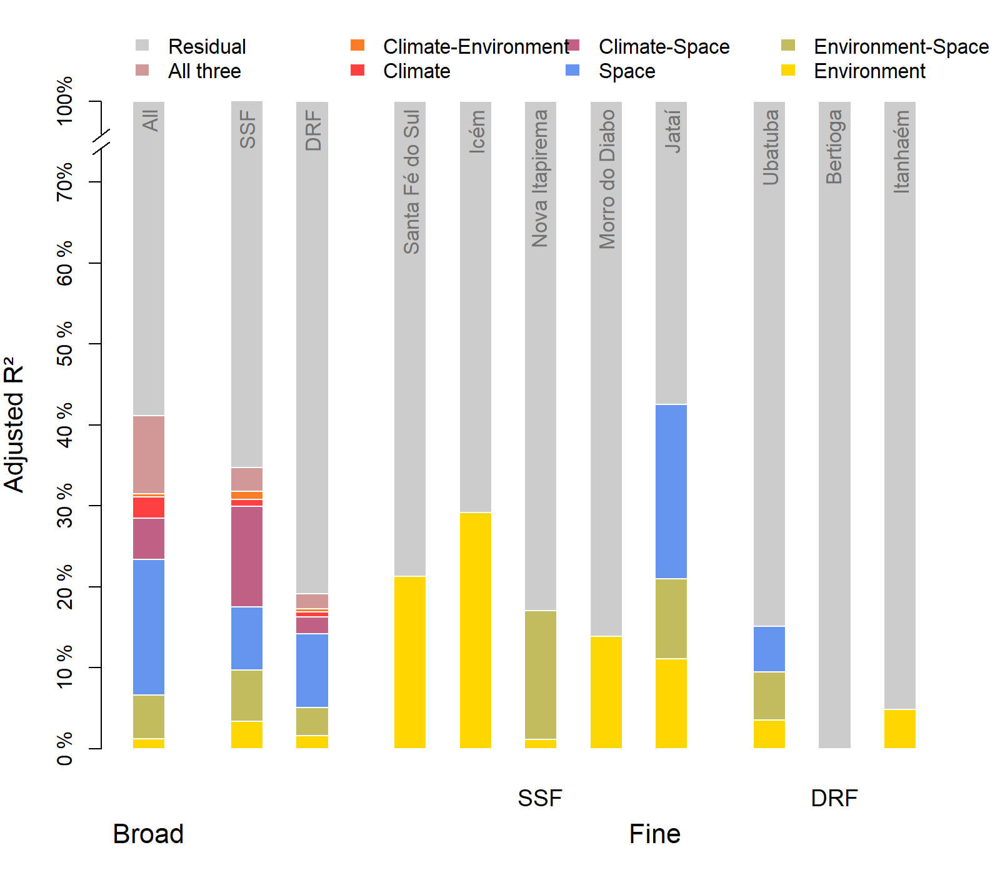

``` r
#text(c(10.5,12.5,16.5,16.5,19.5),c(0.1,0.08,0.17,0.59,0.03), labels =c("*","*","*","*","*","*"), adj = 0.5, col = "white", cex = 2)
#text(c(0.5,0.5,0.5),c(0.01,0.12,0.299), labels =c("*","*","*"), adj = 0.5, col = "white", cex = 2)
#text(c(3.5,3.5),c(0.02,0.1), labels =c("*","*","*"), adj = 0.5, col = "white", cex = 2)
#text(c(5.5,5.5),c(0.01,0.065), labels =c("*","*","*"), adj = 0.5, col = "white", cex = 2)

#text(c(0.5,0.3,0.7,0.5),c(0.24,0.35,0.35,0.035), labels =c("*","*","*","*"), adj = 0.5, col = c("brown1","brown1","gold","gold"), cex = 2)

#text(c(3.5,3.3,3.7),c(0.22,0.3075,0.3075), labels =c("*","*","*"), adj = 0.5, col = c("brown1","brown1","gold"), cex = 2)

#text(c(5.5,5.3, 5.7),c(0.115,0.145,0.145), labels =c("*","*","*"), adj = 0.5, col = c("brown1","brown1","gold"), cex = 2)


###Mudar para simbolos

#cada simbolo representa env, clim e spa
#os shared serão os simbolos de spa com cores dos outros
```

The asterisks represent significant fractions.      

Creating some new important fractions

``` r
Env_Spatially_Structured <- Varpart_plot["Env_Spa",] + Varpart_plot["Spa_Clim_Env",]
Env_Non_Spatially_Structured <- Varpart_plot["Pure_Env",] + Varpart_plot["Env_Clim",]
Clim_Spatially_Structured <- Varpart_plot["Spa_Clim",] + Varpart_plot["Spa_Clim_Env",]
Clim_Non_Spatially_Structured <- Varpart_plot["Pure_Clim",] + Varpart_plot["Env_Clim",]
Non_Spatially_Climate_Environment <- Varpart_plot["Pure_Env",] + Varpart_plot["Pure_Clim",] + Varpart_plot["Env_Clim",]
Spatially_Climate_Environment <- Varpart_plot["Spa_Clim",] + Varpart_plot["Env_Spa",] + Varpart_plot["Spa_Clim_Env",]
Total_Climate_Environment <- Spatially_Climate_Environment + Non_Spatially_Climate_Environment
#Total_Climate_Environment["Nova Itapirema"] <- 0

Varpart_plot <- rbind(Varpart_plot,
                      Env_Spatially_Structured = Env_Spatially_Structured,
                      Env_Non_Spatially_Structured = Env_Non_Spatially_Structured,
                      Clim_Spatially_Structured = Clim_Spatially_Structured,
                      Clim_Non_Spatially_Structured = Clim_Non_Spatially_Structured,
                      Non_Spatially_Climate_Environment = Non_Spatially_Climate_Environment,
                      Spatially_Climate_Environment = Spatially_Climate_Environment,
                      Total_Climate_Environment = Total_Climate_Environment)
```

Means of fractions in all extents

``` r
se <- function(x){
  sd(x)/sqrt(length(x))
}


Means_spatial_extent <- data.frame(Broad_Extent = Varpart_plot[,1],
           Intermediate_Extent = apply(Varpart_plot[,2:3],1,mean),
           Small_Extent = apply(Varpart_plot[,4:11],1,mean))

se_spatial_extent <- data.frame(Intermediate_Extent = apply(Varpart_plot[,2:3],1,se),
           Small_Extent = apply(Varpart_plot[,4:11],1,se))

se_spatial_extent_upper <- Means_spatial_extent[,2:3] + se_spatial_extent
se_spatial_extent_lower <- Means_spatial_extent[,2:3] - se_spatial_extent

Means_spatial_extent
```

    ##                                   Broad_Extent Intermediate_Extent Small_Extent
    ## All                                      0.448              0.2670     0.208125
    ## Env                                      0.261              0.1035     0.191000
    ## Clim                                     0.211              0.0655     0.000000
    ## Spa                                      0.400              0.2295     0.073750
    ## Pure_Env                                 0.031              0.0275     0.134375
    ## Pure_Clim                               -0.003              0.0065     0.000000
    ## Pure_Spa                                 0.145              0.1215     0.017125
    ## Env_Spa                                  0.061              0.0530     0.056750
    ## Env_Clim                                 0.020              0.0040     0.000000
    ## Spa_Clim                                 0.045              0.0355     0.000000
    ## Spa_Clim_Env                             0.149              0.0195     0.000000
    ## Resid                                    0.552              0.7330     0.791875
    ## Env_Spatially_Structured                 0.210              0.0725     0.056750
    ## Env_Non_Spatially_Structured             0.051              0.0315     0.134375
    ## Clim_Spatially_Structured                0.194              0.0550     0.000000
    ## Clim_Non_Spatially_Structured            0.017              0.0105     0.000000
    ## Non_Spatially_Climate_Environment        0.048              0.0380     0.134375
    ## Spatially_Climate_Environment            0.255              0.1080     0.056750
    ## Total_Climate_Environment                0.303              0.1460     0.191125

 

Means of fractions in small extent

``` r
Means_small_extent <- data.frame(SSF = apply(Varpart_plot[,4:8],1,mean),
           DRF = apply(Varpart_plot[,9:11],1,mean))

se_small_extent <- data.frame(SSF = apply(Varpart_plot[,4:8],1,se),
           DRF = apply(Varpart_plot[,9:11],1,se))

se_small_extent_upper <- Means_small_extent + se_small_extent
se_small_extent_lower <- Means_small_extent - se_small_extent

Means_small_extent
```

    ##                                      SSF        DRF
    ## All                               0.2950 0.06333333
    ## Env                               0.2790 0.04433333
    ## Clim                              0.0000 0.00000000
    ## Spa                               0.0946 0.03900000
    ## Pure_Env                          0.2004 0.02433333
    ## Pure_Clim                         0.0000 0.00000000
    ## Pure_Spa                          0.0160 0.01900000
    ## Env_Spa                           0.0788 0.02000000
    ## Env_Clim                          0.0000 0.00000000
    ## Spa_Clim                          0.0000 0.00000000
    ## Spa_Clim_Env                      0.0000 0.00000000
    ## Resid                             0.7050 0.93666667
    ## Env_Spatially_Structured          0.0788 0.02000000
    ## Env_Non_Spatially_Structured      0.2004 0.02433333
    ## Clim_Spatially_Structured         0.0000 0.00000000
    ## Clim_Non_Spatially_Structured     0.0000 0.00000000
    ## Non_Spatially_Climate_Environment 0.2004 0.02433333
    ## Spatially_Climate_Environment     0.0788 0.02000000
    ## Total_Climate_Environment         0.2792 0.04433333

 

``` r
par(mfrow = c(1,3))


barplot(as.matrix(Means_spatial_extent[c(16,15),]), axes = F, col = c("brown1",mix_color(alpha = 0.5,"brown1","grey25")), space = c(0,1,1),
        border = "white", ylim = c(0,0.4), axisnames= F, ylab = "Adjusted R²", cex.lab = 1.25, main = "Climate")
arrows(y0 = c(as.matrix(se_spatial_extent_lower[3,])),
       y1 = c(as.matrix(se_spatial_extent_upper[3,])),
       x1 = c(2.5,4.5),
       x0 = c(2.5,4.5),  code = 3, angle = 90, length = 0.1, lwd = 1)
```

    ## Warning in arrows(y0 = c(as.matrix(se_spatial_extent_lower[3, ])), y1 =
    ## c(as.matrix(se_spatial_extent_upper[3, : zero-length arrow is of indeterminate
    ## angle and so skipped

``` r
axis(2, at = c(0,0.05,0.1,0.15,0.2, 0.25,0.3,0.35,0.4), labels = c("0 %","5 %","10 %","15 %","20 %", "25 %", "30 %", "35 %", "40 %"))
axis(1,at = c(0.5,2.5,4.5),line = 0, labels =c("Broad","Intermediate","Small"), tick = F,las = 1, hadj = 0.5, cex.axis = 1.3)


barplot(as.matrix(Means_spatial_extent[c(14,13),]), axes = F, col = c("gold",mix_color(alpha = 0.5,"gold","grey25")), space = c(0,1,1),
        border = "white", ylim = c(0,0.4), axisnames= F, ylab = "Adjusted R²", cex.lab = 1.25, main = "Local Environment")
arrows(y0 = c(as.matrix(se_spatial_extent_lower[2,])),
       y1 = c(as.matrix(se_spatial_extent_upper[2,])),
       x1 = c(2.5,4.5),
       x0 = c(2.5,4.5),  code = 3, angle = 90, length = 0.1, lwd = 1)
axis(2, at = c(0,0.05,0.1,0.15,0.2, 0.25,0.3,0.35,0.4), labels = c("0 %","5 %","10 %","15 %","20 %", "25 %", "30 %", "35 %", "40 %"))
axis(1,at = c(0.5,2.5,4.5),line = 0, labels =c("Broad","Intermediate","Small"), tick = F,las = 1, hadj = 0.5, cex.axis = 1.3)


barplot(as.matrix(Means_spatial_extent[c(7,18),]), axes = F, col = c("cornflowerblue",mix_color(alpha = 0.5,"cornflowerblue","grey25")), space = c(0,1,1),
        border = "white", ylim = c(0,0.4), axisnames= F, ylab = "Adjusted R²", cex.lab = 1.25, main = "Space")
arrows(y0 = c(as.matrix(se_spatial_extent_lower[4,])),
       y1 = c(as.matrix(se_spatial_extent_upper[4,])),
       x1 = c(2.5,4.5),
       x0 = c(2.5,4.5),  code = 3, angle = 90, length = 0.1, lwd = 1)
axis(2, at = c(0,0.05,0.1,0.15,0.2, 0.25,0.3,0.35,0.4), labels = c("0 %","5 %","10 %","15 %","20 %", "25 %", "30 %", "35 %", "40 %"))
axis(1,at = c(0.5,2.5,4.5),line = 0, labels =c("Broad","Intermediate","Small"), tick = F,las = 1, hadj = 0.5, cex.axis = 1.3)
```

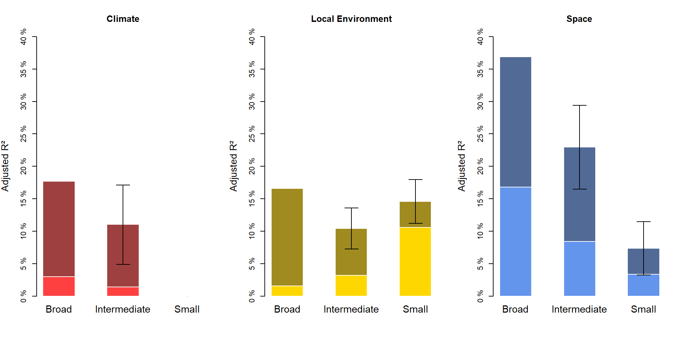

``` r
par(mfrow = c(1,3))

barplot(as.matrix(Varpart_plot[c("Clim_Non_Spatially_Structured", "Clim_Spatially_Structured"),c("SSF","DRF")]),
        axes = F, col = c("brown1",mix_color(alpha = 0.5,"brown1","grey25")), space = c(0,1,2,1),
        border = "white", ylim = c(0,0.4), axisnames= F, ylab = "Adjusted R²", cex.lab = 1.25, main = "Climate")
axis(2, at = c(0,0.05,0.1,0.15,0.2, 0.25,0.3,0.35,0.4), labels = c("0 %","5 %","10 %","15 %","20 %", "25 %", "30 %", "35 %", "40 %"))
axis(1,at = c(1.5,6.5),line = 1, labels =c("Intermediate","Small"), tick = F,las = 1, hadj = 0.5, cex.axis = 1.3)
axis(1,at = c(0.5,2.5,5.5,7.5),line = -0.5, labels =c("SSF","DRF", "SSF","DRF"), tick = F,las = 1, hadj = 0.5, cex.axis = 1.3)


barplot(as.matrix(data.frame(Varpart_plot[c("Env_Non_Spatially_Structured", "Env_Spatially_Structured"),c("SSF","DRF")],
        Means_small_extent[c("Env_Non_Spatially_Structured","Env_Spatially_Structured"),])),
        axes = F, col = c("gold",mix_color(alpha = 0.5,"gold","grey25")), space = c(0,1,2,1),
        border = "white", ylim = c(0,0.4), axisnames= F, ylab = "Adjusted R²", cex.lab = 1.25, main = "Local Environment")
arrows(y0 = c(as.matrix(se_small_extent_lower["Env",])),
       y1 = c(as.matrix(se_small_extent_upper["Env",])),
       x1 = c(5.5,7.5),
       x0 = c(5.5,7.5),  code = 3, angle = 90, length = 0.1, lwd = 1)
axis(2, at = c(0,0.05,0.1,0.15,0.2, 0.25,0.3,0.35,0.4), labels = c("0 %","5 %","10 %","15 %","20 %", "25 %", "30 %", "35 %", "40 %"))
axis(1,at = c(1.5,6.5),line = 1, labels =c("Intermediate","Small"), tick = F,las = 1, hadj = 0.5, cex.axis = 1.3)
axis(1,at = c(0.5,2.5,5.5,7.5),line = -0.5, labels =c("SSF","DRF", "SSF","DRF"), tick = F,las = 1, hadj = 0.5, cex.axis = 1.3)


barplot(as.matrix(data.frame(Varpart_plot[c("Pure_Spa", "Spatially_Climate_Environment"),c("SSF","DRF")],
  Means_small_extent[c("Pure_Spa","Spatially_Climate_Environment"),])),
  axes = F, col = c("cornflowerblue",mix_color(alpha = 0.5,"cornflowerblue","grey25")), space = c(0,1,2,1),
  border = "white", ylim = c(0,0.4), axisnames= F, ylab = "Adjusted R²", cex.lab = 1.25, main = "Space")
arrows(y0 = c(as.matrix(se_small_extent_lower["Spa",])),
       y1 = c(as.matrix(se_small_extent_upper["Spa",])),
       x1 = c(5.5,7.5),
       x0 = c(5.5,7.5),  code = 3, angle = 90, length = 0.1, lwd = 1)
axis(2, at = c(0,0.05,0.1,0.15,0.2, 0.25,0.3,0.35,0.4), labels = c("0 %","5 %","10 %","15 %","20 %", "25 %", "30 %", "35 %", "40 %"))
axis(1,at = c(1.5,6.5),line = 1, labels =c("Intermediate","Small"), tick = F,las = 1, hadj = 0.5, cex.axis = 1.3)
axis(1,at = c(0.5,2.5,5.5,7.5),line = -0.5, labels =c("SSF","DRF", "SSF","DRF"), tick = F,las = 1, hadj = 0.5, cex.axis = 1.3)
```

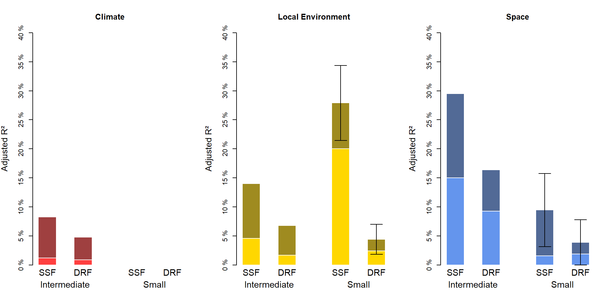

``` r
par(mfrow = c(1,3))

barplot(as.matrix(Varpart_plot[c("Clim_Non_Spatially_Structured", "Clim_Spatially_Structured"),c("Broad","SSF","DRF")]),
        axes = F, col = c("brown1",mix_color(alpha = 0.5,"brown1","grey25")), space = c(0.75,1.5,0.5,1.5,0.5),
        border = "white", ylim = c(0,0.4), axisnames= F, ylab = "Adjusted R²", cex.lab = 1.25, main = "Climate", xlim = c(0,9.75) )
```

    ## Warning in space + width: comprimento do objeto maior não é múltiplo do
    ## comprimento do objeto menor

    ## Warning in w.r - delta: comprimento do objeto maior não é múltiplo do
    ## comprimento do objeto menor

    ## Warning in w.m - delta: comprimento do objeto maior não é múltiplo do
    ## comprimento do objeto menor

    ## Warning in space + width: comprimento do objeto maior não é múltiplo do
    ## comprimento do objeto menor

    ## Warning in w.r - delta: comprimento do objeto maior não é múltiplo do
    ## comprimento do objeto menor

    ## Warning in w.m - delta: comprimento do objeto maior não é múltiplo do
    ## comprimento do objeto menor

``` r
arrows(y0 = c(as.matrix(se_small_extent_lower["Clim",])),
       y1 = c(as.matrix(se_small_extent_upper["Clim",])),
       x1 = c(7.75,9.25),
       x0 = c(7.75,9.25),  code = 3, angle = 90, length = 0.1, lwd = 1)
```

    ## Warning in arrows(y0 = c(as.matrix(se_small_extent_lower["Clim", ])),
    ## y1 = c(as.matrix(se_small_extent_upper["Clim", : zero-length arrow is of
    ## indeterminate angle and so skipped

    ## Warning in arrows(y0 = c(as.matrix(se_small_extent_lower["Clim", ])),
    ## y1 = c(as.matrix(se_small_extent_upper["Clim", : zero-length arrow is of
    ## indeterminate angle and so skipped

``` r
axis(2, at = c(0,0.05,0.1,0.15,0.2, 0.25,0.3,0.35,0.4), labels = c("0 %","5 %","10 %","15 %","20 %", "25 %", "30 %", "35 %", "40 %"))

axis(1,at = c(1.25,4.5,8.5),line = 1, labels =c("Broad","Intermediate","Small"), tick = F,las = 1, hadj = 0.5, cex.axis = 1.3, gap.axis = -1)
axis(1,at = c(3.75,5.25,7.75,9.25),line = -0.5, labels =c("SSF","DRF", "SSF","DRF"), tick = F,las = 1, hadj = 0.5, cex.axis = 1.3, gap.axis = -1)


barplot(as.matrix(data.frame(Varpart_plot[c("Env_Non_Spatially_Structured", "Env_Spatially_Structured"),c("Broad","SSF","DRF")],
        Means_small_extent[c("Env_Non_Spatially_Structured","Env_Spatially_Structured"),])),
        axes = F, col = c("gold",mix_color(alpha = 0.5,"gold","grey25")), space = c(0.75,1.5,0.5,1.5,0.5),
        border = "white", ylim = c(0,0.4), axisnames= F, ylab = "Adjusted R²", cex.lab = 1.25, main = "local Environment", xlim = c(0,9.75) )

arrows(y0 = c(as.matrix(se_small_extent_lower["Env",])),
       y1 = c(as.matrix(se_small_extent_upper["Env",])),
       x1 = c(7.75,9.25),
       x0 = c(7.75,9.25),  code = 3, angle = 90, length = 0.1, lwd = 1)

axis(2, at = c(0,0.05,0.1,0.15,0.2, 0.25,0.3,0.35,0.4), labels = c("0 %","5 %","10 %","15 %","20 %", "25 %", "30 %", "35 %", "40 %"))

axis(1,at = c(1.25,4.5,8.5),line = 1, labels =c("Broad","Intermediate","Small"), tick = F,las = 1, hadj = 0.5, cex.axis = 1.3, gap.axis = -1)
axis(1,at = c(3.75,5.25,7.75,9.25),line = -0.5, labels =c("SSF","DRF", "SSF","DRF"), tick = F,las = 1, hadj = 0.5, cex.axis = 1.3, gap.axis = -1)


barplot(as.matrix(data.frame(Varpart_plot[c("Pure_Spa", "Spatially_Climate_Environment"),c("Broad","SSF","DRF")],
        Means_small_extent[c("Pure_Spa","Spatially_Climate_Environment"),])),
        axes = F, col = c("cornflowerblue",mix_color(alpha = 0.5,"cornflowerblue","grey25")), space = c(0.75,1.5,0.5,1.5,0.5),
        border = "white", ylim = c(0,0.4), axisnames= F, ylab = "Adjusted R²", cex.lab = 1.25, main = "Space", xlim = c(0,9.75) )

arrows(y0 = c(as.matrix(se_small_extent_lower["Spa",])),
       y1 = c(as.matrix(se_small_extent_upper["Spa",])),
       x1 = c(7.75,9.25),
       x0 = c(7.75,9.25),  code = 3, angle = 90, length = 0.1, lwd = 1)

axis(2, at = c(0,0.05,0.1,0.15,0.2, 0.25,0.3,0.35,0.4), labels = c("0 %","5 %","10 %","15 %","20 %", "25 %", "30 %", "35 %", "40 %"))

axis(1,at = c(1.25,4.5,8.5),line = 1, labels =c("Broad","Intermediate","Small"), tick = F,las = 1, hadj = 0.5, cex.axis = 1.3, gap.axis = -1)
axis(1,at = c(3.75,5.25,7.75,9.25),line = -0.5, labels =c("SSF","DRF", "SSF","DRF"), tick = F,las = 1, hadj = 0.5, cex.axis = 1.3, gap.axis = -1)
```

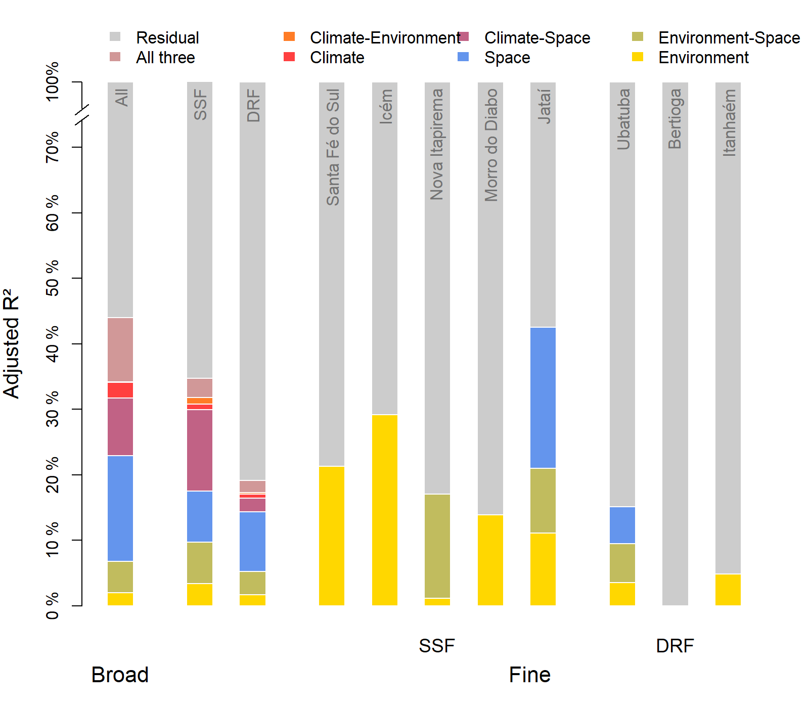
