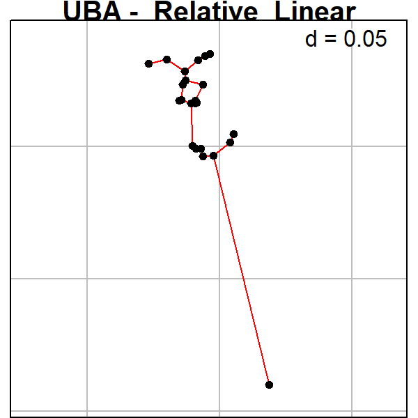
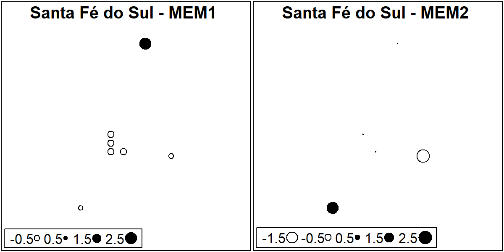
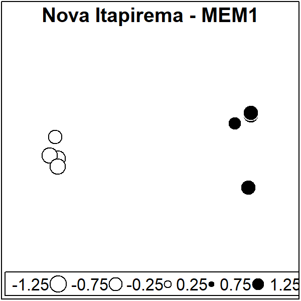
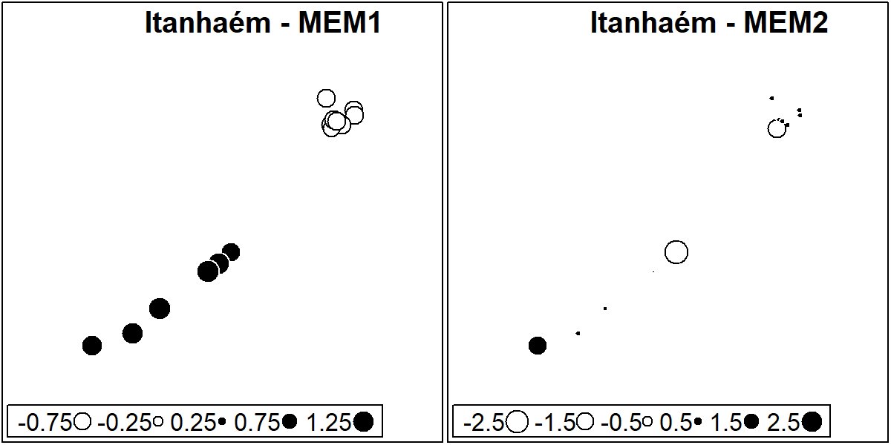
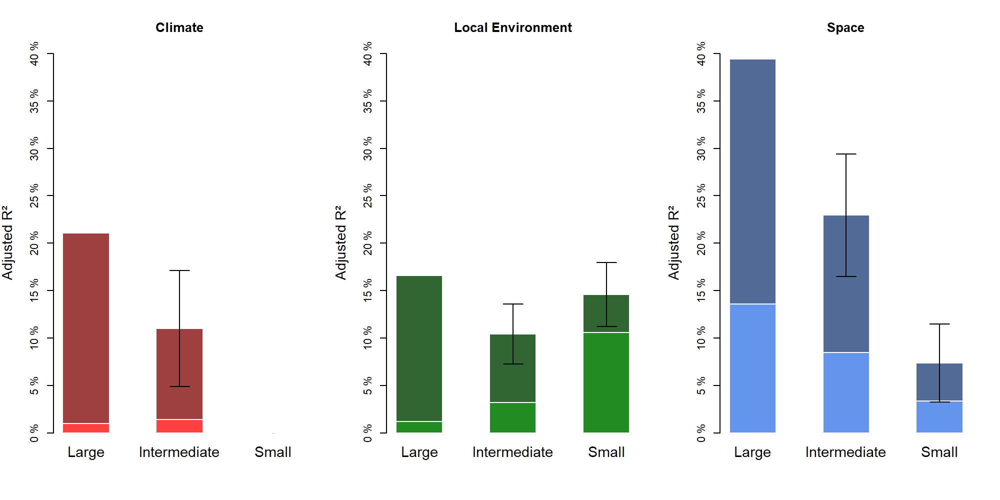
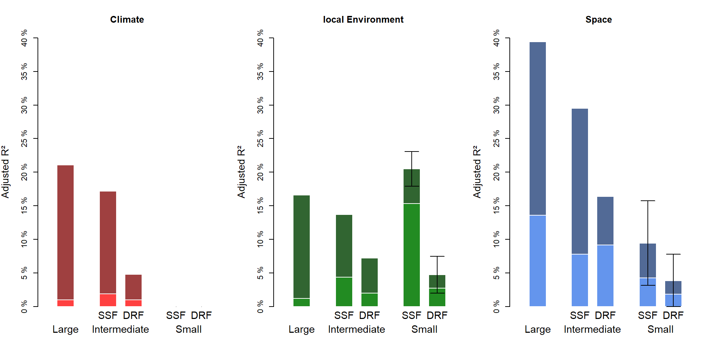

Variation Partitioning
================
Rodolfo Pelinson
07/04/2021

First we need preparare all data matrices from the main dataset. These
are prepared sourcing the “Loading\_data.R” file in the Auxiliary
Scripts folder.

``` r
library(AtlanticForestMetacommunity)
source("Loading_data.R")
```

    ## Error in get(genname, envir = envir) : 
    ##   objeto 'testthat_print' não encontrado

The used packages to run this analysis are:

`vegan` version 2.5-6  
`ade4` version 1.7-15  
`adespatial` version 0.3-8

Some packages used to generate plots and tables

`dplyr` version 0.8.5  
`plotrix` version 3.7-8

       

``` r
set.seed(5)
```

## Reducing Multicolinearity

To remove multicolinear variables from our Environmental Matrix I built
a function that removes variables with the variance inflation factor
(VIF) higher than 3. The function `VIF_selection()` simply uses the
`vif.cca()` from the `vegan` package.

``` r
Broad_env_VIF <- VIF_selection(Broad_pa,  Broad_env_st[,-7])
Broad_env_VIF$VIFs
```

    ## [[1]]
    ##    hydroperiod   canopy_cover           area          depth            nvt 
    ##       1.237565       1.488527       1.118756       1.340180       1.617198 
    ## dist_to_forest 
    ##       1.319102

``` r
SSF_env_VIF <- VIF_selection(SSF_pa,  SSF_env_st)
SSF_env_VIF$VIFs
```

    ## [[1]]
    ##    hydroperiod   canopy_cover           area          depth            nvt 
    ##       1.287250       1.293051       1.287689       1.443912       1.492950 
    ## dist_to_forest 
    ##       1.136891

``` r
ST_env_VIF <- VIF_selection(ST_pa,  ST_env_st)
ST_env_VIF$VIFs
```

    ## [[1]]
    ##    hydroperiod           area          depth            nvt dist_to_forest 
    ##      27.479904      11.917983       5.386203      20.148713       1.807948 
    ## 
    ## [[2]]
    ##           area          depth            nvt dist_to_forest 
    ##       3.533032       2.360081       2.639484       1.668725 
    ## 
    ## [[3]]
    ##          depth            nvt dist_to_forest 
    ##       1.444899       1.301229       1.367747

``` r
IC_env_VIF <- VIF_selection(IC_pa,  IC_env_st)
IC_env_VIF$VIFs
```

    ## [[1]]
    ##    hydroperiod           area          depth            nvt dist_to_forest 
    ##       5.342364       5.518649       3.465826       3.219143       3.331453 
    ## 
    ## [[2]]
    ##    hydroperiod          depth            nvt dist_to_forest 
    ##       2.895120       1.516899       1.606162       2.715728

``` r
NI_env_VIF <- VIF_selection(NI_pa,  NI_env_st)
NI_env_VIF$VIFs
```

    ## [[1]]
    ##    hydroperiod           area          depth            nvt dist_to_forest 
    ##       1.502173       4.868245       4.697667       1.834039       2.256836 
    ## 
    ## [[2]]
    ##    hydroperiod          depth            nvt dist_to_forest 
    ##       1.487856       1.157613       1.493676       1.441587

``` r
MD_env_VIF <- VIF_selection(MD_pa,  MD_env_st)
MD_env_VIF$VIFs
```

    ## [[1]]
    ##    hydroperiod   canopy_cover           area          depth            nvt 
    ##       6.123821      36.928117      15.263901       3.075865       3.436439 
    ## dist_to_forest 
    ##      43.153516 
    ## 
    ## [[2]]
    ##  hydroperiod canopy_cover         area        depth          nvt 
    ##     3.843659     1.637214     5.706331     2.499002     3.434896 
    ## 
    ## [[3]]
    ##  hydroperiod canopy_cover        depth          nvt 
    ##     1.770317     1.410612     1.879809     1.508743

``` r
JA_env_VIF <- VIF_selection(JA_pa,  JA_env_st)
JA_env_VIF$VIFs
```

    ## [[1]]
    ##    hydroperiod   canopy_cover           area          depth            nvt 
    ##      14.962311       7.691347       3.081842       5.988699       3.453394 
    ## dist_to_forest 
    ##      12.622399 
    ## 
    ## [[2]]
    ##   canopy_cover           area          depth            nvt dist_to_forest 
    ##       6.871158       1.961897       4.322304       3.356278       7.533870 
    ## 
    ## [[3]]
    ## canopy_cover         area        depth          nvt 
    ##     2.081341     1.450483     2.089961     2.864143

``` r
DRF_env_VIF <- VIF_selection(DRF_pa,  DRF_env_st)
DRF_env_VIF$VIFs
```

    ## [[1]]
    ##    hydroperiod   canopy_cover           area          depth            nvt 
    ##       1.338500       1.272615       1.296349       1.356465       1.048673 
    ## dist_to_forest 
    ##       1.368314

``` r
UBA_env_VIF <- VIF_selection(UBA_pa,  UBA_env_st)
UBA_env_VIF$VIFs
```

    ## [[1]]
    ##    hydroperiod   canopy_cover           area          depth dist_to_forest 
    ##       1.436660       1.459906       7.001901       1.750901       6.699443 
    ## 
    ## [[2]]
    ##    hydroperiod   canopy_cover          depth dist_to_forest 
    ##       1.341421       1.415973       1.599294       1.643447

``` r
BER_env_VIF <- VIF_selection(BER_pa,  BER_env_st)
BER_env_VIF$VIFs
```

    ## [[1]]
    ##    hydroperiod   canopy_cover           area          depth dist_to_forest 
    ##       3.117432       1.663244       8.428997       2.304574       7.972957 
    ## 
    ## [[2]]
    ##    hydroperiod   canopy_cover          depth dist_to_forest 
    ##       2.192425       1.561949       2.253493       4.070420 
    ## 
    ## [[3]]
    ##  hydroperiod canopy_cover        depth 
    ##     1.541888     1.384145     1.154773

``` r
ITA_env_VIF <- VIF_selection(ITA_pa,  ITA_env_st)
ITA_env_VIF$VIFs
```

    ## [[1]]
    ##  hydroperiod canopy_cover         area        depth          nvt 
    ##     2.342853     1.828709     1.671319     1.996469     1.458903

   

Same thing for climate variables

``` r
Broad_clim_VIF <- VIF_selection(Broad_pa,  Broad_clim_st[,-6])
Broad_clim_VIF$VIFs
```

    ## [[1]]
    ## temp_Season  range_temp  total_prec prec_season 
    ##    16.70111    11.16256    38.16025    37.55883 
    ## 
    ## [[2]]
    ## temp_Season  range_temp prec_season 
    ##    3.005540    2.148041    4.835358 
    ## 
    ## [[3]]
    ## temp_Season  range_temp 
    ##    1.168582    1.168582

``` r
SSF_clim_VIF <- VIF_selection(SSF_pa,  SSF_clim_st)
SSF_clim_VIF$VIFs
```

    ## [[1]]
    ## temp_Season  range_temp  total_prec prec_season 
    ##   44.759191    5.971934    3.197284   52.382832 
    ## 
    ## [[2]]
    ## temp_Season  range_temp  total_prec 
    ##    2.026442    4.722364    3.061846 
    ## 
    ## [[3]]
    ## temp_Season  total_prec 
    ##    1.157234    1.157234

``` r
DRF_clim_VIF <- VIF_selection(DRF_pa,  DRF_clim_st)
DRF_clim_VIF$VIFs
```

    ## [[1]]
    ## temp_Season  range_temp  total_prec prec_season 
    ##    6.561095    3.339104   12.024627    6.439093 
    ## 
    ## [[2]]
    ## temp_Season  range_temp prec_season 
    ##    1.895339    2.812287    2.295711

   

## Spatial Variables

Constructing matrices of spatial filters

``` r
set.seed(3, sample.kind = "default")

candidates_Broad <- listw.candidates(Broad_coord, style = "B", nb = c("del", "gab", "rel", "pcnm"),
                                   weights = c("flin", "fup"), y_fdown = 5, y_fup = 0.5)
```

    ## 
    ##      PLEASE NOTE:  The components "delsgs" and "summary" of the
    ##  object returned by deldir() are now DATA FRAMES rather than
    ##  matrices (as they were prior to release 0.0-18).
    ##  See help("deldir").
    ##  
    ##      PLEASE NOTE: The process that deldir() uses for determining
    ##  duplicated points has changed from that used in version
    ##  0.0-9 of this package (and previously). See help("deldir").

``` r
Broad_MEM <- listw.select(Broad_pa, candidates = candidates_Broad, MEM.autocor = c("positive"), method = c("FWD"),
             MEM.all = FALSE, nperm = 10000, nperm.global = 10000, alpha = 0.05, p.adjust = TRUE, verbose = FALSE)
```

    ## Procedure stopped (alpha criteria): pvalue for variable 5 is 0.286871 (> 0.050000)
    ## Procedure stopped (alpha criteria): pvalue for variable 12 is 0.066193 (> 0.050000)
    ## Procedure stopped (adjR2thresh criteria) adjR2cum = 0.395438 with 22 variables (> 0.393805)
    ## Procedure stopped (alpha criteria): pvalue for variable 16 is 0.072993 (> 0.050000)
    ## Procedure stopped (adjR2thresh criteria) adjR2cum = 0.399941 with 31 variables (> 0.398728)
    ## Procedure stopped (alpha criteria): pvalue for variable 18 is 0.051195 (> 0.050000)
    ## Procedure stopped (adjR2thresh criteria) adjR2cum = 0.371382 with 23 variables (> 0.369036)

``` r
Broad_MEM_FS <- Broad_MEM$best$MEM.select

adegraphics::s.label(Broad_coord, nb = candidates_Broad[[Broad_MEM$best.id]],
                     pnb.edge.col = "red", main = paste("Broad - ",names(Broad_MEM$best.id)), plot = TRUE, labels = NULL)
```


``` r
################################################################################


candidates_DRF <- listw.candidates(DRF_coord, style = "B", nb = c("del", "gab", "rel", "pcnm"),
                                   weights = c("flin", "fup"), y_fdown = 5, y_fup = 0.25)

DRF_MEM <- listw.select(DRF_pa, candidates = candidates_DRF, MEM.autocor = c("positive"), method = c("FWD"),
             MEM.all = FALSE, nperm = 10000, nperm.global = 10000, alpha = 0.05, p.adjust = TRUE, verbose = FALSE)
```

    ## Procedure stopped (alpha criteria): pvalue for variable 8 is 0.083192 (> 0.050000)
    ## Procedure stopped (alpha criteria): pvalue for variable 8 is 0.108089 (> 0.050000)

``` r
DRF_MEM_FS <- DRF_MEM$best$MEM.select


adegraphics::s.label(DRF_coord, nb = candidates_DRF[[DRF_MEM$best.id]],
                     pnb.edge.col = "red", main = paste("DRF - ",names(DRF_MEM$best.id)), plot = TRUE, labels = NULL)
```


``` r
################################################################################


candidates_SSF <- listw.candidates(SSF_coord, style = "B", nb = c("del", "gab", "rel", "pcnm"),
                                   weights = c("flin", "fup"), y_fdown = 5, y_fup = 0.25)

SSF_MEM <- listw.select(SSF_pa, candidates = candidates_SSF, MEM.autocor = c("positive"), method = c("FWD"),
             MEM.all = FALSE, nperm = 10000, nperm.global = 10000, alpha = 0.05, p.adjust = TRUE, verbose = FALSE)
```

    ## Procedure stopped (adjR2thresh criteria) adjR2cum = 0.079183 with 2 variables (> 0.079183)
    ## Procedure stopped (alpha criteria): pvalue for variable 7 is 0.082992 (> 0.050000)
    ## Procedure stopped (adjR2thresh criteria) adjR2cum = 0.304147 with 9 variables (> 0.302779)
    ## Procedure stopped (alpha criteria): pvalue for variable 7 is 0.071493 (> 0.050000)
    ## Procedure stopped (alpha criteria): pvalue for variable 8 is 0.068893 (> 0.050000)
    ## Procedure stopped (alpha criteria): pvalue for variable 9 is 0.071693 (> 0.050000)
    ## Procedure stopped (alpha criteria): pvalue for variable 10 is 0.056094 (> 0.050000)

``` r
SSF_MEM_FS <- SSF_MEM$best$MEM.select


adegraphics::s.label(SSF_coord, nb = candidates_SSF[[SSF_MEM$best.id]],
                     pnb.edge.col = "red", main = paste("SSF - ",names(SSF_MEM$best.id)), plot = TRUE, labels = NULL)
```


``` r
################################################################################


#We restricted our options for optimization because of the low statistical power (low replication) that we had at our small spatial scale. We only used linear weights as we do not believe that a exponential decay would make sense at this scale (even relative large distances between sites are actually small). Also We restricted our graph conectivity matrix to only three that yields relatively different scenarios of conectance. Those are the Delauney triangulation, the Relative neighbour and the PCNM

################################################################################


candidates_ITA <- listw.candidates(ITA_coord, style = "B", nb = c("del", "rel", "pcnm"),
                                   weights = c("flin"))

ITA_MEM <- listw.select(ITA_pa, candidates = candidates_ITA, MEM.autocor = c("positive"), method = c("FWD"),
             MEM.all = FALSE, nperm = 10000, nperm.global = 10000, alpha = 0.05, p.adjust = TRUE, verbose = FALSE)


ITA_MEM_FS <- dbmem(ITA_coord, MEM.autocor = c("positive"), silent = TRUE)
################################################################################


candidates_BER <- listw.candidates(BER_coord, style = "B", nb = c("del", "rel", "pcnm"),
                                   weights = c("flin"))

BER_MEM <- listw.select(BER_pa, candidates = candidates_BER, MEM.autocor = c("positive"), method = c("FWD"),
             MEM.all = FALSE, nperm = 10000, nperm.global = 10000, alpha = 0.05, p.adjust = TRUE, verbose = FALSE)

BER_MEM_FS <- dbmem(BER_coord, MEM.autocor = c("positive"), silent = TRUE)
################################################################################

set.seed(2)
candidates_UBA <- listw.candidates(UBA_coord, style = "B", nb = c("del", "rel", "pcnm"),
                                   weights = c("flin"))
```

    ## Warning in nb2listw(nb.object, style = style, glist = lapply(nb.dist, f1, : zero
    ## sum general weights

``` r
UBA_MEM <- listw.select(UBA_pa, candidates = candidates_UBA, MEM.autocor = c("positive"), method = c("FWD"),
             MEM.all = FALSE, nperm = 10000, nperm.global = 10000, alpha = 0.05, p.adjust = TRUE, verbose = FALSE)
```

    ## Procedure stopped (alpha criteria): pvalue for variable 3 is 0.089791 (> 0.050000)

``` r
UBA_MEM_FS <- UBA_MEM$best$MEM.select

adegraphics::s.label(UBA_coord, nb = candidates_UBA[[UBA_MEM$best.id]],
                     pnb.edge.col = "red", main = paste("UBA - ",names(UBA_MEM$best.id)), plot = TRUE, labels = NULL)
```



``` r
################################################################################


candidates_ST <- listw.candidates(ST_coord, style = "B", nb = c("del", "rel", "pcnm"),
                                   weights = c("flin"))
```

    ## Warning in nb2listw(nb.object, style = style, glist = lapply(nb.dist, f1, : zero
    ## sum general weights

``` r
ST_MEM <- listw.select(ST_pa, candidates = candidates_ST, MEM.autocor = c("positive"), method = c("FWD"),
             MEM.all = FALSE, nperm = 10000, nperm.global = 10000, alpha = 0.05, p.adjust = TRUE, verbose = FALSE)

ST_MEM_FS <- dbmem(ST_coord, MEM.autocor = c("positive"), silent = TRUE)

################################################################################


candidates_IC <- listw.candidates(IC_coord, style = "B", nb = c("del", "rel", "pcnm"),
                                   weights = c("flin"))

IC_MEM <- listw.select(IC_pa, candidates = candidates_IC, MEM.autocor = c("positive"), method = c("FWD"),
             MEM.all = FALSE, nperm = 10000, nperm.global = 10000, alpha = 0.05, p.adjust = TRUE, verbose = FALSE)

IC_MEM_FS <- dbmem(IC_coord, MEM.autocor = c("positive"), silent = TRUE)

################################################################################

set.seed(5)
candidates_NI <- listw.candidates(NI_coord, style = "B", nb = c("del", "rel", "pcnm"),
                                   weights = c("flin"))

NI_MEM <- listw.select(NI_pa, candidates = candidates_NI, MEM.autocor = c("positive"), method = c("FWD"),
             MEM.all = FALSE, nperm = 10000, nperm.global = 10000, alpha = 0.05, p.adjust = TRUE, verbose = FALSE)

NI_MEM_FS <- NI_MEM$best$MEM.select

adegraphics::s.label(NI_coord, nb = candidates_NI[[NI_MEM$best.id]],
                     pnb.edge.col = "red", main = paste("NI - ",names(NI_MEM$best.id)), plot = TRUE, labels = NULL)
```


``` r
################################################################################

candidates_MD <- listw.candidates(MD_coord, style = "B", nb = c("del", "rel", "pcnm"),
                                   weights = c("flin"))

MD_MEM <- listw.select(MD_pa, candidates = candidates_MD, MEM.autocor = c("positive"), method = c("FWD"),
             MEM.all = FALSE, nperm = 10000, nperm.global = 10000, alpha = 0.05, p.adjust = TRUE, verbose = FALSE)

MD_MEM_FS <- dbmem(MD_coord, MEM.autocor = c("positive"), silent = TRUE)

################################################################################


candidates_JA <- listw.candidates(JA_coord, style = "B", nb = c("del", "rel", "pcnm"),
                                   weights = c("flin"))

JA_MEM <- listw.select(JA_pa, candidates = candidates_JA, MEM.autocor = c("positive"), method = c("FWD"),
             MEM.all = FALSE, nperm = 10000, nperm.global = 10000, alpha = 0.05, p.adjust = TRUE, verbose = FALSE)
```

    ## Procedure stopped (alpha criteria): pvalue for variable 2 is 0.084692 (> 0.050000)
    ## Procedure stopped (alpha criteria): pvalue for variable 3 is 0.104390 (> 0.050000)

``` r
JA_MEM_FS <- JA_MEM$best$MEM.select


adegraphics::s.label(JA_coord, nb = candidates_JA[[JA_MEM$best.id]],
                     pnb.edge.col = "red", main = paste("JA - ",names(JA_MEM$best.id)), plot = TRUE, labels = NULL)
```


``` r
################################################################################
```

``` r
###PLOTING WEIGHTS ####
nb <- chooseCN(coordinates(UBA_coord), type = 1, plot.nb = FALSE)

#Delaunay triangulation (type 1)
#Gabriel graph (type 2)
#Relative neighbours (type 3)
#Minimum spanning tree (type 4)
#Neighbourhood by distance (type 5)
#K nearests neighbours (type 6)
#Inverse distances (type 7)

dist_UBA <- dist(UBA_coord)

distnb <- spdep::nbdists(nb, as.matrix(UBA_coord))

a_fdown <- 5
a_f_up <- 0.5

fdist <- lapply(distnb, function(x) 1 - x/max(dist_UBA)) #linear
fdist <- lapply(distnb, function(x) 1 - (x/max(dist_UBA))^a_fdown) #fdown
fdist <- lapply(distnb, function(x) 1 / x^a_f_up) #fup
    
lw <- nb2listw(nb, style = 'B', zero.policy = TRUE, glist = fdist) 

m1 <- as.matrix(dist_UBA)
m2 <- spdep::listw2mat(lw)

plot(m1[!diag(ncol(m1))], m2[!diag(ncol(m2))], pch = 20, xlab = "distance", ylab = "spatial weights")
################
```

       

## Forward Selection

Similarly to removing variables with VIF higher than 3, I built a
function to select the most important variables, when they could
significantly explain species occurrences. This function mostly rely on
the function `fs()` from package `adespatial`. Forward selection is only
performed when the whole predictor matrix can significantly explain (p
\< 0.05) the variation in species occurrences.

### Broad Spatial Extent

``` r
set.seed(5)
Broad_env_Forward <- forward_selection(Broad_pa, Broad_env_VIF$variables)
```

    ## Testing variable 1
    ## Testing variable 2
    ## Testing variable 3
    ## Testing variable 4
    ## Testing variable 5
    ## Procedure stopped (adjR2thresh criteria) adjR2cum = 0.176872 with 5 variables (> 0.175018)

``` r
Broad_env_Forward$forward_results
```

    ##        variables order         R2     R2Cum  AdjR2Cum         F pvalue
    ## 1            nvt     5 0.12280383 0.1228038 0.1134720 13.159611 0.0001
    ## 2 dist_to_forest     6 0.03553797 0.1583418 0.1402416  3.926809 0.0001
    ## 3   canopy_cover     2 0.02254986 0.1808917 0.1541816  2.532738 0.0018
    ## 4    hydroperiod     1 0.02048938 0.2013810 0.1662769  2.334697 0.0066

``` r
Broad_env_FS <- Broad_env_Forward$selected_variables

Broad_clim_Forward <- forward_selection(Broad_pa, Broad_clim_VIF$variables)
```

    ## Testing variable 1
    ## Testing variable 2

``` r
Broad_clim_Forward$forward_results
```

    ##     variables order         R2     R2Cum  AdjR2Cum         F pvalue
    ## 1  range_temp     2 0.18651094 0.1865109 0.1778568 21.551646  1e-04
    ## 2 temp_Season     1 0.04168414 0.2281951 0.2115971  5.022804  1e-04

``` r
Broad_clim_FS <- Broad_clim_Forward$selected_variables

#_______________________________________________________________
SSF_env_Forward <- forward_selection(SSF_pa, SSF_env_VIF$variables)
```

    ## Testing variable 1
    ## Testing variable 2
    ## Testing variable 3
    ## Testing variable 4
    ## Testing variable 5
    ## Procedure stopped (alpha criteria): pvalue for variable 5 is 0.120800 (> 0.050000)

``` r
SSF_env_Forward$forward_results
```

    ##        variables order         R2      R2Cum   AdjR2Cum        F pvalue
    ## 1 dist_to_forest     6 0.06279225 0.06279225 0.04149207 2.947968 0.0013
    ## 2    hydroperiod     1 0.05740783 0.12020008 0.07927915 2.805793 0.0017
    ## 3          depth     4 0.05098863 0.17118871 0.11198790 2.583848 0.0030
    ## 4   canopy_cover     2 0.04138347 0.21257218 0.13574995 2.154765 0.0128

``` r
SSF_env_FS <- SSF_env_Forward$selected_variables

SSF_clim_Forward <- forward_selection(SSF_pa, SSF_clim_VIF$variables)
```

    ## Testing variable 1
    ## Testing variable 2

``` r
SSF_clim_Forward$forward_results
```

    ##     variables order        R2     R2Cum   AdjR2Cum        F pvalue
    ## 1  total_prec     2 0.1030335 0.1030335 0.08264788 5.054228  1e-04
    ## 2 temp_Season     1 0.1050119 0.2080454 0.17121029 5.701730  1e-04

``` r
SSF_clim_FS <- SSF_clim_Forward$selected_variables

#_______________________________________________________________
ST_env_Forward <- forward_selection(ST_pa, ST_env_VIF$variables)
```

    ## Forward selection NOT performed. p > 0.05

``` r
ST_env_Forward$forward_results
```

    ## Permutation test for rda under reduced model
    ## Permutation: free
    ## Number of permutations: 9999
    ## 
    ## Model: rda(X = New_Y, Y = New_X)
    ##          Df Variance     F Pr(>F)  
    ## Model     3   1.5233 1.632 0.0992 .
    ## Residual  4   1.2446               
    ## ---
    ## Signif. codes:  0 '***' 0.001 '**' 0.01 '*' 0.05 '.' 0.1 ' ' 1

``` r
ST_env_FS <- ST_env_Forward$selected_variables

IC_env_Forward <- forward_selection(IC_pa, IC_env_VIF$variables)
```

    ## Testing variable 1
    ## Testing variable 2
    ## Testing variable 3
    ## Procedure stopped (alpha criteria): pvalue for variable 3 is 0.419400 (> 0.050000)

``` r
IC_env_Forward$forward_results
```

    ##        variables order        R2     R2Cum  AdjR2Cum        F pvalue
    ## 1 dist_to_forest     4 0.2762401 0.2762401 0.2038641 3.816737 0.0013
    ## 2    hydroperiod     1 0.1448824 0.4211225 0.2924830 2.252534 0.0107

``` r
IC_env_FS <- IC_env_Forward$selected_variables

NI_env_Forward <- forward_selection(NI_pa, NI_env_VIF$variables)
```

    ## Forward selection NOT performed. p > 0.05

``` r
NI_env_Forward$forward_results
```

    ## Permutation test for rda under reduced model
    ## Permutation: free
    ## Number of permutations: 9999
    ## 
    ## Model: rda(X = New_Y, Y = New_X)
    ##          Df Variance      F Pr(>F)
    ## Model     4   2.2203 1.3581 0.1531
    ## Residual  3   1.2261

``` r
NI_env_FS <- NI_env_Forward$selected_variables

MD_env_Forward <- forward_selection(MD_pa, MD_env_VIF$variables)
```

    ## Forward selection NOT performed. p > 0.05

``` r
MD_env_Forward$forward_results
```

    ## Permutation test for rda under reduced model
    ## Permutation: free
    ## Number of permutations: 9999
    ## 
    ## Model: rda(X = New_Y, Y = New_X)
    ##          Df Variance      F Pr(>F)
    ## Model     4   1.9377 1.2819 0.2587
    ## Residual  3   1.1337

``` r
MD_env_FS <- MD_env_Forward$selected_variables

JA_env_Forward <- forward_selection(JA_pa, JA_env_VIF$variables)
```

    ## Testing variable 1
    ## Testing variable 2
    ## Procedure stopped (alpha criteria): pvalue for variable 2 is 0.058700 (> 0.050000)

``` r
JA_env_Forward$forward_results
```

    ##   variables order        R2     R2Cum  AdjR2Cum        F pvalue
    ## 1     depth     3 0.2978698 0.2978698 0.2101035 3.393898 0.0028

``` r
JA_env_FS <- JA_env_Forward$selected_variables

#______________________________________________________________
DRF_env_Forward <- forward_selection(DRF_pa, DRF_env_VIF$variables)
```

    ## Testing variable 1
    ## Testing variable 2
    ## Testing variable 3
    ## Procedure stopped (adjR2thresh criteria) adjR2cum = 0.082422 with 3 variables (> 0.081064)

``` r
DRF_env_Forward$forward_results
```

    ##      variables order         R2      R2Cum   AdjR2Cum        F pvalue
    ## 1 canopy_cover     2 0.06947213 0.06947213 0.05008614 3.583624 0.0005
    ## 2        depth     4 0.04152619 0.11099833 0.07316847 2.195419 0.0220

``` r
DRF_env_FS <- DRF_env_Forward$selected_variables

DRF_clim_Forward <- forward_selection(DRF_pa, DRF_clim_VIF$variables)
```

    ## Testing variable 1
    ## Testing variable 2
    ## Procedure stopped (adjR2thresh criteria) adjR2cum = 0.059316 with 2 variables (> 0.055078)

``` r
DRF_clim_Forward$forward_results
```

    ##    variables order         R2      R2Cum   AdjR2Cum        F pvalue
    ## 1 range_temp     2 0.06823593 0.06823593 0.04882418 3.515187  2e-04

``` r
DRF_clim_FS <- DRF_clim_Forward$selected_variables

#______________________________________________________________
UBA_env_Forward <- forward_selection(UBA_pa, UBA_env_VIF$variables)
```

    ## Testing variable 1
    ## Testing variable 2
    ## Procedure stopped (alpha criteria): pvalue for variable 2 is 0.263700 (> 0.050000)

``` r
UBA_env_Forward$forward_results
```

    ##      variables order        R2     R2Cum   AdjR2Cum        F pvalue
    ## 1 canopy_cover     2 0.1360444 0.1360444 0.09490361 3.306803 0.0012

``` r
UBA_env_FS <- UBA_env_Forward$selected_variables

BER_env_Forward <- forward_selection(BER_pa, BER_env_VIF$variables)
```

    ## Forward selection NOT performed. p > 0.05

``` r
BER_env_Forward$forward_results
```

    ## Permutation test for rda under reduced model
    ## Permutation: free
    ## Number of permutations: 9999
    ## 
    ## Model: rda(X = New_Y, Y = New_X)
    ##          Df Variance      F Pr(>F)
    ## Model     3  0.61185 0.8438 0.6915
    ## Residual  8  1.93360

``` r
BER_env_FS <- BER_env_Forward$selected_variables

ITA_env_Forward <- forward_selection(ITA_pa, ITA_env_VIF$variables)
```

    ## Forward selection NOT performed. p > 0.05

``` r
ITA_env_Forward$forward_results
```

    ## Permutation test for rda under reduced model
    ## Permutation: free
    ## Number of permutations: 9999
    ## 
    ## Model: rda(X = New_Y, Y = New_X)
    ##          Df Variance      F Pr(>F)
    ## Model     5   1.0943 1.1421 0.3235
    ## Residual  9   1.7247

``` r
ITA_env_FS <- ITA_env_Forward$selected_variables
```

We can plot the important spatial variables to better understand what
spatial patterns they describe.

We are only going to plot the four most important ones

``` r
par(mfrow = c(2,2))

ylim <- c(min(Broad_coord[,"lat"])*1.005, max(Broad_coord[,"lat"])*0.995)
xlim <- c(min(Broad_coord[,"long"])*1.005, max(Broad_coord[,"long"])*0.995)

sr_value(Broad_coord, data.frame(Broad_MEM$best$MEM.select)[,1], ylim = ylim, xlim = xlim, grid=F, csize = 0.8, clegend = 1, xax = 2, yax = 1, method = "bubble")
title(main = paste("LARGE SCALE", colnames(data.frame(Broad_MEM$best$MEM.select))[1]), line = 3, outer = F, adj = 1)

sr_value(Broad_coord, data.frame(Broad_MEM$best$MEM.select)[,2], ylim = ylim, xlim = xlim, grid=F, csize = 0.8, clegend = 1, xax = 2, yax = 1, method = "bubble")
title(main = paste("LARGE SCALE", colnames(data.frame(Broad_MEM$best$MEM.select))[2]), line = 3, outer = F, adj = 1)

sr_value(Broad_coord, data.frame(Broad_MEM$best$MEM.select)[,3], ylim = ylim, xlim = xlim, grid=F, csize = 0.8, clegend = 1, xax = 2, yax = 1, method = "bubble")
title(main = paste("LARGE SCALE", colnames(data.frame(Broad_MEM$best$MEM.select))[3]), line = 3, outer = F, adj = 1)

sr_value(Broad_coord, data.frame(Broad_MEM$best$MEM.select)[,4], ylim = ylim, xlim = xlim, grid=F, csize = 0.8, clegend = 1, xax = 2, yax = 1, method = "bubble")
title(main = paste("LARGE SCALE", colnames(data.frame(Broad_MEM$best$MEM.select))[4]), line = 3, outer = F, adj = 1)
```


       

Intermediate Scale SSF.

``` r
par(mfrow = c(2,2))

ylim <- c(min(SSF_coord[,"lat"])*1.005, max(SSF_coord[,"lat"])*0.995)
xlim <- c(min(SSF_coord[,"long"])*1.005, max(SSF_coord[,"long"])*0.995)

sr_value(SSF_coord, data.frame(SSF_MEM$best$MEM.select)[,1], ylim = ylim, xlim = xlim, grid=F, csize = 0.8, clegend = 1, xax = 2, yax = 1, method = "bubble")
title(main = paste("SSF", colnames(data.frame(SSF_MEM$best$MEM.select))[1]), line = 3, outer = F, adj = 1)

sr_value(SSF_coord, data.frame(SSF_MEM$best$MEM.select)[,2], ylim = ylim, xlim = xlim, grid=F, csize = 0.8, clegend = 1, xax = 2, yax = 1, method = "bubble")
title(main = paste("SSF", colnames(data.frame(SSF_MEM$best$MEM.select))[2]), line = 3, outer = F, adj = 1)

sr_value(SSF_coord, data.frame(SSF_MEM$best$MEM.select)[,3], ylim = ylim, xlim = xlim, grid=F, csize = 0.8, clegend = 1, xax = 2, yax = 1, method = "bubble")
title(main = paste("SSF", colnames(data.frame(SSF_MEM$best$MEM.select))[3]), line = 3, outer = F, adj = 1)

sr_value(SSF_coord, data.frame(SSF_MEM$best$MEM.select)[,4], ylim = ylim, xlim = xlim, grid=F, csize = 0.8, clegend = 1, xax = 2, yax = 1, method = "bubble")
title(main = paste("SSF", colnames(data.frame(SSF_MEM$best$MEM.select))[4]), line = 3, outer = F, adj = 1)
```


       

Intermediate Scale DRF.

``` r
par(mfrow = c(2,2))

ylim <- c(min(DRF_coord[,"lat"])*1.005, max(DRF_coord[,"lat"])*0.995)
xlim <- c(min(DRF_coord[,"long"])*1.005, max(DRF_coord[,"long"])*0.995)

sr_value(DRF_coord, data.frame(DRF_MEM$best$MEM.select)[,1], ylim = ylim, xlim = xlim, grid=F, csize = 0.8, clegend = 1, xax = 2, yax = 1, method = "bubble")
title(main = paste("DRF", colnames(data.frame(DRF_MEM$best$MEM.select))[1]), line = 3, outer = F, adj = 1)

sr_value(DRF_coord, data.frame(DRF_MEM$best$MEM.select)[,2], ylim = ylim, xlim = xlim, grid=F, csize = 0.8, clegend = 1, xax = 2, yax = 1, method = "bubble")
title(main = paste("DRF", colnames(data.frame(DRF_MEM$best$MEM.select))[2]), line = 3, outer = F, adj = 1)

sr_value(DRF_coord, data.frame(DRF_MEM$best$MEM.select)[,3], ylim = ylim, xlim = xlim, grid=F, csize = 0.8, clegend = 1, xax = 2, yax = 1, method = "bubble")
title(main = paste("DRF", colnames(data.frame(DRF_MEM$best$MEM.select))[3]), line = 3, outer = F, adj = 1)

sr_value(DRF_coord, data.frame(DRF_MEM$best$MEM.select)[,4], ylim = ylim, xlim = xlim, grid=F, csize = 0.8, clegend = 1, xax = 2, yax = 1, method = "bubble")
title(main = paste("DRF", colnames(data.frame(DRF_MEM$best$MEM.select))[4]), line = 3, outer = F, adj = 1)
```


       

Small Extent SSF - Santa Fé do Sul

``` r
par(mfrow = c(1,2))

ylim <- c(min(ST_coord[,"lat"])*1.0001, max(ST_coord[,"lat"])*0.9999)
xlim <- c(min(ST_coord[,"long"])*1.0001, max(ST_coord[,"long"])*0.9999)

sr_value(ST_coord, ST_MEM_FS[,1], ylim = ylim, xlim = xlim, grid=F, csize = 0.8, clegend = 1, xax = 2, yax = 1, method = "bubble")
title(main = paste("Santa Fé do Sul -", colnames(ST_MEM_FS)[1]), line = 3, outer = F, adj = 1)

sr_value(ST_coord, ST_MEM_FS[,2], ylim = ylim, xlim = xlim, grid=F, csize = 0.8, clegend = 1, xax = 2, yax = 1, method = "bubble")
title(main = paste("Santa Fé do Sul -", colnames(ST_MEM_FS)[2]), line = 3, outer = F, adj = 1)
```



Small Extent SSF - Icém

``` r
par(mfrow = c(1,2))

ylim <- c(min(IC_coord[,"lat"])*1.0001, max(IC_coord[,"lat"])*0.9999)
xlim <- c(min(IC_coord[,"long"])*1.0001, max(IC_coord[,"long"])*0.9999)

sr_value(IC_coord, IC_MEM_FS[,1], ylim = ylim, xlim = xlim, grid=F, csize = 0.8, clegend = 1, xax = 2, yax = 1, method = "bubble")
title(main = paste("Icém -", colnames(IC_MEM_FS)[1]), line = 3, outer = F, adj = 1)

sr_value(IC_coord, IC_MEM_FS[,2], ylim = ylim, xlim = xlim, grid=F, csize = 0.8, clegend = 1, xax = 2, yax = 1, method = "bubble")
title(main = paste("Icém -", colnames(IC_MEM_FS)[2]), line = 3, outer = F, adj = 1)
```


Small Extent SSF - Nova Itapirema.

``` r
par(mfrow = c(1,1))

ylim <- c(min(NI_coord[,"lat"])*1.0001, max(NI_coord[,"lat"])*0.9999)
xlim <- c(min(NI_coord[,"long"])*1.0001, max(NI_coord[,"long"])*0.9999)

sr_value(NI_coord, NI_MEM_FS[,1], ylim = ylim, xlim = xlim, grid=F, csize = 0.8, clegend = 1, xax = 2, yax = 1, method = "bubble")
title(main = paste("Nova Itapirema -", colnames(NI_MEM_FS)[1]), line = 3, outer = F, adj = 1)
```



Small Extent SSF - Morro do Diabo.

``` r
par(mfrow = c(1,1))

ylim <- c(min(MD_coord[,"lat"])*1.0025, max(MD_coord[,"lat"])*0.9975)
xlim <- c(min(MD_coord[,"long"])*1.0025, max(MD_coord[,"long"])*0.9975)

sr_value(MD_coord, MD_MEM_FS[,1], ylim = ylim, xlim = xlim, grid=F, csize = 0.8, clegend = 0.8, xax = 2, yax = 1, method = "bubble")
title(main = paste("Morro do Diabo -", colnames(MD_MEM_FS)[1]), line = 3, outer = F, adj = 1)
```


Small Extent SSF - Jataí.

``` r
par(mfrow = c(1,2))

ylim <- c(min(JA_coord[,"lat"])*1.0001, max(JA_coord[,"lat"])*0.9999)
xlim <- c(min(JA_coord[,"long"])*1.0001, max(JA_coord[,"long"])*0.9999)

sr_value(JA_coord, JA_MEM_FS[,1], ylim = ylim, xlim = xlim, grid=F, csize = 0.8, clegend = 1, xax = 2, yax = 1, method = "bubble")
title(main = paste("Jataí -", colnames(JA_MEM_FS)[1]), line = 3, outer = F, adj = 1)

sr_value(JA_coord, JA_MEM_FS[,2], ylim = ylim, xlim = xlim, grid=F, csize = 0.8, clegend = 1, xax = 2, yax = 1, method = "bubble")
title(main = paste("Jataí -", colnames(JA_MEM_FS)[2]), line = 3, outer = F, adj = 1)
```


       

Small Extent DRF - Ubatuba

``` r
par(mfrow = c(1,2))

ylim <- c(min(UBA_coord[,"lat"])*1.00015, max(UBA_coord[,"lat"])*0.99985)
xlim <- c(min(UBA_coord[,"long"])*1.00015, max(UBA_coord[,"long"])*0.99985)

sr_value(UBA_coord, data.frame(UBA_MEM$best$MEM.select)[,1], ylim = c(-23.37694,-23.33123), xlim = c(-44.95004, -44.80492), grid=F, csize = 0.8, clegend = 1, xax = 2, yax = 1, method = "bubble")
title(main = paste("UBA", colnames(data.frame(UBA_MEM$best$MEM.select))[1]), line = 3, outer = F, adj = 1)

sr_value(UBA_coord, data.frame(UBA_MEM$best$MEM.select)[,2], ylim = c(-23.37694,-23.33123), xlim = c(-44.95004, -44.80492), grid=F, csize = 0.8, clegend = 1, xax = 2, yax = 1, method = "bubble")
title(main = paste("UBA", colnames(data.frame(UBA_MEM$best$MEM.select))[2]), line = 3, outer = F, adj = 1)
```


   

Small Extent SSF - Bertioga.

``` r
par(mfrow = c(1,1))

ylim <- c(min(BER_coord[,"lat"])*1.0002, max(BER_coord[,"lat"])*0.9998)
xlim <- c(min(BER_coord[,"long"])*1.0002, max(BER_coord[,"long"])*0.9998)

sr_value(BER_coord, BER_MEM_FS[,1], ylim = ylim, xlim = xlim, grid=F, csize = 0.8, clegend = 1, xax = 2, yax = 1, method = "bubble")
title(main = paste("Bertioga -", colnames(UBA_MEM_FS)[1]), line = 3, outer = F, adj = 1)
```


Small Extent DRF - Itanhaém

``` r
par(mfrow = c(1,2))

ylim <- c(min(ITA_coord[,"lat"])*1.003, max(ITA_coord[,"lat"])*0.997)
xlim <- c(min(ITA_coord[,"long"])*1.003, max(ITA_coord[,"long"])*0.997)

sr_value(ITA_coord, ITA_MEM_FS[,1], ylim = ylim, xlim = xlim, grid=F, csize = 0.8, clegend = 1, xax = 2, yax = 1, method = "bubble")
title(main = paste("Itanhaém -", colnames(ITA_MEM_FS)[1]), line = 3, outer = F, adj = 1)

sr_value(ITA_coord, ITA_MEM_FS[,2], ylim = ylim, xlim = xlim, grid=F, csize = 0.8, clegend = 1, xax = 2, yax = 1, method = "bubble")
title(main = paste("Itanhaém -", colnames(ITA_MEM_FS)[2]), line = 3, outer = F, adj = 1)
```


   

## Variation Partitioning

#### Large Extent

``` r
set.seed(10)

#Variation partitioning Broad

Broad_varpart <- var_partitioning(Y = Broad_pa, 
                                       env = Broad_env_FS,
                                       clim = Broad_clim_FS,
                                       spa = Broad_MEM_FS, percent_r2 = F)

#Testing significande of spatially structured environment
candidates_Broad_env <- listw.candidates(Broad_coord, style = "B", nb = c("del", "gab", "rel", "pcnm"),
                                   weights = c("flin", "fup","fdown"), y_fdown = 5, y_fup = 0.5)
```

    ## 
    ##      PLEASE NOTE:  The components "delsgs" and "summary" of the
    ##  object returned by deldir() are now DATA FRAMES rather than
    ##  matrices (as they were prior to release 0.0-18).
    ##  See help("deldir").
    ##  
    ##      PLEASE NOTE: The process that deldir() uses for determining
    ##  duplicated points has changed from that used in version
    ##  0.0-9 of this package (and previously). See help("deldir").

``` r
Broad_MEM_env <- listw.select(Broad_env_FS, candidates = candidates_Broad_env, MEM.autocor = c("positive"), method = c("FWD"),
             MEM.all = FALSE, nperm = 10000, nperm.global = 10000, alpha = 0.05, p.adjust = FALSE, verbose = FALSE)
```

    ## Procedure stopped (adjR2thresh criteria) adjR2cum = 0.253549 with 3 variables (> 0.251115)
    ## Procedure stopped (adjR2thresh criteria) adjR2cum = 0.306761 with 6 variables (> 0.306454)
    ## Procedure stopped (adjR2thresh criteria) adjR2cum = 0.296619 with 6 variables (> 0.295208)
    ## Procedure stopped (alpha criteria): pvalue for variable 10 is 0.063094 (> 0.050000)
    ## Procedure stopped (adjR2thresh criteria) adjR2cum = 0.404339 with 14 variables (> 0.396839)
    ## Procedure stopped (alpha criteria): pvalue for variable 12 is 0.051595 (> 0.050000)
    ## Procedure stopped (alpha criteria): pvalue for variable 10 is 0.050095 (> 0.050000)
    ## Procedure stopped (adjR2thresh criteria) adjR2cum = 0.368117 with 13 variables (> 0.364769)
    ## Procedure stopped (alpha criteria): pvalue for variable 12 is 0.069793 (> 0.050000)
    ## Procedure stopped (alpha criteria): pvalue for variable 13 is 0.050895 (> 0.050000)

``` r
Broad_env_spa_sig <- envspace.test(spe = Broad_pa, env = Broad_env_FS,   coord = Broad_coord,  
              MEM.spe =  Broad_MEM_FS, 
              listw.env = candidates_Broad_env[[Broad_MEM_env$best.id]], MEM.autocor = c("positive"),
              regular = FALSE, nperm = 10000, MSR.method = "singleton", alpha = 0.05)

#Testing significande of spatially structured climate
Broad_MEM_clim <- listw.select(Broad_clim_FS, candidates = candidates_Broad_env, MEM.autocor = c("positive"), method = c("FWD"),
             MEM.all = FALSE, nperm = 10000, nperm.global = 10000, alpha = 0.05, p.adjust = FALSE, verbose = FALSE)
```

    ## Procedure stopped (adjR2thresh criteria) adjR2cum = 0.876851 with 4 variables (> 0.876357)
    ## Procedure stopped (alpha criteria): pvalue for variable 20 is 0.089291 (> 0.050000)
    ## Procedure stopped (alpha criteria): pvalue for variable 23 is 0.083192 (> 0.050000)
    ## Procedure stopped (R2more criteria): variable 35 explains only 0.000994 of the variance.
    ## Procedure stopped (adjR2thresh criteria) adjR2cum = 0.962677 with 30 variables (> 0.962304)
    ## Procedure stopped (alpha criteria): pvalue for variable 30 is 0.055894 (> 0.050000)
    ## Procedure stopped (alpha criteria): pvalue for variable 36 is 0.051695 (> 0.050000)
    ## Procedure stopped (adjR2thresh criteria) adjR2cum = 0.942164 with 26 variables (> 0.941798)
    ## Procedure stopped (adjR2thresh criteria) adjR2cum = 0.938844 with 26 variables (> 0.938675)
    ## Procedure stopped (alpha criteria): pvalue for variable 30 is 0.063194 (> 0.050000)

``` r
Broad_clim_spa_sig <- envspace.test(spe = Broad_pa, env = Broad_clim_FS,   coord = Broad_coord,  
              MEM.spe =  data.frame(Broad_MEM$best$MEM.select), 
              listw.env = candidates_Broad_env[[Broad_MEM_clim$best.id]], MEM.autocor = c("positive"),
              regular = FALSE, nperm = 10000, MSR.method = "singleton", alpha = 0.05)


Broad_varpart
```

    ##              Adj_R2 Df         F      p
    ## All           0.415 36  2.874901 0.0001
    ## Env           0.166  4  5.736676 0.0001
    ## Clim          0.212  2 13.748385 0.0001
    ## Spa           0.395 30  3.063807 0.0001
    ## Pure_Env      0.011  4  1.283095 0.0420
    ## Pure_Clim     0.009  2  1.466479 0.0293
    ## Pure_Spa      0.136 30  1.691412 0.0001
    ## Env_Spa       0.057 NA        NA     NA
    ## Env_Clim      0.001 NA        NA     NA
    ## Spa_Clim      0.104 NA        NA     NA
    ## Spa_Clim_Env  0.097 NA        NA     NA
    ## Resid         0.585 NA        NA     NA

``` r
Broad_env_spa_sig
```

    ## Monte-Carlo test
    ## Call: as.randtest(sim = E.b, obs = R2.b, alter = alternative)
    ## 
    ## Observation: 0.1544202 
    ## 
    ## Based on 10000 replicates
    ## Simulated p-value: 9.999e-05 
    ## Alternative hypothesis: greater 
    ## 
    ##      Std.Obs  Expectation     Variance 
    ## 6.1970326756 0.0208156944 0.0004648091

``` r
Broad_clim_spa_sig
```

    ## Monte-Carlo test
    ## Call: as.randtest(sim = E.b, obs = R2.b, alter = alternative)
    ## 
    ## Observation: 0.2013072 
    ## 
    ## Based on 10000 replicates
    ## Simulated p-value: 9.999e-05 
    ## Alternative hypothesis: greater 
    ## 
    ##      Std.Obs  Expectation     Variance 
    ## 5.5124965211 0.0450111357 0.0008038948

   

#### Intermediate Extent

``` r
DRF_varpart <- var_partitioning(Y = DRF_pa, 
                                      env = DRF_env_FS,
                                      clim = DRF_clim_FS,
                                      spa = DRF_MEM_FS, percent_r2 = F)

#Testing significande of spatially structured environment
candidates_DRF_env <- listw.candidates(DRF_coord, style = "B", nb = c("del", "gab", "rel", "pcnm"),
                                   weights = c("flin", "fup","fdown"), y_fdown = 5, y_fup = 0.5)

DRF_MEM_env <- listw.select(DRF_env_FS, candidates = candidates_DRF_env, MEM.autocor = c("positive"), method = c("FWD"),
             MEM.all = FALSE, nperm = 10000, nperm.global = 10000, alpha = 0.05, p.adjust = FALSE, verbose = FALSE)
```

    ## Procedure stopped (alpha criteria): pvalue for variable 2 is 0.075892 (> 0.050000)
    ## Procedure stopped (alpha criteria): pvalue for variable 3 is 0.058894 (> 0.050000)

``` r
DRF_env_spa_sig <- envspace.test(spe = DRF_pa, env = DRF_env_FS,   coord = DRF_coord,  
              MEM.spe =  data.frame(DRF_MEM$best$MEM.select), 
              listw.env = candidates_DRF_env[[DRF_MEM_env$best.id]], MEM.autocor = c("positive"),
              regular = FALSE, nperm = 10000, MSR.method = "singleton", alpha = 0.05)


#Testing significande of spatially structured climate
DRF_MEM_clim <- listw.select(DRF_clim_FS, candidates = candidates_DRF_env, MEM.autocor = c("positive"), method = c("FWD"),
             MEM.all = FALSE, nperm = 10000, nperm.global = 10000, alpha = 0.05, p.adjust = FALSE, verbose = FALSE)
```

    ## Procedure stopped (adjR2thresh criteria) adjR2cum = 0.853267 with 3 variables (> 0.853267)
    ## Procedure stopped (adjR2thresh criteria) adjR2cum = 0.873833 with 5 variables (> 0.859533)
    ## Procedure stopped (adjR2thresh criteria) adjR2cum = 0.846575 with 6 variables (> 0.839674)
    ## Procedure stopped (adjR2thresh criteria) adjR2cum = 0.953992 with 15 variables (> 0.953021)
    ## Procedure stopped (adjR2thresh criteria) adjR2cum = 0.955943 with 16 variables (> 0.952317)
    ## Procedure stopped (alpha criteria): pvalue for variable 9 is 0.091391 (> 0.050000)
    ## Procedure stopped (alpha criteria): pvalue for variable 15 is 0.064794 (> 0.050000)
    ## Procedure stopped (alpha criteria): pvalue for variable 10 is 0.050195 (> 0.050000)
    ## Procedure stopped (adjR2thresh criteria) adjR2cum = 0.890885 with 8 variables (> 0.888316)
    ## Procedure stopped (adjR2thresh criteria) adjR2cum = 0.880739 with 14 variables (> 0.871375)

``` r
DRF_clim_spa_sig <- envspace.test(spe = DRF_pa, env = DRF_clim_FS,   coord = DRF_coord,  
              MEM.spe =  data.frame(DRF_MEM$best$MEM.select), 
              listw.env = candidates_DRF_env[[DRF_MEM_clim$best.id]], MEM.autocor = c("positive"),
              regular = FALSE, nperm = 10000, MSR.method = "singleton", alpha = 0.05)


###########################################################################################
SSF_varpart <- var_partitioning(Y = SSF_pa, 
                                      env = SSF_env_FS,
                                      clim = SSF_clim_FS,
                                      spa = SSF_MEM_FS, percent_r2 = F)

#Testing significande of spatially structured environment
candidates_SSF_env <- listw.candidates(SSF_coord, style = "B", nb = c("del", "gab", "rel", "pcnm"),
                                   weights = c("flin", "fup","fdown"), y_fdown = 5, y_fup = 0.5)

SSF_MEM_env <- listw.select(SSF_env_FS, candidates = candidates_SSF_env, MEM.autocor = c("positive"), method = c("FWD"),
             MEM.all = FALSE, nperm = 10000, nperm.global = 10000, alpha = 0.05, p.adjust = FALSE, verbose = FALSE)
```

    ## Procedure stopped (alpha criteria): pvalue for variable 2 is 0.119788 (> 0.050000)
    ## Procedure stopped (alpha criteria): pvalue for variable 6 is 0.096290 (> 0.050000)
    ## Procedure stopped (adjR2thresh criteria) adjR2cum = 0.358144 with 8 variables (> 0.340049)
    ## Procedure stopped (alpha criteria): pvalue for variable 10 is 0.051395 (> 0.050000)
    ## Procedure stopped (alpha criteria): pvalue for variable 10 is 0.082992 (> 0.050000)
    ## Procedure stopped (alpha criteria): pvalue for variable 7 is 0.057394 (> 0.050000)
    ## Procedure stopped (alpha criteria): pvalue for variable 7 is 0.052595 (> 0.050000)
    ## Procedure stopped (alpha criteria): pvalue for variable 8 is 0.051895 (> 0.050000)
    ## Procedure stopped (alpha criteria): pvalue for variable 8 is 0.087591 (> 0.050000)
    ## Procedure stopped (alpha criteria): pvalue for variable 3 is 0.052895 (> 0.050000)

``` r
SSF_env_spa_sig <- envspace.test(spe = SSF_pa, env = SSF_env_FS,   coord = SSF_coord,  
              MEM.spe =  data.frame(SSF_MEM$best$MEM.select), 
              listw.env = candidates_SSF_env[[SSF_MEM_env$best.id]], MEM.autocor = c("positive"),
              regular = FALSE, nperm = 10000, MSR.method = "singleton", alpha = 0.05)


#Testing significande of spatially structured climate
SSF_MEM_clim <- listw.select(SSF_clim_FS, candidates = candidates_SSF_env, MEM.autocor = c("positive"), method = c("FWD"),
             MEM.all = FALSE, nperm = 10000, nperm.global = 10000, alpha = 0.05, p.adjust = FALSE, verbose = FALSE)
```

    ## Procedure stopped (alpha criteria): pvalue for variable 6 is 0.057994 (> 0.050000)
    ## Procedure stopped (alpha criteria): pvalue for variable 7 is 0.056694 (> 0.050000)
    ## Procedure stopped (adjR2thresh criteria) adjR2cum = 0.964587 with 12 variables (> 0.963727)
    ## Procedure stopped (alpha criteria): pvalue for variable 12 is 0.071993 (> 0.050000)
    ## Procedure stopped (alpha criteria): pvalue for variable 15 is 0.069693 (> 0.050000)
    ## Procedure stopped (alpha criteria): pvalue for variable 14 is 0.070293 (> 0.050000)
    ## Procedure stopped (adjR2thresh criteria) adjR2cum = 0.938182 with 8 variables (> 0.934646)
    ## Procedure stopped (alpha criteria): pvalue for variable 9 is 0.062394 (> 0.050000)
    ## Procedure stopped (alpha criteria): pvalue for variable 9 is 0.057594 (> 0.050000)

``` r
SSF_clim_spa_sig <- envspace.test(spe = SSF_pa, env = SSF_clim_FS,   coord = SSF_coord,  
              MEM.spe =  data.frame(SSF_MEM$best$MEM.select), 
              listw.env = candidates_SSF_env[[SSF_MEM_clim$best.id]], MEM.autocor = c("positive"),
              regular = FALSE, nperm = 10000, MSR.method = "singleton", alpha = 0.05)


DRF_varpart
```

    ##              Adj_R2 Df        F      p
    ## All           0.191 10 2.154740 0.0001
    ## Env           0.073  2 2.934146 0.0002
    ## Clim          0.049  1 3.515187 0.0003
    ## Spa           0.165  7 2.378271 0.0001
    ## Pure_Env      0.016  2 1.401642 0.0845
    ## Pure_Clim     0.006  1 1.292474 0.1843
    ## Pure_Spa      0.092  7 1.743533 0.0006
    ## Env_Spa       0.034 NA       NA     NA
    ## Env_Clim      0.004 NA       NA     NA
    ## Spa_Clim      0.020 NA       NA     NA
    ## Spa_Clim_Env  0.018 NA       NA     NA
    ## Resid         0.809 NA       NA     NA

``` r
DRF_env_spa_sig
```

    ## Monte-Carlo test
    ## Call: as.randtest(sim = E.b, obs = R2.b, alter = alternative)
    ## 
    ## Observation: 0.05287454 
    ## 
    ## Based on 10000 replicates
    ## Simulated p-value: 0.01249875 
    ## Alternative hypothesis: greater 
    ## 
    ##      Std.Obs  Expectation     Variance 
    ## 2.4273813307 0.0119539831 0.0002841888

``` r
DRF_clim_spa_sig
```

    ## Monte-Carlo test
    ## Call: as.randtest(sim = E.b, obs = R2.b, alter = alternative)
    ## 
    ## Observation: 0.03846861 
    ## 
    ## Based on 10000 replicates
    ## Simulated p-value: 0.03269673 
    ## Alternative hypothesis: greater 
    ## 
    ##      Std.Obs  Expectation     Variance 
    ## 1.5784918115 0.0130585778 0.0002591348

``` r
SSF_varpart
```

    ##              Adj_R2 Df        F      p
    ## All           0.346 14 2.702616 0.0001
    ## Env           0.136  4 2.767066 0.0001
    ## Clim          0.171  2 5.648020 0.0001
    ## Spa           0.294  8 3.344447 0.0001
    ## Pure_Env      0.034  4 1.449166 0.0192
    ## Pure_Clim     0.009  2 1.223076 0.1821
    ## Pure_Spa      0.078  8 1.579172 0.0005
    ## Env_Spa       0.064 NA       NA     NA
    ## Env_Clim      0.010 NA       NA     NA
    ## Spa_Clim      0.124 NA       NA     NA
    ## Spa_Clim_Env  0.029 NA       NA     NA
    ## Resid         0.654 NA       NA     NA

``` r
SSF_env_spa_sig
```

    ## Monte-Carlo test
    ## Call: as.randtest(sim = E.b, obs = R2.b, alter = alternative)
    ## 
    ## Observation: 0.09248927 
    ## 
    ## Based on 10000 replicates
    ## Simulated p-value: 0.00909909 
    ## Alternative hypothesis: greater 
    ## 
    ##     Std.Obs Expectation    Variance 
    ## 2.525610622 0.033365911 0.000548006

``` r
SSF_clim_spa_sig
```

    ## Monte-Carlo test
    ## Call: as.randtest(sim = E.b, obs = R2.b, alter = alternative)
    ## 
    ## Observation: 0.1526691 
    ## 
    ## Based on 10000 replicates
    ## Simulated p-value: 0.00039996 
    ## Alternative hypothesis: greater 
    ## 
    ##      Std.Obs  Expectation     Variance 
    ## 4.2205352914 0.0458711769 0.0006403098

   

#### Small Extent

Small Extent allowing negative fractions

``` r
ST_varpart <- var_partitioning(ST_pa, ST_env_FS, spa = ST_MEM_FS, allow_negative_r2 = T, percent_r2 = F)
IC_varpart <- var_partitioning(IC_pa, IC_env_FS, spa = IC_MEM_FS, allow_negative_r2 = T, percent_r2 = F)
NI_varpart <- var_partitioning(NI_pa, NI_env_FS, spa = NI_MEM_FS, allow_negative_r2 = T, percent_r2 = F)
#Testing significande of spatially structured environment
candidates_NI_env <- listw.candidates(NI_coord, style = "B", nb = c("del", "gab", "rel", "pcnm"),
                                   weights = c("flin", "fup","fdown"), y_fdown = 5, y_fup = 0.5)

NI_MEM_env <- listw.select(NI_env_FS, candidates = candidates_NI_env, MEM.autocor = c("positive"), method = c("FWD"),
             MEM.all = FALSE, nperm = 10000, nperm.global = 10000, alpha = 0.1, p.adjust = FALSE, verbose = FALSE) 
```

    ## Procedure stopped (adjR2thresh criteria) adjR2cum = 0.175515 with 1 variables (> 0.175515)

``` r
# We are not adjusting p-values here because we assume that if there was a significant spatial and environmental strucutre in species distributions, we want to find spatial patterns in the environment

#There was no significant spatial structure in the environmental variables
NI_env_spa_sig <- envspace.test(spe = NI_pa, env = NI_env_FS,   coord = NI_coord,  
              MEM.spe =  NI_MEM_FS, 
              listw.env = candidates_NI_env$DBEM_PCNM, MEM.autocor = c("positive"),
              regular = FALSE, nperm = 10000, MSR.method = "singleton", alpha = 0.05)
```

    ## No significant relation between 'spe' and 'env'; the test was not performed

``` r
MD_varpart <- var_partitioning(MD_pa, MD_env_FS, spa = MD_MEM_FS, allow_negative_r2 = T, percent_r2 = F)
JA_varpart <- var_partitioning(JA_pa, JA_env_FS, spa = JA_MEM_FS, allow_negative_r2 = T, percent_r2 = F)
#Testing significande of spatially structured environment
candidates_JA_env <- listw.candidates(JA_coord, style = "B", nb = c("del", "gab", "rel", "pcnm"),
                                   weights = c("flin", "fup","fdown"), y_fdown = 5, y_fup = 0.5)

JA_MEM_env <- listw.select(JA_env_FS, candidates = candidates_JA_env, MEM.autocor = c("positive"), method = c("FWD"),
             MEM.all = FALSE, nperm = 10000, nperm.global = 10000, alpha = 0.1, p.adjust = FALSE, verbose = FALSE) # We are not adjusting p-values here because we assume that if there was a significant spatial and environmental strucutre in species distributions, we want to find spatial patterns in the environment
```

    ## Procedure stopped (alpha criteria): pvalue for variable 1 is 0.058694 (> 0.050000)
    ## Procedure stopped (alpha criteria): pvalue for variable 1 is 0.057094 (> 0.050000)
    ## Procedure stopped (adjR2thresh criteria) adjR2cum = 0.892776 with 2 variables (> 0.874947)
    ## Procedure stopped (adjR2thresh criteria) adjR2cum = 0.841344 with 2 variables (> 0.808686)
    ## Procedure stopped (adjR2thresh criteria) adjR2cum = 0.852574 with 3 variables (> 0.825464)
    ## Procedure stopped (alpha criteria): pvalue for variable 2 is 0.061594 (> 0.050000)
    ## Procedure stopped (alpha criteria): pvalue for variable 2 is 0.138886 (> 0.050000)
    ## Procedure stopped (adjR2thresh criteria) adjR2cum = 0.855931 with 2 variables (> 0.843916)
    ## Procedure stopped (adjR2thresh criteria) adjR2cum = 0.859910 with 3 variables (> 0.837980)

``` r
#There was no significant spatial structure in the environmental variables
JA_env_spa_sig <- envspace.test(spe = JA_pa, env = JA_env_FS,   coord = JA_coord,  
              MEM.spe =  data.frame(JA_MEM$best$MEM.select), 
              listw.env = candidates_JA_env[[JA_MEM_env$best.id]], MEM.autocor = c("positive"),
              regular = FALSE, nperm = 10000, MSR.method = "singleton", alpha = 0.05)


UBA_varpart <- var_partitioning(UBA_pa, UBA_env_FS, spa = UBA_MEM_FS, allow_negative_r2 = T, percent_r2 = F)

#Testing significande of spatially structured environment
candidates_UBA_env <- listw.candidates(UBA_coord, style = "B", nb = c("del", "gab", "rel", "pcnm"),
                                   weights = c("flin", "fup","fdown"), y_fdown = 5, y_fup = 0.5)
```

    ## Warning in nb2listw(nb.object, style = style, glist = lapply(nb.dist, f1, : zero
    ## sum general weights

    ## Warning in nb2listw(nb.object, style = style, glist =
    ## lapply(nbdists(nb.object, : zero sum general weights

    ## Warning in nb2listw(nb.object, style = style, glist = lapply(nb.dist, f1, : zero
    ## sum general weights

    ## Warning in nb2listw(nb.object, style = style, glist =
    ## lapply(nbdists(nb.object, : zero sum general weights

``` r
UBA_MEM_env <- listw.select(UBA_env_FS, candidates = candidates_UBA_env, MEM.autocor = c("positive"), method = c("FWD"),
             MEM.all = FALSE, nperm = 10000, nperm.global = 10000, alpha = 0.05, p.adjust = FALSE, verbose = FALSE)
```

    ## Procedure stopped (adjR2thresh criteria) adjR2cum = 0.610050 with 4 variables (> 0.570723)
    ## Procedure stopped (adjR2thresh criteria) adjR2cum = 0.532181 with 3 variables (> 0.504917)
    ## Procedure stopped (adjR2thresh criteria) adjR2cum = 0.531064 with 2 variables (> 0.526818)
    ## Procedure stopped (adjR2thresh criteria) adjR2cum = 0.584362 with 3 variables (> 0.552325)
    ## Procedure stopped (adjR2thresh criteria) adjR2cum = 0.544172 with 3 variables (> 0.543362)

``` r
#There was no significant spatial structure in the environmental variables, thus we used the one selected for the species
UBA_env_spa_sig <- envspace.test(spe = UBA_pa, env = UBA_env_FS,   coord = UBA_coord,  
              MEM.spe =  data.frame(UBA_MEM$best$MEM.select), 
              listw.env = candidates_UBA_env[[UBA_MEM$best.id]], MEM.autocor = c("positive"),
              regular = FALSE, nperm = 10000, MSR.method = "singleton", alpha = 0.05)


BER_varpart <- var_partitioning(BER_pa, BER_env_FS, spa = BER_MEM_FS, allow_negative_r2 = T, percent_r2 = F)
ITA_varpart <- var_partitioning(ITA_pa, ITA_env_FS, spa = ITA_MEM_FS, allow_negative_r2 = T, percent_r2 = F)


ST_varpart
```

    ##              Adj_R2 Df         F      p
    ## All           0.197  5 1.3440574 0.2575
    ## Env           0.213  3 1.6319731 0.1074
    ## Clim             NA NA        NA     NA
    ## Spa          -0.085  2 0.7256147 0.8144
    ## Pure_Env      0.282  3 1.5862081 0.2626
    ## Pure_Clim        NA NA        NA     NA
    ## Pure_Spa     -0.016  2 0.9605140 0.5192
    ## Env_Spa      -0.069 NA        NA     NA
    ## Env_Clim         NA NA        NA     NA
    ## Spa_Clim         NA NA        NA     NA
    ## Spa_Clim_Env     NA NA        NA     NA
    ## Resid         0.803 NA        NA     NA

``` r
IC_varpart
```

    ##              Adj_R2 Df         F      p
    ## All           0.291  4 2.1287607 0.0034
    ## Env           0.292  2 3.2736653 0.0002
    ## Clim             NA NA        NA     NA
    ## Spa          -0.041  2 0.7833254 0.7166
    ## Pure_Env      0.332  2 3.1073625 0.0018
    ## Pure_Clim        NA NA        NA     NA
    ## Pure_Spa     -0.001  2 0.9906546 0.5015
    ## Env_Spa      -0.040 NA        NA     NA
    ## Env_Clim         NA NA        NA     NA
    ## Spa_Clim         NA NA        NA     NA
    ## Spa_Clim_Env     NA NA        NA     NA
    ## Resid         0.709 NA        NA     NA

``` r
NI_varpart
```

    ##              Adj_R2 Df         F      p
    ## All           0.140  5 1.2271911 0.2850
    ## Env           0.170  4 1.3581374 0.1484
    ## Clim             NA NA        NA     NA
    ## Spa           0.159  1 2.3197422 0.0158
    ## Pure_Env     -0.019  4 0.9668644 0.5430
    ## Pure_Clim        NA NA        NA     NA
    ## Pure_Spa     -0.030  1 0.8944824 0.5182
    ## Env_Spa       0.189 NA        NA     NA
    ## Env_Clim         NA NA        NA     NA
    ## Spa_Clim         NA NA        NA     NA
    ## Spa_Clim_Env     NA NA        NA     NA
    ## Resid         0.860 NA        NA     NA

``` r
NI_env_spa_sig
```

    ## NULL

``` r
MD_varpart
```

    ##              Adj_R2 Df         F      p
    ## All           0.282  5 1.5500378 0.1634
    ## Env           0.139  4 1.2819349 0.2614
    ## Clim             NA NA        NA     NA
    ## Spa          -0.005  1 0.9665789 0.3781
    ## Pure_Env      0.287  4 1.5993494 0.1713
    ## Pure_Clim        NA NA        NA     NA
    ## Pure_Spa      0.143  1 1.5988564 0.2709
    ## Env_Spa      -0.148 NA        NA     NA
    ## Env_Clim         NA NA        NA     NA
    ## Spa_Clim         NA NA        NA     NA
    ## Spa_Clim_Env     NA NA        NA     NA
    ## Resid         0.718 NA        NA     NA

``` r
JA_varpart
```

    ##              Adj_R2 Df        F      p
    ## All           0.425  3 3.220404 0.0017
    ## Env           0.210  1 3.393898 0.0027
    ## Clim             NA NA       NA     NA
    ## Spa           0.314  2 3.060817 0.0053
    ## Pure_Env      0.111  1 2.354789 0.0577
    ## Pure_Clim        NA NA       NA     NA
    ## Pure_Spa      0.215  2 2.498105 0.0415
    ## Env_Spa       0.099 NA       NA     NA
    ## Env_Clim         NA NA       NA     NA
    ## Spa_Clim         NA NA       NA     NA
    ## Spa_Clim_Env     NA NA       NA     NA
    ## Resid         0.575 NA       NA     NA

``` r
JA_env_spa_sig
```

    ## Monte-Carlo test
    ## Call: as.randtest(sim = E.b, obs = R2.b, alter = alternative)
    ## 
    ## Observation: 0.09888151 
    ## 
    ## Based on 10000 replicates
    ## Simulated p-value: 0.4475552 
    ## Alternative hypothesis: greater 
    ## 
    ##     Std.Obs Expectation    Variance 
    ## 0.155249466 0.091925975 0.002007249

``` r
UBA_varpart
```

    ##              Adj_R2 Df        F      p
    ## All           0.151  3 2.308338 0.0009
    ## Env           0.095  1 3.306803 0.0009
    ## Clim             NA NA       NA     NA
    ## Spa           0.117  2 2.450992 0.0029
    ## Pure_Env      0.035  1 1.821646 0.0481
    ## Pure_Clim        NA NA       NA     NA
    ## Pure_Spa      0.056  2 1.699031 0.0244
    ## Env_Spa       0.060 NA       NA     NA
    ## Env_Clim         NA NA       NA     NA
    ## Spa_Clim         NA NA       NA     NA
    ## Spa_Clim_Env     NA NA       NA     NA
    ## Resid         0.849 NA       NA     NA

``` r
UBA_env_spa_sig
```

    ## Monte-Carlo test
    ## Call: as.randtest(sim = E.b, obs = R2.b, alter = alternative)
    ## 
    ## Observation: 0.06004112 
    ## 
    ## Based on 10000 replicates
    ## Simulated p-value: 0.02989701 
    ## Alternative hypothesis: greater 
    ## 
    ##      Std.Obs  Expectation     Variance 
    ## 1.7891770392 0.0072893001 0.0008692971

``` r
BER_varpart
```

    ##              Adj_R2 Df         F      p
    ## All          -0.085  4 0.7852969 0.7952
    ## Env          -0.044  3 0.8438125 0.6912
    ## Clim             NA NA        NA     NA
    ## Spa          -0.012  1 0.8660103 0.5760
    ## Pure_Env     -0.072  3 0.7776483 0.7527
    ## Pure_Clim        NA NA        NA     NA
    ## Pure_Spa     -0.040  1 0.7035544 0.6921
    ## Env_Spa       0.028 NA        NA     NA
    ## Env_Clim         NA NA        NA     NA
    ## Spa_Clim         NA NA        NA     NA
    ## Spa_Clim_Env     NA NA        NA     NA
    ## Resid         1.085 NA        NA     NA

``` r
ITA_varpart
```

    ##              Adj_R2 Df         F      p
    ## All           0.065  7 1.1390639 0.3530
    ## Env           0.048  5 1.1420928 0.3329
    ## Clim             NA NA        NA     NA
    ## Spa          -0.008  2 0.9443449 0.4926
    ## Pure_Env      0.073  5 1.1874488 0.3179
    ## Pure_Clim        NA NA        NA     NA
    ## Pure_Spa      0.017  2 1.0804479 0.3988
    ## Env_Spa      -0.025 NA        NA     NA
    ## Env_Clim         NA NA        NA     NA
    ## Spa_Clim         NA NA        NA     NA
    ## Spa_Clim_Env     NA NA        NA     NA
    ## Resid         0.935 NA        NA     NA

   

Not allowing negative fractions

``` r
Broad_varpart2 <- var_partitioning(Y = Broad_pa, 
                                       env = Broad_env_FS,
                                       clim = Broad_clim_FS,
                                       spa = Broad_MEM_FS, percent_r2 = F, allow_negative_r2 = F)

DRF_varpart2 <- var_partitioning(Y = DRF_pa, 
                                      env = DRF_env_FS,
                                      clim = DRF_clim_FS,
                                      spa = DRF_MEM_FS, percent_r2 = F, allow_negative_r2 = F)

SSF_varpart2 <- var_partitioning(Y = SSF_pa, 
                                      env = SSF_env_FS,
                                      clim = SSF_clim_FS,
                                      spa = SSF_MEM_FS, percent_r2 = F, allow_negative_r2 = F)


ST_varpart2 <- var_partitioning(ST_pa, ST_env_FS, spa = ST_MEM_FS, allow_negative_r2 = F, percent_r2 = F)
IC_varpart2 <- var_partitioning(IC_pa, IC_env_FS, spa = IC_MEM_FS, allow_negative_r2 = F, percent_r2 = F)
NI_varpart2 <- var_partitioning(NI_pa, NI_env_FS, spa = NI_MEM_FS, allow_negative_r2 = F, percent_r2 = F)
MD_varpart2 <- var_partitioning(MD_pa, MD_env_FS, spa = MD_MEM_FS, allow_negative_r2 = F, percent_r2 = F)
JA_varpart2 <- var_partitioning(JA_pa, JA_env_FS, spa = JA_MEM_FS, allow_negative_r2 = F, percent_r2 = F)

UBA_varpart2 <- var_partitioning(UBA_pa, UBA_env_FS, spa = UBA_MEM_FS, allow_negative_r2 = F, percent_r2 = F)
BER_varpart2 <- var_partitioning(BER_pa, BER_env_FS, spa = BER_MEM_FS, allow_negative_r2 = F, percent_r2 = F)
ITA_varpart2 <- var_partitioning(ITA_pa, ITA_env_FS, spa = ITA_MEM_FS, allow_negative_r2 = F, percent_r2 = F)

Broad_varpart2
```

    ##              Adj_R2 Df         F      p
    ## All           0.415 36  2.874901 0.0001
    ## Env           0.166  4  5.736676 0.0001
    ## Clim          0.212  2 13.748385 0.0001
    ## Spa           0.395 30  3.063807 0.0001
    ## Pure_Env      0.011  4  1.283095 0.0436
    ## Pure_Clim     0.009  2  1.466479 0.0282
    ## Pure_Spa      0.136 30  1.691412 0.0001
    ## Env_Spa       0.057 NA        NA     NA
    ## Env_Clim      0.001 NA        NA     NA
    ## Spa_Clim      0.104 NA        NA     NA
    ## Spa_Clim_Env  0.097 NA        NA     NA
    ## Resid         0.585 NA        NA     NA

``` r
SSF_varpart2
```

    ##              Adj_R2 Df        F      p
    ## All           0.346 14 2.702616 0.0001
    ## Env           0.136  4 2.767066 0.0001
    ## Clim          0.171  2 5.648020 0.0001
    ## Spa           0.294  8 3.344447 0.0001
    ## Pure_Env      0.034  4 1.449166 0.0191
    ## Pure_Clim     0.009  2 1.223076 0.1799
    ## Pure_Spa      0.078  8 1.579172 0.0012
    ## Env_Spa       0.064 NA       NA     NA
    ## Env_Clim      0.010 NA       NA     NA
    ## Spa_Clim      0.124 NA       NA     NA
    ## Spa_Clim_Env  0.029 NA       NA     NA
    ## Resid         0.654 NA       NA     NA

``` r
DRF_varpart2
```

    ##              Adj_R2 Df        F      p
    ## All           0.191 10 2.154740 0.0001
    ## Env           0.073  2 2.934146 0.0003
    ## Clim          0.049  1 3.515187 0.0004
    ## Spa           0.165  7 2.378271 0.0001
    ## Pure_Env      0.016  2 1.401642 0.0897
    ## Pure_Clim     0.006  1 1.292474 0.1951
    ## Pure_Spa      0.092  7 1.743533 0.0006
    ## Env_Spa       0.034 NA       NA     NA
    ## Env_Clim      0.004 NA       NA     NA
    ## Spa_Clim      0.020 NA       NA     NA
    ## Spa_Clim_Env  0.018 NA       NA     NA
    ## Resid         0.809 NA       NA     NA

``` r
ST_varpart2
```

    ##              Adj_R2 Df        F      p
    ## All           0.213  3 1.631973 0.1045
    ## Env           0.213  3 1.631973 0.1045
    ## Clim             NA NA       NA     NA
    ## Spa           0.000 NA       NA     NA
    ## Pure_Env      0.213  3 1.631973 0.1045
    ## Pure_Clim        NA NA       NA     NA
    ## Pure_Spa      0.000 NA       NA     NA
    ## Env_Spa       0.000 NA       NA     NA
    ## Env_Clim         NA NA       NA     NA
    ## Spa_Clim         NA NA       NA     NA
    ## Spa_Clim_Env     NA NA       NA     NA
    ## Resid         0.787 NA       NA     NA

``` r
IC_varpart2
```

    ##              Adj_R2 Df        F     p
    ## All           0.292  2 3.273665 2e-04
    ## Env           0.292  2 3.273665 2e-04
    ## Clim             NA NA       NA    NA
    ## Spa           0.000 NA       NA    NA
    ## Pure_Env      0.292  2 3.273665 2e-04
    ## Pure_Clim        NA NA       NA    NA
    ## Pure_Spa      0.000 NA       NA    NA
    ## Env_Spa       0.000 NA       NA    NA
    ## Env_Clim         NA NA       NA    NA
    ## Spa_Clim         NA NA       NA    NA
    ## Spa_Clim_Env     NA NA       NA    NA
    ## Resid         0.708 NA       NA    NA

``` r
NI_varpart2
```

    ##              Adj_R2 Df        F      p
    ## All           0.170  4 1.358137 0.1483
    ## Env           0.170  4 1.358137 0.1483
    ## Clim             NA NA       NA     NA
    ## Spa           0.159  1 2.319742 0.0153
    ## Pure_Env      0.011 NA       NA     NA
    ## Pure_Clim        NA NA       NA     NA
    ## Pure_Spa      0.000 NA       NA     NA
    ## Env_Spa       0.159 NA       NA     NA
    ## Env_Clim         NA NA       NA     NA
    ## Spa_Clim         NA NA       NA     NA
    ## Spa_Clim_Env     NA NA       NA     NA
    ## Resid         0.830 NA       NA     NA

``` r
MD_varpart2
```

    ##              Adj_R2 Df        F      p
    ## All           0.139  4 1.281935 0.2653
    ## Env           0.139  4 1.281935 0.2653
    ## Clim             NA NA       NA     NA
    ## Spa           0.000 NA       NA     NA
    ## Pure_Env      0.139  4 1.281935 0.2653
    ## Pure_Clim        NA NA       NA     NA
    ## Pure_Spa      0.000 NA       NA     NA
    ## Env_Spa       0.000 NA       NA     NA
    ## Env_Clim         NA NA       NA     NA
    ## Spa_Clim         NA NA       NA     NA
    ## Spa_Clim_Env     NA NA       NA     NA
    ## Resid         0.861 NA       NA     NA

``` r
JA_varpart2
```

    ##              Adj_R2 Df        F      p
    ## All           0.425  3 3.220404 0.0029
    ## Env           0.210  1 3.393898 0.0027
    ## Clim             NA NA       NA     NA
    ## Spa           0.314  2 3.060817 0.0060
    ## Pure_Env      0.111  1 2.354789 0.0568
    ## Pure_Clim        NA NA       NA     NA
    ## Pure_Spa      0.215  2 2.498105 0.0398
    ## Env_Spa       0.099 NA       NA     NA
    ## Env_Clim         NA NA       NA     NA
    ## Spa_Clim         NA NA       NA     NA
    ## Spa_Clim_Env     NA NA       NA     NA
    ## Resid         0.575 NA       NA     NA

``` r
UBA_varpart2
```

    ##              Adj_R2 Df        F      p
    ## All           0.151  3 2.308338 0.0004
    ## Env           0.095  1 3.306803 0.0013
    ## Clim             NA NA       NA     NA
    ## Spa           0.117  2 2.450992 0.0035
    ## Pure_Env      0.035  1 1.821646 0.0493
    ## Pure_Clim        NA NA       NA     NA
    ## Pure_Spa      0.056  2 1.699031 0.0239
    ## Env_Spa       0.060 NA       NA     NA
    ## Env_Clim         NA NA       NA     NA
    ## Spa_Clim         NA NA       NA     NA
    ## Spa_Clim_Env     NA NA       NA     NA
    ## Resid         0.849 NA       NA     NA

``` r
BER_varpart2
```

    ##              Adj_R2 Df  F  p
    ## All               0 NA NA NA
    ## Env               0 NA NA NA
    ## Clim             NA NA NA NA
    ## Spa               0 NA NA NA
    ## Pure_Env          0 NA NA NA
    ## Pure_Clim        NA NA NA NA
    ## Pure_Spa          0 NA NA NA
    ## Env_Spa           0 NA NA NA
    ## Env_Clim         NA NA NA NA
    ## Spa_Clim         NA NA NA NA
    ## Spa_Clim_Env     NA NA NA NA
    ## Resid             1 NA NA NA

``` r
ITA_varpart2
```

    ##              Adj_R2 Df        F      p
    ## All           0.048  5 1.142093 0.3284
    ## Env           0.048  5 1.142093 0.3284
    ## Clim             NA NA       NA     NA
    ## Spa           0.000 NA       NA     NA
    ## Pure_Env      0.048  5 1.142093 0.3284
    ## Pure_Clim        NA NA       NA     NA
    ## Pure_Spa      0.000 NA       NA     NA
    ## Env_Spa       0.000 NA       NA     NA
    ## Env_Clim         NA NA       NA     NA
    ## Spa_Clim         NA NA       NA     NA
    ## Spa_Clim_Env     NA NA       NA     NA
    ## Resid         0.952 NA       NA     NA

   

Constructing a matrix with all R2 values (with negative values)

``` r
Varpart_plot_neg <- data.frame(Broad_varpart[,1],
                           SSF_varpart[,1],
                           DRF_varpart[,1],
                           ST_varpart[,1],
                           IC_varpart[,1],
                           NI_varpart[,1],
                           MD_varpart[,1],
                           JA_varpart[,1],
                           UBA_varpart[,1],
                           BER_varpart[,1],
                           ITA_varpart[,1])

colnames(Varpart_plot_neg) <- c("Broad", "SSF", "DRF", "Santa Fé do Sul", "Icém", "Nova Itapirema", "Morro do Diabo", "Jataí", "Ubatuba", "Bertioga", "Itanhaém")

for(i in 1:dim(Varpart_plot_neg)[1]){
  for(j in 1:dim(Varpart_plot_neg)[2]){
    if(is.na(Varpart_plot_neg[i,j])){Varpart_plot_neg[i,j] <- 0}
  }
}

Varpart_plot_neg
```

    ##              Broad   SSF   DRF Santa Fé do Sul   Icém Nova Itapirema
    ## All          0.415 0.346 0.191           0.197  0.291          0.140
    ## Env          0.166 0.136 0.073           0.213  0.292          0.170
    ## Clim         0.212 0.171 0.049           0.000  0.000          0.000
    ## Spa          0.395 0.294 0.165          -0.085 -0.041          0.159
    ## Pure_Env     0.011 0.034 0.016           0.282  0.332         -0.019
    ## Pure_Clim    0.009 0.009 0.006           0.000  0.000          0.000
    ## Pure_Spa     0.136 0.078 0.092          -0.016 -0.001         -0.030
    ## Env_Spa      0.057 0.064 0.034          -0.069 -0.040          0.189
    ## Env_Clim     0.001 0.010 0.004           0.000  0.000          0.000
    ## Spa_Clim     0.104 0.124 0.020           0.000  0.000          0.000
    ## Spa_Clim_Env 0.097 0.029 0.018           0.000  0.000          0.000
    ## Resid        0.585 0.654 0.809           0.803  0.709          0.860
    ##              Morro do Diabo Jataí Ubatuba Bertioga Itanhaém
    ## All                   0.282 0.425   0.151   -0.085    0.065
    ## Env                   0.139 0.210   0.095   -0.044    0.048
    ## Clim                  0.000 0.000   0.000    0.000    0.000
    ## Spa                  -0.005 0.314   0.117   -0.012   -0.008
    ## Pure_Env              0.287 0.111   0.035   -0.072    0.073
    ## Pure_Clim             0.000 0.000   0.000    0.000    0.000
    ## Pure_Spa              0.143 0.215   0.056   -0.040    0.017
    ## Env_Spa              -0.148 0.099   0.060    0.028   -0.025
    ## Env_Clim              0.000 0.000   0.000    0.000    0.000
    ## Spa_Clim              0.000 0.000   0.000    0.000    0.000
    ## Spa_Clim_Env          0.000 0.000   0.000    0.000    0.000
    ## Resid                 0.718 0.575   0.849    1.085    0.935

     
   

Constructing a matrix with all p values (with negative R2 values)

``` r
Varpart_plot_p_neg <- data.frame(Broad_varpart[,4],
                           SSF_varpart[,4],
                           DRF_varpart[,4],
                           ST_varpart[,4],
                           IC_varpart[,4],
                           NI_varpart[,4],
                           MD_varpart[,4],
                           JA_varpart[,4],
                           UBA_varpart[,4],
                           BER_varpart[,4],
                           ITA_varpart[,4])

colnames(Varpart_plot_p_neg) <- c("Broad", "SSF", "DRF", "Santa Fé do Sul", "Icém", "Nova Itapirema", "Morro do Diabo", "Jataí", "Ubatuba", "Bertioga", "Itanhaém")

Varpart_plot_p_neg
```

    ##               Broad    SSF    DRF Santa Fé do Sul   Icém Nova Itapirema
    ## All          0.0001 0.0001 0.0001          0.2575 0.0034         0.2850
    ## Env          0.0001 0.0001 0.0002          0.1074 0.0002         0.1484
    ## Clim         0.0001 0.0001 0.0003              NA     NA             NA
    ## Spa          0.0001 0.0001 0.0001          0.8144 0.7166         0.0158
    ## Pure_Env     0.0420 0.0192 0.0845          0.2626 0.0018         0.5430
    ## Pure_Clim    0.0293 0.1821 0.1843              NA     NA             NA
    ## Pure_Spa     0.0001 0.0005 0.0006          0.5192 0.5015         0.5182
    ## Env_Spa          NA     NA     NA              NA     NA             NA
    ## Env_Clim         NA     NA     NA              NA     NA             NA
    ## Spa_Clim         NA     NA     NA              NA     NA             NA
    ## Spa_Clim_Env     NA     NA     NA              NA     NA             NA
    ## Resid            NA     NA     NA              NA     NA             NA
    ##              Morro do Diabo  Jataí Ubatuba Bertioga Itanhaém
    ## All                  0.1634 0.0017  0.0009   0.7952   0.3530
    ## Env                  0.2614 0.0027  0.0009   0.6912   0.3329
    ## Clim                     NA     NA      NA       NA       NA
    ## Spa                  0.3781 0.0053  0.0029   0.5760   0.4926
    ## Pure_Env             0.1713 0.0577  0.0481   0.7527   0.3179
    ## Pure_Clim                NA     NA      NA       NA       NA
    ## Pure_Spa             0.2709 0.0415  0.0244   0.6921   0.3988
    ## Env_Spa                  NA     NA      NA       NA       NA
    ## Env_Clim                 NA     NA      NA       NA       NA
    ## Spa_Clim                 NA     NA      NA       NA       NA
    ## Spa_Clim_Env             NA     NA      NA       NA       NA
    ## Resid                    NA     NA      NA       NA       NA

     
   

Constructing a matrix with all R2 values (without negative values)

``` r
Varpart_plot <- data.frame(Broad_varpart2[,1],
                           SSF_varpart2[,1],
                           DRF_varpart2[,1],
                           ST_varpart2[,1],
                           IC_varpart2[,1],
                           NI_varpart2[,1],
                           MD_varpart2[,1],
                           JA_varpart2[,1],
                           UBA_varpart2[,1],
                           BER_varpart2[,1],
                           ITA_varpart2[,1])

colnames(Varpart_plot) <- c("Broad", "SSF", "DRF", "Santa Fé do Sul", "Icém", "Nova Itapirema", "Morro do Diabo", "Jataí", "Ubatuba", "Bertioga", "Itanhaém")

for(i in 1:dim(Varpart_plot)[1]){
  for(j in 1:dim(Varpart_plot)[2]){
    if(is.na(Varpart_plot[i,j])){Varpart_plot[i,j] <- 0}
  }
}

Varpart_plot
```

    ##              Broad   SSF   DRF Santa Fé do Sul  Icém Nova Itapirema
    ## All          0.415 0.346 0.191           0.213 0.292          0.170
    ## Env          0.166 0.136 0.073           0.213 0.292          0.170
    ## Clim         0.212 0.171 0.049           0.000 0.000          0.000
    ## Spa          0.395 0.294 0.165           0.000 0.000          0.159
    ## Pure_Env     0.011 0.034 0.016           0.213 0.292          0.011
    ## Pure_Clim    0.009 0.009 0.006           0.000 0.000          0.000
    ## Pure_Spa     0.136 0.078 0.092           0.000 0.000          0.000
    ## Env_Spa      0.057 0.064 0.034           0.000 0.000          0.159
    ## Env_Clim     0.001 0.010 0.004           0.000 0.000          0.000
    ## Spa_Clim     0.104 0.124 0.020           0.000 0.000          0.000
    ## Spa_Clim_Env 0.097 0.029 0.018           0.000 0.000          0.000
    ## Resid        0.585 0.654 0.809           0.787 0.708          0.830
    ##              Morro do Diabo Jataí Ubatuba Bertioga Itanhaém
    ## All                   0.139 0.425   0.151        0    0.048
    ## Env                   0.139 0.210   0.095        0    0.048
    ## Clim                  0.000 0.000   0.000        0    0.000
    ## Spa                   0.000 0.314   0.117        0    0.000
    ## Pure_Env              0.139 0.111   0.035        0    0.048
    ## Pure_Clim             0.000 0.000   0.000        0    0.000
    ## Pure_Spa              0.000 0.215   0.056        0    0.000
    ## Env_Spa               0.000 0.099   0.060        0    0.000
    ## Env_Clim              0.000 0.000   0.000        0    0.000
    ## Spa_Clim              0.000 0.000   0.000        0    0.000
    ## Spa_Clim_Env          0.000 0.000   0.000        0    0.000
    ## Resid                 0.861 0.575   0.849        1    0.952

     
   

Constructing a matrix with all p values (without negative R2 values)

``` r
Varpart_plot_p <- data.frame(Broad_varpart2[,4],
                           SSF_varpart2[,4],
                           DRF_varpart2[,4],
                           ST_varpart2[,4],
                           IC_varpart2[,4],
                           NI_varpart2[,4],
                           MD_varpart2[,4],
                           JA_varpart2[,4],
                           UBA_varpart2[,4],
                           BER_varpart2[,4],
                           ITA_varpart2[,4])

colnames(Varpart_plot_p) <- c("Broad", "SSF", "DRF", "Santa Fé do Sul", "Icém", "Nova Itapirema", "Morro do Diabo", "Jataí", "Ubatuba", "Bertioga", "Itanhaém")

Varpart_plot_p
```

    ##               Broad    SSF    DRF Santa Fé do Sul  Icém Nova Itapirema
    ## All          0.0001 0.0001 0.0001          0.1045 2e-04         0.1483
    ## Env          0.0001 0.0001 0.0003          0.1045 2e-04         0.1483
    ## Clim         0.0001 0.0001 0.0004              NA    NA             NA
    ## Spa          0.0001 0.0001 0.0001              NA    NA         0.0153
    ## Pure_Env     0.0436 0.0191 0.0897          0.1045 2e-04             NA
    ## Pure_Clim    0.0282 0.1799 0.1951              NA    NA             NA
    ## Pure_Spa     0.0001 0.0012 0.0006              NA    NA             NA
    ## Env_Spa          NA     NA     NA              NA    NA             NA
    ## Env_Clim         NA     NA     NA              NA    NA             NA
    ## Spa_Clim         NA     NA     NA              NA    NA             NA
    ## Spa_Clim_Env     NA     NA     NA              NA    NA             NA
    ## Resid            NA     NA     NA              NA    NA             NA
    ##              Morro do Diabo  Jataí Ubatuba Bertioga Itanhaém
    ## All                  0.2653 0.0029  0.0004       NA   0.3284
    ## Env                  0.2653 0.0027  0.0013       NA   0.3284
    ## Clim                     NA     NA      NA       NA       NA
    ## Spa                      NA 0.0060  0.0035       NA       NA
    ## Pure_Env             0.2653 0.0568  0.0493       NA   0.3284
    ## Pure_Clim                NA     NA      NA       NA       NA
    ## Pure_Spa                 NA 0.0398  0.0239       NA       NA
    ## Env_Spa                  NA     NA      NA       NA       NA
    ## Env_Clim                 NA     NA      NA       NA       NA
    ## Spa_Clim                 NA     NA      NA       NA       NA
    ## Spa_Clim_Env             NA     NA      NA       NA       NA
    ## Resid                    NA     NA      NA       NA       NA

     
   

Plotting the Variation Partioning as barplots.

``` r
Varpart_barplot <- Varpart_plot[-c(1:4),]
Varpart_barplot_break <- Varpart_barplot; Varpart_barplot_break[8,] <- Varpart_barplot_break[8,]-0.2
Varpart_barplot_break <- Varpart_barplot_break[c(1,4,3,6,2,5,7,8),]

par(mfrow = c(1,1))
barplot(as.matrix(Varpart_barplot_break), axes = F, col = c(Pure_Env = "forestgreen",
                                                            Env_Spa = mix_color(alpha = 0.4,"forestgreen","cornflowerblue"),
                                                            Pure_Spa = "cornflowerblue",
                                                            Spa_Clim  = mix_color(alpha = 0.4,"brown1","cornflowerblue"),
                                                            Pure_Clim = "brown1",
                                                            Env_Clim  = mix_color(alpha = 0.4,"brown1","forestgreen"),
                                                            Spa_Clim_Env = mix_color(alpha = 0.7,"brown1","grey"),
                                                            Resid = "grey80"), space = c(0,2,1,2,1,1,1,1,2,1,1), border = "white",
        legend.text = c("Environment","Environment-Space","Space","Climate-Space","Climate","Climate-Environment","All three","Residual"), ylim = c(0,0.8),
        args.legend = list(x = -0.5,y = 0.9, yjust = 1, xjust = 0, horiz = F, ncol = 4, box.col = "transparent",text.width = 5, border = "white"), axisnames= F, ylab = "Adjusted R²", cex.lab = 1.25)
axis(2, at = c(0,0.1,0.2,0.3,0.4,0.5,0.6, 0.7, 0.8), labels = c("0 %","10 %","20 %","30 %","40 %","50 %","60 %","70%","100%"))
axis.break(2, 0.75, style = "slash") 
axis(1,at = c(0.5,4.5,16),line = 2, labels =c("Large","Intermediate","Small"), tick = F,las = 1, hadj = 0.5, cex.axis = 1.3)
axis(1,at = c(12.5,21.5),line = 0.5, labels =c("SSF","DRF"), tick = F,las = 1, hadj = 0.5, cex.axis = 1.1)
text(c(0.5,   3.5,5.5   ,8.5,10.5,12.5,14.5,16.5,    19.5,21.5,23.5),rep(0.79,11), labels =c("All","SSF","DRF","Santa Fé do Sul","Icém","Nova Itapirema","Morro do Diabo","Jataí","Ubatuba","Bertioga","Itanhaém"), srt = 90, adj = 1, col = "grey45")
```


``` r
#text(c(10.5,12.5,16.5,16.5,19.5),c(0.1,0.08,0.17,0.59,0.03), labels =c("*","*","*","*","*","*"), adj = 0.5, col = "white", cex = 2)
#text(c(0.5,0.5,0.5),c(0.01,0.12,0.299), labels =c("*","*","*"), adj = 0.5, col = "white", cex = 2)
#text(c(3.5,3.5),c(0.02,0.1), labels =c("*","*","*"), adj = 0.5, col = "white", cex = 2)
#text(c(5.5,5.5),c(0.01,0.065), labels =c("*","*","*"), adj = 0.5, col = "white", cex = 2)

#text(c(0.5,0.3,0.7,0.5),c(0.24,0.35,0.35,0.035), labels =c("*","*","*","*"), adj = 0.5, col = c("brown1","brown1","forestgreen","forestgreen"), cex = 2)

#text(c(3.5,3.3,3.7),c(0.22,0.3075,0.3075), labels =c("*","*","*"), adj = 0.5, col = c("brown1","brown1","forestgreen"), cex = 2)

#text(c(5.5,5.3, 5.7),c(0.115,0.145,0.145), labels =c("*","*","*"), adj = 0.5, col = c("brown1","brown1","forestgreen"), cex = 2)


###Mudar para simbolos

#cada simbolo representa env, clim e spa
#os shared serão os simbolos de spa com cores dos outros
```

The asterisks represent significant fractions.      

Creating some new important fractions

``` r
Env_Spatially_Structured <- Varpart_plot["Env_Spa",] + Varpart_plot["Spa_Clim_Env",]
Env_Non_Spatially_Structured <- Varpart_plot["Pure_Env",] + Varpart_plot["Env_Clim",]
Clim_Spatially_Structured <- Varpart_plot["Spa_Clim",] + Varpart_plot["Spa_Clim_Env",]
Clim_Non_Spatially_Structured <- Varpart_plot["Pure_Clim",] + Varpart_plot["Env_Clim",]
Non_Spatially_Climate_Environment <- Varpart_plot["Pure_Env",] + Varpart_plot["Pure_Clim",] + Varpart_plot["Env_Clim",]
Spatially_Climate_Environment <- Varpart_plot["Spa_Clim",] + Varpart_plot["Env_Spa",] + Varpart_plot["Spa_Clim_Env",]
Total_Climate_Environment <- Spatially_Climate_Environment + Non_Spatially_Climate_Environment
#Total_Climate_Environment["Nova Itapirema"] <- 0

Varpart_plot <- rbind(Varpart_plot,
                      Env_Spatially_Structured = Env_Spatially_Structured,
                      Env_Non_Spatially_Structured = Env_Non_Spatially_Structured,
                      Clim_Spatially_Structured = Clim_Spatially_Structured,
                      Clim_Non_Spatially_Structured = Clim_Non_Spatially_Structured,
                      Non_Spatially_Climate_Environment = Non_Spatially_Climate_Environment,
                      Spatially_Climate_Environment = Spatially_Climate_Environment,
                      Total_Climate_Environment = Total_Climate_Environment)
```

Means of fractions in all extents

``` r
se <- function(x){
  sd(x)/sqrt(length(x))
}


Means_spatial_extent <- data.frame(Broad_Extent = Varpart_plot[,1],
           Intermediate_Extent = apply(Varpart_plot[,2:3],1,mean),
           Small_Extent = apply(Varpart_plot[,4:11],1,mean))

se_spatial_extent <- data.frame(Intermediate_Extent = apply(Varpart_plot[,2:3],1,se),
           Small_Extent = apply(Varpart_plot[,4:11],1,se))

se_spatial_extent_upper <- Means_spatial_extent[,2:3] + se_spatial_extent
se_spatial_extent_lower <- Means_spatial_extent[,2:3] - se_spatial_extent

Means_spatial_extent
```

    ##                                   Broad_Extent Intermediate_Extent Small_Extent
    ## All                                      0.415              0.2685     0.179750
    ## Env                                      0.166              0.1045     0.145875
    ## Clim                                     0.212              0.1100     0.000000
    ## Spa                                      0.395              0.2295     0.073750
    ## Pure_Env                                 0.011              0.0250     0.106125
    ## Pure_Clim                                0.009              0.0075     0.000000
    ## Pure_Spa                                 0.136              0.0850     0.033875
    ## Env_Spa                                  0.057              0.0490     0.039750
    ## Env_Clim                                 0.001              0.0070     0.000000
    ## Spa_Clim                                 0.104              0.0720     0.000000
    ## Spa_Clim_Env                             0.097              0.0235     0.000000
    ## Resid                                    0.585              0.7315     0.820250
    ## Env_Spatially_Structured                 0.154              0.0725     0.039750
    ## Env_Non_Spatially_Structured             0.012              0.0320     0.106125
    ## Clim_Spatially_Structured                0.201              0.0955     0.000000
    ## Clim_Non_Spatially_Structured            0.010              0.0145     0.000000
    ## Non_Spatially_Climate_Environment        0.021              0.0395     0.106125
    ## Spatially_Climate_Environment            0.258              0.1445     0.039750
    ## Total_Climate_Environment                0.279              0.1840     0.145875

 

Means of fractions in small extent

``` r
Means_small_extent <- data.frame(SSF = apply(Varpart_plot[,4:8],1,mean),
           DRF = apply(Varpart_plot[,9:11],1,mean))

se_small_extent <- data.frame(SSF = apply(Varpart_plot[,4:8],1,se),
           DRF = apply(Varpart_plot[,9:11],1,se))

se_small_extent_upper <- Means_small_extent + se_small_extent
se_small_extent_lower <- Means_small_extent - se_small_extent

Means_small_extent
```

    ##                                      SSF        DRF
    ## All                               0.2478 0.06633333
    ## Env                               0.2048 0.04766667
    ## Clim                              0.0000 0.00000000
    ## Spa                               0.0946 0.03900000
    ## Pure_Env                          0.1532 0.02766667
    ## Pure_Clim                         0.0000 0.00000000
    ## Pure_Spa                          0.0430 0.01866667
    ## Env_Spa                           0.0516 0.02000000
    ## Env_Clim                          0.0000 0.00000000
    ## Spa_Clim                          0.0000 0.00000000
    ## Spa_Clim_Env                      0.0000 0.00000000
    ## Resid                             0.7522 0.93366667
    ## Env_Spatially_Structured          0.0516 0.02000000
    ## Env_Non_Spatially_Structured      0.1532 0.02766667
    ## Clim_Spatially_Structured         0.0000 0.00000000
    ## Clim_Non_Spatially_Structured     0.0000 0.00000000
    ## Non_Spatially_Climate_Environment 0.1532 0.02766667
    ## Spatially_Climate_Environment     0.0516 0.02000000
    ## Total_Climate_Environment         0.2048 0.04766667

 

``` r
par(mfrow = c(1,3))


barplot(as.matrix(Means_spatial_extent[c(16,15),]), axes = F, col = c("brown1",mix_color(alpha = 0.5,"brown1","grey25")), space = c(0,1,1),
        border = "white", ylim = c(0,0.4), axisnames= F, ylab = "Adjusted R²", cex.lab = 1.25, main = "Climate")
arrows(y0 = c(as.matrix(se_spatial_extent_lower[3,])),
       y1 = c(as.matrix(se_spatial_extent_upper[3,])),
       x1 = c(2.5,4.5),
       x0 = c(2.5,4.5),  code = 3, angle = 90, length = 0.1, lwd = 1)
```

    ## Warning in arrows(y0 = c(as.matrix(se_spatial_extent_lower[3, ])), y1 =
    ## c(as.matrix(se_spatial_extent_upper[3, : zero-length arrow is of indeterminate
    ## angle and so skipped

``` r
axis(2, at = c(0,0.05,0.1,0.15,0.2, 0.25,0.3,0.35,0.4), labels = c("0 %","5 %","10 %","15 %","20 %", "25 %", "30 %", "35 %", "40 %"))
axis(1,at = c(0.5,2.5,4.5),line = 0, labels =c("Large","Intermediate","Small"), tick = F,las = 1, hadj = 0.5, cex.axis = 1.3)


barplot(as.matrix(Means_spatial_extent[c(14,13),]), axes = F, col = c("forestgreen",mix_color(alpha = 0.5,"forestgreen","grey25")), space = c(0,1,1),
        border = "white", ylim = c(0,0.4), axisnames= F, ylab = "Adjusted R²", cex.lab = 1.25, main = "Local Environment")
arrows(y0 = c(as.matrix(se_spatial_extent_lower[2,])),
       y1 = c(as.matrix(se_spatial_extent_upper[2,])),
       x1 = c(2.5,4.5),
       x0 = c(2.5,4.5),  code = 3, angle = 90, length = 0.1, lwd = 1)
axis(2, at = c(0,0.05,0.1,0.15,0.2, 0.25,0.3,0.35,0.4), labels = c("0 %","5 %","10 %","15 %","20 %", "25 %", "30 %", "35 %", "40 %"))
axis(1,at = c(0.5,2.5,4.5),line = 0, labels =c("Large","Intermediate","Small"), tick = F,las = 1, hadj = 0.5, cex.axis = 1.3)


barplot(as.matrix(Means_spatial_extent[c(7,18),]), axes = F, col = c("cornflowerblue",mix_color(alpha = 0.5,"cornflowerblue","grey25")), space = c(0,1,1),
        border = "white", ylim = c(0,0.4), axisnames= F, ylab = "Adjusted R²", cex.lab = 1.25, main = "Space")
arrows(y0 = c(as.matrix(se_spatial_extent_lower[4,])),
       y1 = c(as.matrix(se_spatial_extent_upper[4,])),
       x1 = c(2.5,4.5),
       x0 = c(2.5,4.5),  code = 3, angle = 90, length = 0.1, lwd = 1)
axis(2, at = c(0,0.05,0.1,0.15,0.2, 0.25,0.3,0.35,0.4), labels = c("0 %","5 %","10 %","15 %","20 %", "25 %", "30 %", "35 %", "40 %"))
axis(1,at = c(0.5,2.5,4.5),line = 0, labels =c("Large","Intermediate","Small"), tick = F,las = 1, hadj = 0.5, cex.axis = 1.3)
```



``` r
par(mfrow = c(1,3))

barplot(as.matrix(Varpart_plot[c("Clim_Non_Spatially_Structured", "Clim_Spatially_Structured"),c("SSF","DRF")]),
        axes = F, col = c("brown1",mix_color(alpha = 0.5,"brown1","grey25")), space = c(0,1,2,1),
        border = "white", ylim = c(0,0.4), axisnames= F, ylab = "Adjusted R²", cex.lab = 1.25, main = "Climate")
axis(2, at = c(0,0.05,0.1,0.15,0.2, 0.25,0.3,0.35,0.4), labels = c("0 %","5 %","10 %","15 %","20 %", "25 %", "30 %", "35 %", "40 %"))
axis(1,at = c(1.5,6.5),line = 1, labels =c("Intermediate","Small"), tick = F,las = 1, hadj = 0.5, cex.axis = 1.3)
axis(1,at = c(0.5,2.5,5.5,7.5),line = -0.5, labels =c("SSF","DRF", "SSF","DRF"), tick = F,las = 1, hadj = 0.5, cex.axis = 1.3)


barplot(as.matrix(data.frame(Varpart_plot[c("Env_Non_Spatially_Structured", "Env_Spatially_Structured"),c("SSF","DRF")],
        Means_small_extent[c("Env_Non_Spatially_Structured","Env_Spatially_Structured"),])),
        axes = F, col = c("forestgreen",mix_color(alpha = 0.5,"forestgreen","grey25")), space = c(0,1,2,1),
        border = "white", ylim = c(0,0.4), axisnames= F, ylab = "Adjusted R²", cex.lab = 1.25, main = "Local Environment")
arrows(y0 = c(as.matrix(se_small_extent_lower["Env",])),
       y1 = c(as.matrix(se_small_extent_upper["Env",])),
       x1 = c(5.5,7.5),
       x0 = c(5.5,7.5),  code = 3, angle = 90, length = 0.1, lwd = 1)
axis(2, at = c(0,0.05,0.1,0.15,0.2, 0.25,0.3,0.35,0.4), labels = c("0 %","5 %","10 %","15 %","20 %", "25 %", "30 %", "35 %", "40 %"))
axis(1,at = c(1.5,6.5),line = 1, labels =c("Intermediate","Small"), tick = F,las = 1, hadj = 0.5, cex.axis = 1.3)
axis(1,at = c(0.5,2.5,5.5,7.5),line = -0.5, labels =c("SSF","DRF", "SSF","DRF"), tick = F,las = 1, hadj = 0.5, cex.axis = 1.3)


barplot(as.matrix(data.frame(Varpart_plot[c("Pure_Spa", "Spatially_Climate_Environment"),c("SSF","DRF")],
  Means_small_extent[c("Pure_Spa","Spatially_Climate_Environment"),])),
  axes = F, col = c("cornflowerblue",mix_color(alpha = 0.5,"cornflowerblue","grey25")), space = c(0,1,2,1),
  border = "white", ylim = c(0,0.4), axisnames= F, ylab = "Adjusted R²", cex.lab = 1.25, main = "Space")
arrows(y0 = c(as.matrix(se_small_extent_lower["Spa",])),
       y1 = c(as.matrix(se_small_extent_upper["Spa",])),
       x1 = c(5.5,7.5),
       x0 = c(5.5,7.5),  code = 3, angle = 90, length = 0.1, lwd = 1)
axis(2, at = c(0,0.05,0.1,0.15,0.2, 0.25,0.3,0.35,0.4), labels = c("0 %","5 %","10 %","15 %","20 %", "25 %", "30 %", "35 %", "40 %"))
axis(1,at = c(1.5,6.5),line = 1, labels =c("Intermediate","Small"), tick = F,las = 1, hadj = 0.5, cex.axis = 1.3)
axis(1,at = c(0.5,2.5,5.5,7.5),line = -0.5, labels =c("SSF","DRF", "SSF","DRF"), tick = F,las = 1, hadj = 0.5, cex.axis = 1.3)
```


``` r
par(mfrow = c(1,3))

barplot(as.matrix(Varpart_plot[c("Clim_Non_Spatially_Structured", "Clim_Spatially_Structured"),c("Broad","SSF","DRF")]),
        axes = F, col = c("brown1",mix_color(alpha = 0.5,"brown1","grey25")), space = c(0.75,1.5,0.5,1.5,0.5),
        border = "white", ylim = c(0,0.4), axisnames= F, ylab = "Adjusted R²", cex.lab = 1.25, main = "Climate", xlim = c(0,9.75) )
```

    ## Warning in space + width: comprimento do objeto maior não é múltiplo do
    ## comprimento do objeto menor

    ## Warning in w.r - delta: comprimento do objeto maior não é múltiplo do
    ## comprimento do objeto menor

    ## Warning in w.m - delta: comprimento do objeto maior não é múltiplo do
    ## comprimento do objeto menor

    ## Warning in space + width: comprimento do objeto maior não é múltiplo do
    ## comprimento do objeto menor

    ## Warning in w.r - delta: comprimento do objeto maior não é múltiplo do
    ## comprimento do objeto menor

    ## Warning in w.m - delta: comprimento do objeto maior não é múltiplo do
    ## comprimento do objeto menor

``` r
arrows(y0 = c(as.matrix(se_small_extent_lower["Clim",])),
       y1 = c(as.matrix(se_small_extent_upper["Clim",])),
       x1 = c(7.75,9.25),
       x0 = c(7.75,9.25),  code = 3, angle = 90, length = 0.1, lwd = 1)
```

    ## Warning in arrows(y0 = c(as.matrix(se_small_extent_lower["Clim", ])),
    ## y1 = c(as.matrix(se_small_extent_upper["Clim", : zero-length arrow is of
    ## indeterminate angle and so skipped

    ## Warning in arrows(y0 = c(as.matrix(se_small_extent_lower["Clim", ])),
    ## y1 = c(as.matrix(se_small_extent_upper["Clim", : zero-length arrow is of
    ## indeterminate angle and so skipped

``` r
axis(2, at = c(0,0.05,0.1,0.15,0.2, 0.25,0.3,0.35,0.4), labels = c("0 %","5 %","10 %","15 %","20 %", "25 %", "30 %", "35 %", "40 %"))

axis(1,at = c(1.25,4.5,8.5),line = 1, labels =c("Large","Intermediate","Small"), tick = F,las = 1, hadj = 0.5, cex.axis = 1.3, gap.axis = -1)
axis(1,at = c(3.75,5.25,7.75,9.25),line = -0.5, labels =c("SSF","DRF", "SSF","DRF"), tick = F,las = 1, hadj = 0.5, cex.axis = 1.3, gap.axis = -1)


barplot(as.matrix(data.frame(Varpart_plot[c("Env_Non_Spatially_Structured", "Env_Spatially_Structured"),c("Broad","SSF","DRF")],
        Means_small_extent[c("Env_Non_Spatially_Structured","Env_Spatially_Structured"),])),
        axes = F, col = c("forestgreen",mix_color(alpha = 0.5,"forestgreen","grey25")), space = c(0.75,1.5,0.5,1.5,0.5),
        border = "white", ylim = c(0,0.4), axisnames= F, ylab = "Adjusted R²", cex.lab = 1.25, main = "local Environment", xlim = c(0,9.75) )

arrows(y0 = c(as.matrix(se_small_extent_lower["Env",])),
       y1 = c(as.matrix(se_small_extent_upper["Env",])),
       x1 = c(7.75,9.25),
       x0 = c(7.75,9.25),  code = 3, angle = 90, length = 0.1, lwd = 1)

axis(2, at = c(0,0.05,0.1,0.15,0.2, 0.25,0.3,0.35,0.4), labels = c("0 %","5 %","10 %","15 %","20 %", "25 %", "30 %", "35 %", "40 %"))

axis(1,at = c(1.25,4.5,8.5),line = 1, labels =c("Large","Intermediate","Small"), tick = F,las = 1, hadj = 0.5, cex.axis = 1.3, gap.axis = -1)
axis(1,at = c(3.75,5.25,7.75,9.25),line = -0.5, labels =c("SSF","DRF", "SSF","DRF"), tick = F,las = 1, hadj = 0.5, cex.axis = 1.3, gap.axis = -1)


barplot(as.matrix(data.frame(Varpart_plot[c("Pure_Spa", "Spatially_Climate_Environment"),c("Broad","SSF","DRF")],
        Means_small_extent[c("Pure_Spa","Spatially_Climate_Environment"),])),
        axes = F, col = c("cornflowerblue",mix_color(alpha = 0.5,"cornflowerblue","grey25")), space = c(0.75,1.5,0.5,1.5,0.5),
        border = "white", ylim = c(0,0.4), axisnames= F, ylab = "Adjusted R²", cex.lab = 1.25, main = "Space", xlim = c(0,9.75) )

arrows(y0 = c(as.matrix(se_small_extent_lower["Spa",])),
       y1 = c(as.matrix(se_small_extent_upper["Spa",])),
       x1 = c(7.75,9.25),
       x0 = c(7.75,9.25),  code = 3, angle = 90, length = 0.1, lwd = 1)

axis(2, at = c(0,0.05,0.1,0.15,0.2, 0.25,0.3,0.35,0.4), labels = c("0 %","5 %","10 %","15 %","20 %", "25 %", "30 %", "35 %", "40 %"))

axis(1,at = c(1.25,4.5,8.5),line = 1, labels =c("Large","Intermediate","Small"), tick = F,las = 1, hadj = 0.5, cex.axis = 1.3, gap.axis = -1)
axis(1,at = c(3.75,5.25,7.75,9.25),line = -0.5, labels =c("SSF","DRF", "SSF","DRF"), tick = F,las = 1, hadj = 0.5, cex.axis = 1.3, gap.axis = -1)
```


